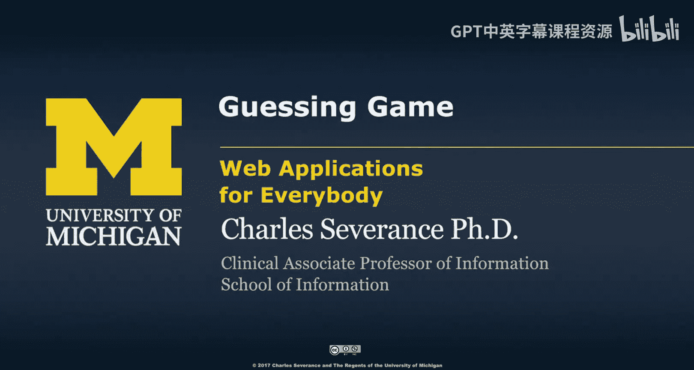
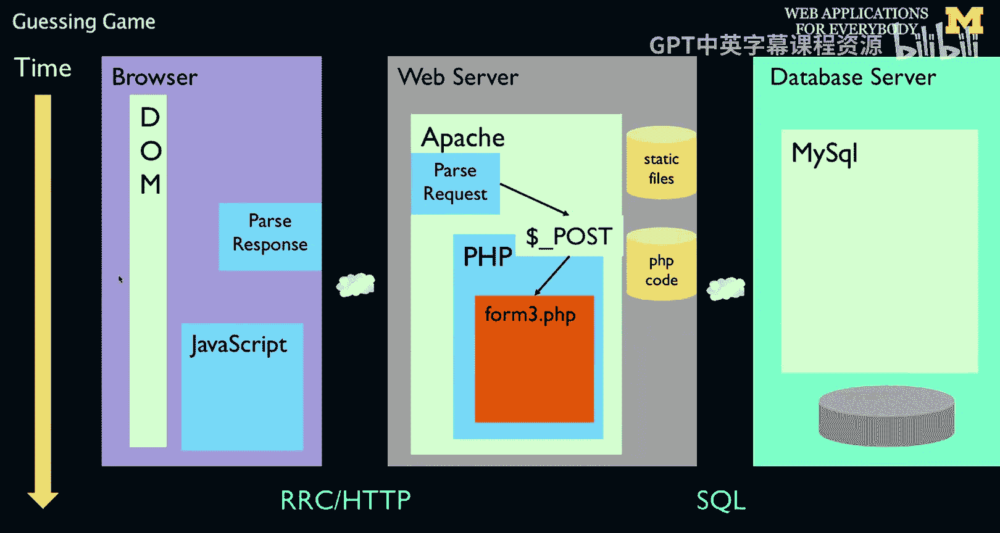
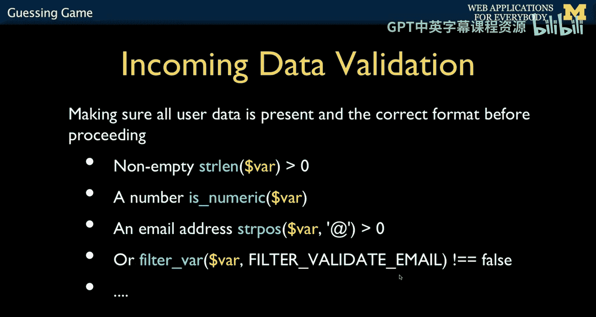
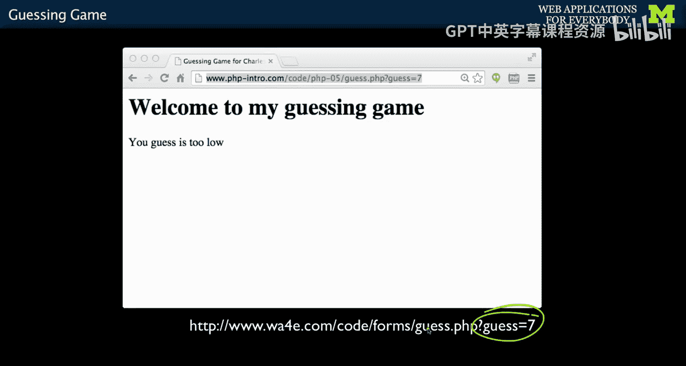
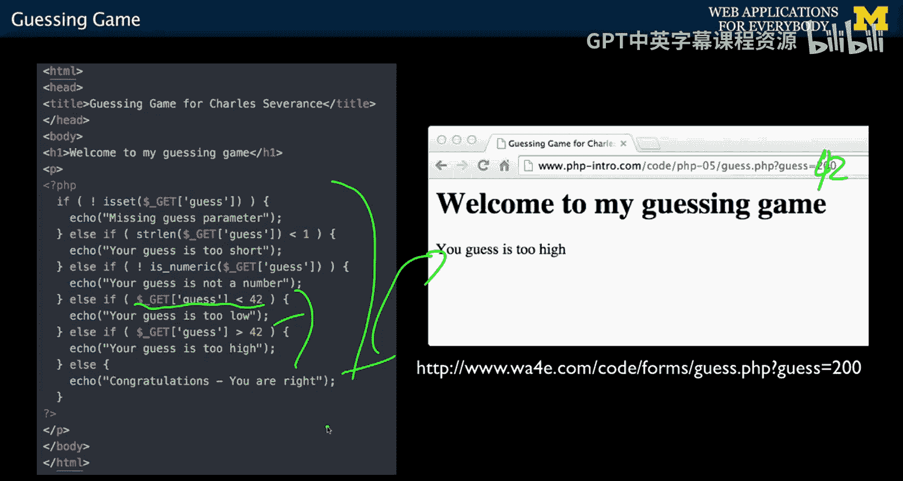

# 密歇根大学《面向所有人的Web应用程序（PHP、SQL、APP、JavaScript和JQuey｜Web Applications for Everybody》 p47 46_猜数游戏.zh_en -BV1Lr421A75d_p47-

Now， we're going to talk about in server data validation。

 that moment where you are receiving the data。 Okay And so we talked about HTML 5 and that HTML 5。

 when you're typing something in that's not a URL， that's actually just an interaction between the user and that browser and document object model。

 But then when the data finally comes in。 We have to protect ourselves， So the post data comes in。

 and we're sitting here at the beginning of this， the post data sitting there。

 And now we have to ask ourselves， is the data good， Is the data right， Is it dangerous。

 We talked about HTML entities， And that's when you're echoing it back out。

 you want to make sure that you put Ampersand Lt semicolon。

We just sort of talked about it going out。 Now， we're talking about inside the server a high up in your script。

 deciding whether the data looks good or not before you're going to do it because ultimately。

 we're going to store it in a database。 And so we might want to go back and send a message back and say。

 you know， that wasn't very good。 I don't like what you did there。 Please send it in。

 The email is required or the URLs required。 or you need at least five characters for your password or who knows what it is。

 But it's a set of questions。That basically you're going to ask before you trust the data and then maybe go back and complain to the user。

So this is code that you write at the top of your program。

 and there's a couple of different functions that we tend to use。

 things like we might want to ensure that a variable came in on the post data is not emptyty。

 I there one or more characters in there is numeric looks at the actual characters themselves and says。

 is this a number So Fred is not a number because part of it is PP converts things so easily。

 So Fred converts to a zero， so you can't check to see if it's a number by just checking it if it's equal to zero。

 Fred is equal to zero you say hey give me a true false as to whether this is his numeric。

 you can do something like Stpo， like you can do a simple email thing where you say if there is an at sign somewhere in it。

 So if you don't have an at sign， this will be false And if you do have an at sign， it'll be true。

 and there's other more complex ways to do this， this is a function thats built in called Vivaar。

 which is specifically designed to check things and so you can go look at the documentation for filtervar and see a whole series of more sophisticated emails。

More sophisticated filters that can give you true falses as to whether or not your data looks good。

If we take this guessing game and the whole idea of this guessing game is you just put your guess on the end of it and we want to actually defend against really bad guesses。

 right and so。

Here's an example of this， right， so we're taking a look at this bit of data that's coming in。

Here's our code， we can check to see is there a parameter at all？And if there's no parameter。

 we can say， oh， you don't have a parameter。 And then I'm going to have a series of  elsess。

 And I kind of have constructed this in a way that I'm checking the most obvious and broadest thing。

 First， I want to check if it's there。 Once I know it's there， I can say is it less than one。

 So they might just say guess equals with absolutely nothing， if the length of that is less than one。

 I'm just going to say your guess is too short。 if it's not numeric。

 I'm going to say your guess is not a number。 Now， I know that it's a number。

 and I know that it's not not empty。 and now I'm doing the actual sort of gain logic of saying if it's less than 42。

 now， implicitly， there's a number conversion going on because this is a string and that's a number。

 but it just works。 it converts it to a number and then checks， and then I can see if it's above 42。

 Otherwise it says you are right。 if you say guess equals 42。

 So these are just examples of the kinds of things that you can ask about a parameter， Is it there。

 how long is it， I it a number， et cetera， et cetera， et ce。

So the next thing I want to talk about is the basic idea of how you structure your applications in the file about handling input data and producing the next output。

 updating the database， etc， a concept called Model view controller。

