# 面向所有人的Web应用程序：48：代码详解：猜数游戏 🎮

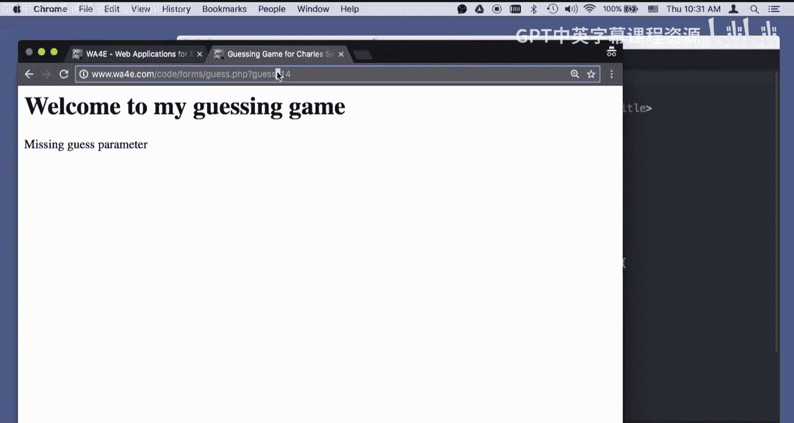

在本节课中，我们将通过一个简单的“猜数字”游戏代码示例，深入探讨Web应用程序开发中的一个核心架构模式：模型-视图-控制器（MVC）。我们将分析一段初始代码，并学习如何将其重构为更清晰、更易于维护的MVC结构。

## 概述

我们将从一段功能完整但结构较为混乱的PHP脚本开始。这段脚本混合了HTML和PHP逻辑，虽然能正常工作，但在代码组织上存在不足。本节的目标是理解MVC模式的基本思想，并学习如何将数据处理（模型）、用户界面（视图）和控制逻辑（控制器）清晰地分离开来。

## 初始代码分析

首先，我们来看一段典型的、结构较为基础的PHP脚本。它的主要功能是让用户猜测一个预设的数字（例如42）。

```php
<?php
// ... 一些初始的PHP逻辑和HTML混合代码
$guess = $_POST['guess'] ?? false;
$number = 42;

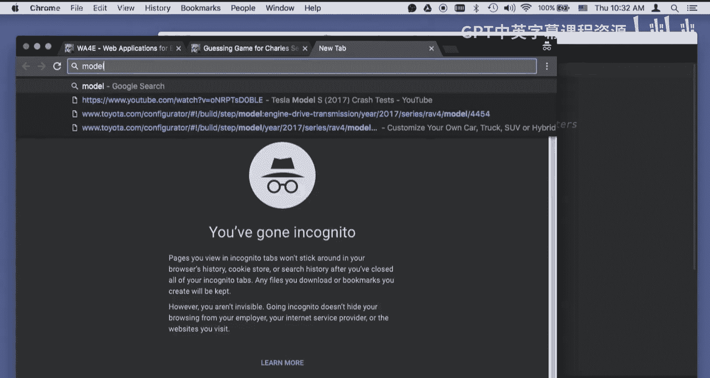

if ($guess === false) {
    echo "请提交一个猜测值。";
} elseif (!is_numeric($guess)) {
    echo "您的猜测必须是一个数字。";
} else {
    $guess = (int)$guess;
    if ($guess < $number) {
        echo "猜得太低了！";
    } elseif ($guess > $number) {
        echo "猜得太高了！";
    } else {
        echo "恭喜你，猜对了！";
    }
}
// ... 后续的HTML输出
?>
```

这段代码的优点在于它进行了良好的输入验证，检查了参数是否存在、是否为数字。然而，其缺点是将PHP业务逻辑与HTML展示代码紧密耦合在一起，随着功能增加，代码会变得难以阅读和维护。

## 引入模型-视图-控制器（MVC）模式

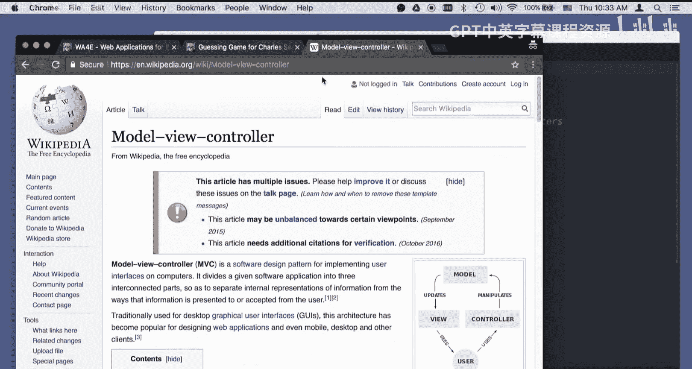

上一节我们分析了混合编码的弊端，本节中我们来看看如何用MVC模式来改善它。

MVC是一种将应用程序分为三个核心部件的设计模式：
*   **模型（Model）**：负责处理数据和业务逻辑（例如，检查猜测值是否正确）。
*   **视图（View）**：负责渲染用户界面（例如，生成HTML页面）。
*   **控制器（Controller）**：负责接收用户输入，协调模型和视图（例如，决定调用哪个模型函数，选择哪个视图进行渲染）。

这种分离使得代码更模块化，更易于测试和维护。即使在简单的应用中，遵循这种分离原则也是有益的。

## 重构为MVC结构

以下是如何将之前的猜数游戏重构为遵循MVC原则的代码。关键是在脚本中建立一条清晰的“分界线”。

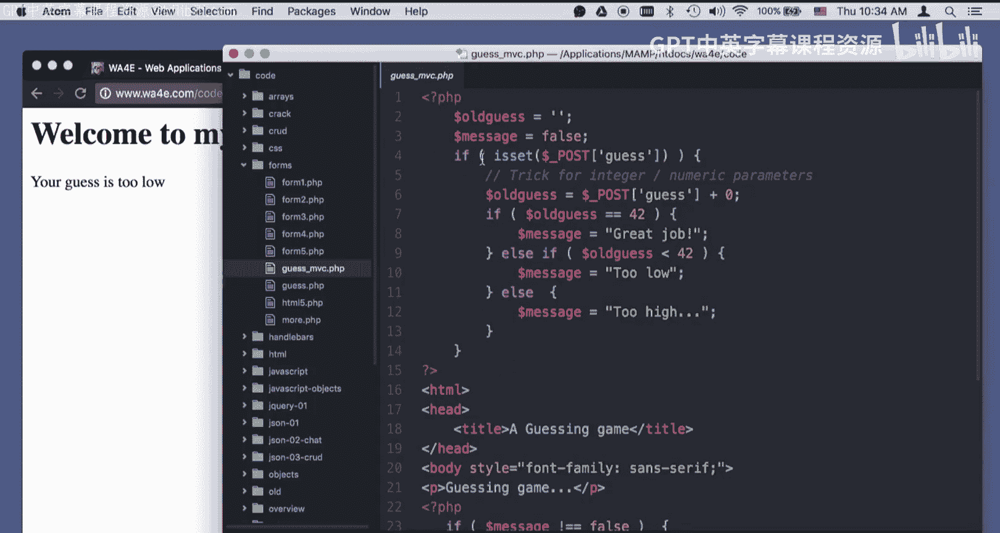

```php
<?php
// ========== 模型/控制器部分 (数据处理与逻辑) ==========
// 初始化“上下文”变量，用于向视图传递数据
$oldguess = $_POST['guess'] ?? '';
$message = false;
$number = 42; // 模型数据

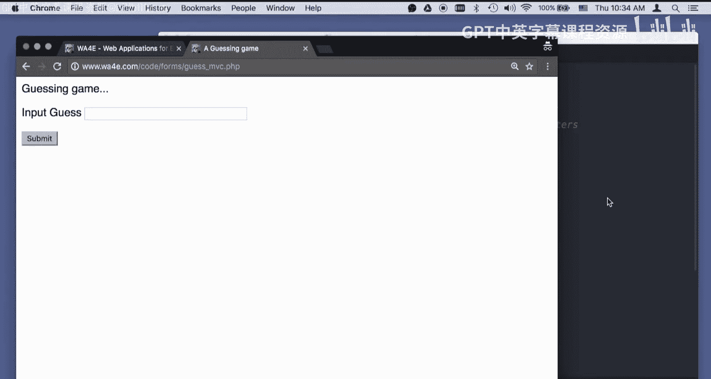

// 控制器逻辑：检查是否有POST请求并处理
if ($_SERVER['REQUEST_METHOD'] == 'POST') {
    // 模型逻辑：验证和处理数据
    if (strlen($oldguess) < 1) {
        $message = "您的猜测不能为空。";
    } elseif (!is_numeric($oldguess)) {
        $message = "您的猜测必须是一个数字。";
    } else {
        $guess = (int)$oldguess; // 快速转换为整数
        // 核心游戏逻辑
        if ($guess < $number) {
            $message = "猜得太低了！";
        } elseif ($guess > $number) {
            $message = "猜得太高了！";
        } else {
            $message = "恭喜你，猜对了！";
        }
    }
}
// ========== 分界线：以上无输出，以下无核心数据操作 ==========
?>
<!— ========== 视图部分 (用户界面) ========== —>
<!DOCTYPE html>
<html>
<head><title>猜数游戏 (MVC)</title></head>
<body>
    <h1>猜猜我的数字（1-100之间）</h1>
    <?php if ($message !== false): ?>
        <p><?= htmlentities($message) ?></p>
    <?php endif; ?>
    <form method="post">
        <p><label for="guess">输入猜测:</label>
        <input type="text" id="guess" name="guess"
               value="<?= htmlentities($oldguess) ?>" /></p>
        <input type="submit" value="提交猜测"/>
    </form>
</body>
</html>
```

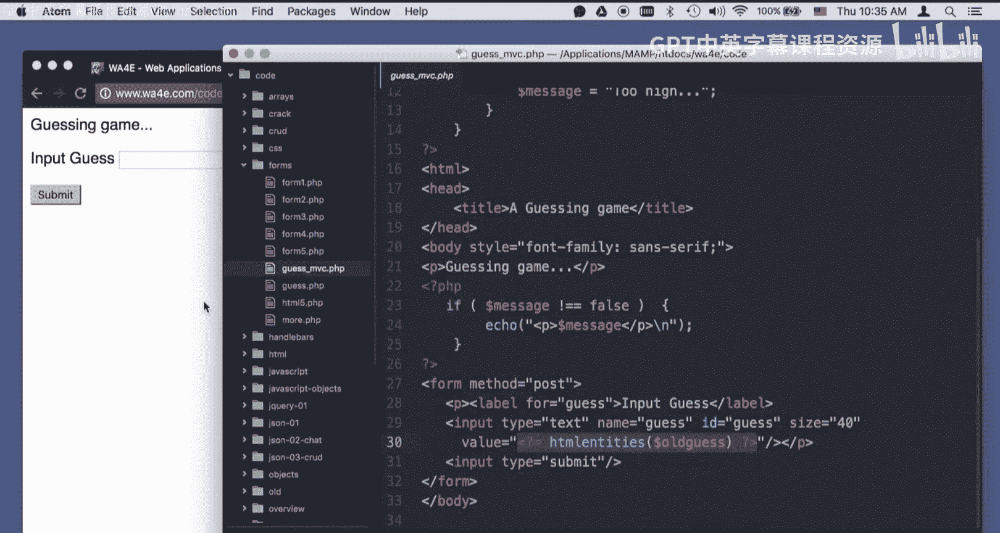

### 代码结构解析

以下是重构后代码各部分的详细说明：

1.  **模型与控制器（分界线上方）**：
    *   这部分代码专注于数据处理。它检查请求类型（GET或POST），验证用户输入，并执行猜数字的核心逻辑。
    *   它不直接产生任何输出（如`echo`），而是将结果存储在变量（如`$message`和`$oldguess`）中。这些变量构成了传递给视图的“**上下文（Context）**”。

2.  **视图（分界线下方）**：
    *   这部分几乎全是HTML，夹杂少量用于展示的PHP代码（如`<?= ?>`短标签）。
    *   它从“上下文”中读取数据（`$message`, `$oldguess`）并将其渲染到页面上。
    *   在此部分，我们避免进行数据库查询或复杂的业务逻辑计算。

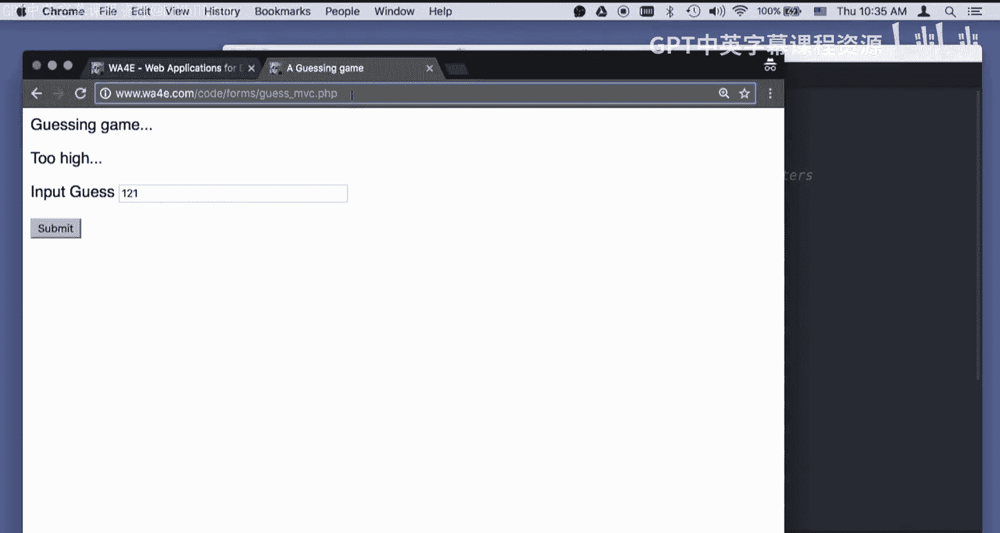

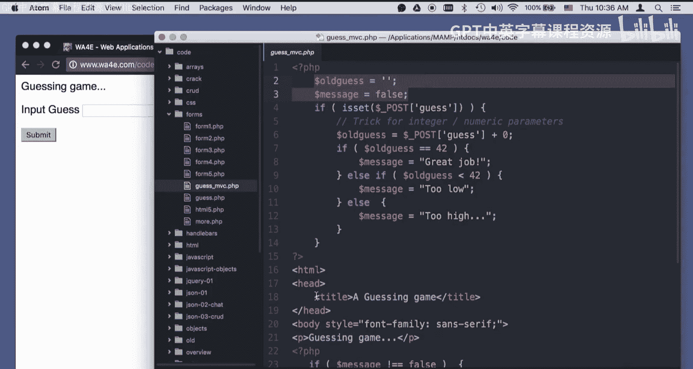

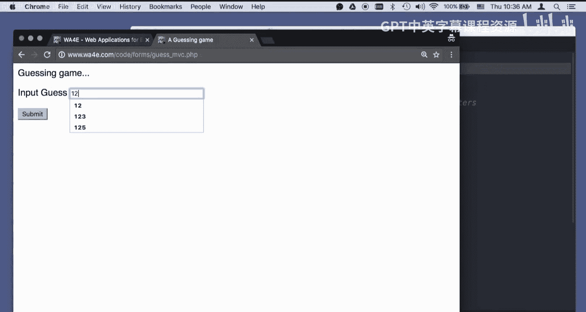

3.  **控制器的作用**：
    *   在整个脚本中，控制器是隐式存在的。它由顶部的条件逻辑（`if ($_SERVER[‘REQUEST_METHOD’] == ‘POST’)`）扮演，负责根据用户请求决定执行哪些模型逻辑。
    *   在更复杂的应用中，控制器可能会决定重定向到不同的页面（路由）。

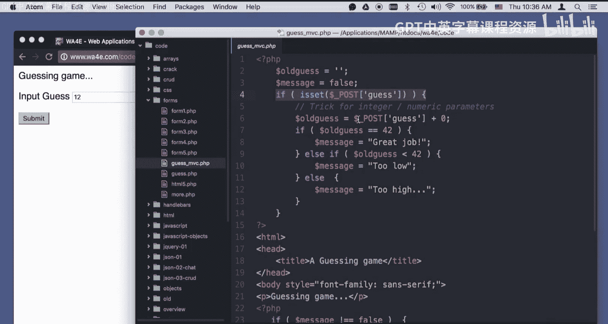

### 工作流程示例

*   **首次加载（GET请求）**：脚本执行模型部分，由于不是POST请求，`$message`为`false`，`$oldguess`为空。然后跳至视图部分，显示一个空的表单。
*   **提交猜测（POST请求）**：脚本执行模型部分的所有逻辑，计算出相应的提示信息并存入`$message`，同时将用户输入存入`$oldguess`。然后进入视图部分，将信息和旧值填充到HTML表单中并显示给用户。

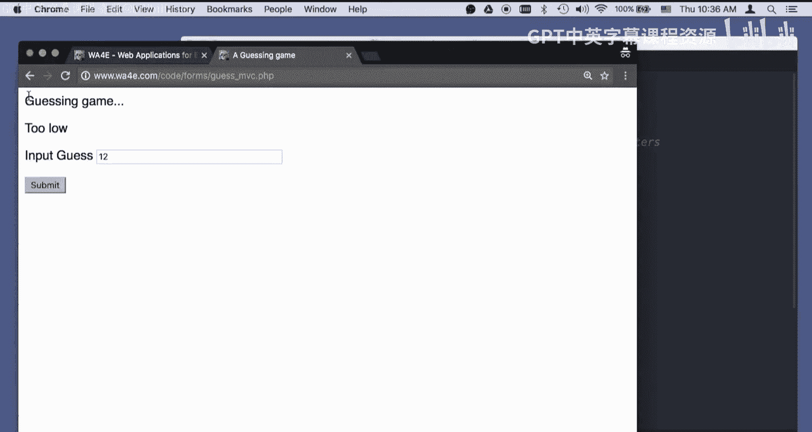

## 总结

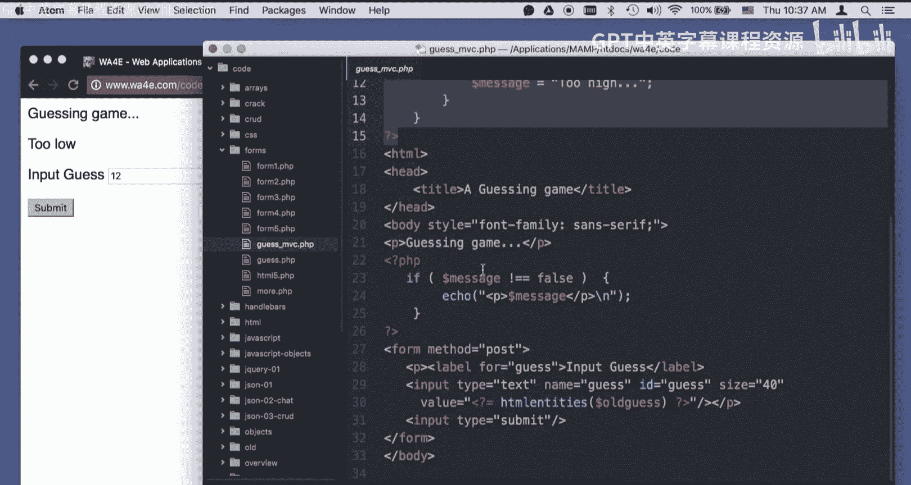


本节课中我们一起学习了MVC（模型-视图-控制器）设计模式在一个简单PHP猜数游戏中的应用。我们首先分析了一段混合编码的脚本，然后通过引入一条清晰的逻辑“分界线”，将其重构为结构更清晰的版本：将数据处理逻辑置于上方（模型/控制器），将展示逻辑置于下方（视图）。这种分离使得代码更易于理解、调试和扩展。记住，**上下文（Context）** 是连接数据处理和界面展示的桥梁。掌握这一基本模式，将为未来学习更复杂的Web框架打下坚实的基础。