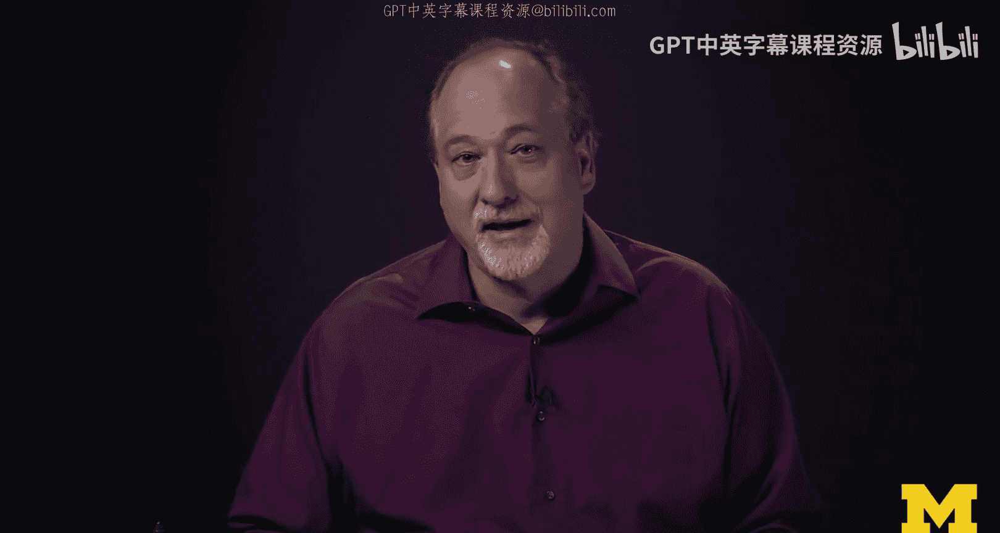
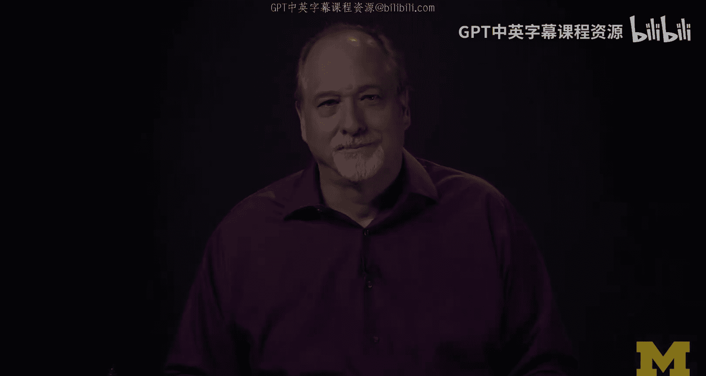

# 面向所有人的Web应用程序：第2章：欢迎学习SQL与数据库课程 👋

在本节课中，我们将要学习一门全新的计算机语言——SQL（结构化查询语言），它是我们与数据库服务器进行对话的方式。本节是课程的欢迎与介绍部分，将为你勾勒出整个课程的学习路径和重要性。

## 课程定位与学习路径 🔄

欢迎来到SQL与数据库课程。这门课程与之前的课程非常不同。

我们不会编写任何HTML代码。我们也不会编写任何PHP代码。我们不会编写任何CSS，也不会讨论请求-响应周期。我们要做的是学习一门全新的计算机语言——SQL（结构化查询语言），这是我们与数据库服务器对话的方式。

有趣的是，第一门课程是关于PHP、HTML等内容的，而这一门是SQL课程。实际上，你可以以任意顺序学习这两门课程。因此，如果你偶然进入这门课程，但对HTML、CSS或PHP一无所知，这完全没有问题。这两门课程可以按任何顺序学习。

但是，你必须完成第一门和第二门课程，才能为第三门课程做好准备。在第三门课程中，我们将把PHP和SQL结合起来。如果你不了解这两个部分，那将会显得非常困难。

## SQL语言的魅力 ✨

如果你从未接触过SQL，但可能了解一些编程语言，比如Python，或者了解PHP、HTML和CSS，我认为你会收获一份惊喜。

如果你看过我的其他课程，我有时会表示歉意，我可能会说：“是的，我对某些工作原理感到有些抱歉，但没关系，只管加上那些括号，因为这是你必须做的。”但我从不为SQL道歉。对我来说，SQL是我使用过的最优美的编程语言。它非常强大，表达力超强，并且合乎逻辑。

我经常告诉校园里的学生，我先教你们Python，再教你们SQL。因为如果我先教你们SQL，你们可能会拒绝学习Python。这是因为人类的思维方式是“我想要这个”，而我们在SQL中所做的正是说“我想要这个”。因此，它感觉非常符合人类的直觉。

## SQL的定位与学习意义 🎯

如果你像我一样爱上了SQL，你可能会想：“那么我以后就用SQL来编写所有程序了。”但事实证明，SQL更像是一种高级语言，这正是它如此优美的原因，但你确实无法用SQL编写所有程序。所以你仍然需要学习JavaScript，仍然需要学习PHP，仍然需要学习Python。

正如我所说，这门课程对于为你准备下一门课程——数据库与PHP课程——至关重要。第三门课程是我们将所有内容融合在一起的地方。我希望能直接从第三门课程开始，因为在课程结束时，你将构建出一个真正可运行的数据库应用程序，一个具备**CRUD**（创建、读取、更新、删除）功能的应用程序。但现在，你需要学习SQL，并且纯粹地学习SQL本身，享受它。然后，我们将在稍后真正应用它来构建应用程序。

## 沟通与支持渠道 📢

感谢你对本课程的兴趣。如果遇到任何问题或发现有错误，请通过表单告知我们。我很乐意修复问题。如果你需要紧急联系我，只需在推特上@DrChuck，我通常会在几分钟内看到。

再次感谢你来上课，我们课程结束时再见。

---

本节课中我们一起学习了SQL课程的定位、SQL语言的独特魅力及其在Web开发技术栈中的位置。我们明确了先独立学习SQL，再将其与PHP结合的学习路径，为后续构建完整的数据库应用程序打下坚实基础。