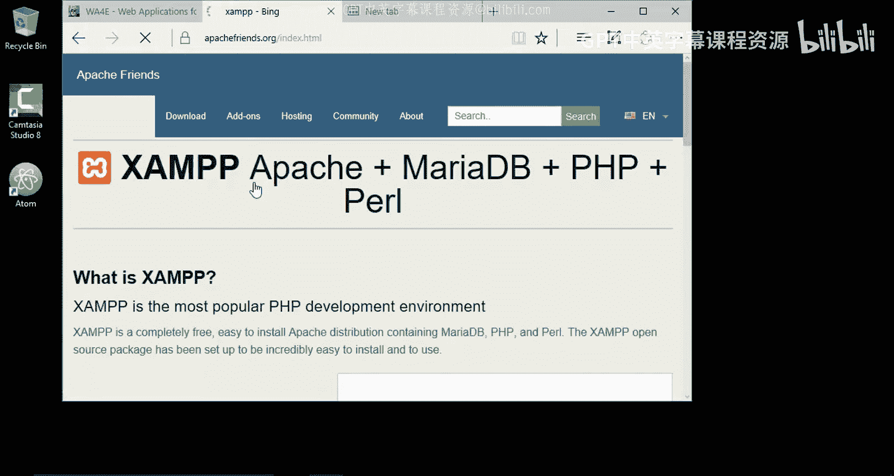
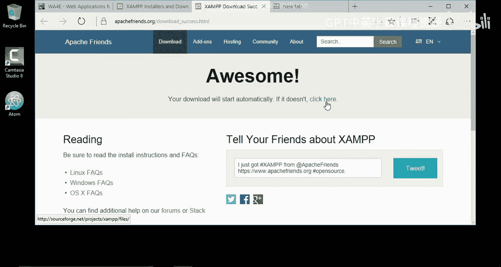
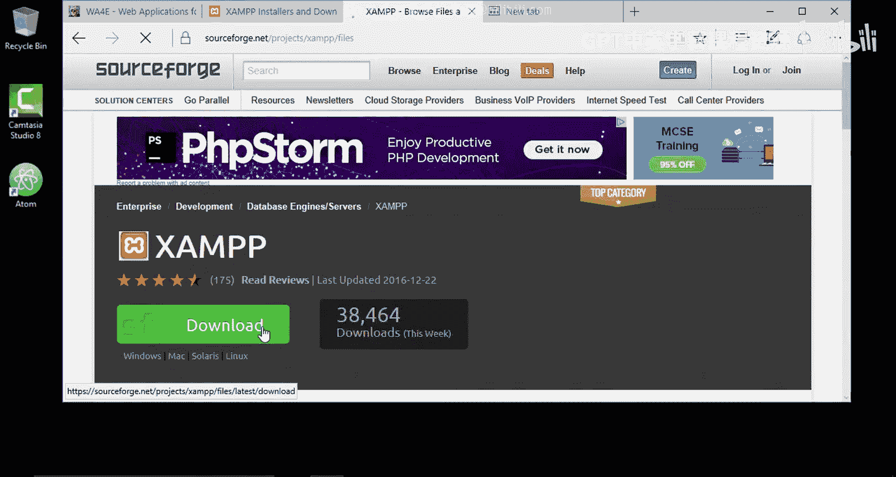
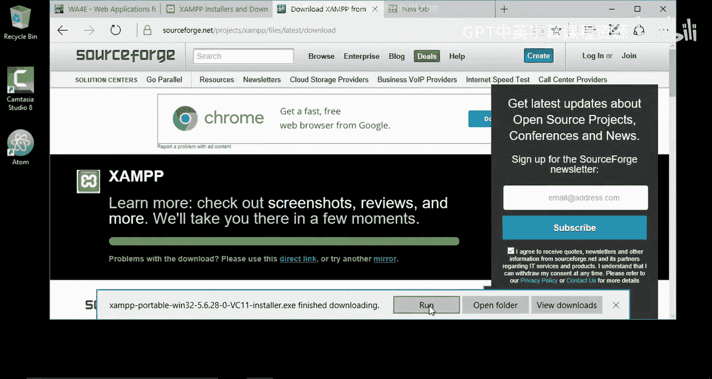
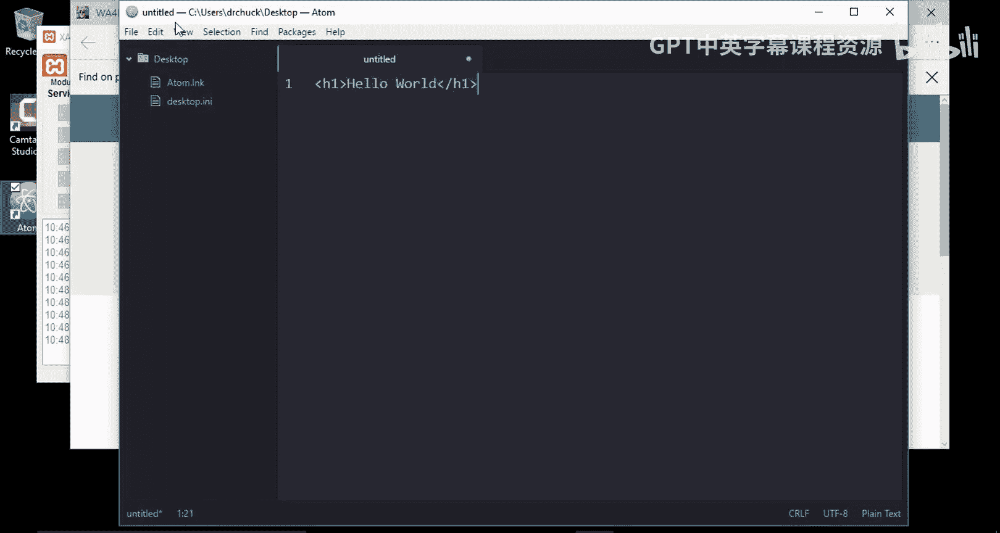
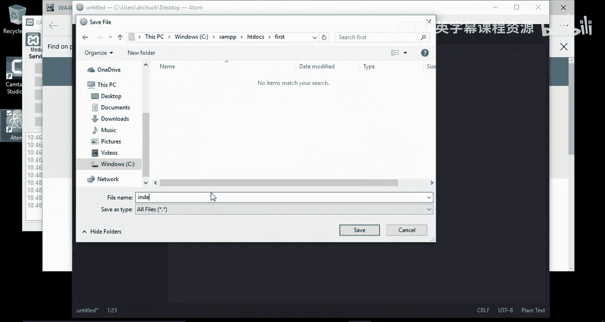
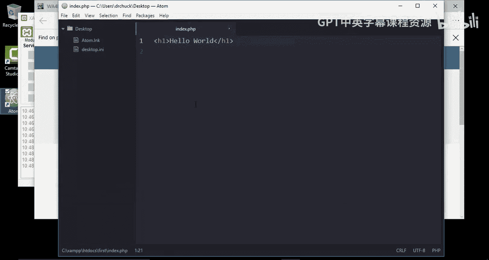
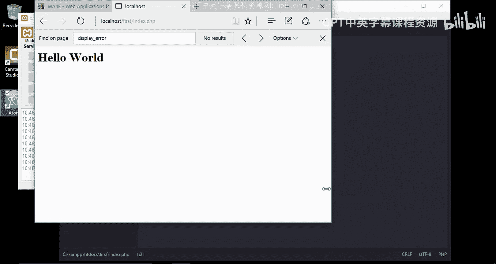
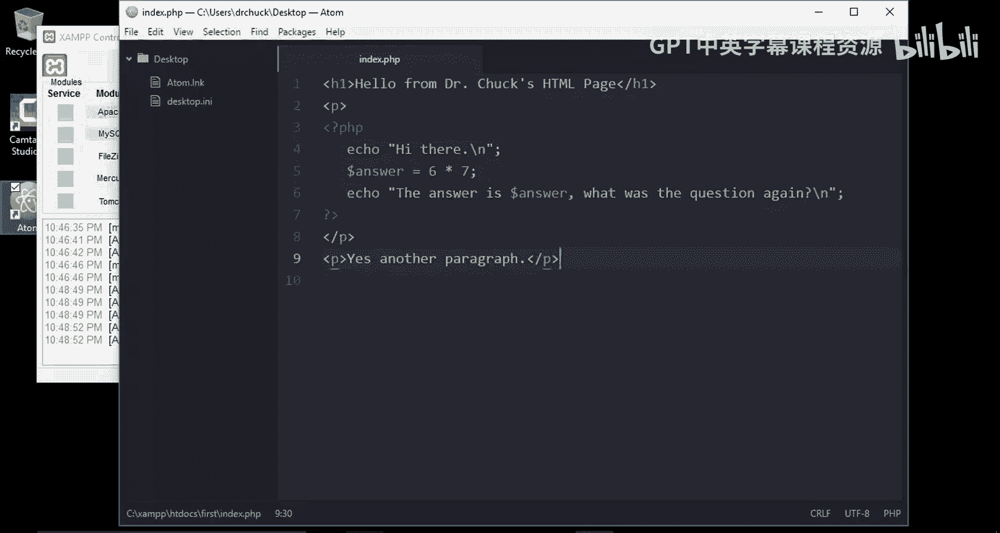
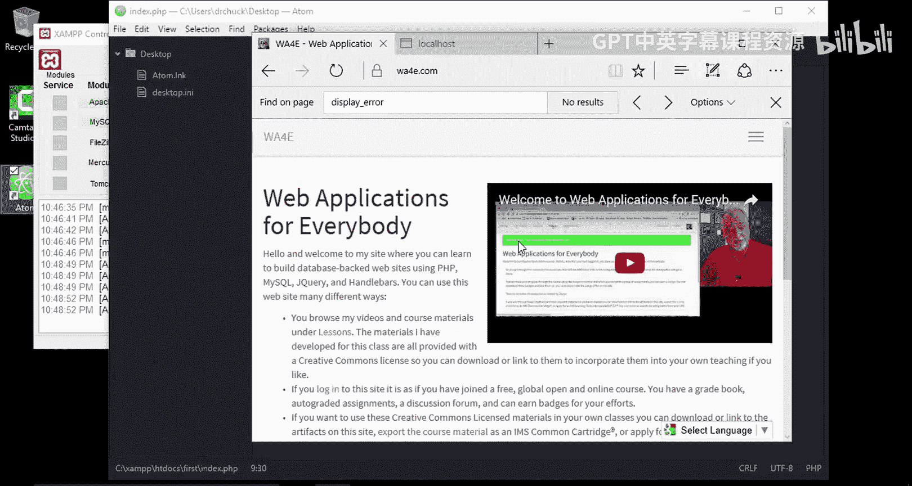

# 面向所有人的Web应用程序：3：在Windows 10上安装XAMPP 🖥️






在本节课中，我们将学习如何在Windows 10操作系统上安装XAMPP。XAMPP是一个集成了Apache、MySQL、PHP和Perl的免费开源软件包，它是搭建本地Web开发环境的理想工具。我们将一步步完成下载、安装、配置以及运行第一个PHP程序的全过程。





## 下载XAMPP安装程序

首先，我们需要从Apache Friends官方网站获取XAMPP的Windows版本安装程序。

以下是下载步骤：
1.  访问Apache Friends网站。
2.  找到适用于Windows的XAMPP版本。
3.  点击下载链接，开始下载安装程序。

## 运行安装程序

下载完成后，我们将在默认的下载文件夹中找到安装文件，并启动安装过程。

以下是安装过程中的关键步骤：
1.  运行下载好的安装程序。
2.  在安装向导中，选择默认的安装路径 `C:\xampp`。虽然这个路径可能稍显不便，但它能简化后续操作。
3.  在组件选择界面，取消勾选不需要的组件，例如Tomcat、Perl和Fake Sendmail。对于基础的Web开发，我们主要需要Apache和MySQL。
4.  等待安装程序完成所有文件的复制和配置。

## 启动XAMPP控制面板

安装完成后，我们不会立即启动控制面板。我们将手动找到其位置并启动它，以便你了解如何独立启动。

以下是启动步骤：
1.  打开文件资源管理器，进入 `C:\xampp` 目录，这是XAMPP的默认安装位置。
2.  在该目录中找到 `xampp-control.exe` 文件并运行它。
3.  首次启动时，可能会弹出语言选择和安全警告对话框，请选择“是”或允许操作。
4.  为了方便后续使用，建议右键点击任务栏上的控制面板图标，选择“固定到任务栏”。

## 启动Apache与MySQL服务

现在，我们通过控制面板来启动Web开发所需的核心服务：Apache（Web服务器）和MySQL（数据库服务器）。

以下是启动服务的步骤：
1.  在XAMPP控制面板中，找到Apache模块，点击其右侧的“Start”按钮。
2.  观察控制台输出，确保没有出现红色错误提示。
3.  以同样的方式，启动MySQL服务。
4.  当Apache和MySQL旁边的状态指示灯都变为绿色时，表示服务已成功运行。

## 验证安装与配置PHP




服务启动后，我们可以通过访问本地仪表盘来验证安装是否成功，并检查一项重要的PHP开发配置。



以下是验证和检查步骤：
1.  打开浏览器，访问 `http://localhost`。如果看到XAMPP欢迎页面（仪表盘），则说明Apache服务器运行正常。
2.  在仪表盘页面，点击“PHPInfo”链接，查看详细的PHP配置信息。
3.  在PHPInfo页面中，搜索 `display_errors` 配置项。对于开发环境，此选项应设置为 **On**，以便在页面上显示错误信息，方便调试。
4.  如果发现 `display_errors` 为 Off，则需要修改PHP配置文件。你可以通过XAMPP控制面板的Apache模块“Config”按钮，选择“PHP (php.ini)”来编辑配置文件。找到 `display_errors` 和 `display_startup_errors`，将其值改为 `On`，保存文件后，**必须重启Apache服务**才能使更改生效。



## 创建并运行第一个PHP程序



最后，我们将创建一个简单的PHP文件，并将其放置在Apache服务器的文档根目录下，通过浏览器访问来测试整个环境。


以下是创建和测试步骤：
1.  打开你喜欢的文本编辑器（例如VS Code、Sublime Text或Notepad++）。
2.  创建一个新文件，输入以下混合了HTML和PHP的代码：
    ```php
    <!DOCTYPE html>
    <html>
    <head>
        <title>My First PHP</title>
    </head>
    <body>
        <h1>Hello World from HTML</h1>
        <?php
            echo “<p>This is coming from PHP.</p>”;
            $sum = 6 + 4;
            echo “<p>The sum of 6 and 4 is: “ . $sum . “</p>”;
        ?>
    </body>
    </html>
    ```
3.  将文件保存到XAMPP的文档根目录。具体路径为：`C:\xampp\htdocs\`。建议在该目录下为你的项目创建一个新文件夹，例如 `first`，然后将文件以 `index.php` 为名保存到 `C:\xampp\htdocs\first\` 目录下。
4.  打开浏览器，访问 `http://localhost/first/index.php`。如果页面成功显示“Hello World from HTML”以及PHP计算出的结果“The sum of 6 and 4 is: 10”，则表明你的本地PHP开发环境已经完全配置成功。



---



本节课中我们一起学习了在Windows 10上搭建本地Web开发环境的完整流程。我们从下载XAMPP安装程序开始，逐步完成了安装、启动核心服务（Apache和MySQL）、验证安装并配置关键的PHP开发选项，最后通过创建并运行一个简单的PHP程序，确认了整个环境工作正常。现在，你已经拥有了一个功能完备的本地服务器，可以开始进行PHP编程、数据库操作等Web应用开发学习了。