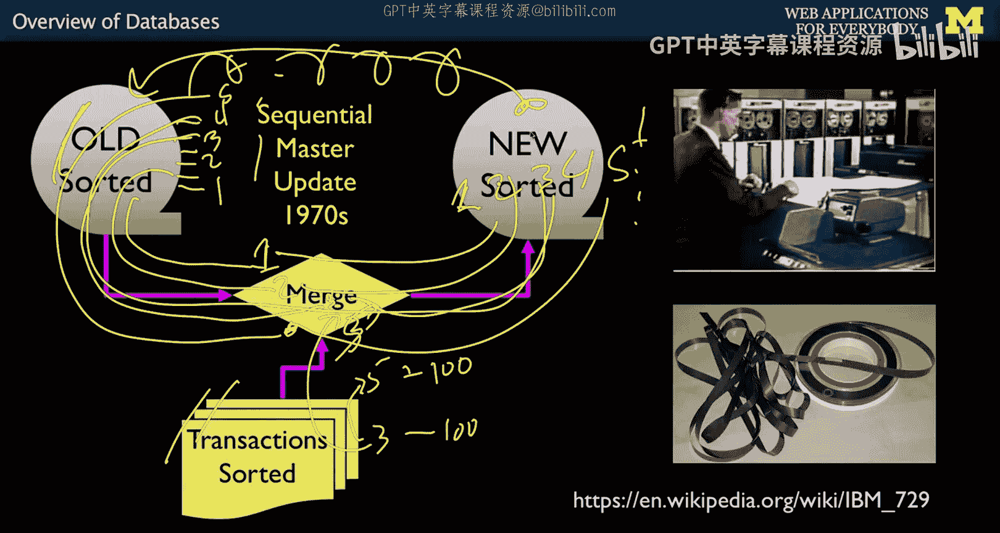
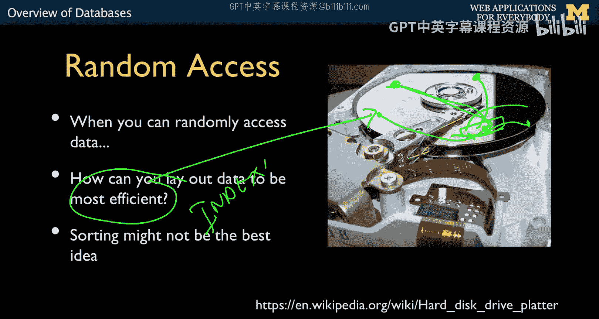
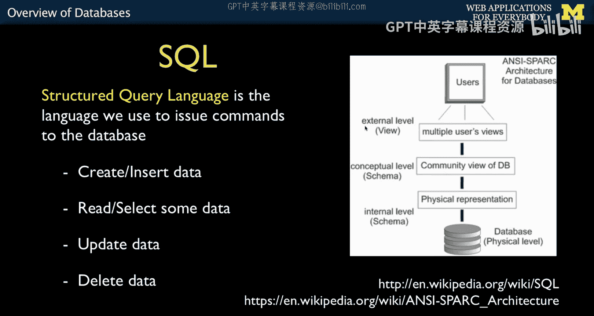
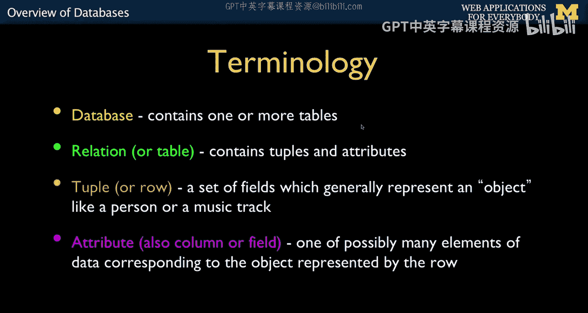
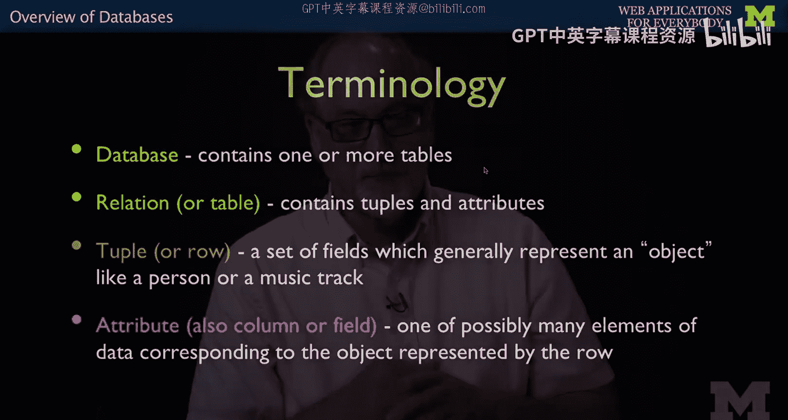
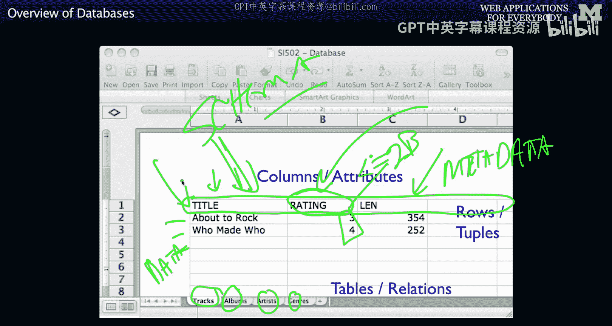
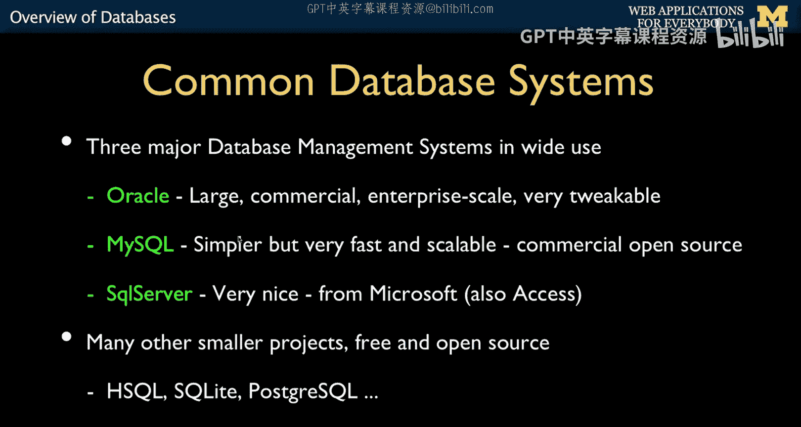

# 面向所有人的Web应用程序：5：数据库概述

在本节课中，我们将要学习关系型数据库的基本概念、发展历史以及SQL语言的核心思想。我们将从数据存储的早期挑战开始，逐步了解现代数据库技术的诞生背景和设计哲学。

## 从顺序存储到随机访问

上一节我们介绍了课程主题，本节中我们来看看数据存储技术是如何演进的。

最初的计算机主要用于计算，例如弹道轨迹和天气预测。这些计算数据都存储在计算机内部。然而，当开始处理像银行业务这样的应用时，数据量变得非常庞大，无法全部存放在计算机内存中。因此，需要一种方法来存储比计算机自身容量更大的数据。

在磁盘驱动器出现之前，我们使用磁带驱动器。磁带是顺序存储介质，这意味着你必须按顺序读取数据，无法直接跳转到特定位置。想象一下，如果你是一家银行，所有账户及其昨日余额都存储在一盘磁带上。今天，人们进行了存取款交易。为了计算今日结束后的新余额，你需要处理所有交易。在20世纪60年代和70年代，银行余额可能每天只更新一次，因为处理所有数据需要很长时间。

以下是当时使用的一种称为“顺序主文件更新”的算法步骤：
1.  所有账户记录按账号顺序排序存储在磁带上。
2.  所有交易记录也按账号排序。
3.  编写一个程序，同时读取旧主文件磁带和交易磁带。
4.  程序比较当前读取的账号。如果交易账号大于当前主文件账号，则直接将旧主文件记录复制到新磁带。
5.  当交易账号与主文件账号匹配时，程序应用交易（如加减金额），计算出新余额，并将更新后的记录写入新磁带。
6.  处理完所有记录后，就得到了包含所有新余额的新磁带。这盘新磁带将在下一天成为旧的“主文件”磁带。

这个过程可能需要数小时，因为它依赖于物理移动磁带。这个算法解决的核心问题是：我们需要比计算机内存更大、更持久的存储。

## 磁盘驱动器与索引的诞生

上一节我们了解了顺序处理的挑战，本节中我们来看看随机访问存储技术如何改变了游戏规则。

最终，我们迎来了磁盘驱动器。磁盘驱动器的关键特性是它一直在旋转，并且有一个磁头可以移动到不同位置读取数据。这意味着你不再需要顺序读取所有数据。如果你需要读取磁盘上某个特定位置的数据，只需将磁头移动到正确的位置，然后等待数据旋转到磁头下方即可读取。

磁盘的转速通常为每分钟7200转，平均访问时间在毫秒级别。这使得数据库的概念得以诞生：现在我们不必等到晚上10点才更新数据；我们可以将账户记录存储在磁盘的不同位置，并且每秒可以读写成千上万次。

但问题依然存在：如何快速找到特定的记录？如果仍然需要读取所有数据，可能仍需一小时。解决方案是**索引**。

索引就像一个目录或面包屑路径。你可以创建一个小的“目录”，记录每条数据在磁盘上的位置。例如：
*   记录1 位于 位置A
*   记录2 位于 位置B
*   记录3 位于 位置C

当需要读取记录5时，你无需扫描所有数据。只需查询索引，找到记录5的位置，然后直接跳转到那里读取。索引本身通常比被索引的数据小得多。这一切都是为了最大限度地利用这项新技术，使得查询和更新银行余额能在秒级而非天级完成。

## 关系型数据库：理论与标准的形成

上一节我们看到了索引如何提升效率，本节中我们来看看关系型数据库这一标准是如何在竞争中诞生的。

关系型数据库是一种技术。当我们思考如何最佳地利用随机访问存储时，计算机科学家们提出了各种想法，如图表模型、网状数据库等。在20世纪60年代和70年代，关于最佳方式的争论催生了一个标准。

有趣的是，关系型数据库最初是一个非常理论化、看似不实用的概念。它建立在强大的数学理论之上。早期的关系型数据库性能不佳，但随着它们不断改进，其魔力逐渐显现。最终，我们得到了一种强大而优雅的数据管理方式。

## SQL：与数据库对话的语言

上一节我们介绍了关系型数据库的理论背景，本节中我们来看看我们如何与它进行交互。

我们通过一种语言来操作关系型数据库，而不是直接处理硬盘上的数据。这种语言面向的是一个非常复杂且强大的软件——数据库服务器（如MySQL）。服务器知道所有数据的存储位置和索引。我们最终得到了一种极其简单、优美、优雅的方式来表达：“这是我想要的数据。你是个天才，去想办法以最快的速度获取并返回给我。” 这就是 **SQL**。

SQL 是结构化查询语言。它的诞生有一段有趣的历史。美国国家标准与技术研究院的Elizabeth Fong在视频访谈中解释道，当时各家数据库供应商争论不休，都希望政府采用自己的技术标准。美国政府作为大量技术的采购方，并没有偏袒任何一方，而是要求所有供应商必须达成一个统一的通信协议标准，否则将不采购任何一家的产品。正是在这样的背景下，SQL 作为行业共识诞生了。它抽象了底层复杂的软件和存储，提供了一个统一的接口。

## 数据库的核心操作：CRUD

上一节我们了解了SQL的由来，本节中我们来看看用SQL能完成哪些基本操作。

数据库的基本操作可以概括为四项：创建、读取、更新、删除。在SQL中，它们有对应的命令：
*   **C**reate -> `INSERT` (插入)
*   **R**ead -> `SELECT` (选择)
*   **U**pdate -> `UPDATE` (更新)
*   **D**elete -> `DELETE` (删除)

SQL 的设计理念是让这些最常用、最基础的操作变得超级简单。你只需要告诉数据库“做什么”（例如，删除那一行），而不需要关心“如何做”或数据存储在哪里。

## 行、列、表与关系、元组、属性

上一节我们介绍了CRUD操作，本节中我们来看看描述数据库结构的两种视角。

由于SQL有深厚的数学理论背景，你会看到两种描述数据库的方式：
1.  **程序员/通俗视角**：我们谈论**行**、**列**和**表**。这就像电子表格：每个`表`像一个工作表标签，里面有`行`（记录）和`列`（字段）。
2.  **数学家/理论视角**：他们谈论**关系**、**元组**和**属性**。本质上，`关系`对应`表`，`元组`对应`行`，`属性`对应`列`。

虽然我在调侃数学家，但正是他们的理论让数据库运行得如此高效。所以，如果你在文档中看到“关系”、“元组”这些词，不要觉得困惑，它们只是“表”、“行”、“列”更学术的说法。

## 模式：数据的蓝图

上一节我们对比了两种术语体系，本节中我们来看看如何精确地定义数据的结构。

在电子表格中，我们通常用第一行来定义每一列的含义（例如，“标题”、“评分”），这行本身不是真实的数据，而是关于数据的**元数据**。

在数据库中，我们对此更加严格和精确，称之为**模式**。我们会用非常复杂的语句来定义每一列：它是什么类型的数据（整数、文本、日期等）、最大长度是多少、允许什么字符集等等。例如，我们可以定义“评分”列是一个有符号整数，且值不超过20亿。虽然细节更多，但其核心思想与电子表格的第一行作为元数据是相似的。

## 常见的数据库系统

上一节我们了解了模式的概念，本节中我们来看看实践中常用的几种数据库系统。

本课程将使用 **MySQL** 数据库服务器。它是一款非常流行的开源数据库，广泛应用于Web开发。当然，它并非唯一的选择：
*   **Oracle**：大型商业企业级数据库。
*   **SQL Server**：微软的数据库产品。
*   **PostgreSQL**：另一款非常流行的开源SQL数据库。
*   **SQLite**：轻量级数据库，在之前的Python课程中可能接触过。

对于构建Web应用，我们选择切换到MySQL。

## 总结与展望

本节课中我们一起学习了数据库的概述。我们从数据存储的历史挑战讲起，看到了从顺序磁带存储到随机访问磁盘驱动的飞跃，以及索引技术的引入如何极大提升了数据检索效率。我们探讨了关系型数据库作为一项标准技术的形成过程，并认识了SQL这一优雅的数据库操作语言，了解了其CRUD核心操作。最后，我们区分了描述数据库结构的两种术语体系，引入了“模式”的概念，并列举了常见的数据库系统。

这为我们提供了SQL的历史和背景。接下来，我们将开始实际输入一些SQL语句，进行真正的操作。