# 密歇根大学《面向所有人的Web应用程序（PHP、SQL、APP、JavaScript和JQuey｜Web Applications for Everybody》 p57 6_基本SQL操作.zh_en -BV1Lr421A75d_p57-

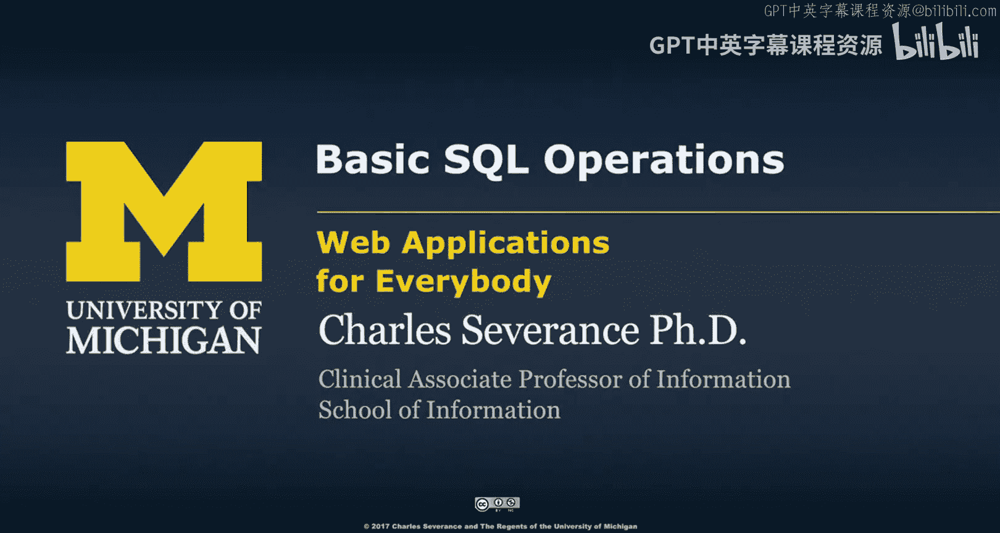

So after all that long winded introduction， now it's time to actually start using SQL。

 but before we do， I want to give you a picture of where we're at right so this is the request response cycle。

We have a browser over here on this side。 You are way over here。 That's you on this side。

 You click on a link， the browser goes and makes a network request using HttP to a web server。

And then it maybe pulls a file in and maybe that files PhP code and PhC code starts to run。

 but then it has to talk to the database server。 So it sends SQl across。

 that's what we're talking about now and then this SQl server My Sql software is really smart about where to find all the stuff and it sends the back data back to PhP and the PP loops through the data got from the SQl server and write some more HTMLl which goes back is the response。

 This is the request response cycle here and it pars this response fills up this thing called the document object model and here we are sitting here and we see the new screen right and so that's the request response cycle。

 But for today for this lecture we're really here as a matter of fact。

 we're going to learn the language that's flowing back and forth cross the network Now often these are on three separate servers。

1，2，3 but on your laptop and on my laptop they'll always just be one server。

 but it doesn't matter we're still sending commands over So we are learning in this next couple of lectures。

 the syntax of the SQL。Language that goes into the database server gives it instructions and is used then to return the data from the database server。

 So we'll zoom in now。

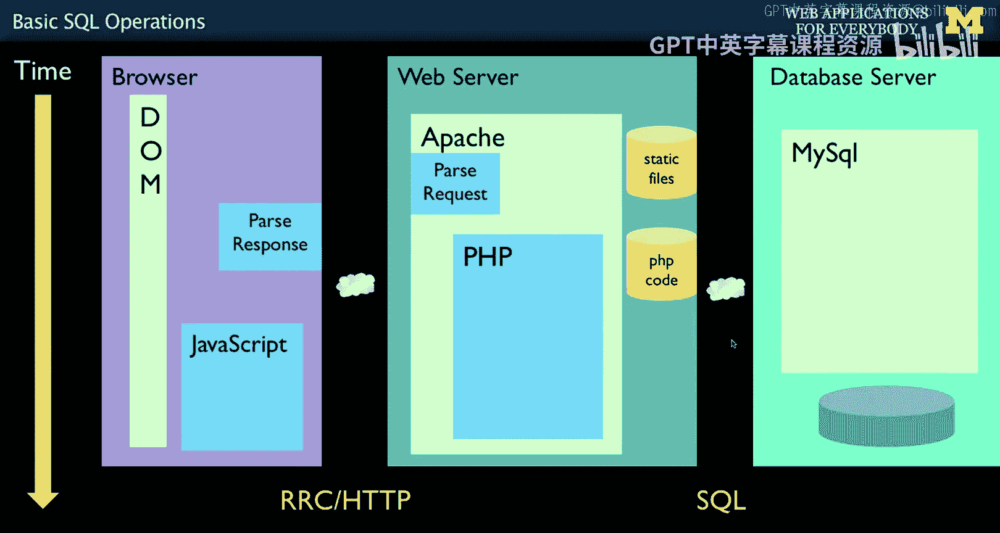

We're going to do two basic things。 We have this piece of software， the database server。

 and I keep saying how wonderful this software is and its millions of lines of a highly tuned computer scienceency code that also has itself some files that it works with。

 we don't ever look straight at these files。 we would never do that。

 we send SQL commands in the magic software does its thing and retrieves the data and then gives it back to us。

 And it turns out because this is kind of a network。

 we can send these commands simultaneously even from multiple sources。 And so this is like a server。

 meaning that in this case， the PhP could be a client。 My SQl could be a client。

 And the role that we're going to be in is we're going to be what's called a database administrator because usually when you're writing software or running production software。

 we developers never get to touch theus database。 But for a while， so we can learn SQl。

 we're going to be the allpowerful database administrator。

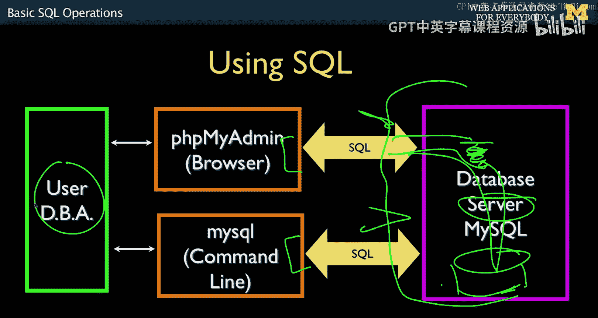

Okay， so by now I hope that you've installed something like Xampmp or LAM because you're going to need it for the PhP parts of this class because that has a database server all built in。

 a PhP server built in， all kinds of things， and it just saves you a long times a big bunch of files on Macintosh we have a thing calledM and we have Xampmp on Windows。

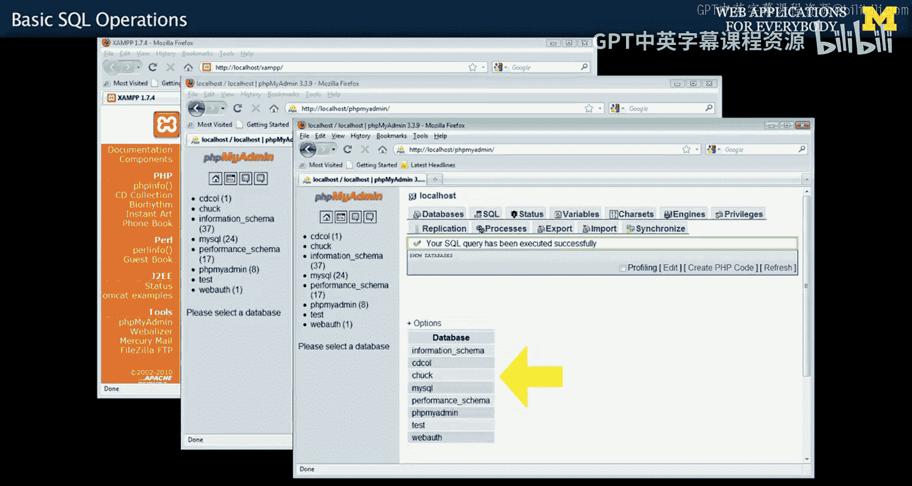

I'm not going to spend a lot of time on command line， but。Command line is really very important。

 especially if you're going to run stuff on servers， maybe with a Linux server。

 and so I'll just show you a little bit of command line at the very beginning with the understanding that maybe you're running Linux and you're going to use the command line the whole time and I think that's really cool if you do but most of us use the command line rarely and we tend not to do too much on our servers。

 So we use the command line to go in on the server and figure things out if something's not working but when you're doing software development。

 we tend to use this software called PhHP Myadmin So let me show you some of that。

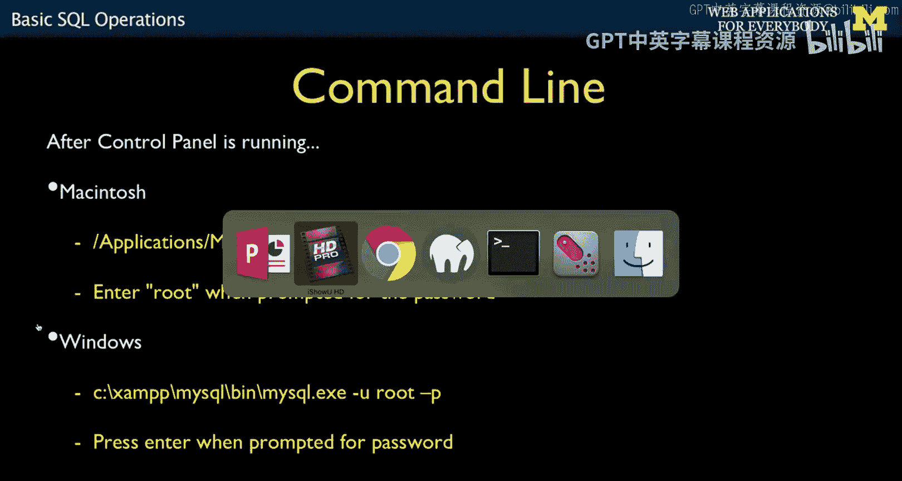

So。Here'sM， so if Ma has this control panel that can start and stop the MySQl server and Apache server。

 these are two programs waiting for network requests and I can open this web start page like Xamamp。

 they all have these little control panels you go to the starting page and so this is running on port 8088 if you remember URLs or on local host which is a loop back So it's it's a web server that's running on the same server as this browser is。

The outside world can't talk to this， port 8088 is normally port 80 is for web。

 but this is going to run on port 8888 in case you're doing something because it's kind of a developer environment。

So one of the tools。Is called PhP myadmin。And so this is a console that database administrators and if you run stuff in production。

 lots of people use this exact software， so we're not really playing in a toy environment。

 there are more sophisticated ways to do this， but this is a very common tool that a lot of people use to do real production management of database servers。

OkayAnd so we will come to this in a second， we can type commands here。

 but now I'm going to show you how you can talk to the database server from the command line。

I've got this handout。 Let me grab the。Command line text from the handout and go into。

Oh already did it once to test it。So this is what you do in Ma。

 it's really just a long path to a file called My SQL。

 and I'm logging in with a username of Ro and a password of rootot。

 This is not that big a deal because you can't really come in from outside into my database because local host is how this works。

And so now I'm at the prompt。 I'm like it a my SQL prompt。

 And so this my Sql is connected to the same My Sql server that's running on port 8088 that here I am in this。

 a port actuallys on port 8089， the servers on port 8089。 and so I am also on port 8089。Oh。

 I already knew there was report 889， so there's commands that you can type here like I can type show databases。

Semicolon。And so that's really the same information here。As it is here。Okay。And。

This software and the command line are simultaneously talking to the same SQL server。

 Neither of these or the SQL server， they are just clients that are sending commands back and forth。

 So watch what can happen here。I'm going to get rid of this database。Click on Datas。Click check。

 Get rid of that database。 Now， by the way， don't get rid of any of these databases that are here。

 If you didn't put it in， don't take it out。 Those are internal databases that my SQl uses for its own purposes。

 Now I'm going to go back to the command line。 I'm trying to show you how both pieces of software talking to the same database server at the same time。

 So last time I typed show databases。 you saw people。 If I type show databases again。 it's gone。

 I deleted it from one client， and I see the effect of the deletion on the other client。

 So there can literally be tons of client hitting the same database server。

 There is still one database server。 And if I came over here。To my map console。

And I stopped the servers， this is shutting down the database server。

I hope I can get it back up after I shut it down。 Do do do。

 so my scale server is down and the Apache servers down。 Now， I'm going to say， show databases。

Let's go。That server has gone away。Let's see if I can bring it back。Dart servers。Come back。Come back。

When squ all came back， you see a little green dot。An X app it looks a little different。

You might have trouble when you first get this set up， get some help from somebody if it comes up。

 great if you need a little bit of work， whatever now。

 I think I should be able to just hit up arrow and ask again， show databases。 yep。

 because there we go the away we go。 So that is just really showing you。

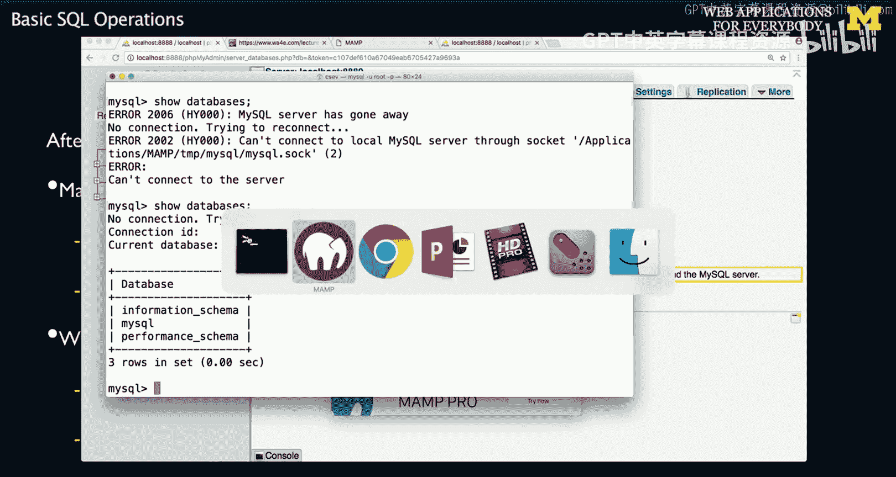

That there are two ways of simultaneously talking， we're talking from PhP Mydmin or mySQL。

 but both are doing SQL， even if I do things in here。

 it's actually sending SQL commands back to the database server。

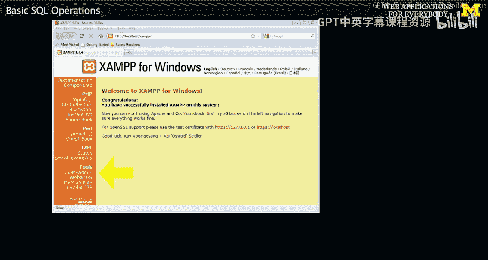

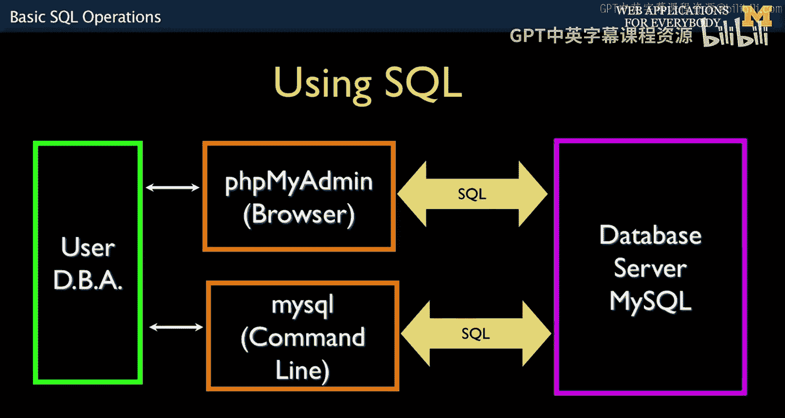

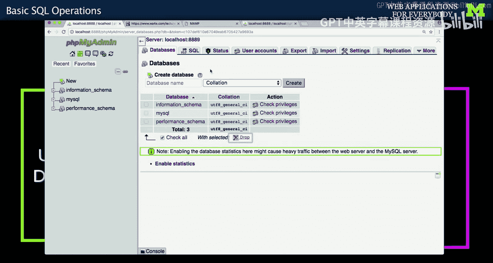

Now we're going to make a database， so I'm going to use this statement createreate database。

 and I've got this little file that's got all these commands here。

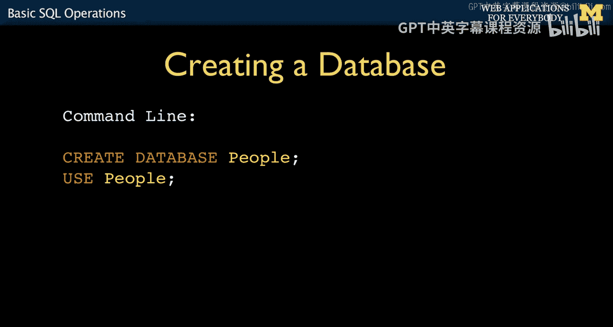

Now， if you're on the command line， you actually have to switch databases。

I want to do this not in the command line because I did the last time in the command line。

 I'm going to do this in PhP myadmin。So I'm going to be here with SQL。Let me hit refresh here。

People's gone on that when I hadn't refreshed。And now I am going to create oh wait。

 I got to create a database。Hangan。This is going to fail because I'm not in a database。

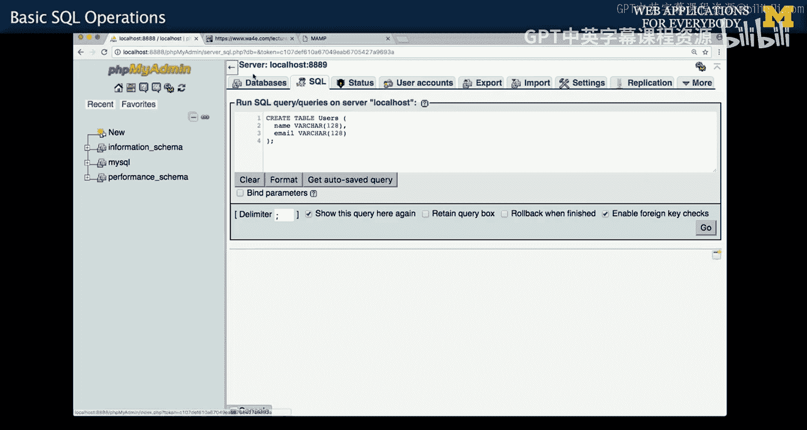

Anyway on， come back， create database people。Is that in my little sheet？

Oh， yeah， right here。 Create database people。 This defaultult character set is probably a good idea。

 Deult character set means that you can have non Latin characters。 So Asian characters。

 Greek characters， Russian characters， et cetera。 So that's， that's a good idea to do in general。

 So now I'm going to go back and come over here and create my people database。

 create database people with the right character set。I find， and so now I have a database people。

And now I'm going to write some SQL， I'm writing this SQL in the database people because the table that I'm about to create。

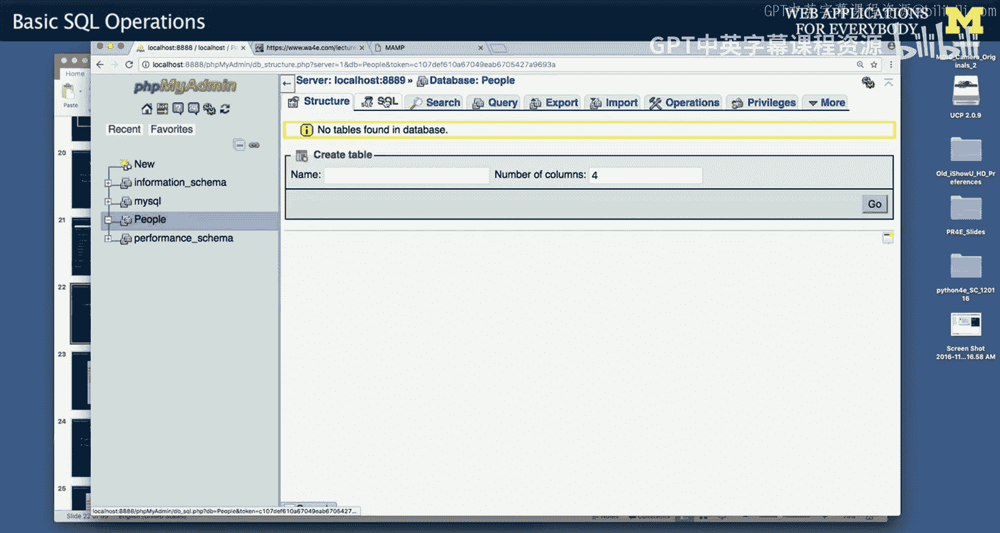

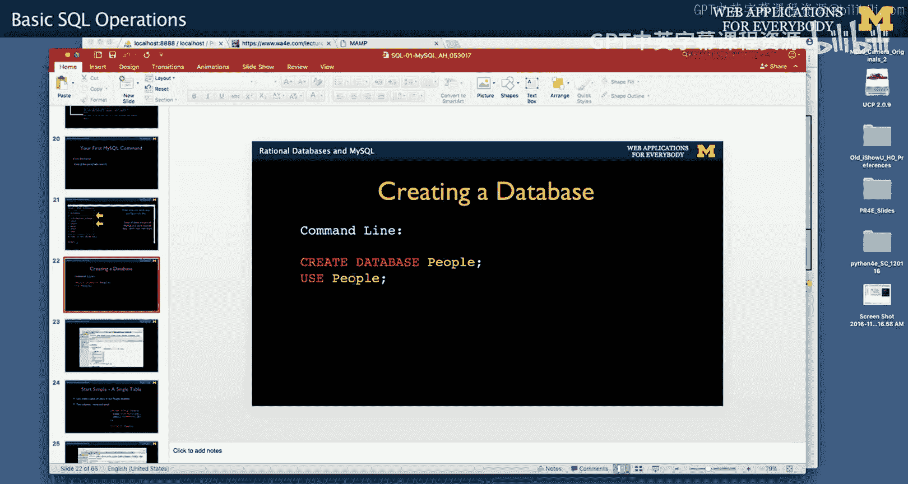

Is going to be in that database。 Oh， come back。Create table。 So this great table statement。

 What this is is remember， I talked about the spreadsheet and the columns of the spreadsheet。

 This is making the columns of the table。 But I told you that when we do this for a database。

 we're far more precise。 We're going to make two columns。

 once going to be called name and thoses called to email。

 They're both variable link character fields。Capable of storing characters。

 not just in the Latin character set。And there are maximum 128 characters， so it。

 if you try to put 129 characters in， it blows up。And you say， well， that's pretty mean。 I like， no。

 well， we told it we only wanted 128 characters。 So we're establishing a contract at this point。

 And part of the reason for that contract is for the efficiency that's required。

 So it can store precisely in a certain way because it knows it's never going to be asked to store more than 128 characters。

 It was going to store a million characters。 It would take a different approach to storing it。

 But we don't have to worry about that。 We just say our contract with you， Mr。

 database server is128 characters。 So I'm going to type this create table users。

 And I'm creating it in the people database， People database。 There we go。Do to。

 So now I see that if I go into the people database and I find out I've got one table called users。

 and I can go look at it， and I can look at the structure of the users's table。 And there we go。

 we have two columns。 and UTF 8， that's every time you see UTF 8。

 what you are knowing is that we can put non Latin characters in here。

 which is a good idea in general。

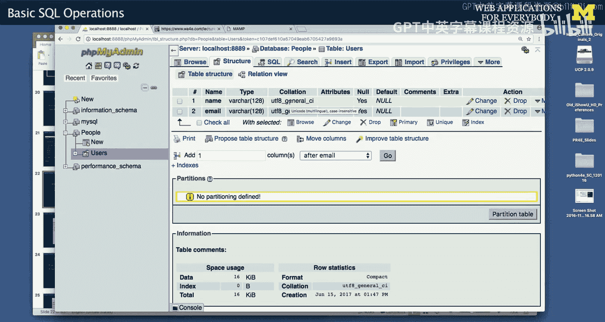

Okay， so there's our first database with lots of color commentary。

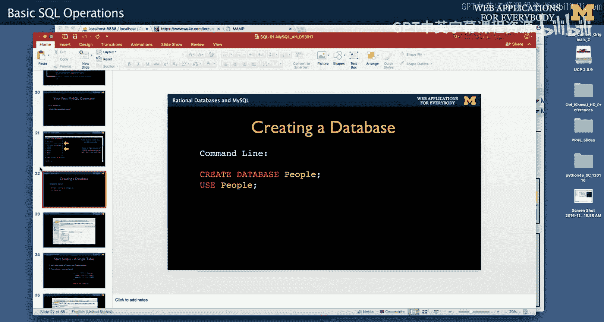

We already did create table。 The describe is something that you can type in the command line。

 I'll type that into the command line。

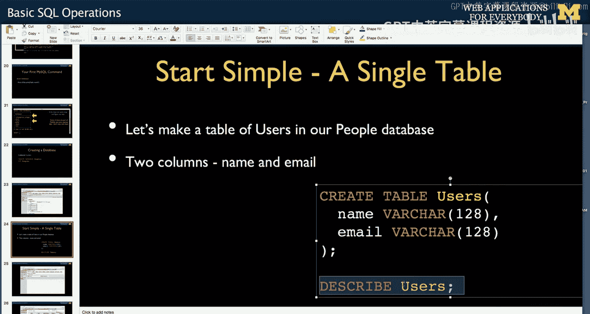

So now you see we have the papal database to switch so all your commands are aimed at a database。

 just say use。Use the people database。Multiple tables can be in one database。And now， I can say。

 describe。Now， the keywords like describe and select， etc cetera， are upper lowercase。

I tend in documentation to make all the keywords uppercase。

And so that is the same as what we saw in PHP myadmin， where it said， oh， we got two columns。

 their varchar， variablein character， up to 228 characters。Now， I didn't create the table here。

 but that's because the database server has the table created。

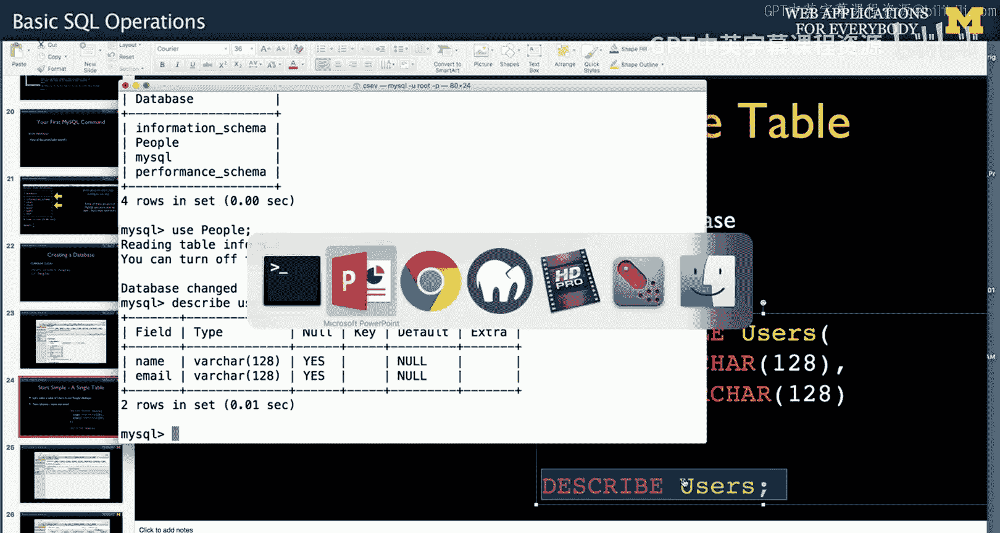

Okay， so we're done with that， we're done with that。

 you can actually create all these tables using a wiwig GI like editor inside of the PP Mymin that's possible。

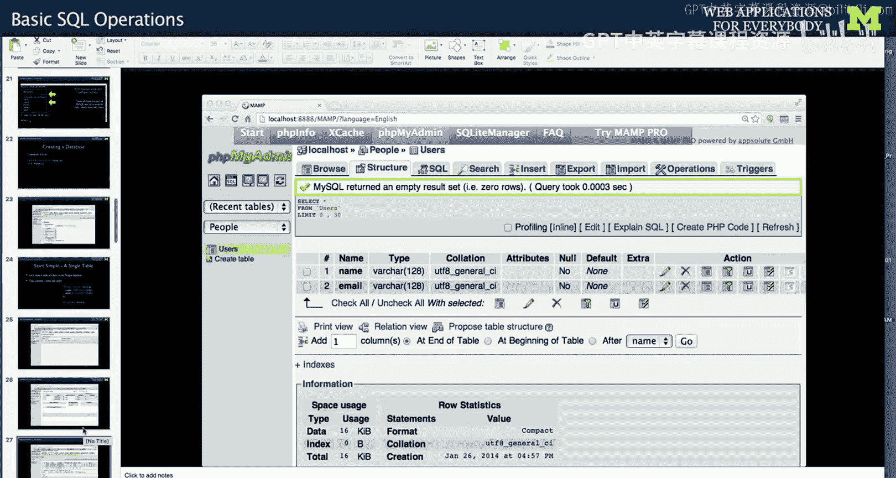

Okay， so now we have a table and we're going to do some insert statements and so this is our first bit of SQL。

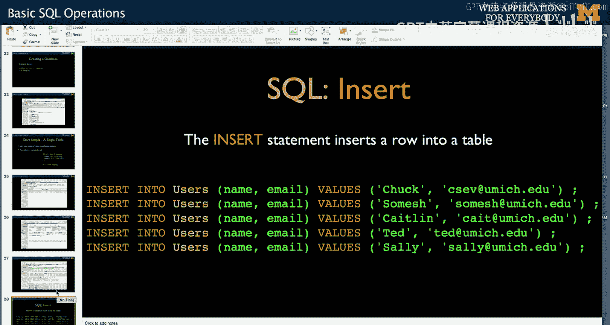

And so the insert statement actually is insert into。 Now。

 if really super programmers were doing this would be like， oh into is extra。

 there is a goal inside SQL for you to kind of cognitively look at it and go oh that's what's going on。

 So insert into is kind of just pretty there for us to read it。 It's it's rare。

 There's a programming language that adds things to make it more readable。

 We are going to send this query。 So there's a file somewhere and the database has this file And so let me go to here。

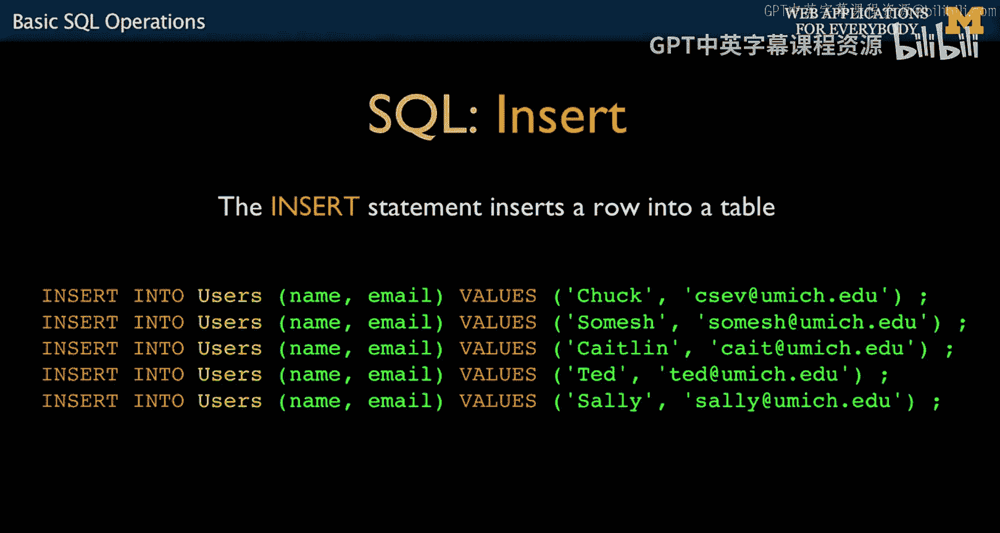

And grab。The insert statement。And。Go into SQL。I'm in the database people。And I'm gonna to say。

Insert into users， name， email， values， Chuck， and away I go。Okay， so now if I take a look。

 I see that I now have one row with a name column and an email column。Lzy enough。

Now let's do it again。And it turns out that the way SQL commands work。

Is you can make more than one of them as long as you put a semicloe at the end。

 And so this is the next four insert statements。 And I can type them all in。At the same time。

And hit go。And it ran into the inserts because it had semicloe at the end of each one。

 and so now I have five lines sitting in there， so that's your first SQL command。

Pretty straightforward。

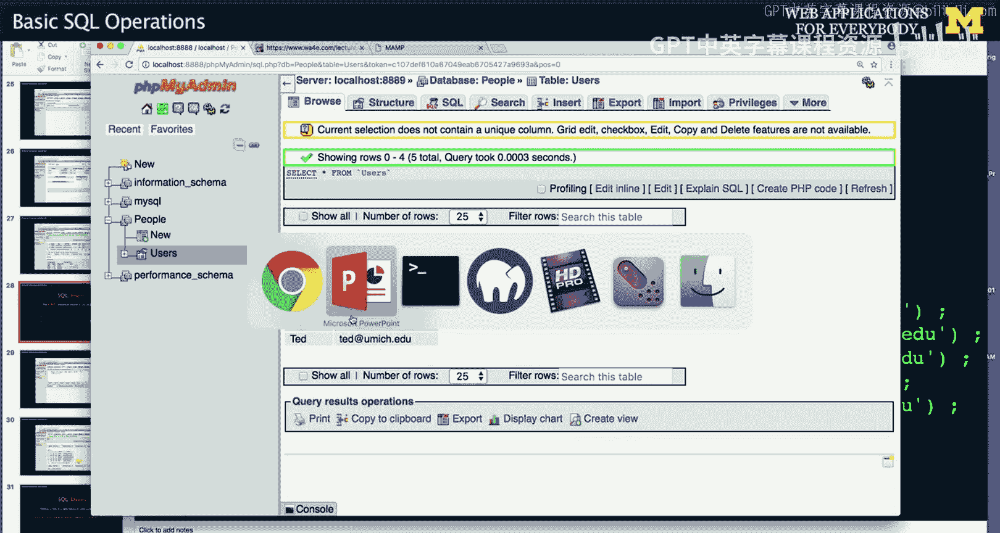

The next SQL command is the delete statement。And like the insert。

 we think of delete from as like the keyword， users is the name of the table。

 and we're going to see a lot of the where clauses。

The way a lot of these SQL commands work is they operate against the whole table unless you limit them。

 So where is saying don't doot everything， only do it where email equals Ted@ummira E to you。

 And so this is like an if statement in a programming language。

Except that it's like this whole thing is a loop。 The delete is like。

 go through that whole table and delete from users。 But only if that happens。

 you could think of that as like a loop that's going around。

 But then there's an if statement in the loop。 And then this is only this delete。

The lead is only done to the records where this turns out to be true。

So it's like writing a loop and an if statement all in one statement。

 and this is one of the reasons that people like this。

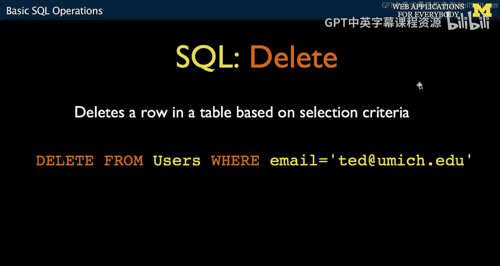

So。Buggle grabbed a delete statement。Now， if I go look at the data， it one row was affected。

 so I take a look and Ted's gone。So there's your second SQL statement。

 you're doing very well learning SQL。

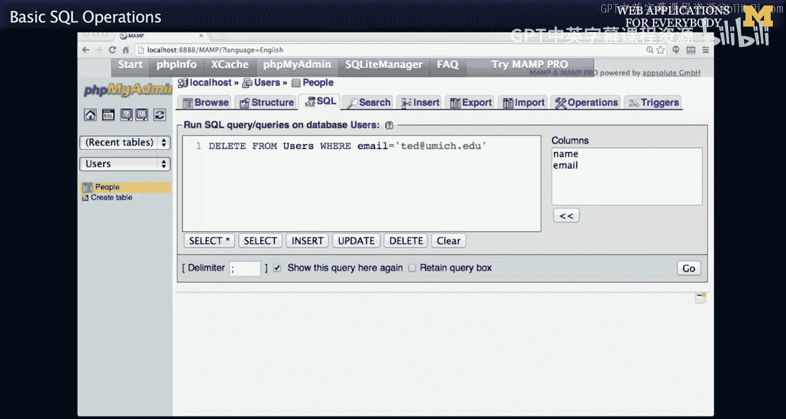

You're actually halfway through。So the O， the u of CruRs。

 create read updateate and deletete is update。So here we have the update。keyword。

 table to update the set keyword， and then a column name and a value with equal signs。

 name equals Charles。 and then again， if we this is an implied loop， the update is update everywhere。

 I don't to think of the word everywhere sitting here。

 update all the rows in users and set the name equals Charles。

 except for those rows where email equals C7 atummiish do Edu。

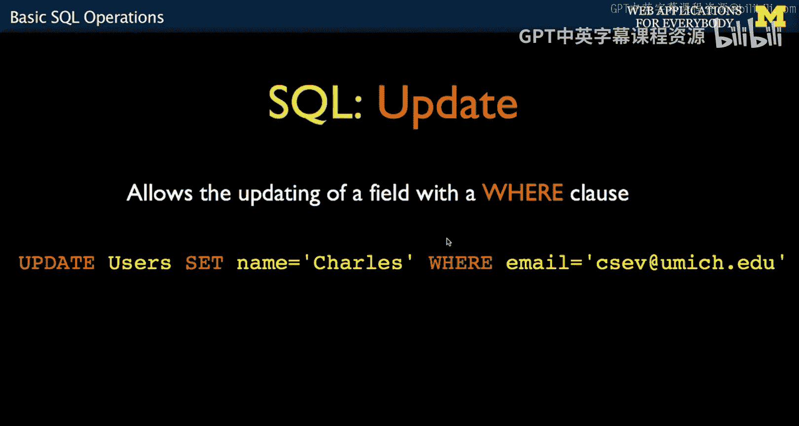

So let's take a look at that。Copy that and paste it in， hopefully you're keeping up。Go to SQL。Go。

And now I take a look at my data and son of a gun， if right there， the name has been updated。

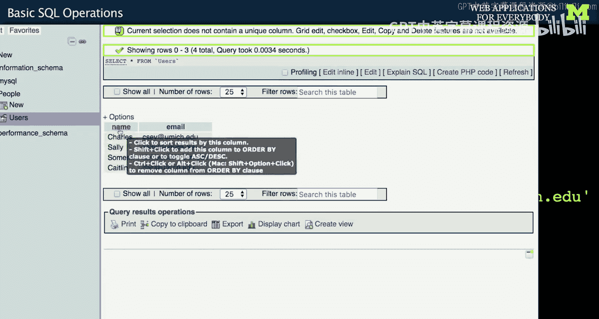

And I hope right now you're thinking to yourself， wow。

 that's pretty easy because we're three quarters of the way of learning SQL。

I'm sure there's a few other things beyond this， but we're most of the way。

Select。So it's create， read， update and delete。 But the way we read stuff is by select。

 So it's the Rs kind of。 we still call it Cr for fun。

 So select is the statement that says read a table。And the first parameter is。

Select then the columns and star means all the columns。 This way。

 if you don't know what the columns are， you kind of forget what the columns are。

 you could just say select star from is a keyword， Use is the table。

 and you can ask this is a good example of how if you don't put a where clause in。

 it's going to get them all because the select implicitly is a loop， select all from users。

 And then if you want just one or two， you can apply a where clause to that。

 So you just tack a where clause onto to the end。 So let's take a look at those two commands。

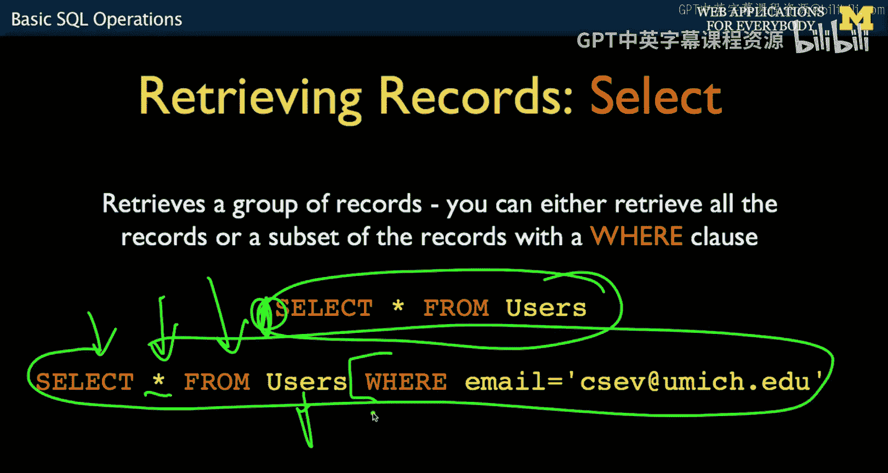

Select。Start from users。Summercon。Go。So now we get all the four tables。 I can go， and then I can say。

Select。Star from users where。Name。Or email。Equals c7 at U manage study E U。Okay。

And then I can type go。Oh， I tight too fast。 I type the from backwards。

 but that shows you what an error looks like。From。So that works。But you saw what N is。 Here。

 here's another thing。 Let me just show you this。 So let's take a look at our data really quick。

 We got four rows。 Here are other things。 So let's just， I'm going to do， I'm going to say this。

 select。Select。Star from users。Where name equals。Alex。Now， you might think this is an error。

And when we run it， you're going to see that it's not at all an error。

And what it says is you got no rows。And it's true。 What did you ask for， You said。

 go through all the rows。 Show me every single one where there's a name of Alex。 And it did。

 cause there was no name。 Alex。 That's not a flaw。 You asked for something， and you got it。

You could check to see how many rows you got back and sometimes we do a select and say did I get a row back if you didn't get a row back。

 you might consider that you might consider as the program programmer that that was an error。

 but other than that not， it doesn't have to be an error。Okay， we're making good， good progress。

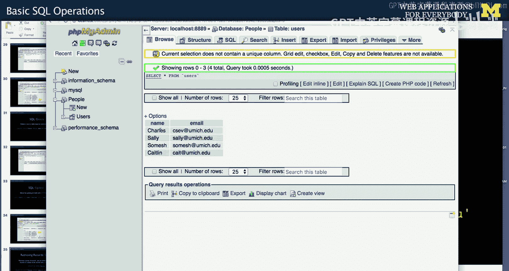

So the select has a couple of features like you can change the order。

 so select star from users order by email。

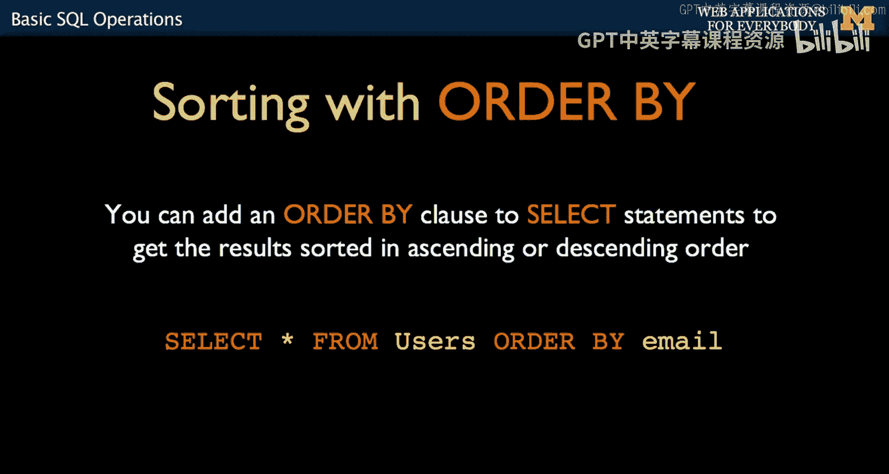

That will order the results by email。Okay so now it's sorting。

 sorting is another thing databases do really， really well。

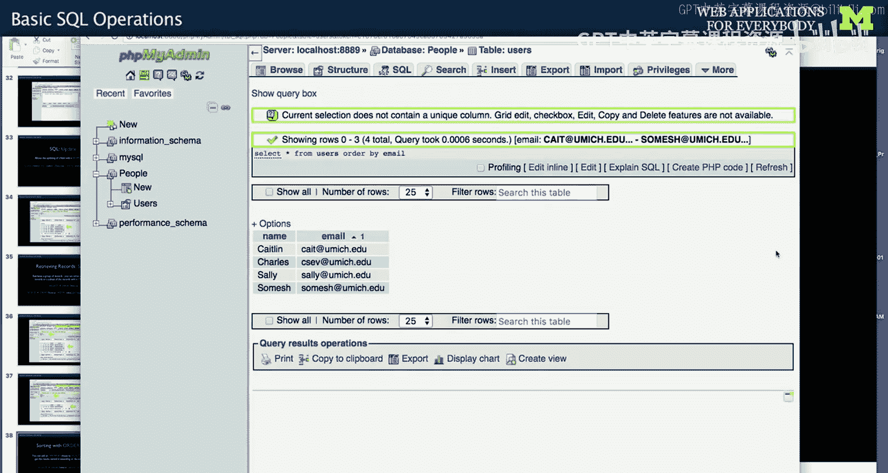

Hopefully you're just following along。Unlike claws is another form of the wear clauses。 It's like。

 it's like a wild card where this is sort of。This is the letter E， some characters before it。

 the letter E and then some characters after it。 so I can type that one。

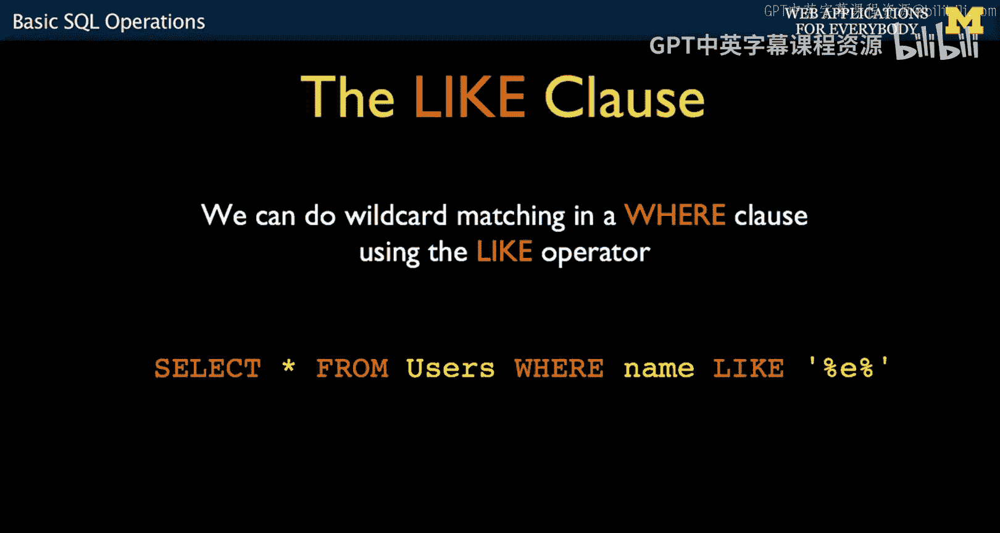

Okay， so I'm going to type。Keep having delete the stuff。 Select star from。Users。Where name like。

Percent sign that matches any number of characters， per E per cent。 That really is saying。

 show me an E anywhere in it。 In this case， I could put a semicolon here。

 But since it's only one command， it doesn't really need the semilon。

 I really need the semilon if I'm doing more than one command here。

And so this shows me all the people that have E in their name。

 so it's kind of a wild card like selection。

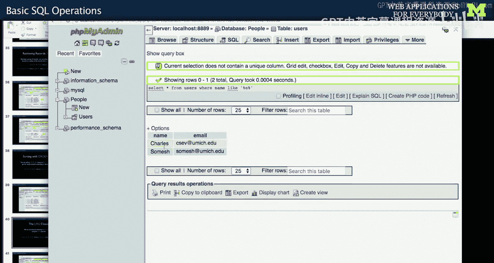

You can also order these things and put limits on them。

 and this is a common thing where maybe you're paging and I'll come back to this later when we will find it more useful。

 but you can read up on that。You can ask for the number of rows with a count count as a built in function。

 So what we're saying is don't give me the actual rows。

 but instead give me the number of rows that would have been returned had I ran the select statement so I can say。

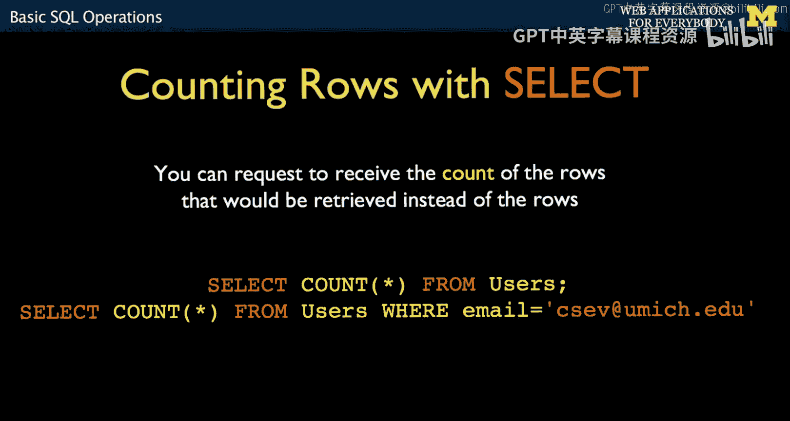

Select。Count。Star。From users， and that's going to tell me basically how many records are in the users' table。

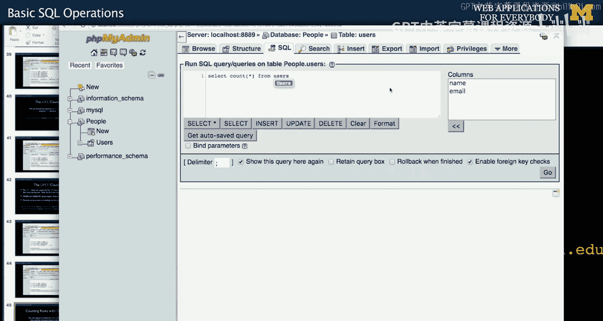

And so it told me4。And so at this point。We have actually hit all the crud。

We've learned how to insert， we've learned how to delete， we've learned how to update。

 we've learned how to select， and we've learned a couple of different things that we can do in select。

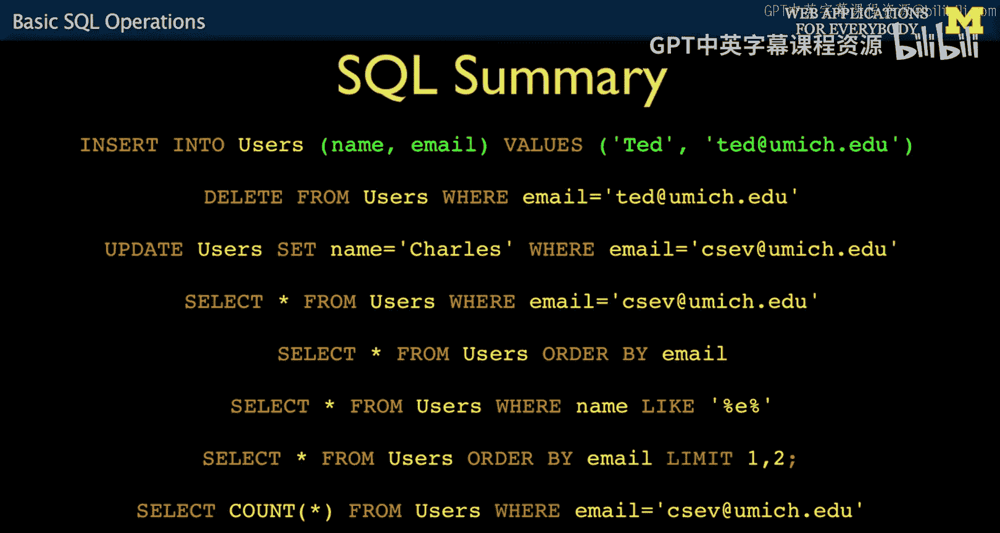

At this point， you kind of learn half of SQL because that's really what it does。

 It looks like a great big spreadsheet with a billion things in it and super fast。

 But the next thing we're going to learn， well， when we start moving things between more than one tables and exploit the relationships between those tables is when it actually becomes interesting。

 So coming up next， we're going to talk about more detail on how we set up these tables and different kinds of fields that we can put into databases。

😊。

