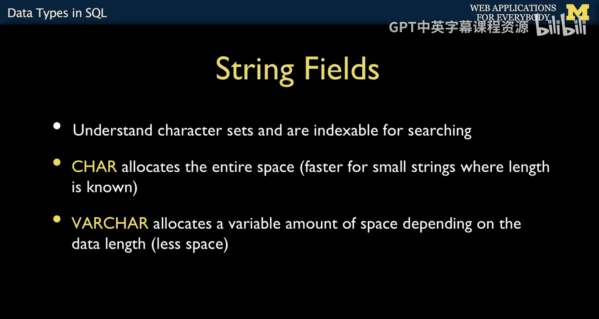
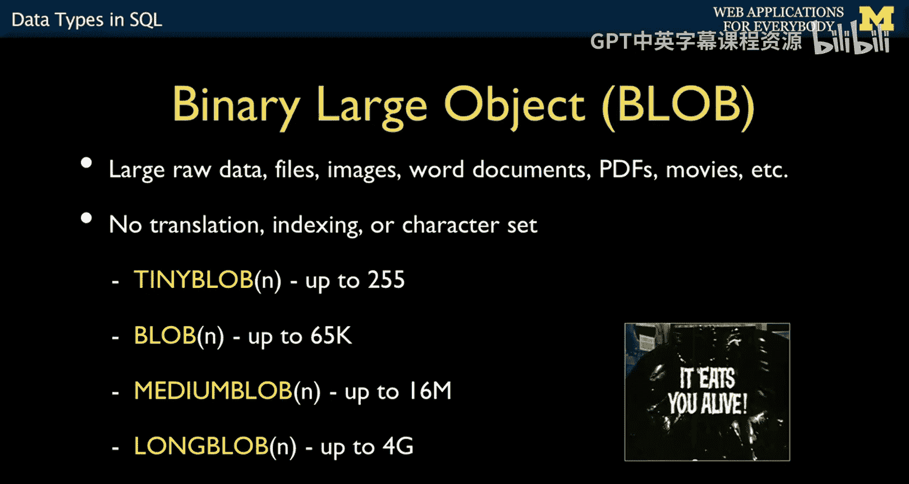
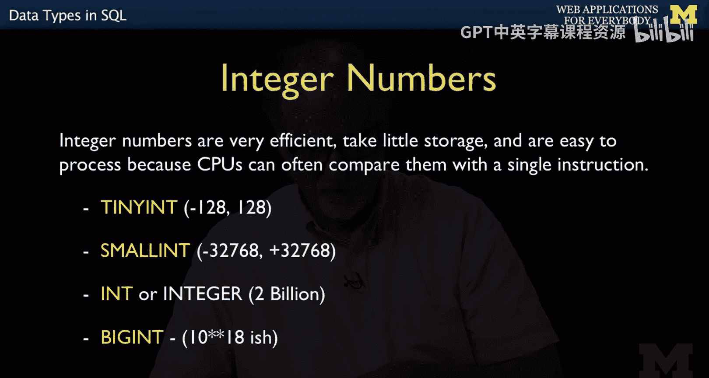
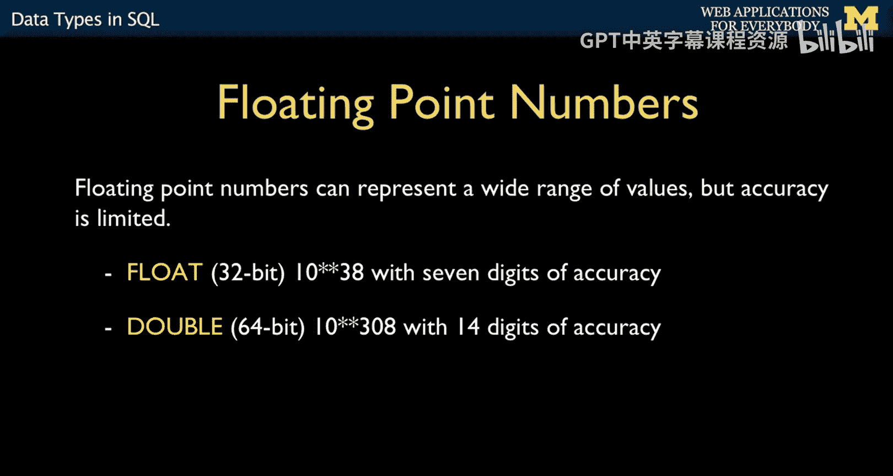
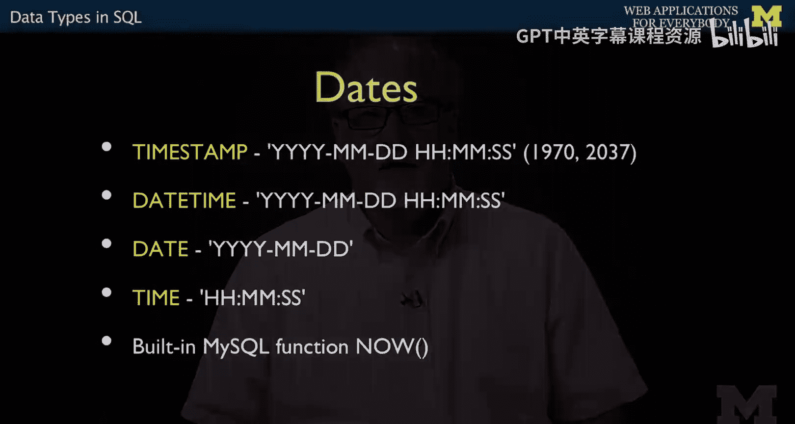
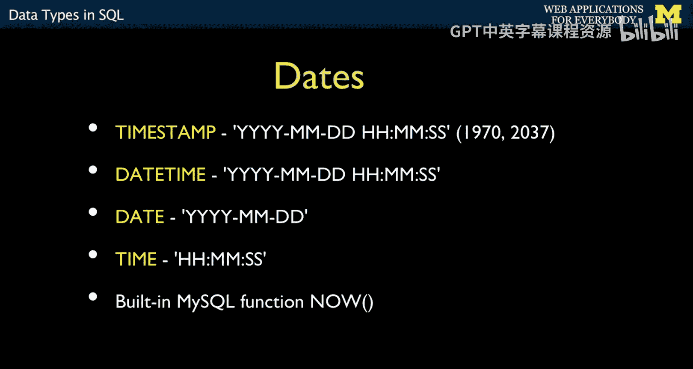
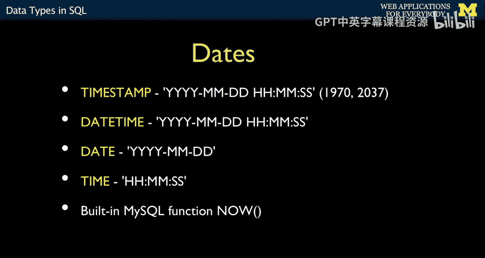

# 密歇根大学《面向所有人的Web应用程序》：第7章：SQL数据类型 📊

在本节课中，我们将要学习SQL中用于定义数据表列的各种数据类型。理解这些类型是设计高效、准确数据库的基础。

## 概述

我们将探讨文本字段、二进制数据字段、数值字段、自动增量字段以及其他类型的字段。了解每种类型的特点和适用场景，能帮助我们为数据选择最合适的存储方式。

---

## 文本字段：CHAR与VARCHAR 📝

上一节我们介绍了数据表的基本结构，本节中我们来看看如何描述构成表的列。首先，最常见的字段类型是字符字段，即`CHAR`和`VARCHAR`。

这两种类型都支持字符集，这意味着它们可以存储拉丁字符、亚洲字符、俄语、波斯语等各种文字。`VARCHAR`是可变长度的字符字段。当你指定`VARCHAR(512)`时，你告诉数据库：这个字段可能长达512个字符，但也可能只有4个字符。数据库会采用一种高效的方式来存储长度在4到512之间的字符串。

如果你使用`CHAR`类型，例如`CHAR(20)`，你是在声明这个字段几乎总是20个字符长。对于恰好是20个字符的数据，它的存储效率很高；但如果数据只有5个字符，存储可能就不那么高效了。

以下是选择建议：
*   如果字段长度变化较大（例如在5到500个字符之间），应使用`VARCHAR`。
*   如果字段长度基本固定（例如总是20个字符），应使用`CHAR`。

你为这些类型指定的长度是绝对最大值。例如，`VARCHAR(128)`就是一个约束，数据库会强制要求该列的数据不能超过128个字符。

---

## 大文本与二进制字段 🔤

除了`CHAR`和`VARCHAR`，还有一些用于存储大量文本的字段类型，统称为`TEXT`字段。

这些字段的关键特性是，它们不能像普通字符字段那样被有效地建立索引或排序。如果你需要存储博客文章或Facebook评论这类长文本，就会用到它们。它们都有最大长度限制：
*   `TEXT`：最多约65，000个字符，适合小型博客文章。
*   `MEDIUMTEXT`：容量更大。
*   `LONGTEXT`：最多可存储4GB的字符数据。

由于这些字段也支持字符集，因此65，000个拉丁字符与65，000个亚洲字符所占用的“字符数”是相同的，数据库能够处理所有这些字符。

接下来，我们看看很少使用的字节类型。在拉丁字符集（如ASCII）中，一个字符是8位（1字节）。但在Unicode中，一个字符可能长达32位（4字节）。而一个字节（`BYTE`）严格等于8位。

如果你存储的是二进制数据，并且确切知道其值范围在0到255之间（即一个字节），你可以使用`BINARY`或`VARBINARY`类型来定义字段。这种类型不常用，你通常不会为它建立索引或排序，因为它对其内容“一无所知”。但有时，例如从传感器读取的原始0和1数据流，就适合用这种类型存储。

你还可以在数据库中存储图像、PDF或视频等文件。数据库非常擅长处理这类数据，它们被称为BLOB（二进制大对象）。BLOB也有不同的大小类型，如`TINYBLOB`、`BLOB`、`MEDIUMBLOB`、`LONGBLOB`。

数据库存储这类数据效果很好，但问题在于，时间长了会显著拖慢数据库的备份速度。因此，常见的做法是：将中等大小的数据（如个人资料照片）存入数据库，以便与其他数据统一管理；而对于视频或大型文档，则倾向于以普通文件的形式存储在服务器上，然后在数据库中记录其文件路径。除了可能导致备份文件过大之外，在数据库中存储二进制对象本身并无不妥。

---

## 数值字段：整数与浮点数 🔢

整数类型有不同的大小。你可能会问为什么需要多种尺寸。答案是：为了效率。如果我们要存储数百万条记录，而某个整数字段的值范围只在1到15之间，我们就不需要为它分配与存储20亿数量级数字相同的空间。

因此，我们有不同大小的整数：
*   `TINYINT`：非常小的整数。
*   `SMALLINT`：小型整数。
*   `INT`：标准整数，范围大约是0到20亿（32位整数）。
*   `BIGINT`：更大的整数，占用更多空间。

整数类型，特别是`INT`，优点很多：排序速度快、占用存储空间相对少、易于比较和排序。它们常被用于建立索引，因此在很多场景下，我们倾向于使用整数而非字符串来表示信息。

浮点数在计算机中的工作方式与所有编程语言一致。例如`98.6`、`3.14`或`6.02e23`（科学计数法），你一直在使用的就是浮点数。关于浮点数的关键点是：像`1.7`这样的数字无法被完美精确地表示。浮点数是对实数的近似。

以下是浮点数的类型：
*   `FLOAT`：较小的浮点数，32位，范围可达10的38次方，但无论数字大小，**精度只有约7位有效数字**。
*   `DOUBLE`：双精度浮点数，提供更高的精度（约14位有效数字）。

对于温度、速度等测量值，浮点数通常完全够用，因为你能测量的精度很难超过7位有效数字。对于大多数科学计算，`FLOAT`和`DOUBLE`类型都很合适。但是，**不要用浮点数来存储货币金额**，因为像`$10.25`这样的金额无法被完美表示，会导致计算误差。实际上，存储金额通常使用按比例缩放的整数（例如，以分为单位存储）。

---

## 日期与时间字段 ⏰

SQL提供了多种时间和日期格式。

有一种类型叫`TIMESTAMP`（时间戳）。它存储的是自1970年1月1日（UTC）以来的秒数，并以32位整数形式保存。因为它本质上是一个整数，所以排序非常高效和快速。

但它有几个问题：
1.  它只能精确到秒，无法表示毫秒或更小单位。
2.  它有一个绝对的长度限制。时间戳的概念在1970年代被提出，从1970年1月开始计算秒数。这意味着在2037年，Unix系统和数据库系统将遇到一个类似“千年虫”的问题，因为届时32位整数将溢出（大约在2038年1月19日）。不过在此之前它都工作良好，未来我们可以将其升级为64位整数，那样就能用到太阳毁灭之日了，所以不必过于担心。

因此，对于仅需要秒级精度、记录行创建或更新时间的情况，我们倾向于使用`TIMESTAMP`。

`DATETIME`类型则更为通用，它占用空间稍大，可以表示任何年份（例如1300年），因为它的存储方式不依赖于1970年这个基准点。它可以表示任何符合 `YYYY-MM-DD HH:MM:SS` 格式的日期和时间，并且能安全度过2037年。`DATE`类型则只包含年月日部分，`TIME`类型只包含时分秒部分。

MySQL有一个内置函数可以获取当前日期时间。你可以在插入数据时这样使用：`INSERT ... VALUES (..., NOW(), ...)`。`NOW()`函数会返回数据库服务器当前理解的日期时间。

---

## 总结

本节课中我们一起学习了SQL的核心数据类型。
*   我们了解了文本字段（`CHAR`， `VARCHAR`， `TEXT`）如何存储字符串及其在字符集和长度上的特点。
*   探讨了二进制字段（`BINARY`， `BLOB`）的用途，以及存储大型二进制对象的利弊。
*   分析了数值字段，包括不同大小的整数（`TINYINT`， `INT`， `BIGINT`）和近似值的浮点数（`FLOAT`， `DOUBLE`），并特别指出货币存储应避免使用浮点数。
*   最后，我们比较了日期时间类型，如高效的`TIMESTAMP`和更通用的`DATETIME`、`DATE`。

理解这些数据类型是优化数据库存储、确保数据完整性和提升查询性能的关键一步。在下一节中，我们将讨论如何为每一列的数据指定更详细的使用意图和约束。