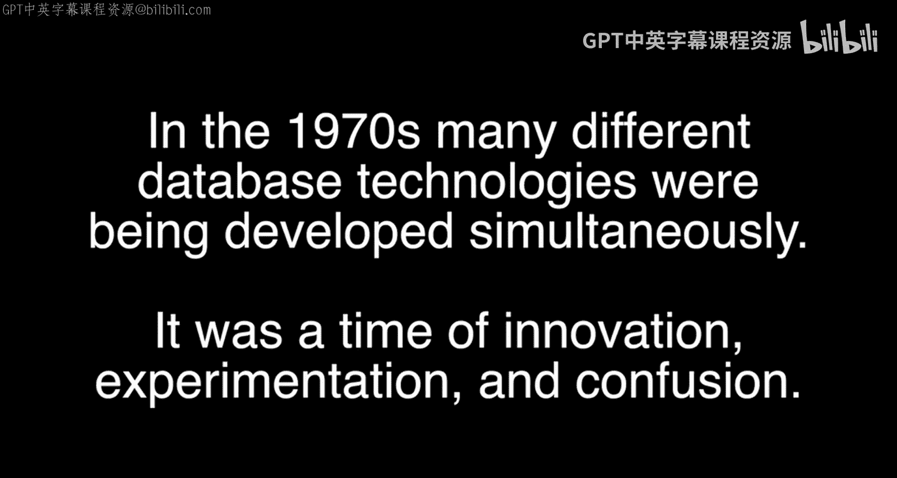
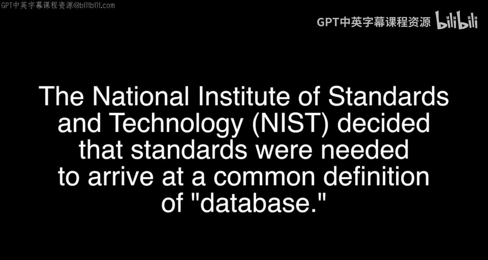
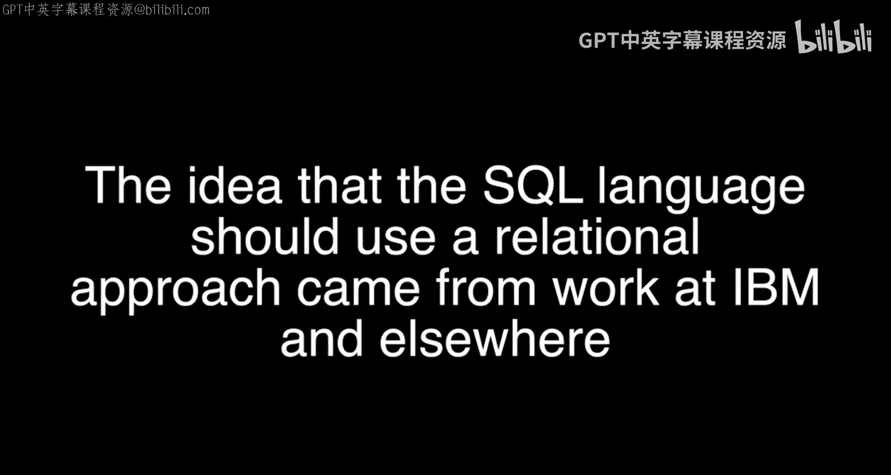
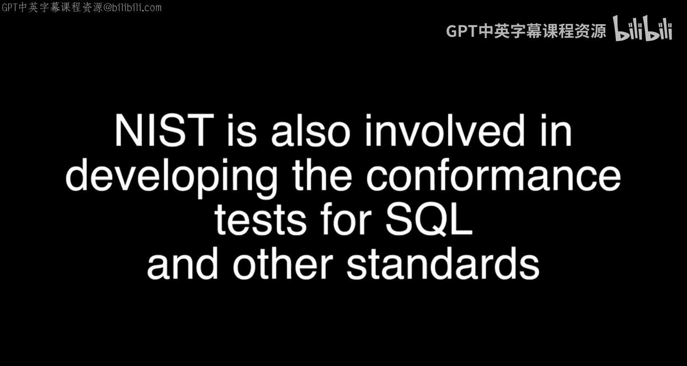

# 密歇根大学《面向所有人的Web应用程序（PHP、SQL、APP、JavaScript和JQuey｜Web Applications for Everybody》 p60 9_特别内容：Liz Fong谈SQL标准化.zh_en -BV1Lr421A75d_p60-

Yeah。🎼你是。🎼Okay。🎼好。🎼宝宝。🎼，🎼好。🎼哦。

🎼，And there were products that are coming。Growing from wild。 And then we realized that， hey。

I want to buy a product。 What kind of a feature do I need。

 another one of the things that I have done is the feature analysis。 so we have about。

Half a dozen of product and the standardization are really building a consensus we brought from a matured。

呃。Technology that are ready to be standardized where people say。

 do I buy IBM or do I buy Oracle or shall I buy a cheaper one。

 This kind of a decision started emerging。And the selection of I mean。

 how many variety application you can build on top of a software foundation。

 what I call database management system， is too varied and so you want to have some sort of a standard so that your application can work on。

Different platform。We work with files and we call it the file system， the files were hierarchical。

 there was the IMSS， the IBM information management system。

 which is a tree structure and the debate wass going on。

 whether there should be a tree or a network or flat file and we are still debd whether the data have a self-deib tag and later on we known it as a metadata and now people call it a schema。

So the database system study group come up with a reference model or specification for a minimal functionality of a database management system。

 in order to be a database management system， you want to be able to store data， retrieve data。

 modify data， organize data， delete， manipulate data， and it becomes a spec。And during that time。

 there was a birth of a。We initiated a birth of an NC。Group， it's now called Insight。

 the NCs American National standardss Group， and it's called the x3 H2， of which the。

Don Deutsch and people like Ln Gallagher all participated in that。

 that group is called the data management language。In order to standardize anything。啊啊。

You realize that you can have a lot of light bulb， for example， you can have red， light bulb。

 white light bulb， the only thing you want to standardize is when you want to talk to another person。

 a communication interface or a area where both both of us have to understand a common vocabulary or whatever。

 so the standard，The only standardization of a software system。Is not the capability。

 but the language。

And relational database at that time was IBM Christ State， and he's talking about normalization。

 he started talking about flat file and he called it a table and it's a very easy concept that everybody understand。

 so in order to retrieve a table you say select，From a column such as such， from a table of employee。

 and there was a birth of a simple query language。

Testing part is also a very important aspect of when you adopt the standard。

 you want to certify that the product conform two such a such version of ISO standard， JTC1。

 whatever it is。So that gets to be if you're otherwise your app won't work， your application。

 let's say you build a student。Course record。And。No matter you've got an Oracle。

 youve got a Sibase or Microsoft SQL， you want your。Application to work， no matter what。

And that's what the marketplace wanted to go， the user， of course， Oracgo。

Or Microsoft buy my buy my product。Oracle is say， buy my product。 And in the procurement， you say。

 I want to be。Compliant with SQL。And so you have to have the conformance testing certificate。

And we have the nav labs， it's a laboratory that's certified and give you a validated。Product list。

Of here， the。List of product that has been validated， that they conform to it。

 and you can buy from that list。But there's a requirement。

 this is strictly user you're buying because you're paying the money， not us。

Timing is everything you can't standardize a thing too early or you drive a lot of innovative concepts away because people say。

 hey， there's no way for me to get into your market because you already decided and even though it's not very good。

I won't。I won't get into that business， so we killed innovation。And if it is too late。

You miss the opportunity， you get too many variety of things coming up and the choice is too much。

 but of course， SQL is one of the success stories that lift。We have。🎼。

