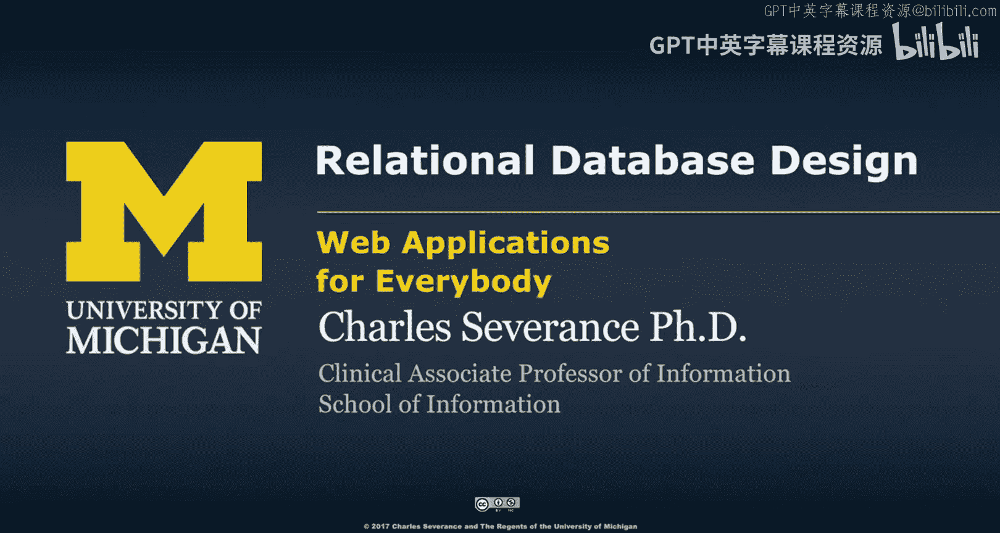
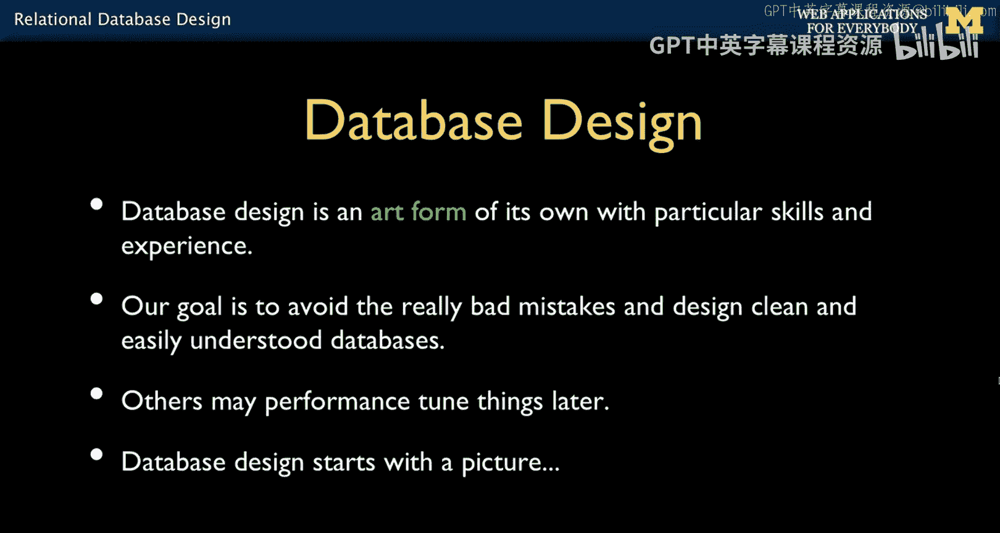
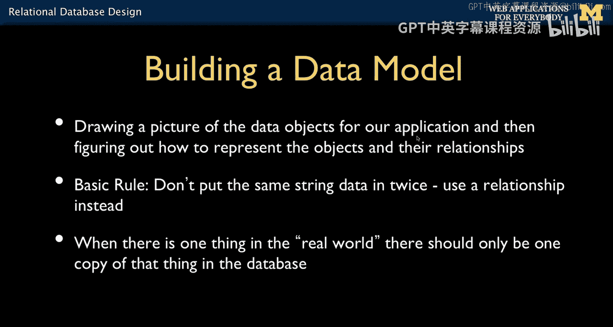
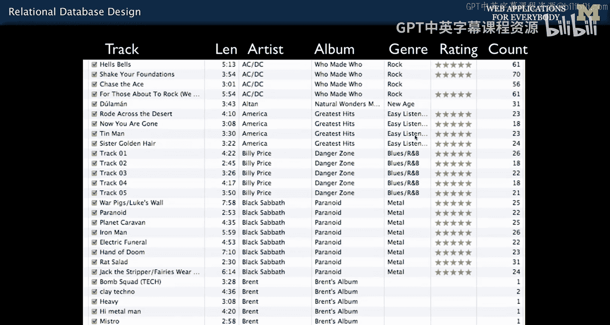
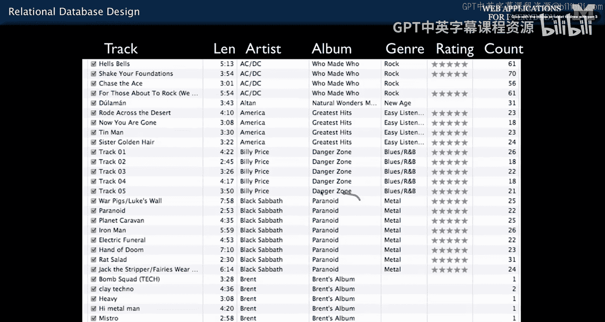
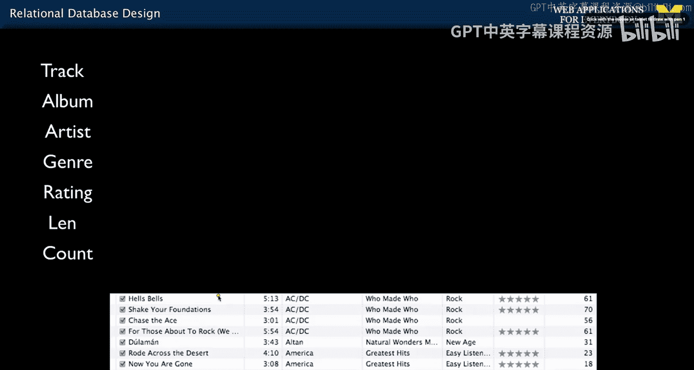
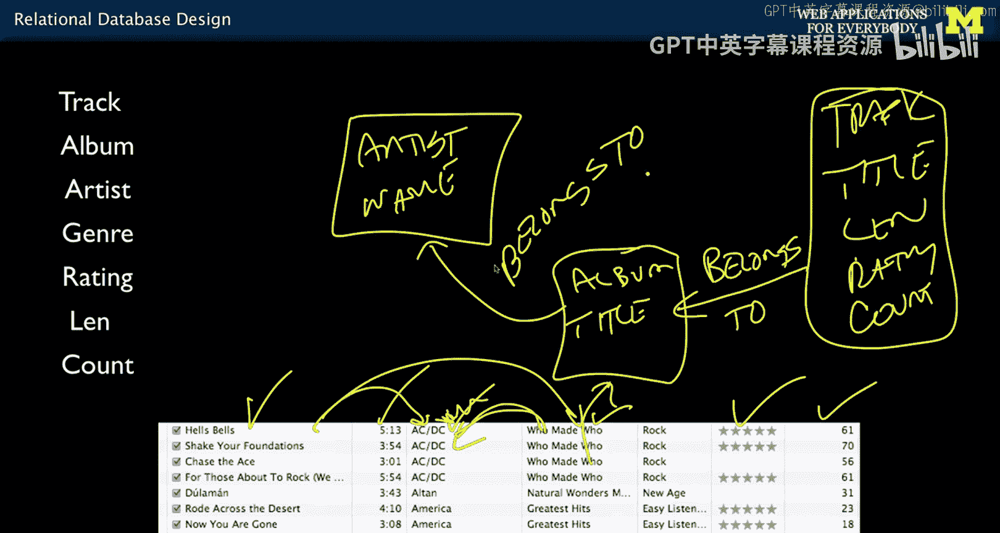
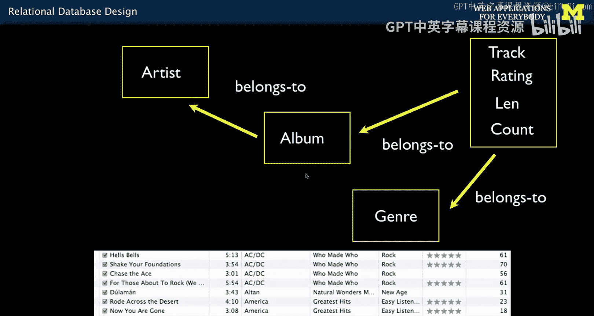

# 面向所有人的Web应用程序：第11讲：关系型数据库设计 🗄️

在本节课中，我们将要学习关系型数据库设计的核心概念。我们将从理解如何将应用需求转化为高效的数据模型开始，探讨如何识别和分离数据，以及如何建立表与表之间的关系。

## 概述

上一讲我们学习了如何在单张表中进行操作。本节中，我们来看看如何连接多张表，这正是“关系型”数据库的核心所在。我们将学习复杂的数据模型和关系，以及如何以允许数据库进行高效、高性能数据检索的方式来表示这些数据。这是我们将理论付诸实践，真正学习如何构建数据库的关键环节。

从这里开始，我们将从“如何编写SQL语句”转向“如何设计数据库”。

## 数据库设计之美

我个人学习数据库的时间较晚，是在20世纪80年代的研究生阶段。那时的关系型数据库并不完善，我一度认为它们很笨拙，宁愿自己写循环来读取数据。直到大约2000年，我首次以专业身份参与一个Web应用项目，需要设计数据库时，我才真正开始学习。我很快掌握了它，并发现这是一件非常美妙的事情。

你可以绘制一张图，画出这些线条，就像为你的应用程序创建一个数据网络。数据库设计的基础很容易理解，我相信在接下来的几节课后，你就能很好地掌握它们。基础部分易于理解，而高级技巧通常是在你遇到实际问题时，通过请教他人或查阅Stack Overflow等平台来学习的。

这是一种优美的艺术形式。掌握基础后，你将能够参与数据库设计，构建中等复杂度的数据库而不犯错误。当然，总会有更多技巧可以学习。

## 数据模型实例

这是一张我构建的数据模型图，它与我们本节课要讨论的内容类似。这是一个学习管理系统，实际上是我为本课程自动评分工具使用的软件的数据模型。

图中的每个小方框代表一张表，每条线代表表之间的关系。我们稍后会理解这些符号（如“多”、“一”等）的含义。我们正在创建的是一个网络图，而“关系型”的精髓以及使其速度极快的关键，就在于你对这些关系线的思考。它们看似只是技术细节，但这就是关系型数据库的魔力所在。

实际上，几小时后，你将能理解这张图上的几乎所有内容。这意味着当你进入工作岗位，看到墙上挂着类似的复杂图表时，你将能看懂。这是另一个我参与的开源项目“Sakai”（一个开源学习管理系统）的数据模型，而这只是其整个数据模型的约四分之一。

作为一名应用开发者，你必须了解并能够修改数据模型。理解数据模型是编写高性能代码的关键，因为任何人都能写出糟糕的代码，但对于一个成功的Web应用，性能必须相对良好。

## 从应用界面到数据模型

基本思路是：你不是从数据模型开始构建应用，而是从应用界面推导出数据模型。你观察应用界面，思考“这里有哪些数据块？”，然后决定如何将它们分配到不同的表中，因为把所有数据放在一张表里会很慢。所以，我们需要将数据拆分到几张表中，并决定哪些部分最适合放在哪张表里。

让我们假设我们刚成立了一家公司，我们的创新想法是：未来人们将按单曲购买音乐，而不是按专辑。专辑是一组音乐曲目，通常以约9美元的价格整张出售，而我们可以以1美元的价格出售单曲。这听起来是个好主意，对吧？

我们聘请了一位平面设计师，他给出了这个应用界面的设计稿。作为开发者，我们的首要任务不是去争论这个设计稿，比如“你意识到这个数据模型没有正确规范化吗？所以你必须修改应用界面”。我们不能这样做。我们假设这就是我们想要的样子。

对于一个数据建模人员来说，这个界面可能看起来很“吓人”，因为存在字符串的垂直重复，这不应该发生。我们的工作是构建一个满足用户需求的数据模型，而不是告诉用户，仅仅因为他们在用户界面的某一列中多次输入了“Paranoid”这个词，他们就违反了规范化规则，应该设计一个不同的用户界面。

那么，问题是如何从这个用户界面出发。我们有这些列：曲目、时长、艺术家、专辑、流派、评分、账户。现在，一种方法是创建一张名为“music”的大表，把所有列都放进去。但你会发现，就像你可能在整理自己的音乐电子表格时经历过的那样，你会反复输入相同的信息，然后意识到“这里有问题”。接着，你可能会打错字，然后需要在很多地方修复它。

关系型数据库的理念是：这些数据不应该放在一张大表里。专辑信息需要有自己的表。我们只将“Paranoid”这个词存储一次。然后，我们会在曲目表中放一个标记，比如“专辑编号7”。这样，“Paranoid”对应的所有曲目都会引用这个编号7。稍后这会更清楚，但基本思想就是这样。

我们作为数据建模人员，不会要求设计师改变界面外观，我们会在后端进行补偿。

## 识别核心对象与分组

我们需要查看所有列，因为我们确实需要表示所有列。我们知道会有多张表，但我们希望以合理的方式对它们进行分组。因此，我们必须弄清楚需要哪些表，这里表示的核心对象是什么。为每一列创建一个对象也不是好主意。我们需要在“属于一起的数据”和“需要分开并通过链接关联的数据”之间找到平衡。一旦找到这种平衡，我们就能获得最高的效率。

你可以暂停一下，去喝杯咖啡，因为我们将要坐下来，在白板前讨论并确定这个应用的数据模型。

以下是我们必须创建的列。我们首先要进行的讨论通常是：“第一张表是什么？”因为我们知道会有多张表。在构建数据模型时，你经常会问：“第一张表是什么？”通常你会思考：“这个应用的核心目的是什么？”

对于Twitter，核心可能是“推文”；对于学习管理系统，核心可能是“课程”；对于电子邮件系统，核心可能是“用户”。现在，我们需要为我们这个小应用进行辩论：核心是什么？用户不是我们的核心，因为我们构建的是一个每个人单独使用的小工具。而且，我们的界面上没有名为“用户”或“电子邮件”的列。

观察这个界面，我认为每一行的基本要素是“曲目”。所以，我认为核心是“曲目”。让我们确定第一张表是 `Track`（曲目）。

## 构建数据模型

现在，我们要做的是查看所有这些列，并判断哪些是每个曲目独有的、互不相同的方面，哪些是在多个曲目间相同的。这其实就是关于垂直重复的问题。

垂直重复是线索。如果你看到某个字符串垂直重复，那就是个问题。而数字的垂直重复通常是可以接受的。数字存储起来很廉价、容易。

以下是我们的分析步骤：

1.  **曲目**：这是我们的核心表。
2.  **标题**：每个曲目的标题都不同，所以它属于 `Track` 表。
3.  **时长**：这是一个数字，即使不同曲目时长相同也没关系。它属于 `Track` 表。
4.  **评分**：这是一个0到5的数字，属于 `Track` 表。
5.  **播放次数**：这是一个计数数字，属于 `Track` 表。

这样，我们的第一张 `Track` 表就包含了：`title`（标题）、`length`（时长）、`rating`（评分）、`count`（播放次数）。我们把这些列勾选掉了。

接下来，我们处理那些存在垂直重复的列。这些列将促使我们创建新表。

1.  **专辑**：专辑名（如“Paranoid”）在多个曲目中重复。我们创建一个 `Album`（专辑）表，包含 `title`（专辑名）。然后，我们建立关系：每个曲目（`Track`）属于（`belongs to`）一个专辑（`Album`）。
2.  **艺术家**：艺术家名（如“AC/DC”）也在多个专辑中重复。我们创建一个 `Artist`（艺术家）表，包含 `name`（艺术家名）。然后，我们建立关系：每个专辑（`Album`）属于（`belongs to`）一个艺术家（`Artist`）。同时，曲目通过专辑间接关联到艺术家。
3.  **流派**：现在的问题是，流派应该连接到哪里？是连接到艺术家、专辑还是曲目？这是数据建模中需要做出的决策，并且会影响我们的应用。
    *   如果连接到艺术家，意味着AC/DC的所有作品都必须是摇滚乐。这限制性太强。
    *   如果连接到专辑，意味着《Who Made Who》专辑的所有曲目都必须是摇滚乐。这更接近，但如果一张“精选集”专辑包含不同流派的歌曲呢？这也不行。
    *   因此，为了灵活性，我们将流派连接到曲目。我们创建一个 `Genre`（流派）表，包含 `name`（流派名）。然后，我们建立关系：每个曲目（`Track`）属于（`belongs to`）一个流派（`Genre`）。

## 最终的数据模型图

最终，我们得到了一个包含四张表的数据模型：
*   `Track` (曲目)
*   `Album` (专辑)
*   `Artist` (艺术家)
*   `Genre` (流派)

以及它们之间的关系：
*   曲目 **属于** 专辑
*   专辑 **属于** 艺术家
*   曲目 **属于** 流派

我们并不需要过分担心专业术语，我们只是尝试将列拆分到属于一起的组中，并建立一些有意义的、人类可以理解的关系。接下来，我们将讨论如何将这幅图转化为实际的数据库代码，包括列命名约定和使这一切组合在一起的数据库特性。

## 总结

本节课中，我们一起学习了关系型数据库设计的基础。我们从应用界面出发，识别出核心数据对象（曲目），并通过分析数据的垂直重复情况，将信息拆分到不同的表（专辑、艺术家、流派）中。我们建立了表与表之间的“属于”关系，从而构建了一个高效、灵活且易于维护的数据模型。这个模型避免了数据冗余，并为未来的功能扩展留下了空间。在下一节中，我们将学习如何将这个设计图转化为具体的SQL表结构和关系键。