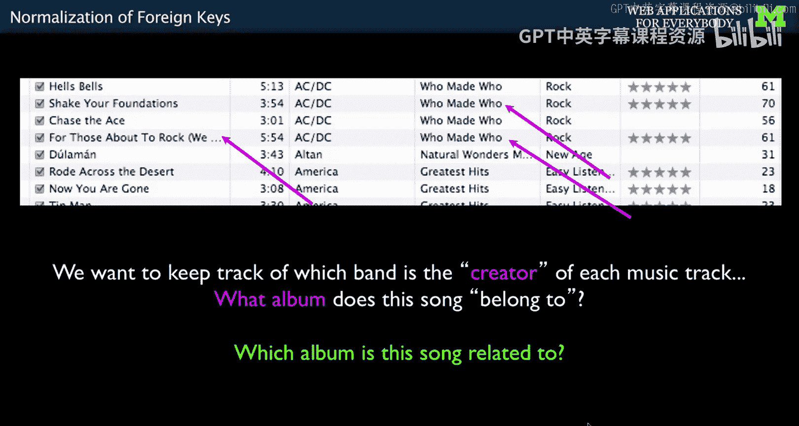
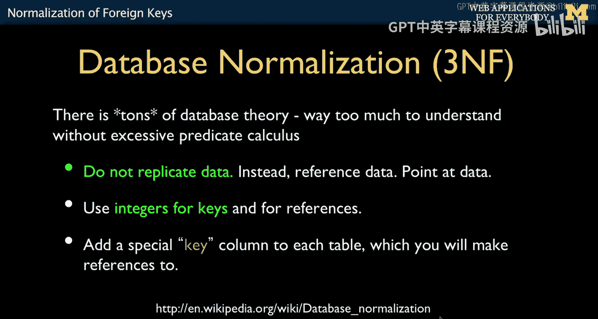
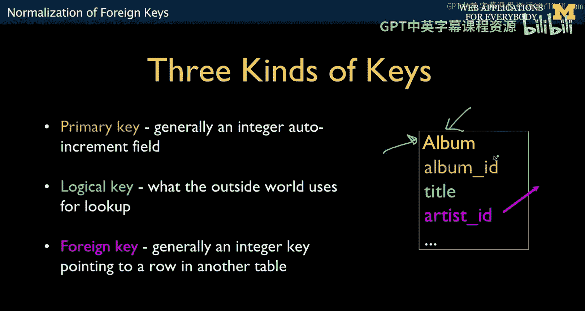
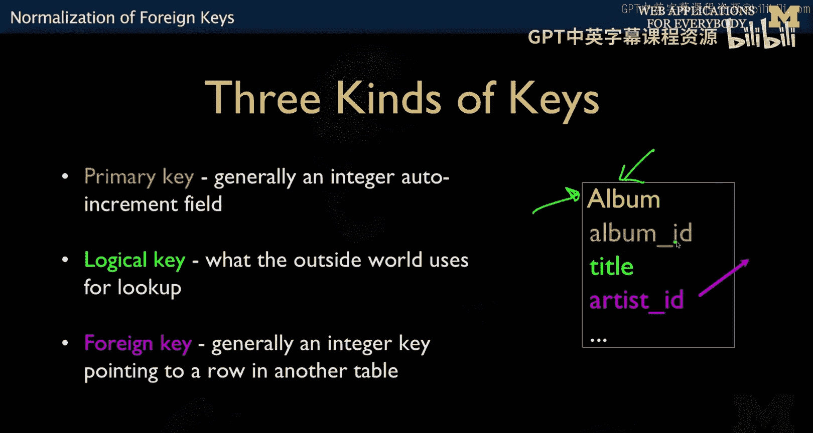
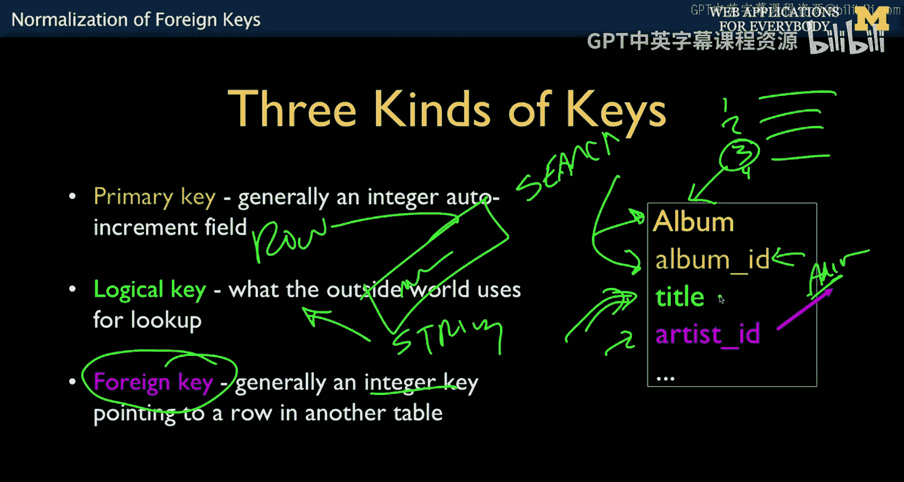
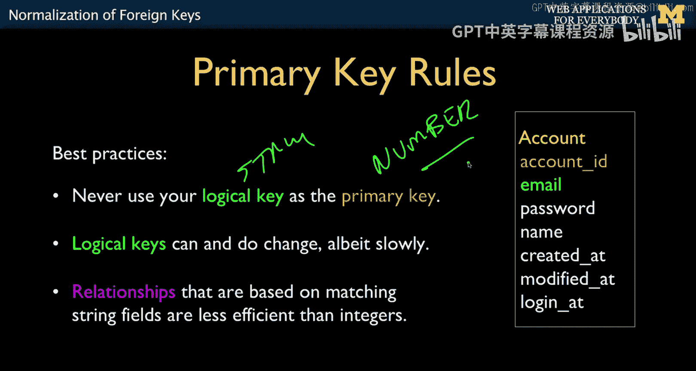
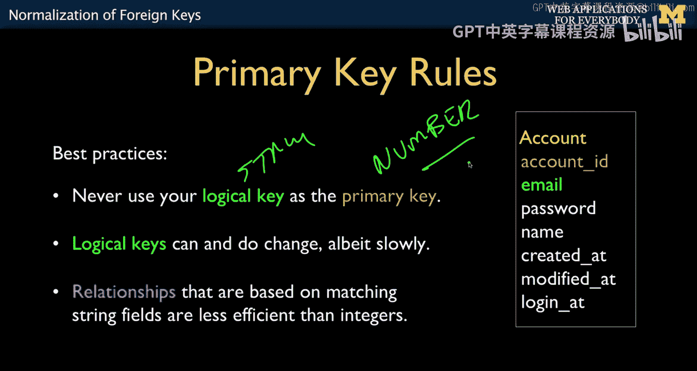
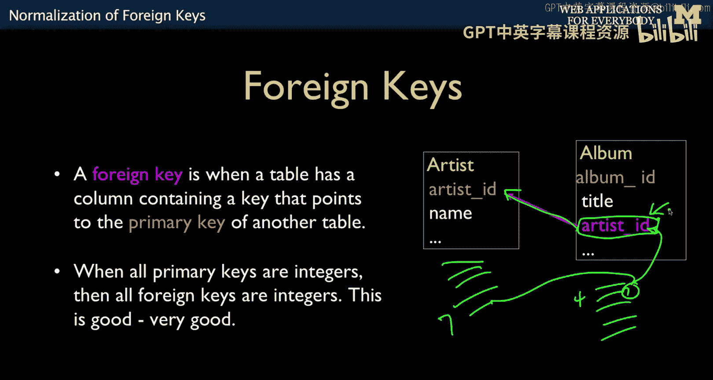
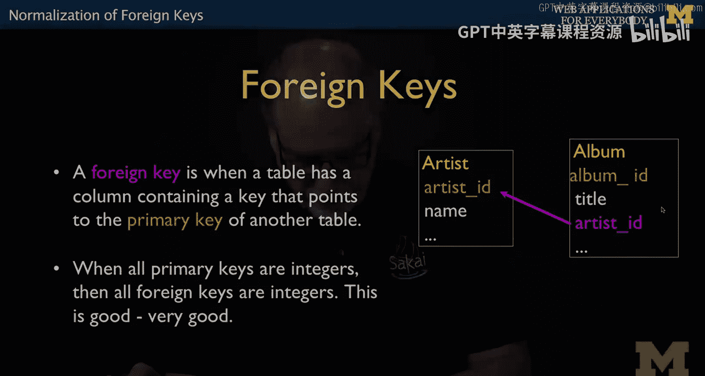

# 密歇根大学《面向所有人的Web应用程序（PHP、SQL、APP、JavaScript和JQuey｜Web Applications for Everybody》 p63 12_规范化与外键.zh_en -BV1Lr421A75d_p63-

So now that we have sort of a picture weve drank a couple cups of coffee。

 we took a break and then we come back， we take a look at our picture and we make sure that maybe we got everything right in the picture and now it's time to get to work and make it so that that picture turns into columns and databases so we still need to connect all these things we need to keep track like we can't just say the tracks are in one table the albums or another table we need to connect rows of track table to row the corresponding row of album days so we still have to keep track of this stuff we just don't get to have this vertical duplication of string data。

This is what's called database normalization。 It's what we've been doing。

 And so database normalization， you can read as much as you want about this and it has to do with and I told you about like why relational databases are so cool and there's like all this wonderful predicate calculus that I have no clue about。

 but I do know this。 it's really awesome when someone else figures it out。

 So databases are super fast。 So most of us as programmers don't need to know the math。

 but the math benefits us。😊。

And so when we're doing this database normalization。

 we are structuring a database in that the magical underlying cool math that makes databases fast。

We can take best use of it。 We can write bad databases。

 and then all this magic that it does is not available to us。

 So database normalization is a study of its own， and you could take like a whole semester on the math that makes this work。

 and then there's like first normal form， second normal form。

 two and a half normal form or a bunch of stuff。 but and that's fun。 And if you like that stuff。

 go study it。 and you'll learn something from it。 What I'm going to do is I'm gonna to collapse that down into one slide。

 I've already told you all the rules。😊。

The rules are don't replicate vertically data， don't put the same string in twice。

 so in in a system where you're going to put the name of each of your user and the name is Charles Severance。

 don't put that anywhere except one place and then get a little number。Integer key。 we have keys。

 So Charles severance is equal to2。 And so two， then is everywhere else we need to mention my name that points to the user table as it were。

 We're going to use the number two。 And these integer keys。

 And so we have this special key column so that we can like have a handle for each of the rows。

 And you already know how to do that。 The auto increment。 Remember that that makes a key column。

 That's what we're doing with auto increment。And so what we end up with is a key column。

In every table。 And so this is our artist table， right our artist table， we have an artist name。

 And then the key is just our bookkeeping mechanism that we add to every table。

 And so this is like one of those auto increments。 and this is just something we're going to do in every row。

 and you've seen this before。 What you haven't seen before is what we call a foreign key。

 And that is， if this is a table called the album table。

 and we have a relationship between albums and artist， we had another column。

 which is the beginning of these arrows。 right， the beginning of the arrow called artist Id that says this corresponds to row2 of the artist table。

 So goaded row 2 row 2。 And so this is it。 That's the whole thing。I mean， literally。

 we're going to have put in primary keys and then foreign keys。So we have some terminology。

 the primary key is the key that indicates the row and it's generally an integer auto increment and I have a convention。

 this convention I sort of borrow a framework called Ruby on Rails。

 I sort of adjust it a little bit if I name a table。

 I tend to name a table and then I have the primary key be the table name underscore ID so in this class I make my tables be uppercase Caml case first letter and then I replicate it but I make all of my columns lowercase。

Having a convention is good。If you would work at a place and they have a different convention。

 don't tell them about my convention and don't try to tell them that your professor told you that my convention is better。

 even though my convention is better， but don't tell them because they think their convention is better and they won't like you very well。

 So there's a primary key which is the key for the row。

Which wrote it is a logical key。 We' talked about this。 This is like， you know。

 your email address or your name or the title of an album。 It's how you might look it up。

 And so if there was some user interface that had a search。

And whatever you'd be typing into that search and hitting the button。

 that's what we call a logical key。 It's a key that the humans outside of our application。

 The humans should never know or see what this internal key is because it's just a sequence number 1。

2，3 that tells allows us to have a handle to grab onto a particular row。

 then when we have a column that really is pointing to a different table。

 the artist table in this case。 Then we call that a foreign key。

 So it's not a key to the table were in。 It's a key to another table。

 So primary key handle for a row logical key。 the way humans looked a rows up。

 For key points to a row in a different table。 Again， integer。Integer。

 and this one's usually not an integer， this is usually a string。So the title。

 the foreign key is usually a string， probably this single biggest mistake that people make。

In any application， is they say， oh， well， everybody has an email address。

 Why do I have to make a little number， You know， C7 U missed out Edu is 916。

 And then I can't just put C7ev everywhere becauseuse wouldn't it be easy to look at my database and just see the email address And the answer is。

 no。

You're not going to do that。 Not going to do that。 Never use your logical key， the string thing。

As the number thing。Ever， ever， ever， never。And that's because logical keys change。Also。

 they take up more space。 Now you think， oh， a number number and a string whatever A number takes up 4 bys。

 A string can take up 100 Btes or 200 Btes。 Promise you don't know how long strings are。

 And so but the numbers are all exactly four bytes。 They sort really fast。

 computers are so much faster at numbers than strings。

 especially when you start thinking about character sets and sort of Asian character sets and Russian characters and all these other character sets。

 That's hard for computers to do compared to comparing numbers。 So just don't do it。 Don't do it。

There are some systems I won't mention Oracle， no， I won't mention Oracle that think oh don't worry about it。

 just use your string as the primary key will take care of everything and like like， no。

 I'm not going to do that because in my SQL you don't want to do that maybe there's magic things I don't use magic。

 I like to give the primary key I like to know what it is。Sorry， sorry。

 I got to call myself down because I'm imagining some of you are thinking you might use the logic key as the primary key。

Logical keys can and do change， and even if you're using Oracle and you think maybe logical keys don't perform so horribly bad anymore。

Because Oracle does like useless magic。That makes me really annoyed， But you at a university。

 you can come in and they can assign me an email address and you don't like it。 maybe get married。

 maybe get divorced。 Maybe just don't like the email address。

 there are generally most universities a place that you can say hello， I don't like my email address。

 I want to be awesome dude at Umi study you right， now， usually they won't just do that。

 but maybe I did get married and they can change and then if you have in many if you think of a university。

 it has hundreds of applications。

And perhaps 20 to 100 tables in every one of those applications and if your email address is in every one of those tables because it's more convenient to look at it versus a number。

 it's terrible so the way it works at this university is there are like 10 major applications when you change your email you kind of hold your you say okay give us a couple days and then what they do is they talk to each application and if the email address is only one place in the application bam then you kind of wake back up you get your new email address and then all these applications know about you because if you're lucky different applications will have a copy of your name。

 but each application will only have one copy so we change 10 applications and literally the entire university sees use this new email address okay。

Okay， strings are slow， integers are fast。Logical keys change， I think I've said enough about that。

 For keys， as I've said， is a situation where you have a row， and artist。

And this is row 7 and you have an album and you want to。

 you know's this is an album and this can be album 4 and you want to connect album 4 to row 7。

 So you just put a7 in here。 So this is the foreign key。 That's the foreign key。

 Now I also name the foreign key with the same as that primary key so that's like a little memory queue so that I know that Now Rubyen Ras does this exactly the same way。

Okay， foreign keys are going to be integers， fast， fast， good， small store， compare， all good。

So。Now that we understand the basic idea of making these numbers and putting the numbers in very various places。

 let's go through an example of how we would do this。

