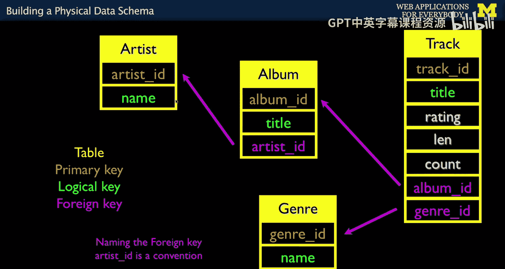
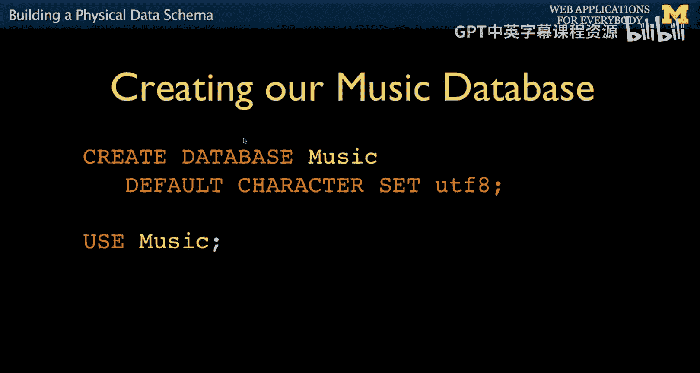
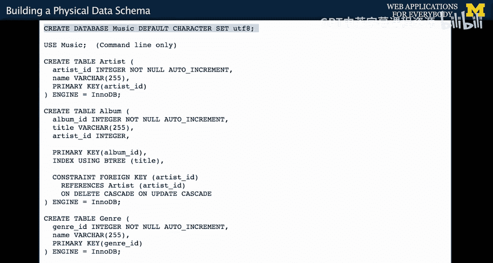
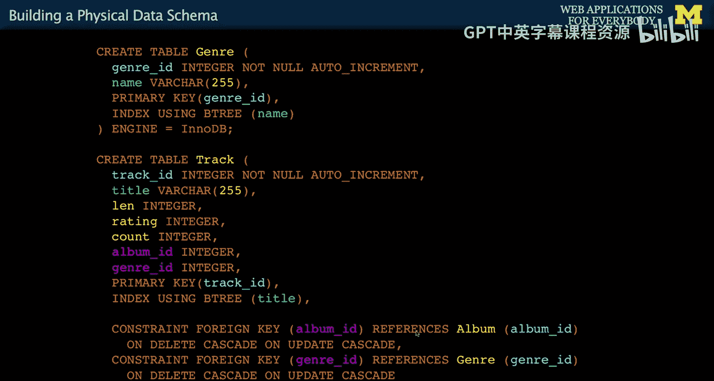
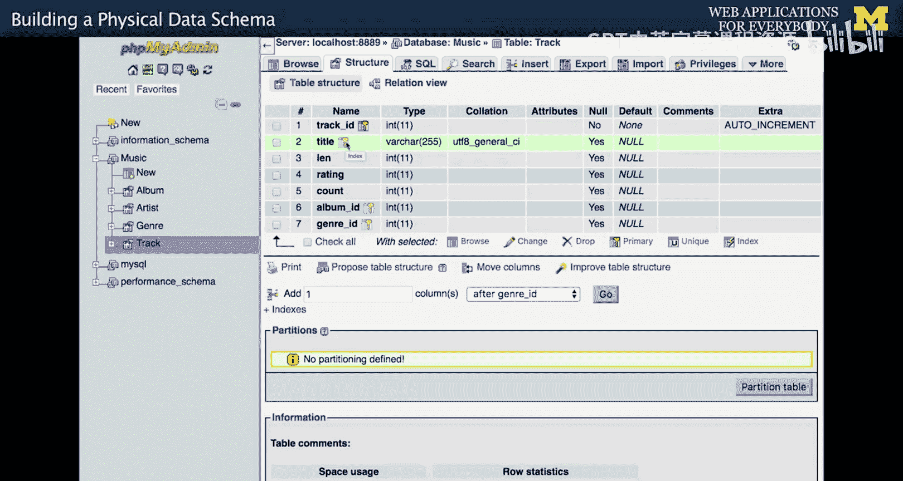
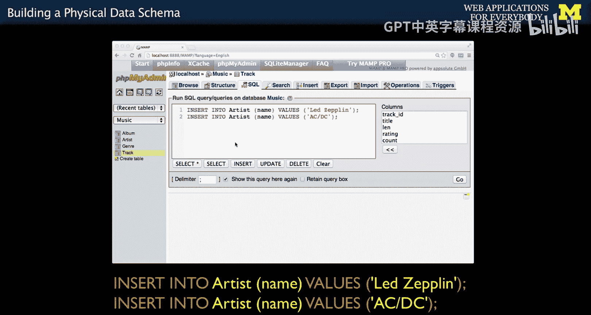
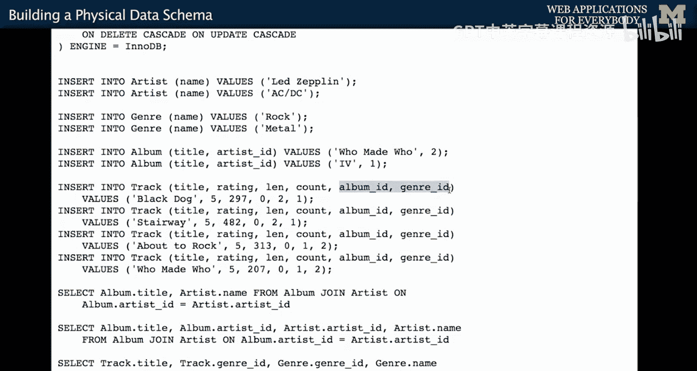
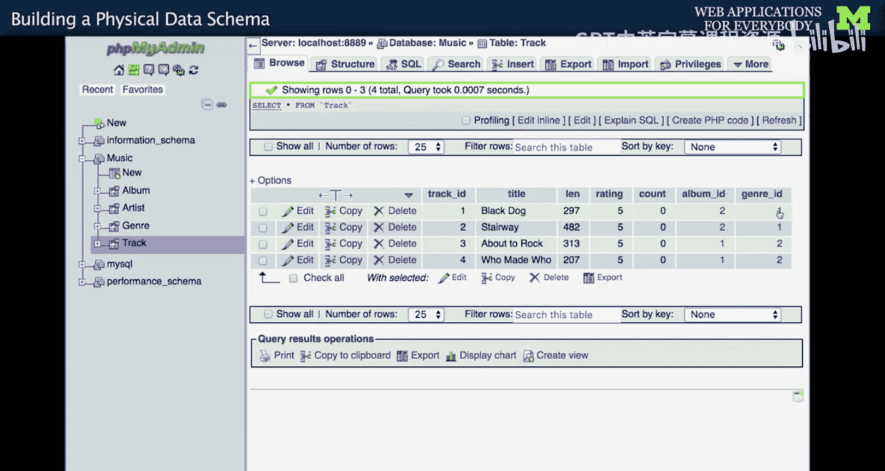
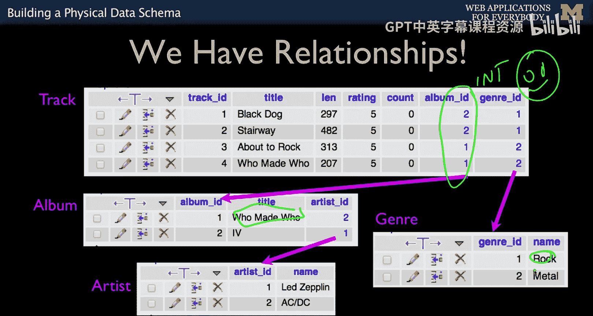

# 密歇根大学《面向所有人的Web应用程序（PHP、SQL、APP、JavaScript和JQuey｜Web Applications for Everybody》 p64 13_构建物理数据模型.zh_en -BV1Lr421A75d_p64-

So now we're going to work through an example where we're going to put these actual numbers in tables and if you take a look at what we started with。

 we drew this picture on the wall in our conference room， we drank a lot of coffee。

Now， when we drew this picture， we didn't sort of worry about the nerd mechanics of this。

 We didn't worry about the exact name of the columns。

 We really focused on this is like what the logical structure。

 And now we're gonna map this sort of logical structure to a more physical structure。

 And so what we're going do is this was a part of that picture that we drew。

 and now what we're going do is say， you know what we got to map this to sort of exactly what we're going name the columns or we're going to name the tables。

 et cetera。 So what we're going do is we're gonna start and say okay， we're gonna make a track table。

 and we're going to put a primary key and you'll see almost every single thing we do。

 that's first just put a primary key in you'll cut and paste in。

 you just do it over and over and over again， put a primary key And again。

 that's so that we just have a little handle for each row that we can point to later。

 That's exactly what we're doing。 we'll have a logical key。

 And I'm just kind painting that with the green color。

 And then we have kind of data columns like these are just integers。

 This is string this integer integer integer。 And then we have to model this right。

SoWhat happens is we add the foreign key to the table that is the beginning of the arrow。

 and this is actually later we'll learn this is a many to one relationship。 Many tracks。

 meaning there will be many rows in the track table that point to the same album table。

 So album has many tracks。 So this is a many to one or you might say infinity to one or the little crow feet to like vertical bars。

 So there's all kind of ways on these pictures， which we'll take a look at in a bit to capture these notions。

 but we put the foreign key at the beginning。Of the arrow， That's what we do。

 We put the foreign key at the beginning of the arrow。 And then in the album table。We just， you know。

 make an album table album ID， title， okay， we might look up albums by title。

 so we'll mark that as a logical key。So if we keep doing this over and over and over again。

 it's pretty simple because albums belong to artists So we make an artist table。

 a primary keyeological key。 albums have primary cheological key。

 Oh yeah foreign key because there was an arrow between albums and artists and then we put genre in we got the genre I in the genre name and then we have an arrow there and so we have two foreign keys here and that's okay that's perfectly fine we have two arrows that started it track and now we have two foreign keys and we've got this naming convention that genre genres。

 I mean， you just look at it and go like thank heaven if I called this X Y Z AB D E F G H I J K if I named them with really stupid names。

 we could still write code and the program would not care but naming conventions is really important so that you just don't go crazy。

 So unless you have your own naming convention， follow my naming conventions and you know if you want to help from the teaching assistant and you're not using the naming conventions we just。

Hey， whyhy don't you go back and just rewrite everything you've got using our Na of conventions because it makes our heads go。

When you show me stuff that's not using the name of convention。 and you ask my help。Okay， so。

Let's make ourselves a database and as usual。

We have got a little handout。That's going to make our lives a little easier。Okay。

 so let's just get some of the。Work out of the way， let's make a database called music。

So we got a music database， let's be in the database， and then we're going to make some tables。So。

Let's take a look at some of these create statements。

So remember what we're doing is we're capturing these pictures。And so。

We're going to build from the outside in。So we're going to work on artist first。

And we're going to work on outside end because in a sense。

 we have to establish this table before we can establish the table that points to it。

 So we'll probably do this like one，2，3 or 4。 This might be two。

 but this hasn't going to have to be the last one because it really depends on the other。

 So you kind of work from the leaves of our tree inwards。So we'll do create table artist。

 And so this is from the previous lecture。 This is just an auto increment non null integer fineine。

 then there's a name。 and we're going to say the primary keys artist Idie。

 Now this is sort of what we did before， that's that's all we did。 Now the next。

 the interesting one now is we're going to create the table album。 And so if you have an artist。

And the album。We had an arrow here， so we're going to have a primary key for the album。

 We're looking at this table right now， primary key for the album that's done。

 We say not all increment， primary key， we have a title and an artist ID we' going to call we're going to use the B3 index because that's kind of our logical key and so that that stuff we've done before and now here's the new stuff。

There's a lot of stuff and constraint foreign keys like SQL keywords or my SQL keywords。

 and then what we basically say is the column artist ID in this table references a column in the artist table named artist ID。

This is the syntax that we use on the createate statement that establishes thearrow relationship from here to here。

Now it turns out you don't actually need to do this and we'll talk a little bit later about this ondte on update cascade。

 but what we're doing。Is super helpful to my SQl to performance tune what you're doing， saying， look。

 this isn't just another integer column because up here， we just said it's an integer。

 We're really distinguishing this。 We're saying not only is this an integer。

 but this is an integer that has a special kind of number in it。 And it points to another table。

 So that's how we capture it。 So look closely at this。King。And so if we look at the next thing。

 we're going to have the genre right the genre has a primary key again you just cut and paste this stuff。

 I literally when I start new projects， I come back to these lectures and I cut and paste this stuff and then tweak it and change it right So we got an integer。

 We got a index for the for the name we're going to call the primary key。 that's just another thing。

 And now we're going to create the table track primary key logical key data。Foreign key， foreign key。

 We mark that this is the primary key， and we tell this that this is telling what our primary and logical key is within the table。

 right， So that's telling us within the table。 And now。Track has a link to album and a link to genre。

 So now we've got these two foreign keys， but now we have to inform。Myus QL about the workflow。

 So our field album I D， this one here points to。Albums， album ID， so this is table name。

 field name and genre ID， our genre ID points to the genre table。Row indexed by genre I D。

 And so we have we're using this as a textual way to draw the picture。

 And so the text doesn't need to be complex。 If you know what the picture is。

 you should be able to directly convert from the picture to the text。 The scientific， clever。

 creative bit was all in making the picture， not in typing up the SQl。

 Once you know what the picture is， it's a rather manual process。 And as a matter of fact。

 there's even tools that let you draw this stuff and then say make the SQL。

 I don't like those tools because they're too fancy， because I like to be able to look at this。

 And I like to understand this because to me， that's a picture。

 And I think it's actually very beautiful to capture that picture。😊，Okay， so let's run some SQL now。

And this is where cutting and pasting is super fun。

Ive got you notice I got semies at the end of these， so well I'll start with one。

 I'll just create the artist table。And let's go in and create the artist table。Poof。Worked。

Create the album table now。Well， let me do this。 Let me show you something。

Let me try to create the track table and watch how it blows up。

So the track points to the album table and the genre table， neither of which have been created yet。

Okay， so what I'm trying to do here is I have an artist table。

 but I don't have an album or genre table。 And so I'm I'm like， hey。

 let's link out to these other tables and it's going to say。No， that was not making me very happy。

 cannot add foreign key constraint。 Now， you could even go to stack overflow。

 Let's put this in a stack overflow， just for yucks。Or just go to Google and see what happens。

Reasons that you might not get a foreign constraint foreign key。 blah， blah， blah bla， blah， blah。

 Who knows if that's a good question or not， That's half to promise stack overflows。 you fine stuff。

 You don't know if it's good or not。 So， but the mistake we made is we did not start from the leaves of this database and work our way in。

 So we will go back and do this right now， and we will go and we will make。 We have the artist table。

 And now we can create the album table。 And this part here is going to work。This part here。

 get rid of that and go like this artist exists。 And so we're going to establish a relationship between this album table we're about to make and the artist table。

 So this is going to be happy。 click， and so if you look an artist。 well we'll see this。

 So if you look an artist， it knows about this stuff and look at album it knows about this stuff。

 it knows that that's a foreign key， it's an index， it's a foreign key。

 there's other stuff over here。 you know， so it kind of knows all this stuff。

 we've communicated a picture using text。Okay， the next thing we're going to create is the genre table。

 genre table just got a primary key becauses it's a leaf on the end of this。Create the genre Raticum。

Create the genre table， easy money。And then we will create the track table Now this this is the one we tried to do before that blew up。

 but now that those two tables exist， it's going to be happy as a clam。不。There's our track。

It's got know， foreign key， foreign key logical key primary key。Primary key。Indexed。

 this has also got an index on it as well， but there's even more that it knows about that。

We have all these values， and it's time to insert the data。

 The other thing that we do is we insert the data from the leaves in because we have to establish those rows。

 So I'm going to start in the artist table because you got to establish the rows Now when we do this in a programming like PhP。

 we will actually be able to ask the database what these numbers are。

So now we're going to insert some data。And one of the things we have to do when we insert the data is we got to kind of work outwards because we have to establish the numbers that go with each of these items because we're going to point to them using the numbers。

 so we're going to start with artists and then work our way in。

And insert the two artists that we have。LED Zepppelin and ACDC。Now if you recall。

From the last time we talked about this with auto increment or demonstrating auto increment。

 so now we can go into the artist table and you will notice when we look at the artist' data。

That we have assigned these auto increment。 Now before we just it was like， oh， that's magic。

 It works。 But now we know that LED Zepplin is always one。 Now that when we're writing PhP code。

 you'll be able to call the database and say， hey， you just put in LED Zeppellin。

 what number did you give it。 And then we can know in the rest of our code to use one。

 But for now we're going to have to we don't we're not writing code。

 So I'm going to have to say that LED Zepplin is one。😊，And a c d c is two。So I wrote that down。

So now I have a primary key， an integer primary key for every time I want to mention LED Zeppellin anywhere in this data model from now on。

 same thing is true for ACDC。Now the next thing we have to insert is we'll put the genres in and again。

 we're not putting genre ID， where effect by inserts， we are going to establish the genre ID， right？

So I'm going to insert two genres。And let's take a look， and that means that。Got to write this down。

 Rock is one。Rock。And metal is two。So now we are going to insert into album。

 now this one here is interesting。Because we haven't had to mention the primary keys because they're auto increment。

 but the foreign keys are not。 We have to know what these numbers are。

 So what we're saying here is let's put an album in of who made who。 and that's artist number2。

 and artist number2 is ADC。Then let's put in an album name for IV and the artist' name is Zeppellin and that's number one according to my little sheet right okay so the foreign keys we as the programmer are responsible for knowing the exact number of the foreign keys and like I said。

 when we're writing code you'll see that this is easier。

It'll tell you what these numbers are when you insert the artists and the genres。And so now in album。

 take a look at album。So you'll notice here that this is what we've got now this is interesting because we have informed my SQL and PP My admin also knows that this is a link。

 and so you'll notice that this is a highlighted link and we can actually dive in and we can follow the link。

To the artist。Now I just ran a warehouse clauseuse there it did that and so so PP mydmin。

 once we have informed it enough about these connections with those constraints that we typed in that said this column is related to a column in another table。

 thank you very much。 We know what we can do here and we can actually make use of it。

And so the last thing we've got to do， which oh wait， yeah， the last thing we've got to do。

Is we have to insert into the track and this looks crazy。

 It's all data and album ID and genre ID are the only things that matter。 oops。

 I forgot to write down the album Is。

They would be written down on this piece of paper， but I forgot to write them， but it doesn't matter。

 So all this other stuff。 this is just， this is just data right here。 data， data to data。

 That's data。 That's the count of how many times I played it。 This is album 2 and genre 1。 But again。

 it's no different。 So I can put all these things in。 Again， like I said。

 it's easier when we write code to do this。

But I'll put all these guys in。Oh， by the way， see how when I inserted this row。

 it says that was row I D1， that's kind of like when the database tells you what the primary key that it chose so it will know that this first track of black dog is number one and stairway is number two and about to rock is number three and again in code we are handed this stuff back。

So now if I go take a look at the tracks and take a look at the track data。

 you'll see that we've got these two foreign keys and you can dive through the foreign key。

You can dive through the foreign key into the actual record in the genre table and again。

 you can see how whoa this is a lot easier if you have a really consistent naming and discipline in your naming conventions。

 because if you didn't have discipline in your naming conventions， you would be like super crazy。

So if we were to look at all of these things now， we have basically drawn we have informed myQL what's going on。

 what's connected to what we have created foreign keys。

 we have informed myQL about what our meaning of the foreign keys are PhP Myadmin understands the foreign keys。

 that's why the little bits are blue， and we've put the right numbers in。

 that's our job as a programmer to know those numbers and put the right numbers in。

 but ultimately now you can see that we've created the picture。😡，Now。

 other thing that you will see is that there is vertical duplication in the albums。

 but these are integers。 So that's okay。 It's more than okay。 It's super awesome。 You'll notice。

 though， that who made who only appears once in this entire database。

 and the word rock only appears once。 The rule of what we were trying to do was no vertical duplication of columns that have strings in them。

 It's okay to have vertical duplication of columns that have integers。 And when you've solved it。

 We did it。 we made it。😊。

Now we blew our data into all these tables， and now what we're going to do is bring it all back together。

