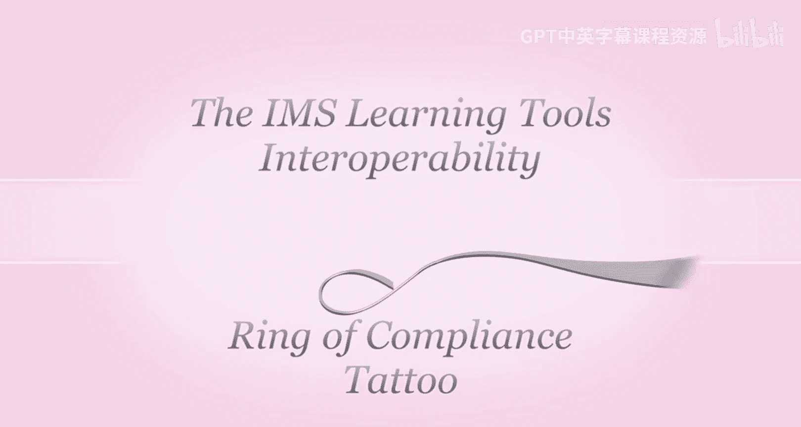
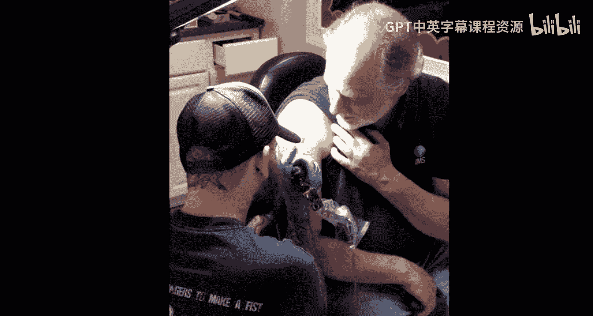
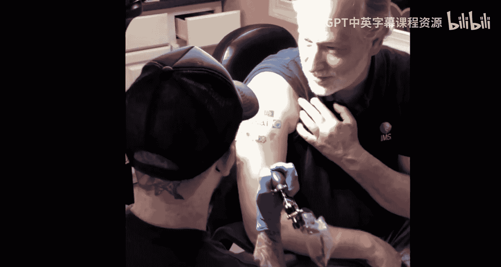
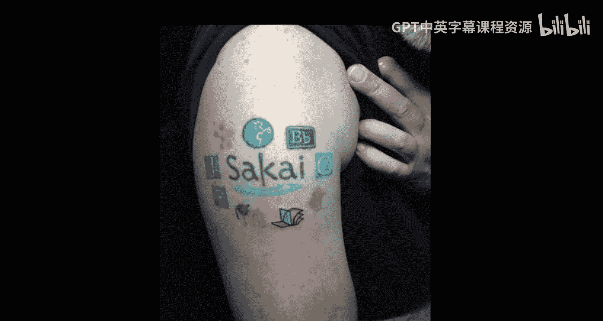
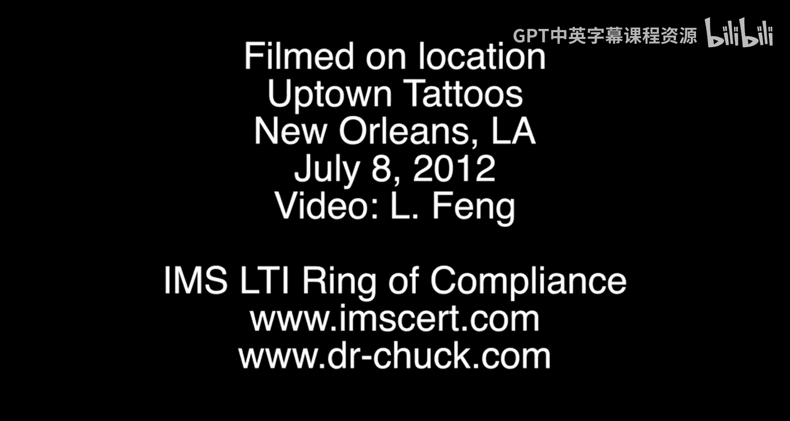

# 密歇根大学《面向所有人的Web应用程序（PHP、SQL、APP、JavaScript和JQuey｜Web Applications for Everybody》 p67 16_趣味环节：Chuck博士的教育科技纹身.zh_en -BV1Lr421A75d_p67-

🎼They're all company logo。 and I show it to that company in their life。They're like。

 you want say ahead。It doesn't look like our logo at all， I say， well， man it skin。

What can the skin do？Where。多块。外。以上。

啊。It' learningearning software for like universities。

But what I wanted to do is I wanted to put angel wings on。ていじ。

I told him and I would put into wind on and got really mad。So he was going to find a big company。那要。

I want to put with angel wind instead of a pages。If you guys are really good angel。You can do any。

He said， don't put angels on。

什么公安。

🎼，🎼Yeah。