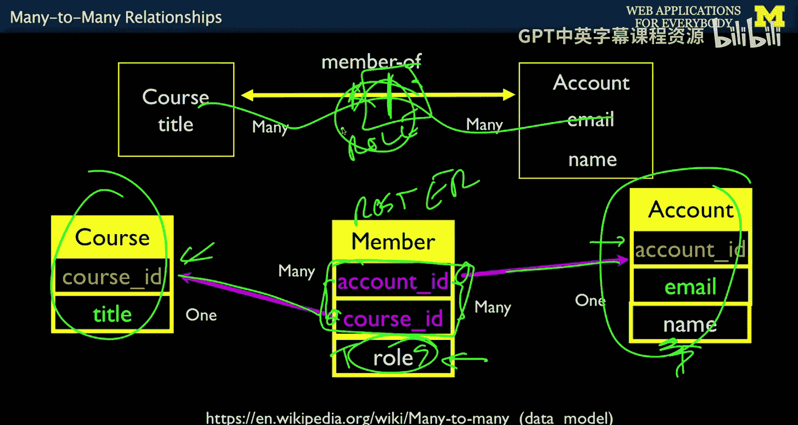
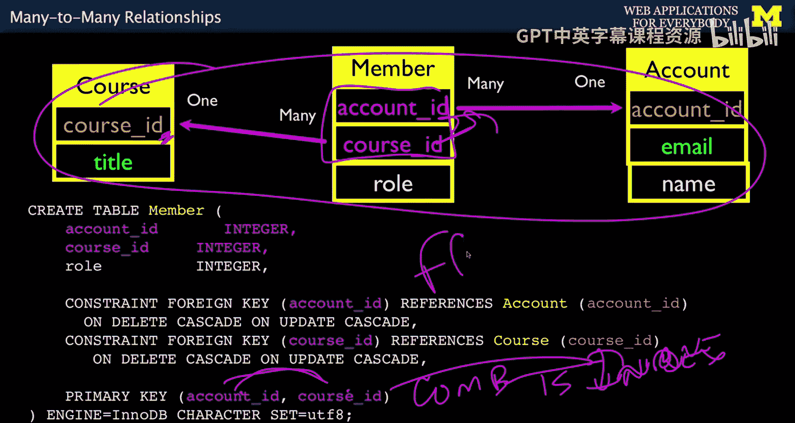
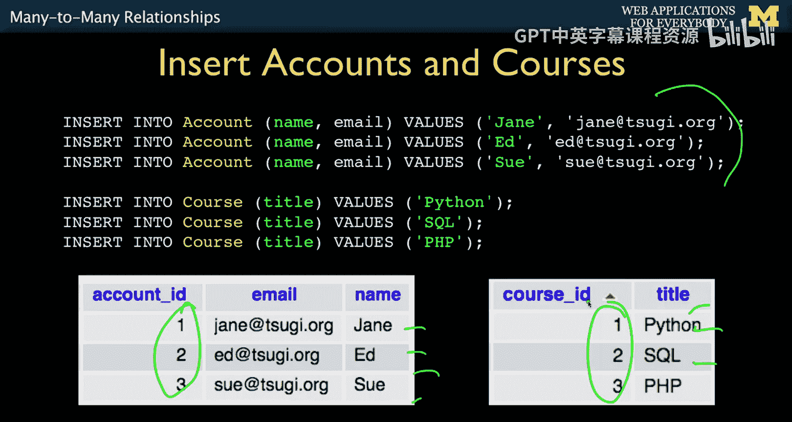
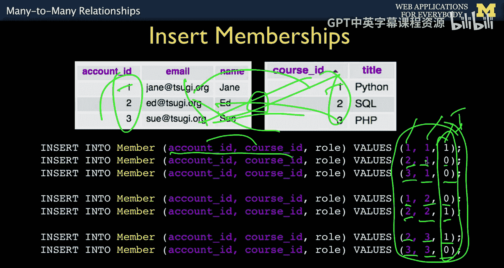
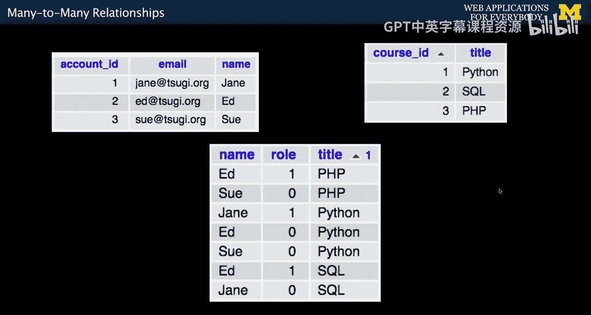
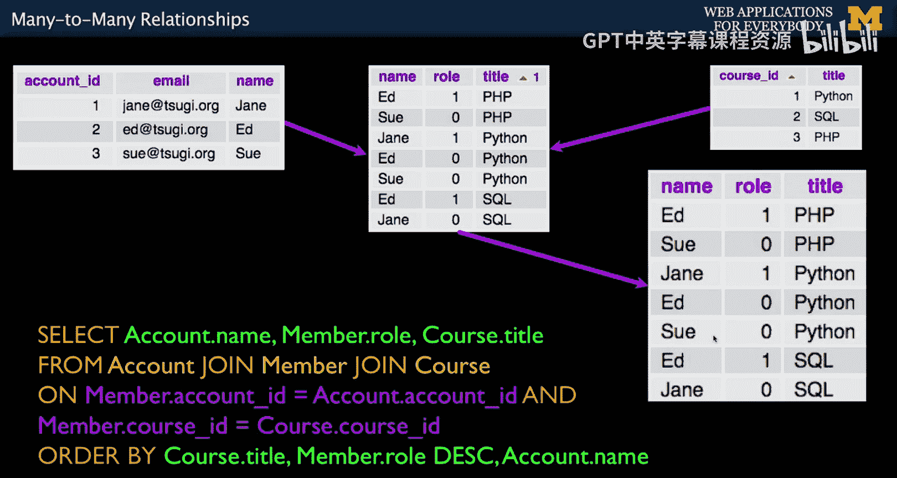
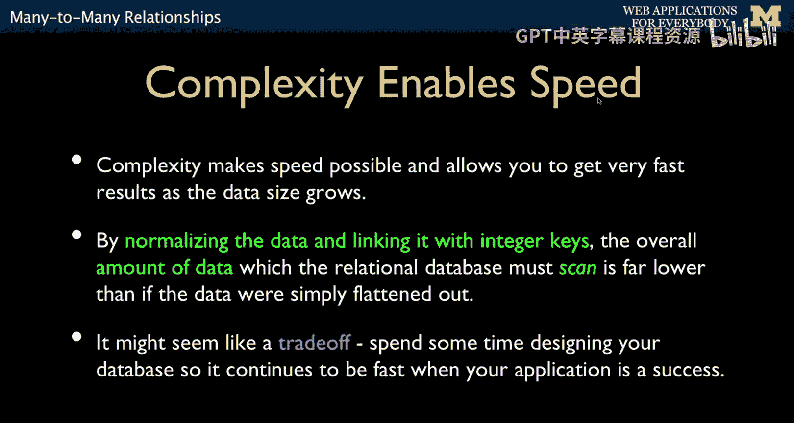
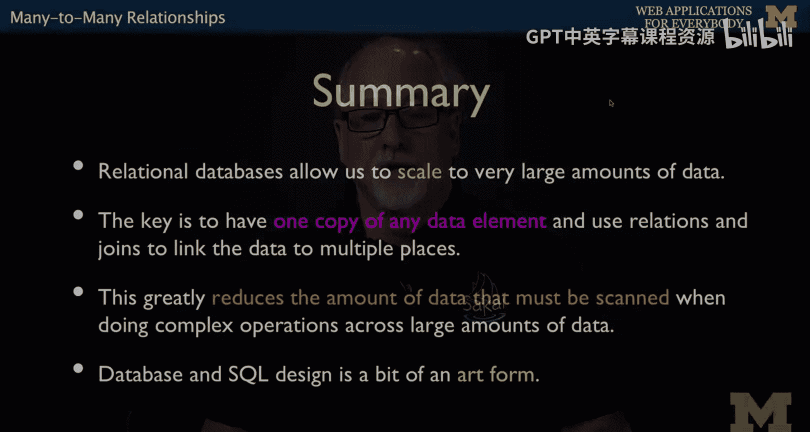
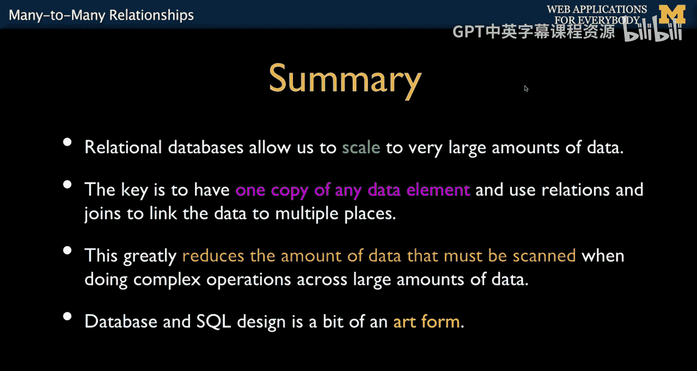

# 面向所有人的Web应用程序：17：多对多关系 📚


在本节课中，我们将学习数据库关系模型中的一个核心概念：多对多关系。我们将探讨为什么需要这种关系，如何通过“连接表”来实现它，以及如何在SQL中创建和查询这种关系。


---

## 概述

到目前为止，我们讨论的都是“一对多”关系。但在数据库设计中，表之间还存在其他类型的关系，其中最重要且尚未讨论的就是“多对多”关系。本节将详细介绍多对多关系的概念、应用场景以及实现方法。

---

## 从一对多到多对多 🔄

上一节我们介绍了一对多关系，例如一张专辑属于一位艺术家。但在现实世界中，许多关系更为复杂。例如，一位艺术家可以创作多张专辑，而一张专辑也可能由多位艺术家合作完成。这种关系就是典型的多对多关系。

多对多关系意味着一个实体（如表A中的记录）可以与多个其他实体（如表B中的记录）相关联，反之亦然。例如：
*   一个用户可以注册多门课程。
*   一门课程可以包含多名用户。

---

## 为何需要连接表？ 🧩

在数据库中，我们无法像处理一对多关系那样，通过在一个表中添加指向另一个表的外键列来直接建立多对多关系。因为这样会导致数据冗余和结构问题。




以下是解决多对多关系的核心方法：

我们必须在两个表之间创建一个新的中间表，通常称为**连接表**、**联结表**或**关系表**。这个表的作用是将一个多对多关系拆分为两个一对多关系。

**逻辑模型**：
`用户` <--多对多--> `课程`

**物理实现（通过连接表）**：
`用户` <--一对多--> `成员表` <--一对多--> `课程`

连接表包含两个外键列，分别指向两个主表的主键。这两个外键的组合，共同构成了连接表的“复合主键”。

---



## 连接表示例与数据建模 📊


连接表不仅可以存储关系，有时还可以存储与这种关系本身相关的数据。



以用户和课程为例，连接表（可以命名为 `member`）可能包含以下列：
*   `account_id`：外键，指向用户表 (`account`)。
*   `course_id`：外键，指向课程表 (`course`)。
*   `role`：表示用户在该课程中的角色（例如：“教师”或“学生”）。

**代码示例：创建连接表**
```sql
CREATE TABLE member (
    account_id INTEGER,
    course_id INTEGER,
    role VARCHAR(16),
    PRIMARY KEY (account_id, course_id), -- 复合主键
    FOREIGN KEY (account_id) REFERENCES account (account_id) ON DELETE CASCADE,
    FOREIGN KEY (course_id) REFERENCES course (course_id) ON DELETE CASCADE
);
```
**关键点解析**：
*   `PRIMARY KEY (account_id, course_id)`：这定义了一个**复合主键**。它确保了`(account_id, course_id)`这个组合在整个表中是唯一的，防止同一用户在同一门课程中出现多次。同时，它也会为这个组合建立索引，提高查询速度。
*   连接表通常没有独立的、自增的单一主键（如`id`）。
*   外键约束确保了数据的引用完整性。

---




## 插入与连接数据 ➕

在插入数据时，我们需要先向两个主表（`account`和`course`）插入记录，获取它们自动生成的主键ID。然后，在连接表（`member`）中，使用这些ID来建立关联。



**代码示例：插入关系数据**
```sql
-- 假设已知ID：Jane (1), Ed (2), Sue (3); 课程 PHP (1), Python (2), Perl (3)
INSERT INTO member (account_id, course_id, role) VALUES
(1, 1, '教师'), -- Jane 在 PHP 课程中是教师
(2, 1, '学生'), -- Ed 在 PHP 课程中是学生
(3, 1, '学生'), -- Sue 在 PHP 课程中是学生
(1, 2, '学生'), -- Jane 在 Python 课程中是学生
(2, 2, '教师'), -- Ed 在 Python 课程中是教师
(2, 3, '教师'), -- Ed 在 Perl 课程中是教师
(3, 3, '学生'); -- Sue 在 Perl 课程中是学生
```

---



## 查询多对多关系 🔍

要获取完整的信息（例如，生成一份包含用户姓名、角色和课程名称的课程花名册），我们需要使用 `JOIN` 语句将三个表连接起来。

**代码示例：连接三个表进行查询**
```sql
SELECT account.name, member.role, course.title
FROM account
JOIN member ON member.account_id = account.account_id
JOIN course ON member.course_id = course.course_id
ORDER BY course.title ASC, member.role DESC, account.name ASC;
```
**查询逻辑**：
1.  `FROM account`：从用户表开始。
2.  `JOIN member ON ...`：通过`account_id`连接`member`表，获取用户参与课程的角色信息。
3.  `JOIN course ON ...`：再通过`course_id`连接`course`表，获取课程名称。
4.  `ORDER BY`：对结果进行排序，例如先按课程名升序，再按角色降序（使“教师”排在前面），最后按姓名升序排列。


---

## 总结与重要性 🚀






本节课中，我们一起学习了数据库中的多对多关系。



**核心要点总结**：
1.  **概念**：多对多关系描述了实体间复杂的双向关联，无法用单一外键直接实现。
2.  **解决方案**：通过创建**连接表**，将多对多关系分解为两个一对多关系。连接表的核心是**两个外键**及其可能构成的**复合主键**。
3.  **数据建模**：连接表本身也可以存储与关系相关的属性（如`role`）。
4.  **查询**：使用多表`JOIN`（特别是通过连接表进行“穿针引线”）来获取完整的关联信息。
5.  **设计原则**：使用数字ID作为键，避免使用字符串。正确的数据模型（规范化）是应用能够高效处理大规模数据、并保持良好性能的基础。早期重视数据模型设计，可以避免应用在增长时面临重构甚至崩溃的风险。


掌握多对多关系是构建复杂、可扩展Web应用程序的关键一步。虽然数据库设计是一门深奥的艺术，但理解这些基础概念已足以让你设计出专业级别的数据模型。