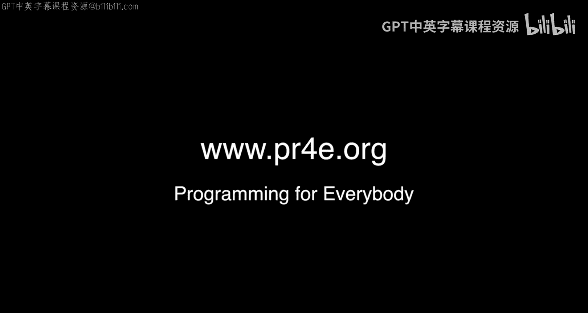

# 面向所有人的Web应用程序：第69讲：附加办公时间：俄勒冈州波特兰

在本节课中，我们将回顾密歇根大学《面向所有人的Web应用程序》课程在俄勒冈州波特兰市举行的一次附加办公时间。本次办公时间汇集了来自不同背景的学习者，他们分享了各自的学习经历和收获。

---

大家好，我们来到了俄勒冈州的波特兰市，进行又一次的办公时间活动。

我们将有两位……哦，等等，我刚才说了什么？哦，我只是感觉……至少我是在正确的州。俄勒冈州，波特兰市，俄勒冈州。好的，波特兰市，俄勒冈州。在一条非常繁忙的街道上，我们在这里又一次成功地举办了办公时间。和往常一样，我想让班上的其他同学认识一下大家。那么，开始吧，请打个招呼，说说你的名字以及任何你想对班上其他同学说的话。

以下是参与者的自我介绍：

*   嗨，我叫阿尔文。我报名参加了多门在线课程，这门Python课程是我第一个完成了全部四个部分课程的。我也是，这要感谢出色的讲师。
*   你好，我叫斯科特。我正在学习Python用于信息处理。
*   嗨，我叫阿里·礼萨。在过去的几个月里，我见到查克博士的次数比见到我孩子的次数还多。听起来你也是。我刚刚完成了Python课程，它结构清晰，做得非常好。谢谢。
*   嗨，我叫保罗。我有一个17岁的儿子，他也叫保罗。我们正在一起使用Coursera学习，作为一个父子项目。他是一名高中生，学得很好。对我来说这是爱好，对他来说是为了获得一些未来能用得上的技能。我的梦想是最终让这门课程进入每一所高中。我的意思是，这就是我想要的，但这是一件非常困难的事情。不过，它已经进入了我们的家庭。
*   嘿，我是麦迪，我是匹泽学院有机生物学专业的学生，但我对学习Python感到兴奋。
*   谢谢。嗨，我是玛格丽特，实际上我是从田纳西州来这里度假的。Python课程是我一直想学的编程入门课。
*   很棒。嗨，我是黛安。我正在学习这个系列课程的第四门，今年夏天我将完成毕业设计。这很有趣，很有趣，很有趣。
*   是的，毕业设计是所有课程中最简单的。嗨，我是亚历杭德拉。三年前，当我住在古巴哈瓦那工作时，我参加了精彩的互联网历史课程。所以，感谢查克博士的精彩课程。
*   嗨，我叫安德鲁。我和我的同事内森一起加入了Coursera，他今天因为工作不能来。不过，他有点像是在虚拟地抢镜。你可以放一张内森的照片吗？不，我没有。那会很酷。你可以把他放在我心脏旁边。但我已经离开了那份工作。感谢查克博士所做的所有出色工作。
*   酷。嗨，我是赫布。很久以前，我学习了互联网历史、技术和安全课程。然后我成为了社区助教，现在我是导师。我已经参与这门课程很长时间了，非常享受帮助学生的过程。
*   赫布是不到十位导师中的一位。赫布是不到十位导师中的一位，他不知疲倦地帮助所有学生，并且完全没有报酬。所以我喜欢做的一件事就是去导师所在的城市，请他们吃顿饭。对于三年辛勤工作来说，一顿免费的饭只是很小的补偿。但如果没有像赫布这样的导师，这些课程真的无法活跃起来。即使有最好的讲座视频、最好的作业和最好的测验，如果没有人的参与，也毫无意义，因为学习是人的事情。这不是信息，是人的事情。像赫布这样的人让这些事情保持活力，即使在我离开很久之后，在所有讲座都结束之后，等等，等等。所以，让我们为出色的赫布鼓掌。
*   好的，我们还有随机的……是的，各位，我们还有像赫布这样的随机参与者。哦，当然不是化学家。我是莫琳，我是一名化学家。基本上，我学习这门课程是为了能够以自动化的方式提取数据并每周创建图表，而不是在Excel中手动操作。
*   酷。

好的，我们就在这里，就这样了。下一次办公时间将在不到24小时后，在西雅图举行。在那之后，你们都被邀请参加再下一次在英格兰布莱切利公园举行的办公时间。所以，如果你要去英格兰度假，可以来参加办公时间。那么，再见。

---

本节课中，我们一起回顾了在波特兰举行的办公时间活动，聆听了多位学习者分享他们学习Python和Web开发课程的经历、动机与收获。这些分享体现了在线学习的社区氛围和互助精神，也展示了编程技能在不同职业和兴趣领域的广泛应用。