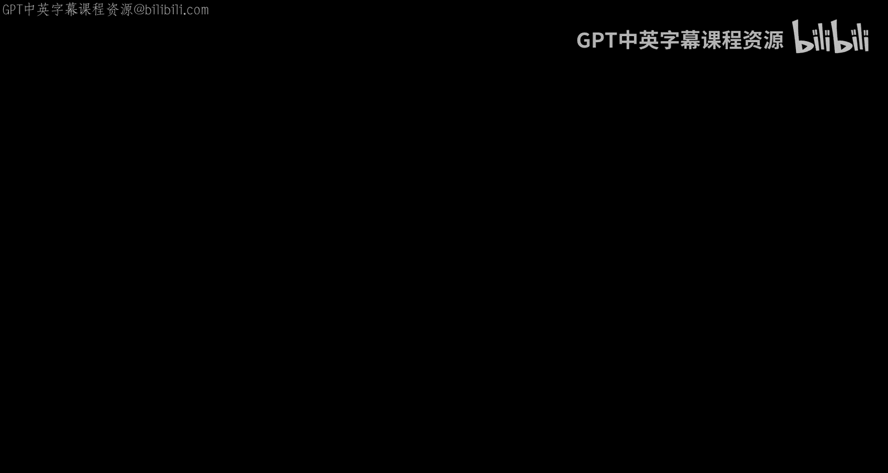

# 密歇根大学《面向所有人的Web应用程序》：第70讲：欢迎学习本课程 🎉

在本节课中，我们将概述《构建数据库应用程序与PHP》这门课程。我们将回顾前序课程的基础，并介绍本课程的核心目标：将之前所学的零散知识整合起来，构建一个功能完整的Web应用程序。

欢迎来到《构建数据库应用程序与PHP》课程。如果你已经完成了本系列的前两门课程，那么恭喜你并欢迎你。这些知识现在至关重要。

在你学习前两门课程的过程中，你可能产生过疑问：这一切有意义吗？我们为什么要做这些？这门课程将回报你的耐心。我们将把所有学过的零散知识，像乐高积木一样组合起来。我们将建立这个基础，并在其上继续构建。现在，就是我们将所有这些概念整合在一起的时刻。

本课程会快速进入主题，因为我们假定你已经掌握了前两门课程的所有知识：HTML、CSS、SQL以及PHP的基础。你已经搭建好了开发环境，并且知道如何编写代码。如果你对其中任何一项不熟悉，你真的需要回到之前的课程，因为我们不会放慢速度。我们不是在教PHP基础，而是在学习如何运用PHP对象，进度会很快。

所以，如果你准备好了，这正是你想要的。是时候开始工作，构建真正优秀、真实且完整的应用程序了。如果一开始你觉得跟不上，只需回去学习其他课程。我们希望你开始本课程前已具备所需知识。

一旦我们开始，我们将快速推进，学习如何开发数据库应用程序和复杂的Web功能。我们将学习一些至关重要的内容，例如**cookies**、**HTTP headers**、**sessions**以及登录和登出的实现。这些都是我们需要真正掌握的知识。

这门课程包含大量内容，即使你最终不使用PHP，无论是使用Ruby on Rails、Java、Node.js还是其他技术，你仍然需要了解会话、HTTP头、请求-响应周期等概念。因此，这是一个转折点，我们不再仅仅是学习编程语言，而是真正开始学习Web应用程序开发。

在本课程结束时，我们将完成一个**CRUD**应用程序。我们会循序渐进地构建一个应用程序，更多地了解应用程序是如何组合在一起的，我们将连接PHP和SQL。当我们创建出基本的、必不可少的Web应用程序——即CRUD应用程序时，课程就告一段落了。

**CRUD**代表**创建（Create）、读取（Read）、更新（Update）和删除（Delete）**。这是数据库能做的四件事。我们还需要一点用户界面来完成这四项操作。从那时起，你开发的所有Web应用程序都将是这个主题的变体。

因此，在本课程结束时，你将成为一个Web开发者。剩下的只是关于你使用什么语言、什么特性的细节问题。我非常高兴你能走到这一步，但我更期待你完成这门课程。

再次感谢你对本课程的兴趣，我们课堂上见。