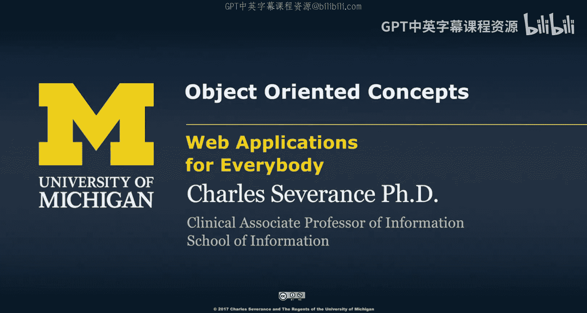
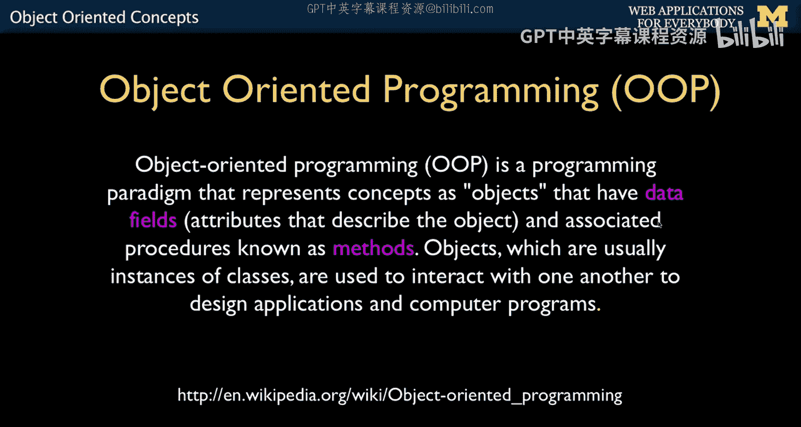
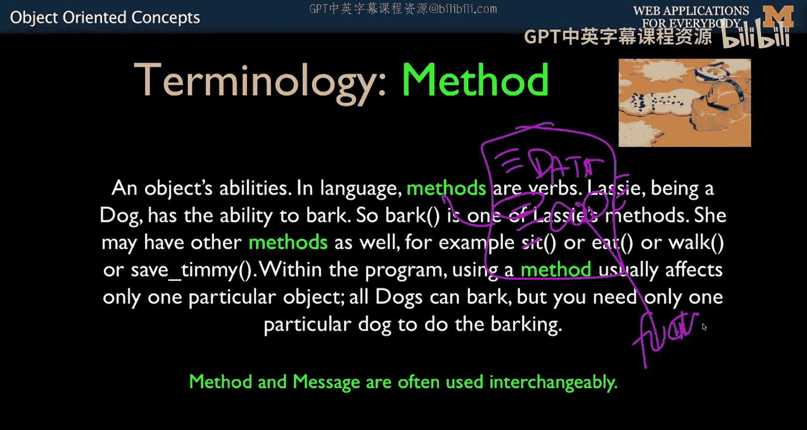
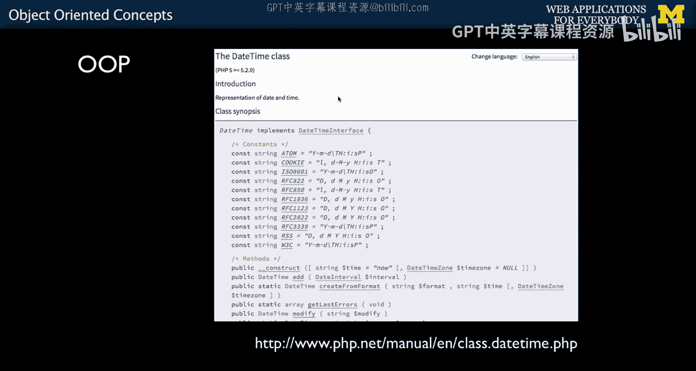
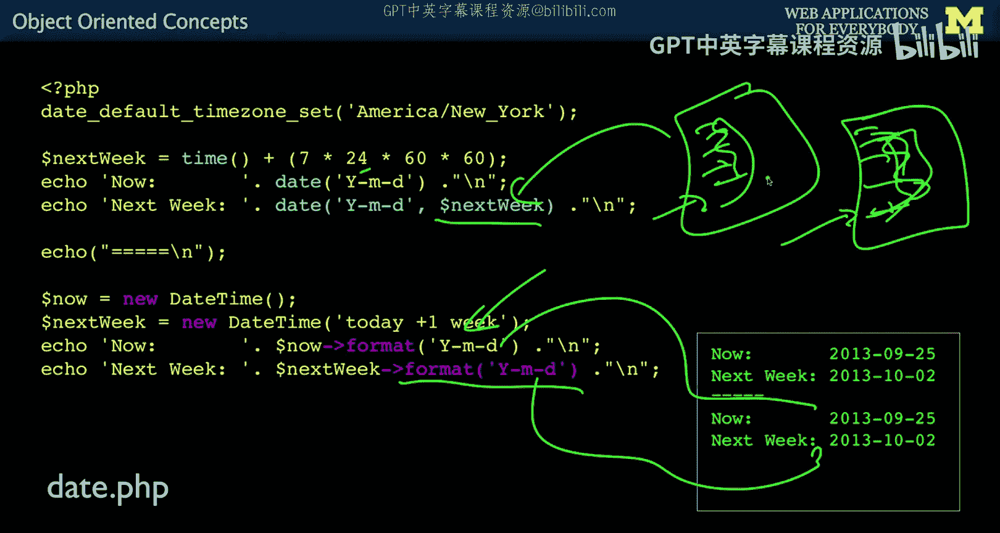

# 密歇根大学《面向所有人的Web应用程序（PHP、SQL、APP、JavaScript和JQuey｜Web Applications for Everybody》 p71 1_面向对象概念.zh_en -BV1Lr421A75d_p71-

So welcome to our lecture on object learningium programming。

 I both love and hate teaching object learningium programming。

 I love teaching object learning programming because it's a really awesome technique。 I hate it。

 because。😊，I don't want to confuse you。 And so whenever I teach object or programming。

 I don't really give you an assignment that says， go write an object。

 which is traditionally the first thing that you do。

 I really just want you to understand some terminology。 So in this lecture。

 you can kind of sit back and relax and just absorb because I'm not trying to give you a skill that you can apply。

 But instead， some word that I can use later。 Okay， so this is as much a terminology。

 So PhP as a programming language as I mentioned before has been around for a very， very long time。

 There was Ph P1， P P2， Ph P3 and PhP4。 P P4 wast around for a really long time。

 It was kind of the awesome one。 And then there was a PhP 5。 and then remember 6， PhP never happened。

 and then 7， which is the current PhP5 is the place that they brought object oriented。

 or we call it oh， oh， it came in。And so P P is sort of of two minds when it comes to object orientation。

 you see some things that are from the old days， the early old days and C and pearl where the influences here。

 right， so that that you see a lot of ways that we used to accomplish things in C。

 like prefix all the functions with stir or prefix all the functions with date， St， underscore， date。

 underscore or whatever， this is kind of a non objectject oriented way of coping with complexity as that you get more and more complex。

 And in as in Ph P5。 And the nice thing is we're sort of one beyond it now。 So in P P 5。😊。

Things are really in transition， but really in7 object oriented is very natural。 and advanced Ph P。

 which will get touch at the very， very end of this class， is really becoming quite beautiful。

 And the whole PhP community is very much depending on object orientation。 So over time。

 it's more important to know it。 But for now， we're just learning the basics。

 and we're not going to write a lot of code that makes new objects。😊，For now。

 we're just going to be using them。 so just understand it's a language and transition。So。

Everything is a pattern。 I talked about Model view controller。 It's a programming pattern。

 It's a way for us to talk about each other's code， share code with each other and go oh。

 I get what you're doing there， right So if I just give you just a bunch of random code， you're like。

 oh man， I' gotta struggle to figure all this out。 But if I say， oh yeah， that's an object。

 you're like， oh， I got， I know what an object is。So if you think about it。

 any program that you build has some code， loops and if statements， and then some data。

 maybe some arrays， maybe some key value arrays or linear arrays。

 so you think of the data as one half of the solution to a nerdy problem and then the logic as well。

So an object to any programming we're doing is we're sort of taking that notion that there's data and code and we're making smaller granularity of it。

 So what we're doing instead of saying we have one program that has data encode。

 what we're going to say is there's going to be lots of objects and each one of these objects has data encode in it。

 and we draw kind of a bright boundary。 We draw bright boundaries around like functions and stuff。

But now we're going to take an object that's a set of functions and a set of variables。

 data inside of it， and going to draw a boundary around that。 And that's also called encapsulation。

 It's called isolation。 It means that you don't have to look at all the code that's the beauty of object because that's containing a whole bunch of functionality that's very complex in a way that's beautiful。

 And when you start writing them when you start writing libraries for others。 You'll be like， oh。

 I'm going to spend a lot of time building this really cool library。

 and I'm going to hand it to you in the form of five objects。

 don't look too closely inside of it because it was hard for me to write。

It's just a way to capture capture and encapsulate information and make it as usable as possible and only share the necessary details with others。

So like I said， this is sort of terminology。We're going to learn the word class。

 we're going to learn method， object， and instance。And attribute as well。

 And so I love this little picture， this creative commons picture of the idea of a cookie cutter and lots of cookies。

 right， So a class。😊，Is a template。 It's a way to make things。 It's not a thing in itself。

 It's not a cookie。 A template is a way to make cookies of the same shape。

 So then with that template， you can stamp out。As many cookies as you want。

 And then each cookie can have different attributes， colors， what kind of frosting you put on them。

 And so these are objects， objects。 And this is a class。

 A class is a cookie cutter on object is the cookie itself。The template is not itself a cookie。

 meaning you can't eat the template。You could if you were like a transformer or something。

 maybe you could eat it。 but don't eat the template， okay。

And then methods are things inside and attributes that I don't have on the slide。

 There are also things inside。 So there's data inside each one and code inside each one。

 The whole snowman cookie model falls down a little bit there。So a class is a blueprint。

 It's a generic。 it is not itself a thing like dog。There is。 you might have named your dog dog。

 and then you actually have an instance of a dog named dog。 But in general。

 we don't name our dog's dog， but we know what a dog is， but there's not a particular dog。

An instance is when you have many dogs and each one has names spot。And they have different color。

 fur color， and they well they all bark， but they might have different fur color。

 And so that's what instance， the word instance and object。

Are the sub religions of the object orientation pattern Use the different terminology。

 You should think of them as the same。 An instance is a thing。 An object is a thing。

 class is the template。Different programming languages tend to use these different words。

 but they use them for the same thing。A method is a bit of code that lives inside of an object。

 so if we start saying here is an object in this object， there is data。And then there is code。

Method is one of the things that's code。 And so this object might have five methods。

 They are different functions。 These look just like functions。 They're just slightly special。

Okay。So it's a sump code that's part of an object is a method。

So if we take a look at some PhP documentation and one of the things I want you to know how to do is to read PhP documentation。

 if we look at sort of a classic way of handling a series of date functions because in the old days with PhP。

Less than five， we had to create all the libraries were just global variables。

 And so just to keep ourselves from going crazy。And not having a function called add。

And takes like two things like， what does that do， We just prefix them。

 So you'll see this like obsessive prefixing。 So because these are all global functions。

 D underscore was a convention。 It didn't have to work that way。 but smart programmers like。

 I think I'll just name everything D underscore so that I can have a thing called date add。Add。

 string， add。Aray， add， et cea， et cetera， et cetera。

 And so that way I know that those things I have to do with dates。

 And it's my way of like reading documentation。 I can say show me all the date functions。 Oh。

 thank heaven。 They've got a date underscore prefix。

 So this is kind of like a crude but effective way for organizing the naming space of libraries。

Objarion really cleans that up。 What Ob Orion does is it creates a box。

That not only has code and attributes， but it also has what we call a namespace。

So you can create an add function。But that add function。Lives within this class， the date time class。

 So it's not just add。 It's date time， dot addd or date time， whatever。

 And so that's add within that。And that way， you can name the ad exactly what you want it to be。

 You say， oh， this is going to add two strings together or whatever， right。

 And so it's going to do a thing。 But we're knowing that this has to do with dates， right？

 And so that's the idea that when you go look and you'll see。

 look here when I told you there are all these things tell you when this is。 Well。

 it means that this has to be greater than Ph P5。2。 And then all of a sudden。

 this date time class is there。And then you can make daytime objects and use those daytime classes。

 So you'll see pretty quickly， you'll say oh， old and new， right。

 the OOP object learning programming stuff is the new way of doing business。

So if we look at how this works in terms of code。You are just calling global functions with big long names。

 date， default time zone set。That's something you have to do。 you just have a time function。

 it's a global function date and so that's what the current time is。

 and then we're going to add time gives you back seconds。Since。1，1，1970。

 And then we're adding seconds。 So that's 7 days a week，24 hours a day，60 minutes，60 seconds。

 And so that's the number seconds in a week。 So that's next week。 And we're going to do date。

 and we're going to give it a format as the first parameter。 And if we want it。

 that's the default will be now。And then next week is if we want to take this variable that seconds and print it out。

 so that would print these two things out， which is now and next week。

 I wrote these slides long time ago， very long time ago。

 So thats tells you how long object orientation has been inside PhP。Now。

 if we do this with an object orient pattern， we have this thing called New。So new is very important。

New is the act of taking the template and stamping out a new cookie。 So bam， make a new cookie。

 So you're telling the date time class to make a new。Object using the datetime template。

 and then give me that object back in the variable now。So go make a new date time。Buildder all up。

 Give it to me back。 And I'm going to use that variable now from this point forward to reference both the data。

 So there is a date time object。 It's got code in it。 It's got data in it， and I've got dollar now。

That points to all that stuff。Okay， that's what happens。

So I can sometimes just say give me a new thing or I can give it some parameters about what I want that to be。

 so in this case you go read the documentation today plus one week and so that's giving you a week from now and we get two variables one is there's two。

2。We have two date time objects。 now， objects。 datetime is the class， but these objects。

 and now points to one of them。 and next week points to another one。 And somehow。

 the data inside these is different。 This is the now data for now。

 and this is now data for next week。Not because I named the variable next week。

 but because I told it to construct it in such a way that its initial values were next week。

I'm going to say， okay， hey， now variable format yourself。So this， I'm calling the format method。

 which is。Inside this。 And then I'm going to call next week format， which is inside this。 Okay。

 And so that's how you do it。 So there's this little arrow guy。

 This little arrow guy right here says here's an object called the method name format within that object。

 So arrow is an operator method within or attribute within if there's data that we can access directly。

And you pass into format the actual format that you want kind of like this。

 You don't have to pass the actual object in because it's implicit because this format code runs within the object。

 So it knows which object it is。 So if the now has a set of data and the next week has a set of data and is's slightly different。

 it knows when we call format， it's going to call this set of data。 and we call format here。

 it looks at that set of data。 And so that's how this comes out now and this comes out next week。

 because it is both code and data that's self- containedtain in two objects made from the date time template。

So up next， we're going to make our own class and then make some objects with the class that we make ourselves。

