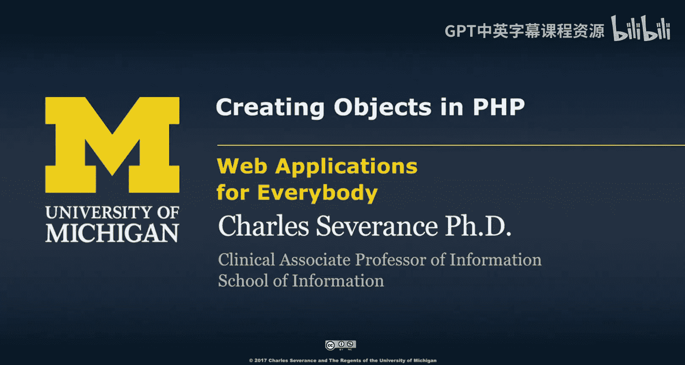
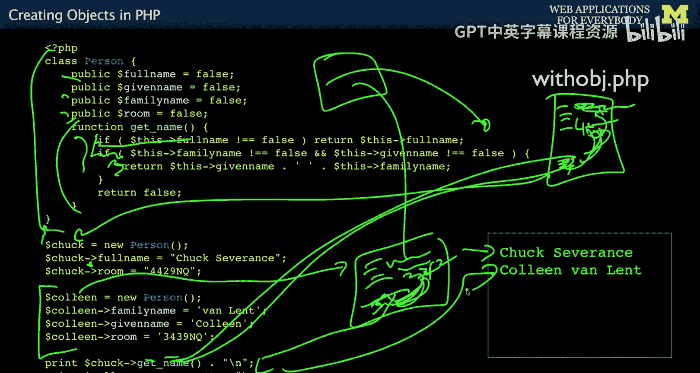

# 面向所有人的Web应用程序：2：在PHP中创建对象




在本节课中，我们将学习PHP中面向对象编程的基础知识，特别是如何创建和使用对象。我们将从理解对象的概念开始，然后通过一个具体的例子来学习如何定义类、创建对象实例以及访问对象内部的属性和方法。

## 概述

上一节我们介绍了面向对象编程的基本思想。本节中，我们来看看如何在PHP中实际创建和使用对象。我们将通过一个管理人员信息的例子，对比传统的数组数据结构和面向对象的方法，来理解对象的优势。

## 从数据结构到对象

在深入创建对象之前，让我们先回顾一下PHP4时代处理复杂数据的方式。人们喜欢PHP的一个原因是，使用数组，特别是键值对数组，可以构建出灵活的数据结构。

例如，我们要处理人名信息。有时我们有一个全名，有时我们有名和姓。我们决定将“姓”称为“家族名”，因为“姓”在某些文化中并不排在最后，家族名可能在前，名在后。所以，我们会有一些数据结构。有些包含全名，有些包含家族名和名，并且每个结构都有一个房间号。

这还不是真正的对象，只是使用了对象术语的通用做法。我们创建了数据结构。但问题是，当我们需要打印人名时，我们必须编写一些代码来处理这两种变体。

以下是处理这两种变体的函数代码示例：

```php
function get_person_name($person) {
    if (isset($person[‘full_name’])) {
        return $person[‘full_name’];
    }
    if (isset($person[‘family_name’]) && isset($person[‘given_name’])) {
        return $person[‘given_name’] . ‘ ‘ . $person[‘family_name’];
    }
    // 这里可能根据文化背景有更复杂的拼接逻辑
}
```

我们不想一遍又一遍地重复编写这段代码。现在我们可以传入Chuck和Colleen的数据，打印出正确的人名。这是一种非面向对象的做法，即使用数组并编写辅助函数来复用代码。

## 创建对象模板（类）

现在，如果我们用面向对象的模式来重构这个例子，我们会创建一个模板。在PHP中，我们使用 `class` 关键字来定义这个模板。

`class` 有点像 `function`，用于定义一个结构。下面的代码定义了一个模板，它本身不会运行，只是被解析。其效果是添加了一个新的“Person”模板。

```php
class Person {
    public $full_name = false;
    public $given_name = false;
    public $family_name = false;
    public $room = false;

    function get_name() {
        if ($this->full_name != false) {
            return $this->full_name;
        }
        if ($this->family_name != false && $this->given_name != false) {
            return $this->given_name . ‘ ‘ . $this->family_name;
        }
        // 这里可能有更复杂的逻辑
    }
}
```

在这个类中，我们定义了四个属性（数据）和一个方法（代码）。每个 `Person` 对象都将拥有这些变量和方法。方法内部的 `$this` 是一个预定义的常量，只能在类的方法内部使用。`$this` 总是指向当前正在执行代码的那个对象实例本身。这非常重要，它使得同一个方法可以在成千上万个不同的对象上运行，并访问各自的数据。

## 实例化对象并使用

定义好类（模板）后，我们就可以创建具体的对象实例了。以下是创建和使用对象的步骤：

1.  **创建对象实例**：使用 `new` 关键字和类名来创建一个新的对象。
2.  **设置对象属性**：使用箭头操作符 `->` 来访问和设置对象内部的属性。
3.  **调用对象方法**：同样使用箭头操作符 `->` 来调用对象内部的方法。

```php
// 创建第一个Person对象
$chuck = new Person();
$chuck->full_name = “Chuck Severance”;
$chuck->room = “4, North Quad”;

// 创建第二个Person对象
$colleen = new Person();
$colleen->family_name = “Van Lent”;
$colleen->given_name = “Colleen”;
$colleen->room = “34, North Quad”;

// 调用对象的方法
echo $chuck->get_name(); // 输出：Chuck Severance
echo $colleen->get_name(); // 输出：Colleen Van Lent
```

当我们调用 `$chuck->get_name()` 时，方法内部的 `$this` 指向 `$chuck` 这个对象，因此它检查的是 `$chuck->full_name`。对于 `$colleen->get_name()`，`$this` 则指向 `$colleen` 对象，检查其 `family_name` 和 `given_name`。

## 总结



本节课中我们一起学习了PHP中创建对象的基础知识。我们首先回顾了使用数组构建数据结构的方法，然后引入了面向对象的概念。我们学习了如何使用 `class` 关键字定义包含属性和方法的类模板，如何使用 `new` 关键字实例化对象，以及如何使用 `$this` 关键字在方法内部访问当前对象的属性。对象的核心是**数据**和**代码**的封装，`$this` 是实现这种封装的关键，它确保了方法能正确访问到所属对象实例的数据。理解这些概念是有效使用PHP内置对象和阅读相关文档的基础。