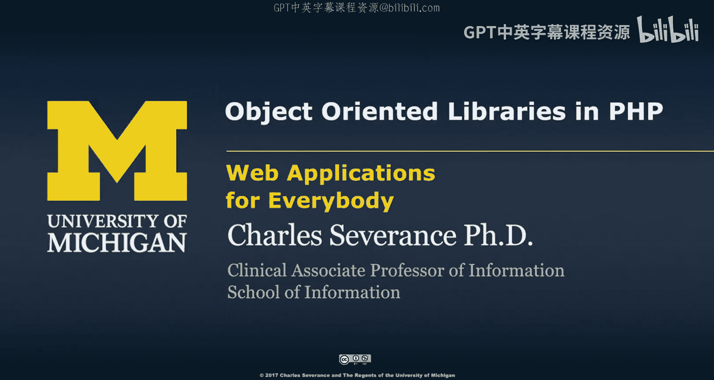
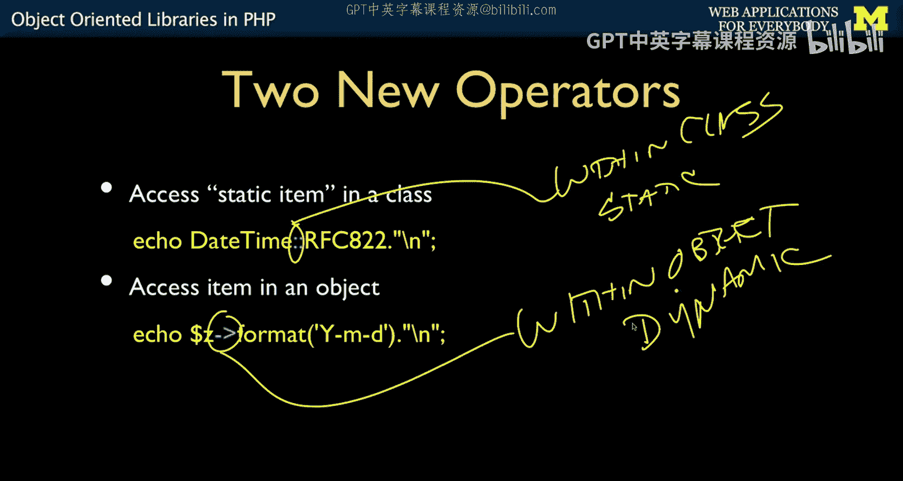
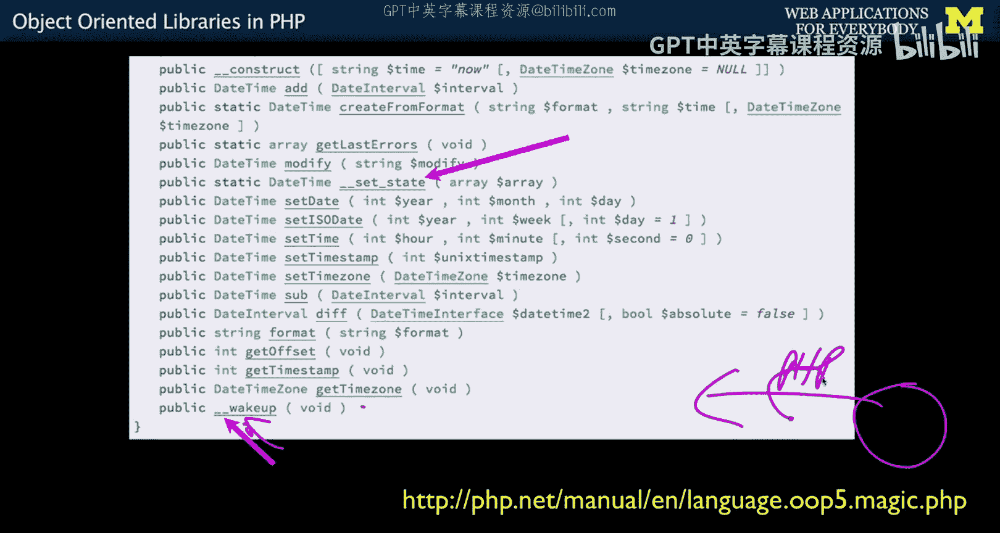

# 密歇根大学《面向所有人的Web应用程序》：3：PHP中的面向对象库 📚

在本节课中，我们将学习PHP中面向对象编程的核心概念，特别是如何理解和使用类库。我们将重点介绍访问类与对象内部成员的两种不同方式，并解释静态成员与动态成员的区别。

上一节我们介绍了如何构造一个简单的对象。本节中，我们来看看如何阅读和使用PHP内置的面向对象库文档，并理解其中的关键操作符和概念。

## 访问对象内部的成员

我们首先回顾一个已经见过的操作符。这个操作符基本上表示“在...之内”的含义。

例如，`$z->format()` 表示在名为 `$z` 的对象内部寻找 `format` 函数。
同理，`$colleen->first_name` 表示访问 `$colleen` 对象内部的 `first_name` 变量。
我将这个操作符理解为“在...之内”。

## 静态成员与动态成员

类中的某些成员可以被直接访问。尽管类是模板，但有些代码是静态的、不变的，因此它不是动态的。我们可以直接从类模板中取出并运行这段代码。

以下是静态成员与动态成员的关键区别：

*   **静态成员**：使用类直接访问，没有 `$this` 关键字。例如 `DateTime::RFC822`。
*   **动态成员**：必须在已实例化的对象上运行。例如 `$z->format()`。

静态成员存在于**类**内部，而动态成员存在于**对象**（或实例）内部。

## 阅读面向对象文档

现在，我们来看一些面向对象的文档。

文档中包含了常量。这些是静态定义的常量。例如，`DateTime::RFC822` 表示获取 `DateTime` 类内部定义的 `RFC822` 常量。这个字符串是用于不同日期格式化场景的格式之一。

你需要知道类中存在常量，并了解如何使用它们。

## 构造方法

类中有一些特殊的方法，我们将特别讨论构造方法。在文档中，你不会看到一个专门展示 `new` 操作允许做什么的部分。有人可能会认为这里应该叫 `new`，但你必须将 `new` 与 `__construct` 等同起来，因为构造对象是“获取模板并创建实例”的通用概念。`new` 是触发构造过程的操作符。

阅读文档时，你必须找到 `__construct` 方法来了解在 `new` 后面的括号里允许做什么。它本质上是一个函数调用。例如，`DateTime` 的构造方法有两个可选参数：时间 `$datetime` 和时区 `$timezone`。如果不指定，则默认使用当前时间和服务器时区。

通过查找 `__construct` 方法，你可以理解在调用 `new` 时允许做什么。

## 静态方法

有时我们会遇到静态方法。这些是可以直接从类本身访问的方法。

例如，`$x = new DateTime()` 创建了一个常规对象。但 `DateTime::getLastErrors()` 是一个静态方法。文档中标注了“static”，这意味着它不依赖于 `$this`，也意味着你可以直接通过类名调用它。

`::` 符号表示“进入类并获取那段代码”。在这个例子中，它是为了获取构造过程中可能发生的错误。因为使用 `new` 构造时，它要么返回一个有效对象，要么返回空。如果你想查看出了什么错，必须调用类方法并询问：“类啊，上次构造时你遇到了什么错误？”

## 普通（动态）方法

普通方法没有 `static` 关键字。我们已经接触过：创建一个新对象，然后访问该对象内部的方法。例如，`$z` 是一个对象，`format` 是该对象内部的一个方法。

你会发现，文档中大多数方法都不是静态的。大多数都是动态的，这意味着你只能使用箭头符号 `->`（即“在...之内”的表示法）来访问它们。

## 对象的生命周期与魔术方法

PHP引入面向对象模式较晚，因此能够借鉴其他语言的最佳特性。你会看到一些以下划线 `__` 开头的方法，它们与对象的生命周期有关。

例如，`__wakeup()` 方法。当某个对象从会话中恢复并重新加载到PHP内存时（即使我们还没讲到会话），这个方法会被调用。因此，你可以构建一个对象，要求在其被重新加载和唤醒到内存的时刻被调用和咨询。

接下来，我们将更详细地讨论我刚才提到的内容：对象的生命周期。

---

本节课中我们一起学习了PHP面向对象库的基本使用。我们区分了通过 `->` 访问对象实例成员和通过 `::` 访问类静态成员这两种方式，理解了构造方法 `__construct` 与 `new` 操作符的关系，并初步了解了静态方法的作用以及对象生命周期中的魔术方法。这些知识是阅读和使用PHP类库文档的基础。