# 面向所有人的Web应用程序：6：在Macintosh上安装MAMP 🍎

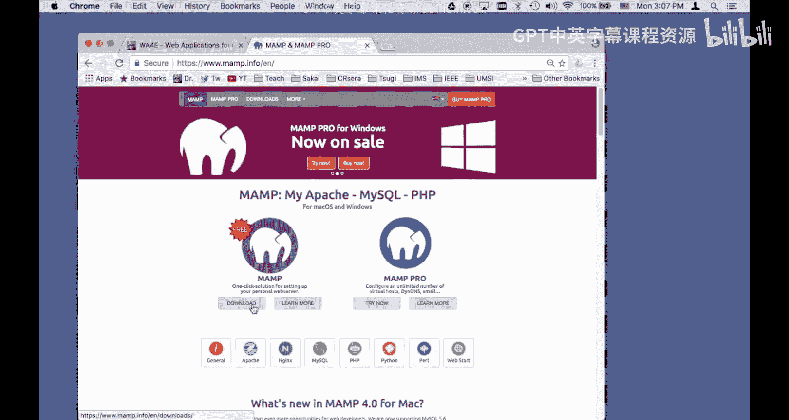

在本节课中，我们将学习如何在Macintosh电脑上安装MAMP软件，并配置PHP开发环境，最后创建一个简单的PHP网页来验证安装是否成功。

## 概述

MAMP是一个集成了Apache服务器、MySQL数据库和PHP的本地开发环境软件包。通过安装MAMP，我们可以在自己的Mac电脑上搭建一个Web服务器，用于开发和测试PHP应用程序，而无需连接到互联网。本节教程将引导你完成从下载、安装到基本配置的全过程。

## 下载MAMP

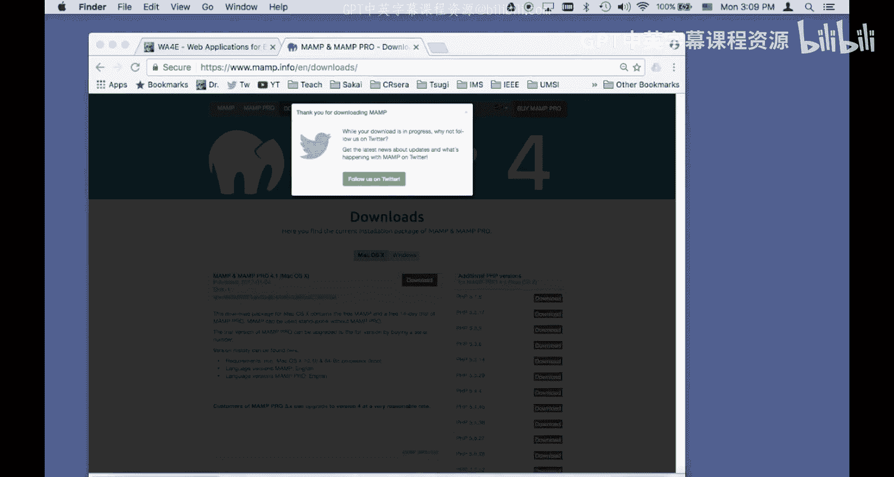

首先，我们需要从MAMP的官方网站下载安装程序。

1.  打开浏览器，访问 `mamp.info`。
2.  在网站上找到适用于Mac的MAMP版本并点击下载。

下载完成后，安装文件通常会保存在你的“下载”文件夹中。

## 安装MAMP

接下来，我们将运行安装程序并完成MAMP的安装。

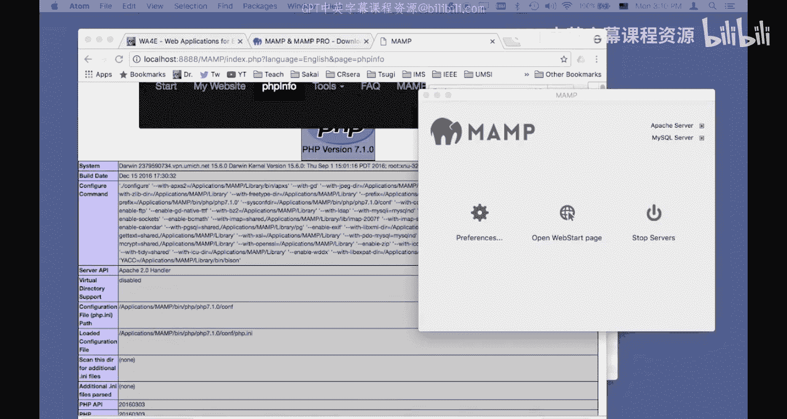

1.  打开“访达”，进入“下载”文件夹。
2.  找到下载的MAMP安装文件（通常是一个 `.dmg` 文件），双击打开。
3.  在弹出的安装窗口中，将MAMP图标拖拽到“应用程序”文件夹的图标上，以完成安装。

安装过程会持续几分钟。安装完成后，你可以在“应用程序”文件夹中找到MAMP。

## 启动与验证MAMP

安装完成后，让我们启动MAMP并查看其基本信息。

1.  进入“应用程序”文件夹，找到并打开“MAMP”应用程序。
2.  MAMP控制面板将会启动。点击“Start Servers”按钮，启动Apache和MySQL服务。当按钮旁的指示灯变为绿色时，表示服务已成功运行。
3.  在MAMP控制面板中，点击“Open WebStart page”按钮，这将在浏览器中打开MAMP的欢迎页面。
4.  在欢迎页面中，点击“PHPInfo”链接。这个页面显示了当前PHP环境的详细配置信息，对我们后续的配置很有帮助。

## 配置PHP开发环境

默认情况下，MAMP的PHP配置是为生产环境优化的，会隐藏错误信息。但对于开发来说，我们需要看到所有错误以便调试。因此，我们需要修改PHP的配置文件。

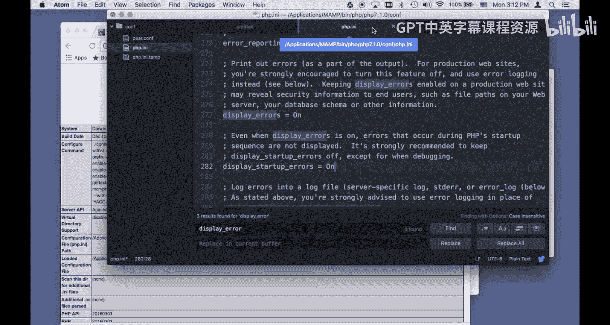

上一节我们启动了MAMP并查看了PHP信息，本节中我们来看看如何修改配置以开启错误显示。

1.  在MAMP的PHPInfo页面中，找到“Loaded Configuration File”这一行。它指明了当前生效的PHP配置文件（`php.ini`）的路径，例如：`/Applications/MAMP/bin/php/php7.1.0/conf/php.ini`。
2.  使用文本编辑器（如TextEdit、Sublime Text或VS Code）打开这个 `php.ini` 文件。
3.  在文件中搜索 `display_errors` 这个配置项。你会找到类似下面两行：
    ```ini
    display_errors = Off
    display_startup_errors = Off
    ```
4.  将这两行的值从 `Off` 改为 `On`：
    ```ini
    display_errors = On
    display_startup_errors = On
    ```
    > **注意**：在生产环境的网站上开启错误显示是不安全的，但我们在本地开发时这样做可以快速定位问题。
5.  保存并关闭 `php.ini` 文件。

为了使新的配置生效，我们需要重启MAMP服务器。

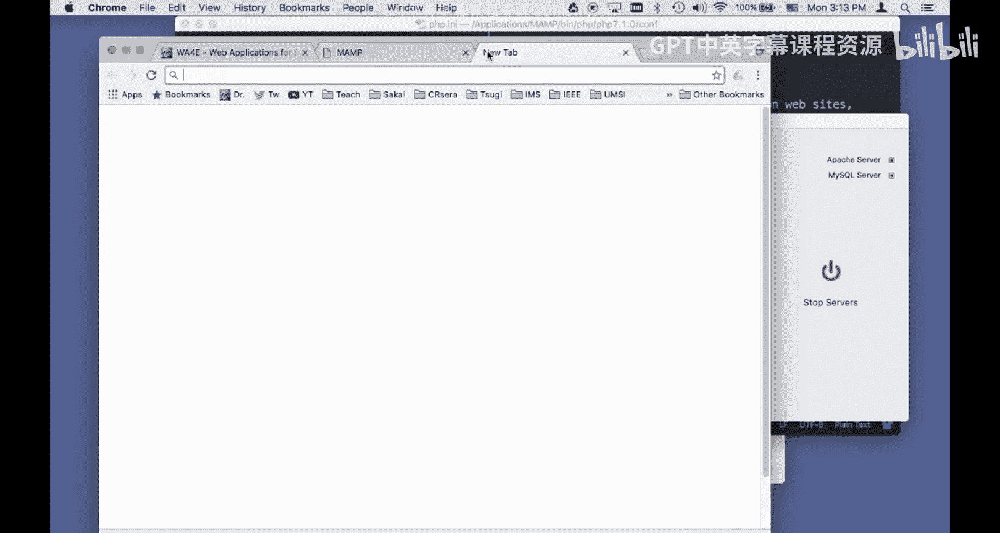

1.  回到MAMP控制面板，点击“Stop Servers”按钮停止服务。
2.  等待服务完全停止后，再次点击“Start Servers”按钮重新启动。
3.  刷新浏览器中的PHPInfo页面。
4.  在页面中搜索 `display_errors`，确认其状态已变为 **On**。这表示配置修改成功。

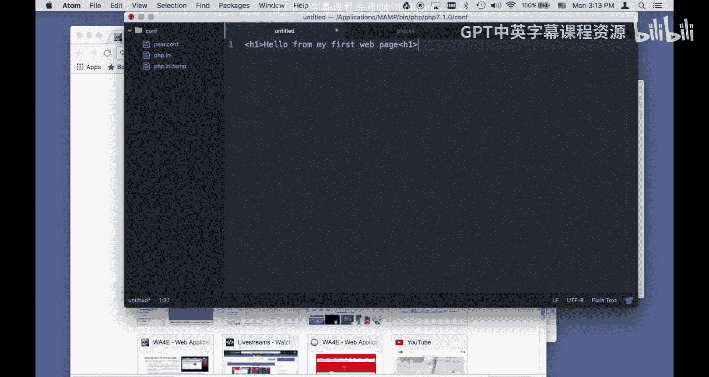

## 创建第一个PHP网页

现在，我们的开发环境已经配置好了，让我们创建一个简单的PHP文件来测试一切是否正常工作。

上一节我们配置了PHP环境，本节我们将动手创建第一个程序。

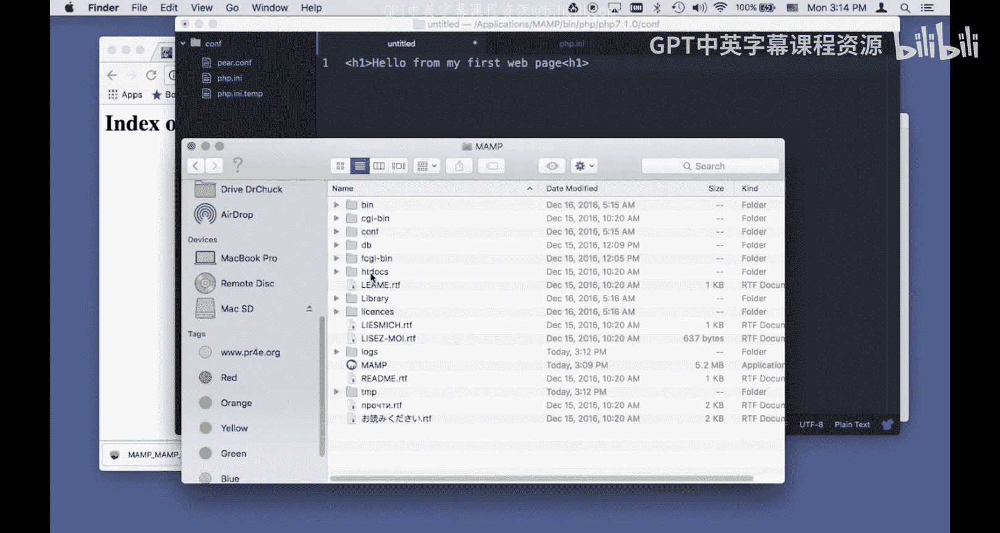

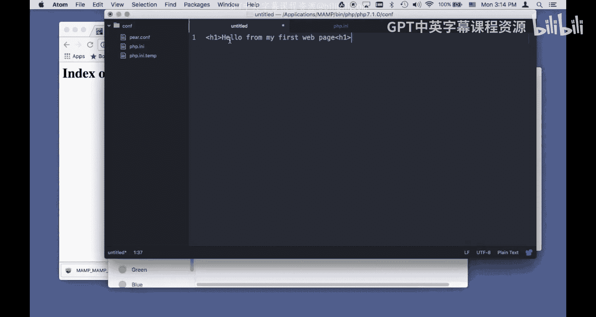

首先，我们需要知道网站文件应该放在哪里。MAMP的Web服务器根目录是 `htdocs` 文件夹。

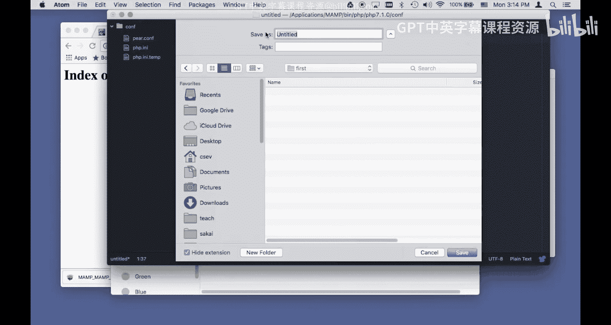

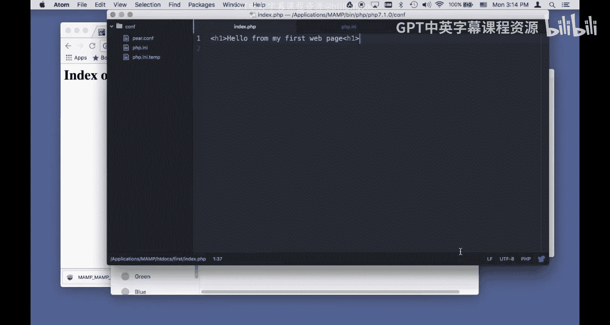

1.  打开“访达”，进入路径：`Macintosh HD` -> `应用程序` -> `MAMP` -> `htdocs`。所有需要通过 `localhost` 访问的网页文件都应放在这个文件夹或其子文件夹中。
2.  为了保持项目整洁，我们在 `htdocs` 文件夹内创建一个名为 `first` 的新文件夹。
3.  打开文本编辑器，创建一个新文件。
4.  在文件中输入以下PHP代码：
    ```php
    <?php
    echo "Hello from my first web page!";
    ?>
    ```
5.  将这个文件保存到刚创建的 `first` 文件夹中，并将文件命名为 `index.php`。

现在，让我们在浏览器中查看这个页面。

1.  确保MAMP服务器正在运行（控制面板指示灯为绿色）。
2.  打开浏览器，访问地址：`http://localhost:8888/first/`。
    *   `localhost` 代表你的本地电脑。
    *   `8888` 是MAMP默认使用的端口号。
    *   `/first/` 指向我们刚创建的文件夹。
3.  浏览器会自动寻找并打开 `first` 文件夹下的 `index.php` 文件（这是Web服务器的默认文档之一）。你应该能在页面上看到“Hello from my first web page!”这行文字。

## 总结

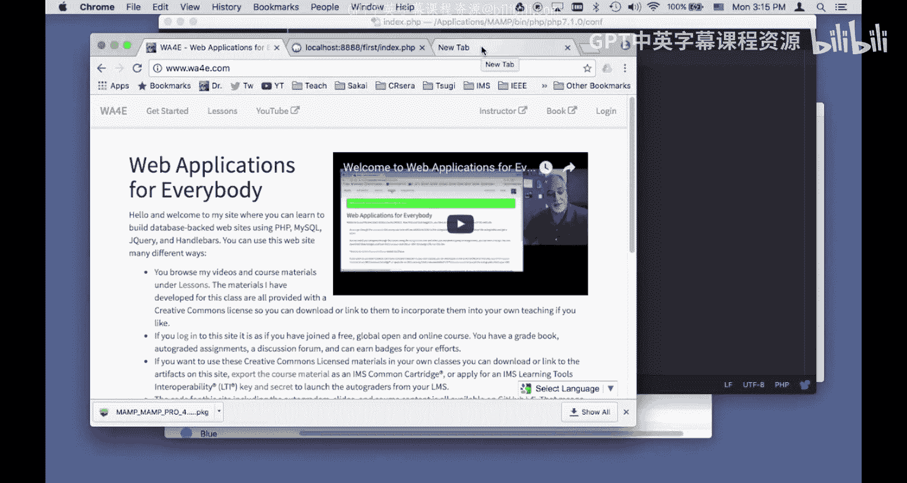


本节课中我们一起学习了在Macintosh上搭建PHP本地开发环境的完整流程。我们首先从官网下载了MAMP并完成了安装。接着，我们启动了MAMP服务，并通过修改 `php.ini` 配置文件开启了PHP错误显示功能，这对于开发调试至关重要。最后，我们在MAMP的 `htdocs` 目录下创建了项目文件夹和第一个PHP文件 `index.php`，并通过浏览器成功访问，验证了整个环境的可用性。现在，你已经拥有了一个功能完备的本地PHP开发环境，可以开始构建你的Web应用程序了。