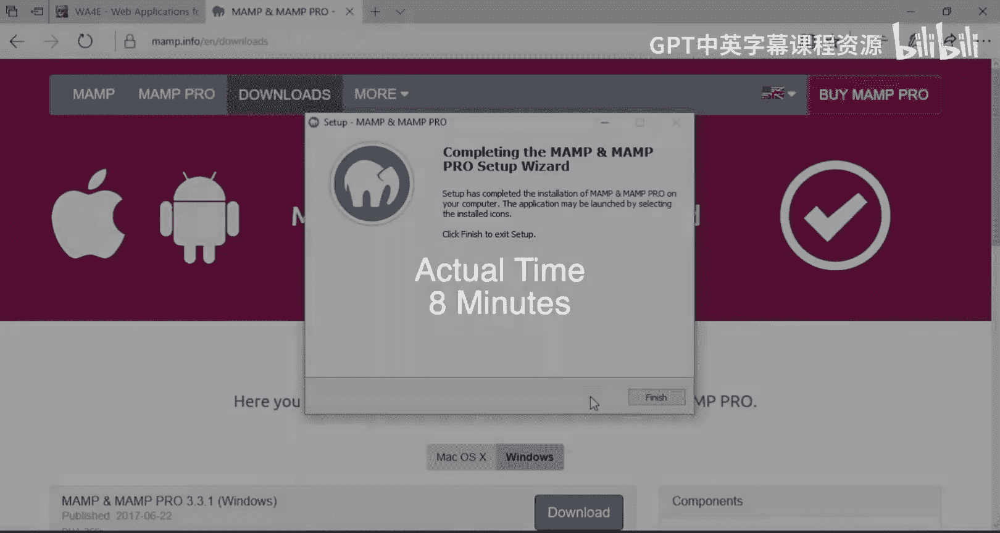
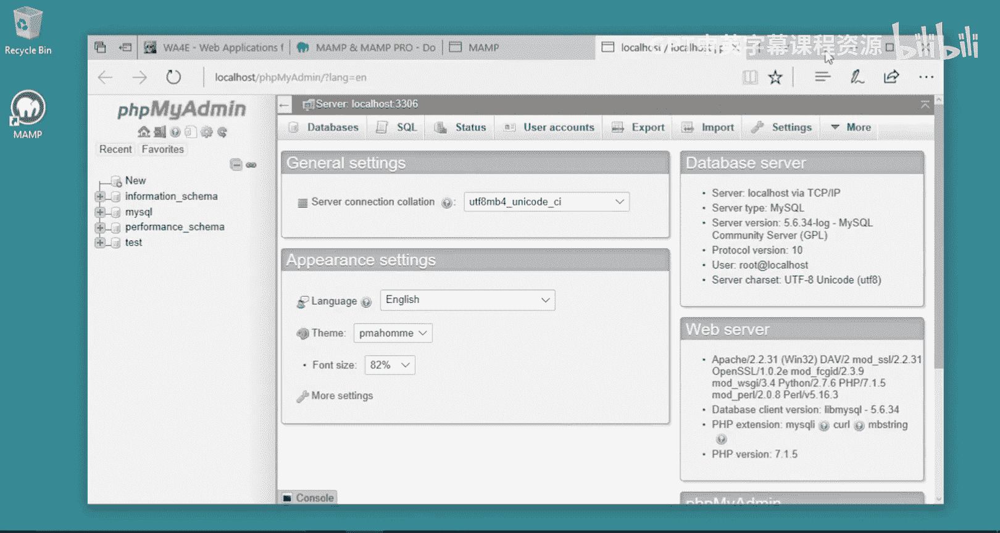
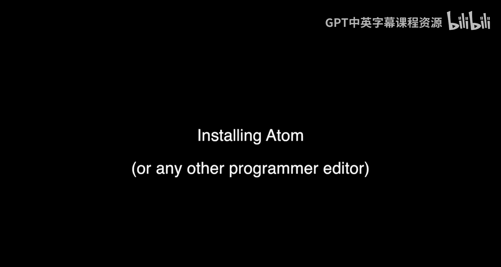
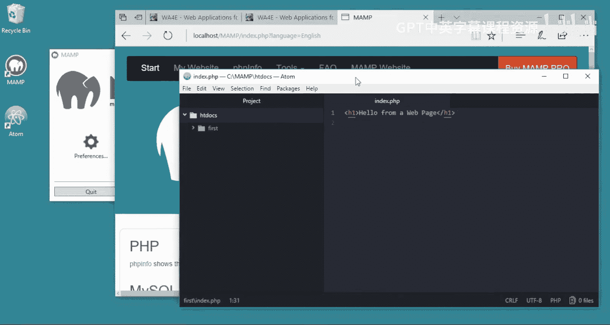

# 面向所有人的Web应用程序：第7章：在Windows 10上安装MAMP与编写第一个PHP程序 🖥️

在本节课中，我们将学习如何在Windows 10系统上安装MAMP集成开发环境，并利用它编写和运行第一个PHP程序。整个过程包括下载安装、配置服务器、编写代码以及设置错误显示。


## 安装MAMP

首先，我们需要下载并安装MAMP。访问MAMP官方网站，选择Windows版本进行下载。下载完成后，运行安装程序。





安装程序启动后，选择“是”以继续。在语言选择界面，选择“English”并点击“Next”。


在接下来的界面中，取消勾选安装“MAMP PRO”的选项。这是一个付费版本，本教程使用免费版本即可。然后，阅读并接受许可协议。





选择MAMP的安装路径，建议使用默认路径 `C:\MAMP`。之后，连续点击“Next”完成安装。安装结束后，运行MAMP。


MAMP启动后，桌面上会出现其快捷方式。启动MAMP控制面板，点击“Start Servers”按钮以启动Apache和MySQL服务器。

在服务器启动过程中，Windows防火墙可能会弹出安全警报。这是非常重要的步骤，必须允许Apache HTTP Server和MySQL的通信通过防火墙。请勾选两个选项并点击“允许访问”。


服务器成功启动后，点击“Open Start Page”按钮。在打开的浏览器页面中，你可以查看PHP信息或打开phpMyAdmin。


如果phpMyAdmin页面能够正常显示，恭喜你，MAMP已成功安装并运行。

## 安装文本编辑器Atom

上一节我们成功安装了MAMP服务器环境，本节我们将安装一个代码编辑器。虽然你可以使用任何喜欢的文本编辑器，但强烈建议不要使用记事本或Word，因为它们可能破坏代码文件的格式。我们推荐使用Atom，因为它支持语法高亮，并且在Windows、Mac和Linux上表现一致。

从Atom官网下载Windows安装程序并运行。





按照安装向导的提示完成Atom的安装。

## 编写第一个PHP程序

现在，我们已经准备好了服务器环境和代码编辑器，可以开始编写第一个PHP程序了。

首先，确保MAMP中的Apache和MySQL服务器已经启动。然后，在Atom中创建一个新文件。

以下是创建文件的步骤：
1.  在Atom中，点击 `File` -> `New File`。
2.  在新文件中输入以下HTML代码：
    ```html
    <h1>Hello from a web page</h1>
    ```
3.  点击 `File` -> `Save` 保存文件。
4.  在保存对话框中，导航到MAMP的Web文档根目录：`C:\MAMP\htdocs\`。
5.  在该目录下创建一个新文件夹，命名为 `first`。
6.  将文件保存到 `first` 文件夹中，并命名为 `index.php`。`index.php` 是一个特殊名称，当浏览器访问一个目录时，服务器默认会寻找并执行该文件。


现在，打开浏览器，访问以下地址：`http://localhost/first/index.php`。你应该能看到显示“Hello from a web page”的页面。


到目前为止，我们只是输出了静态HTML。接下来，让我们在PHP中执行一些代码。

在 `index.php` 文件中，添加PHP代码块。PHP代码需要包裹在 `<?php` 和 `?>` 标签中。

```php
<?php
    echo "Hi there.\n";
?>
```
保存文件并刷新浏览器页面，你会看到“Hi there.”被输出。

在PHP中，服务器会执行 `<?php ... ?>` 标签内的所有代码，并将 `echo` 语句输出的内容插入到最终的HTML页面中。

我们可以添加更多逻辑，例如使用变量：
```php
<?php
    $x = 6 * 7;
    echo "The answer is " . $x . ".\n";
?>
```
保存并刷新后，页面将显示“The answer is 42.”。

## 配置PHP错误显示

在开发过程中，看到详细的错误信息对于调试代码至关重要。然而，出于安全考虑，MAMP默认关闭了在网页上显示错误的功能。我们需要手动开启它。

首先，在MAMP的启动页面，点击“PHPInfo”链接。在打开的页面中，找到“Loaded Configuration File”这一行，记下PHP配置文件的路径，例如 `C:\MAMP\conf\php7.1.5\php.ini`。


然后，用Atom打开这个 `php.ini` 配置文件。在文件中搜索 `display_errors` 设置。

找到以下两行：
```
display_errors = Off
display_startup_errors = Off
```
将它们修改为：
```
display_errors = On
display_startup_errors = On
```
修改后保存文件。


由于修改了服务器配置，需要重启MAMP的Apache和MySQL服务器才能使更改生效。在MAMP控制面板中，先点击“Stop Servers”，等待停止后，再点击“Start Servers”。

服务器重启后，返回你的PHP代码文件，故意制造一个语法错误，例如删除一行代码末尾的分号。
```php
<?php
    echo "Hi there" // 缺少分号
?>
```
保存并刷新浏览器页面。现在，你应该能看到一个明确的错误信息，例如“Parse error: syntax error, unexpected end of file... on line 3”，这能帮助你快速定位问题。


修复错误（添加上分号），保存文件，再次刷新页面，程序应恢复正常。


在开发初期就开启错误显示功能可以节省大量调试时间，避免因只有模糊的“500错误”而不知所措。

## 总结


本节课中，我们一起学习了Web应用开发环境的搭建。我们首先在Windows 10上安装并配置了MAMP服务器套件，包括Apache和MySQL。然后，我们安装了Atom代码编辑器用于编写程序。接着，我们在MAMP的 `htdocs` 目录下创建了第一个PHP文件，并学习了如何混合HTML与PHP代码，以及使用变量和 `echo` 进行输出。最后，我们通过修改 `php.ini` 配置文件，开启了PHP的错误显示功能，这对于后续的代码调试和开发至关重要。现在，你已经拥有了一个完整的本地PHP开发环境，可以开始构建更复杂的Web应用程序了。