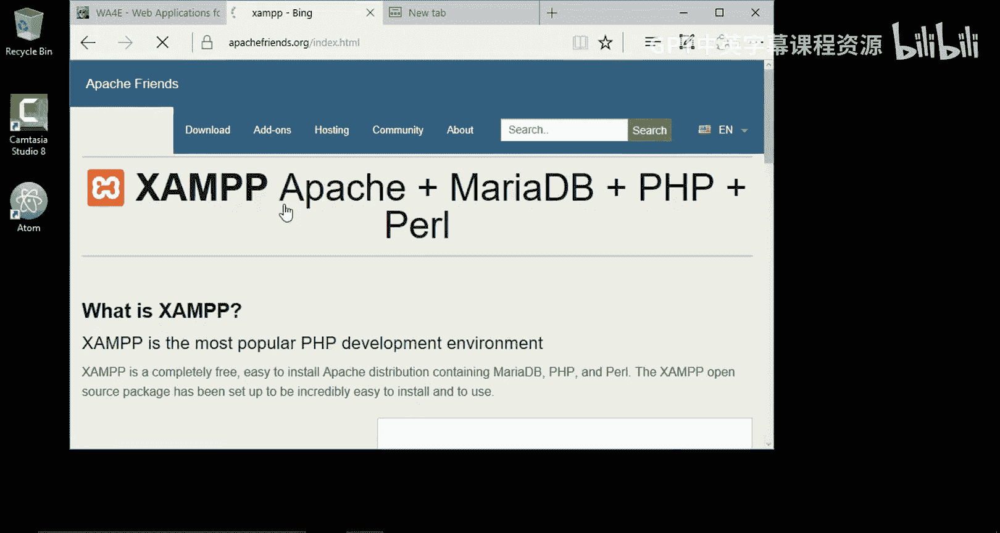
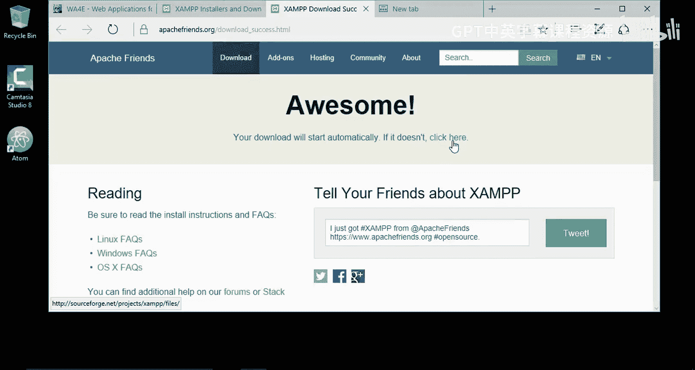
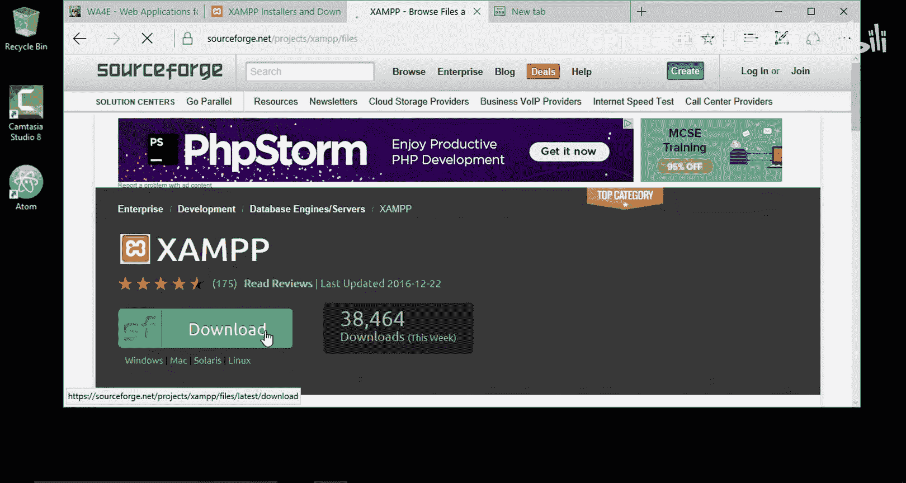
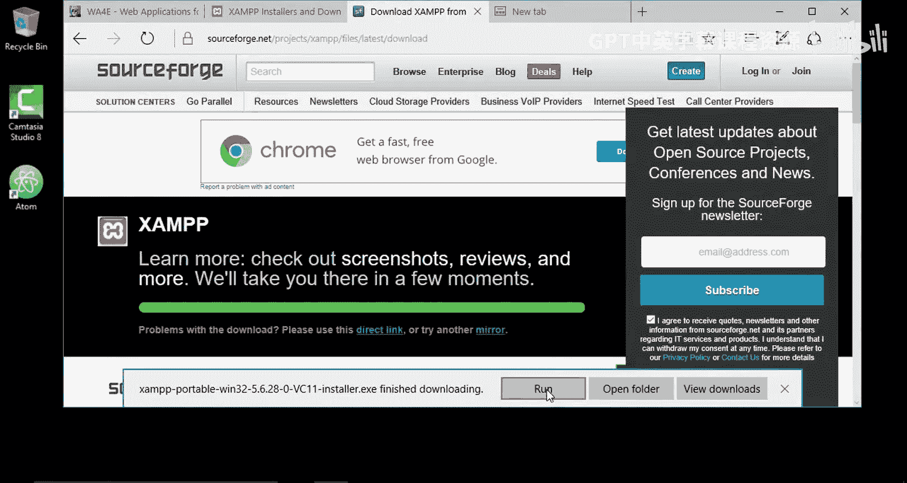
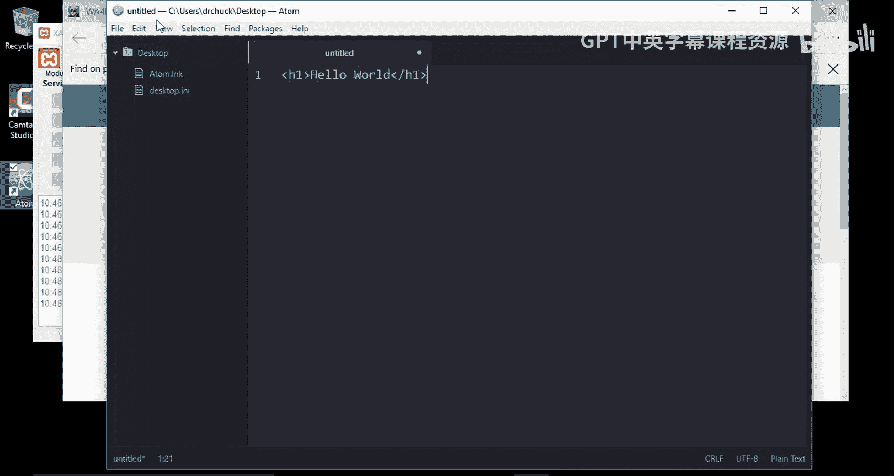
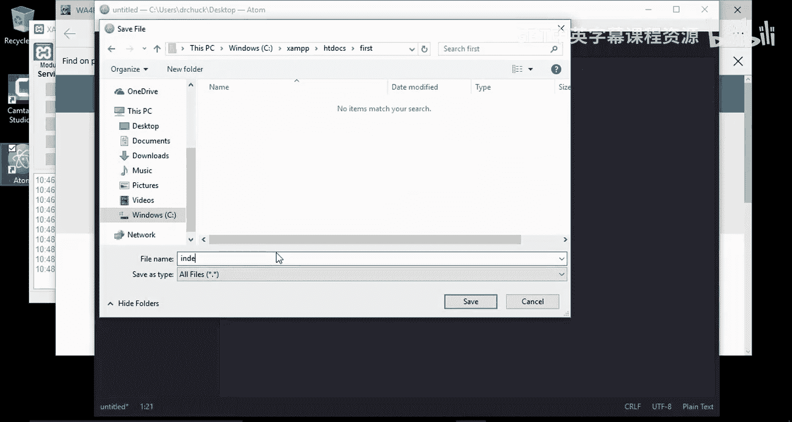
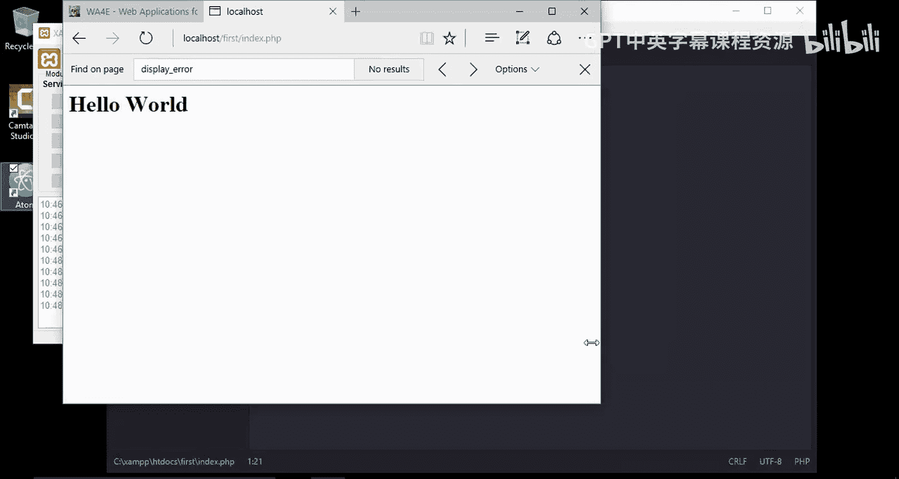
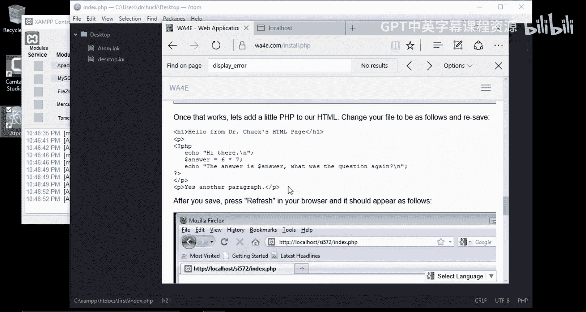

# 面向所有人的Web应用程序：第8章：在Windows 10上安装XAMPP 🖥️








在本节课中，我们将学习如何在Windows 10操作系统上安装XAMPP。XAMPP是一个集成了Apache、MySQL、PHP和Perl的免费开源软件包，是搭建本地Web开发环境的理想工具。我们将从下载开始，逐步完成安装、配置，并运行一个简单的PHP程序来验证安装是否成功。



## 下载XAMPP安装程序

首先，我们需要从Apache Friends官方网站下载XAMPP的Windows版本安装程序。

以下是下载步骤：
1.  访问Apache Friends网站。
2.  找到适用于Windows的XAMPP版本。
3.  点击下载链接，开始下载安装程序。

下载完成后，安装程序通常位于系统的“下载”文件夹中。

## 运行安装程序并完成安装

上一节我们下载了安装程序，本节中我们来看看如何运行它并进行安装。

以下是安装步骤：
1.  找到并运行下载好的XAMPP安装程序。
2.  安装向导启动后，建议使用默认的安装路径，即 `C:\xampp`。避免安装在“Program Files”目录下，可以简化后续操作。
3.  在组件选择界面，可以根据需要取消勾选不需要的组件，例如Tomcat、Perl和Fake Sendmail。对于基础的Web开发，通常只需要Apache和MySQL。
4.  确认选择后，开始安装过程。安装可能需要一些时间。

安装完成后，先不要立即启动XAMPP控制面板。

## 启动XAMPP控制面板并运行服务

现在安装已经完成，本节中我们来看看如何找到并启动XAMPP控制面板，以运行Web服务器和数据库。

以下是启动步骤：
1.  打开文件资源管理器，进入XAMPP的安装目录（例如 `C:\xampp`）。
2.  在该目录下找到名为 `xampp-control.exe` 的程序并运行它。
3.  首次启动时，可能会弹出安全警告或语言选择对话框，请根据提示进行操作。对于安全警告，通常需要点击“允许”或“是”。
4.  控制面板启动后，为了方便后续使用，可以右键点击任务栏上的控制面板图标，选择“固定到任务栏”。
5.  在控制面板中，点击Apache和MySQL模块旁边的“Start”按钮，分别启动Web服务器和数据库服务器。启动成功后，模块名称旁会显示绿色的“Running”标识。

## 验证安装与配置PHP


服务成功启动后，我们可以通过访问本地仪表盘来验证安装。同时，确保PHP的配置适合开发环境。



以下是验证和检查步骤：
1.  打开浏览器，访问 `http://localhost`。如果看到XAMPP的欢迎仪表盘页面，说明Apache服务器运行正常。
2.  在仪表盘页面，可以点击“PHPInfo”链接查看详细的PHP配置信息。
3.  一个关键的开发配置是 `display_errors` 设置。在PHPInfo页面中搜索“display_errors”。对于开发环境，此设置应为 **On**，以便在页面上显示错误信息，方便调试。对于生产环境，则应设为 **Off** 以隐藏错误信息。
4.  如果需要修改此配置，可以点击XAMPP控制面板中Apache模块所在行的“Config”按钮，选择“PHP (php.ini)”。
5.  在打开的配置文件中，使用 `Ctrl+F` 搜索 `display_errors`，将其值修改为 `On`。同时，也可以检查 `display_startup_errors` 的设置。
6.  保存配置文件后，必须在XAMPP控制面板中重启Apache服务器（先Stop，再Start），修改才能生效。




## 创建并运行第一个PHP程序



环境配置妥当后，本节中我们来看看如何编写一个简单的PHP程序，并通过本地服务器运行它。



以下是创建和测试步骤：
1.  打开你喜欢的文本编辑器（例如VS Code、Sublime Text或Notepad++）。
2.  创建一个新的文件，输入以下混合了HTML和PHP的代码：
    ```php
    <!DOCTYPE html>
    <html>
    <head>
        <title>My First PHP</title>
    </head>
    <body>
        <h1>Hello World from HTML</h1>
        <?php
            echo “<p>This is coming from PHP.</p>”;
            $sum = 6 + 4;
            echo “<p>The sum of 6 and 4 is: “ . $sum . “</p>”;
        ?>
    </body>
    </html>
    ```
3.  将文件保存到XAMPP的Web根目录下。默认路径是 `C:\xampp\htdocs\`。建议在该目录下为你的项目创建一个新文件夹，例如 `first`。
4.  将文件以 `index.php` 为名保存在 `first` 文件夹中，完整路径为 `C:\xampp\htdocs\first\index.php`。
5.  打开浏览器，访问 `http://localhost/first/index.php`。如果页面正确显示了HTML标题和PHP计算出的结果，说明你的本地开发环境已经成功搭建并可以运行PHP程序了。


## 总结


本节课中我们一起学习了在Windows 10上搭建PHP本地开发环境的完整流程。我们从下载XAMPP安装程序开始，逐步完成了安装、启动Apache与MySQL服务、验证安装以及配置关键的PHP开发设置。最后，我们通过创建并运行一个包含HTML和PHP代码的简单网页，成功验证了整个环境的工作状态。现在，你已经拥有了一个功能完备的本地服务器，可以开始进行数据库构建和PHP代码编写等Web开发学习了。