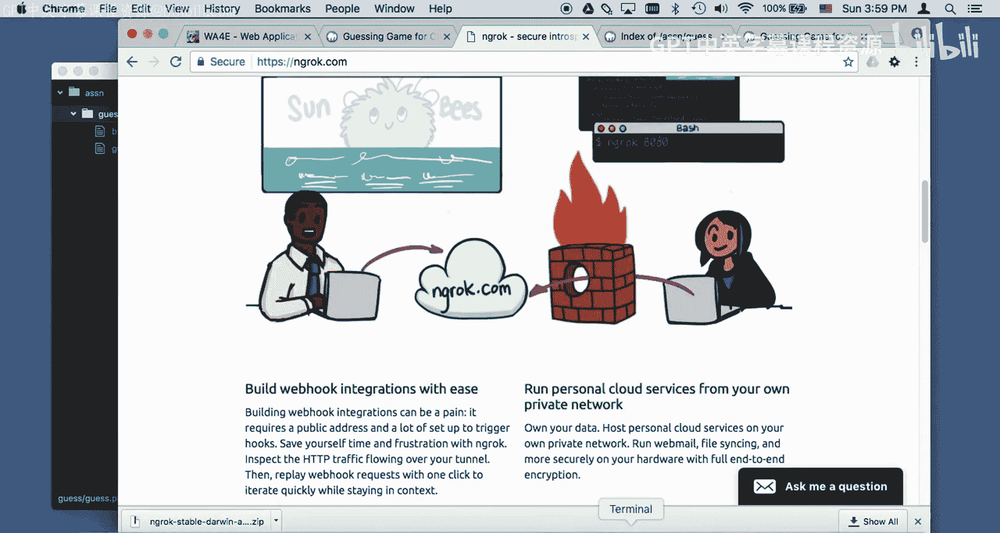
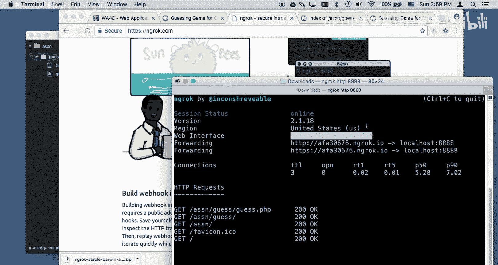
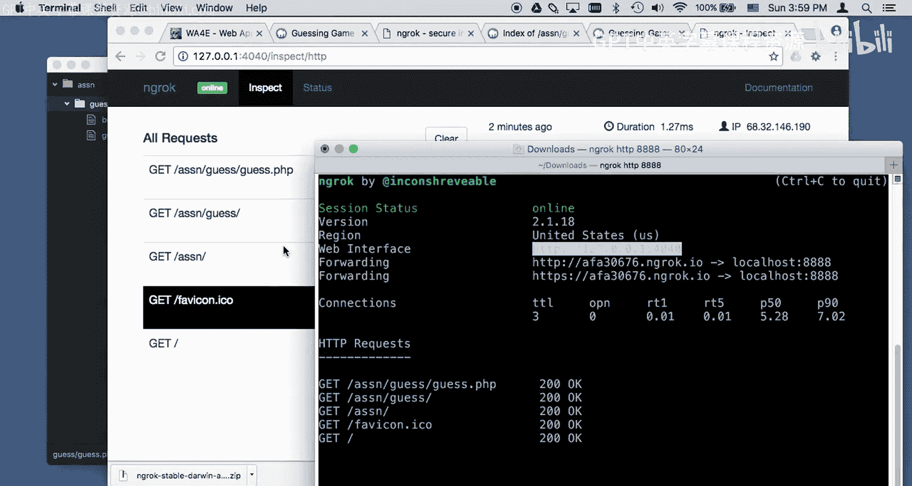
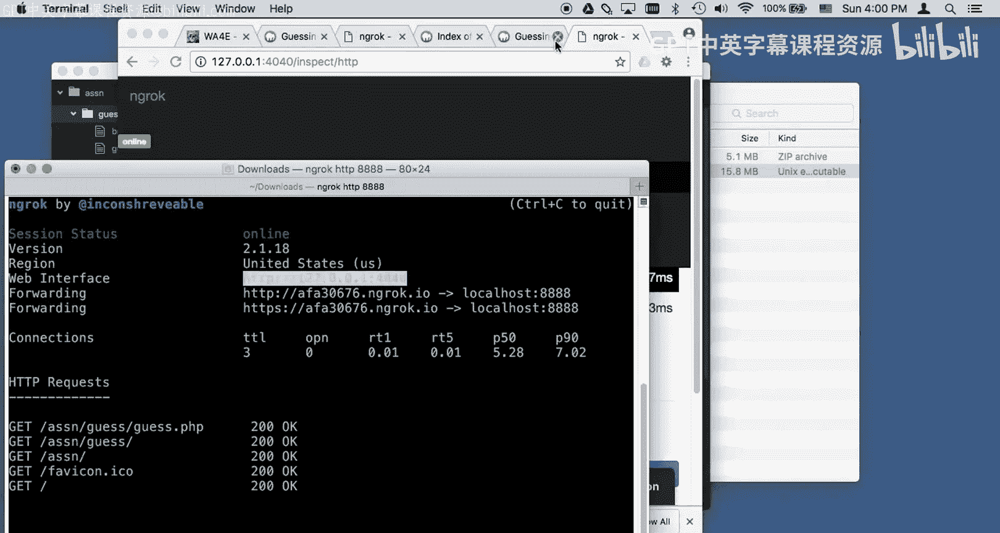
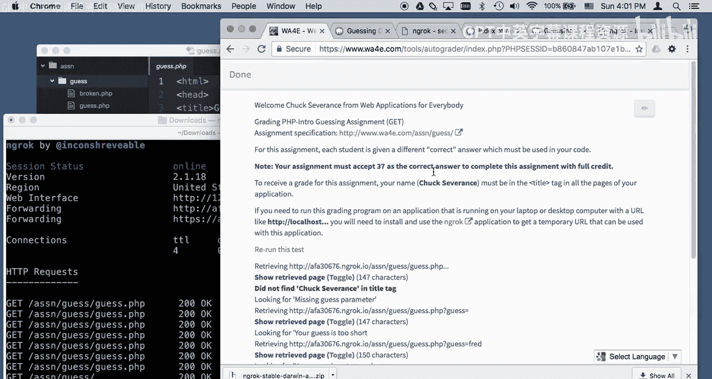
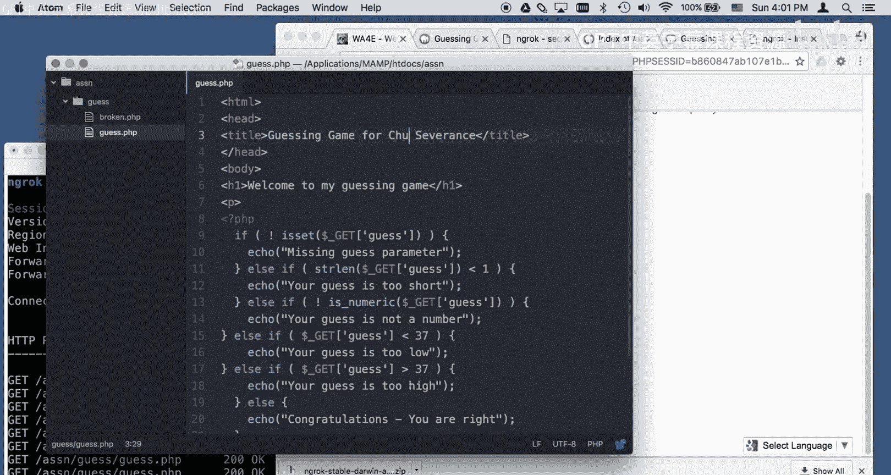
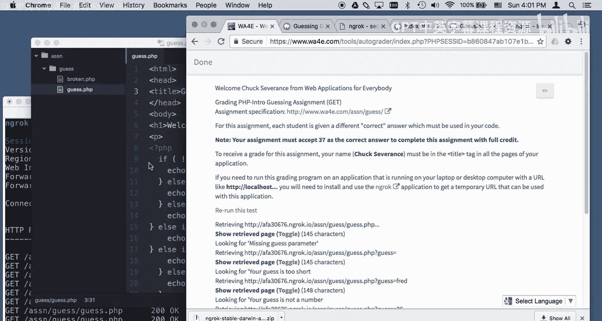
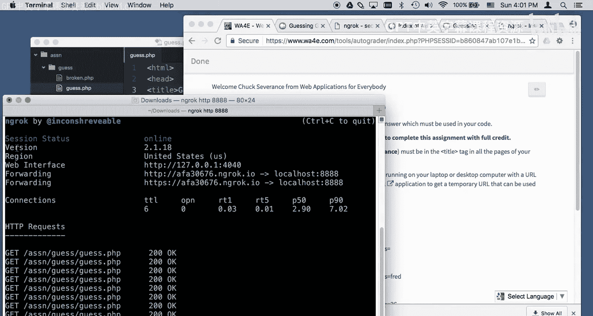
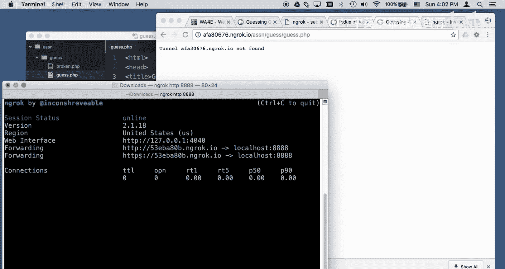

# 面向所有人的Web应用程序：10：Macintosh系统使用Ngrok连接自动评分器 🖥️➡️🌐

在本节课中，我们将学习如何使用Ngrok工具，将运行在你本地电脑（如Macintosh）上的Web应用程序暴露到公共互联网，以便课程中的自动评分器能够访问并评估你的作业。


## 概述


当你在本地开发环境中（例如使用MAMP）运行PHP Web应用程序时，你的服务器地址通常是`localhost`或`127.0.0.1`。这意味着只有你本机的浏览器可以访问它。然而，课程中的自动评分器运行在真实的互联网上，它无法直接连接到你的本地`localhost`地址。为了解决这个问题，我们需要使用一个名为Ngrok的工具，它能在公共互联网和你的本地服务器之间建立一个安全的隧道。

## 问题：本地服务器与互联网的隔离

假设你正在完成“猜数字游戏”的作业。你的代码运行在本地MAMP服务器上，地址类似于`http://localhost:8888/assignments/guess/guess.php`。

你可以通过浏览器访问这个地址并进行测试。例如，访问`http://localhost:8888/assignments/guess/guess.php?guess=42`。

但是，如果你直接将这个`localhost`地址提交给自动评分器，评分器会尝试连接它并失败。因为`localhost`这个地址只在你的电脑内部有意义，在互联网上的评分器无法找到它。你会收到类似“连接被拒绝”的错误。

## 解决方案：使用Ngrok建立隧道

Ngrok是一个轻量级的工具，它能创建一个从公共互联网到你本地服务器的临时通道。其核心原理可以概括为以下流程：

```
互联网上的自动评分器 <---> Ngrok提供的公共URL (如 https://abc123.ngrok.io) <---> 你的本地服务器 (localhost:8888)
```

上一节我们介绍了本地服务器无法被互联网访问的问题，本节中我们来看看如何使用Ngrok来解决它。

### 步骤一：下载并安装Ngrok

首先，你需要下载Ngrok软件。


1.  访问Ngrok的官方网站下载页面。
2.  根据你的操作系统（Mac或Windows）选择对应的版本进行下载。
3.  下载完成后，文件通常位于你的“下载”文件夹中。对于Mac系统，它是一个可执行的压缩文件。

### 步骤二：在终端中运行Ngrok

你需要通过终端（Mac/Linux）或命令提示符（Windows）来运行Ngrok。

1.  打开终端应用程序。
2.  使用`cd`命令导航到存放`ngrok`文件的目录。例如，如果它在下载文件夹：
    ```bash
    cd ~/Downloads
    ```
3.  运行以下命令来启动隧道，将本地端口`8888`暴露到互联网：
    ```bash
    ./ngrok http 8888
    ```
    这个命令告诉Ngrok：监听本地`8888`端口，并为其创建一个公共的访问地址。





运行成功后，终端会显示类似以下的信息：

```
Forwarding    http://abc123.ngrok.io -> http://localhost:8888
Forwarding    https://abc123.ngrok.io -> http://localhost:8888
```





**关键点**：屏幕上显示的`https://abc123.ngrok.io`（你的地址会不同）就是一个真实的、可以在互联网任何地方访问的URL。只要Ngrok程序在运行，这个隧道就有效。



### 步骤三：使用Ngrok URL进行测试和提交

现在，你可以用这个新的Ngrok URL替换原来的`localhost`地址。

1.  在浏览器中访问：`https://abc123.ngrok.io/assignments/guess/guess.php`。你应该能看到和访问`localhost`时完全一样的页面。
2.  将这个完整的Ngrok URL（例如 `https://abc123.ngrok.io/assignments/guess/guess.php`）复制下来。
3.  回到课程的自动评分器页面，将复制的URL粘贴到提交框中，然后点击“评估”。



此时，自动评分器会通过互联网访问你的Ngrok URL，Ngrok会将请求转发给你的本地服务器，再将服务器的响应传回给评分器。你可以在运行Ngrok的终端窗口里看到所有的请求和响应日志。


### 步骤四：调试与完成



在自动评分器运行测试时，请仔细阅读其反馈。





*   **如果测试失败**：不要慌张。评分器的错误信息通常会指出问题所在，例如“在标题标签中未找到‘Chuck Severance’”，或者“猜测的数字太高”。你需要根据这些提示，回头修改你本地的PHP代码（例如，将正确的答案从42改为37，或者在HTML标题中添加要求的名字），保存文件，然后重新在评分器中运行测试。
*   **使用Ngrok监控**：你还可以在浏览器中访问 `http://127.0.0.1:4040`（这是Ngrok提供的本地监控界面），来详细查看通过隧道的所有网络请求和响应数据，这有助于深度调试。

当你完成作业并通过所有测试后，可以回到运行Ngrok的终端窗口，按下 `Control + C` 键来停止Ngrok服务。隧道会立即关闭，之前的Ngrok URL也将失效。




**请注意**：每次重新启动Ngrok，它都会生成一个全新的随机URL。因此，如果你需要再次提交或测试，必须使用最新的URL。

## 总结


本节课中我们一起学习了如何利用Ngrok工具桥接本地开发环境与公共互联网。我们了解了将`localhost`服务暴露出去的必要性，逐步实践了下载、运行Ngrok并创建隧道的流程，最后学会了如何使用生成的公共URL让自动评分器成功访问并评估我们本地的Web应用作业。记住，Ngrok是一个临时解决方案，每次启动都会获得新地址，在开发和测试阶段非常实用。