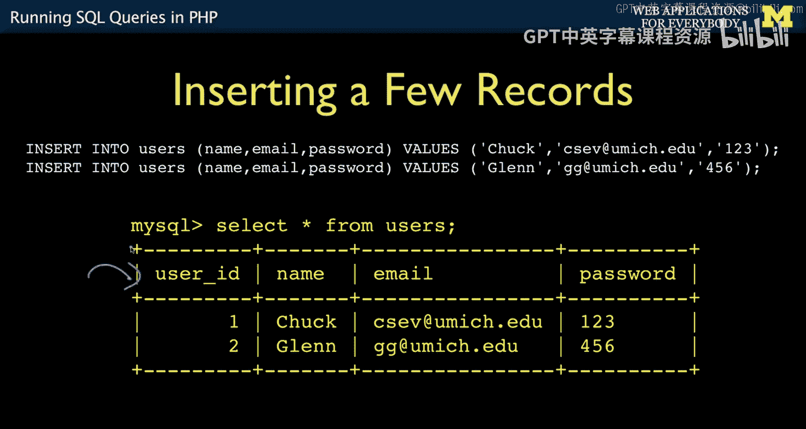
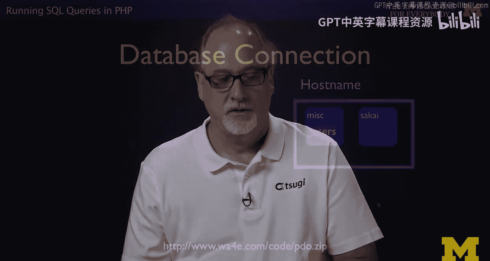
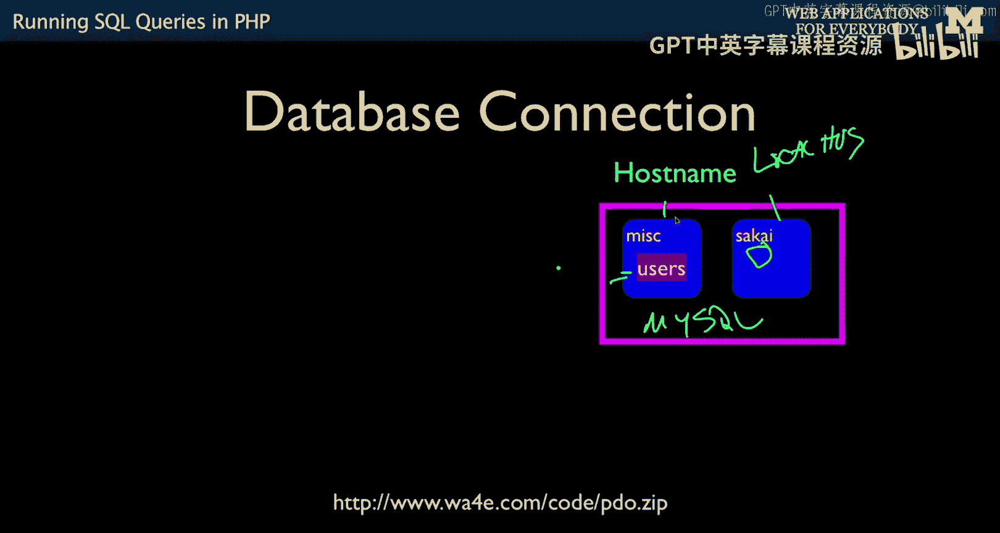
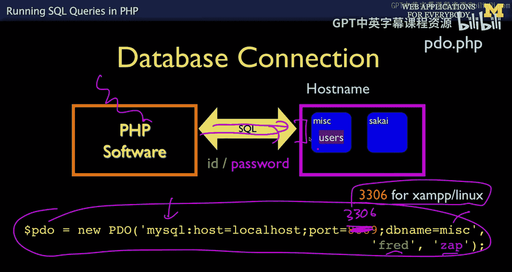
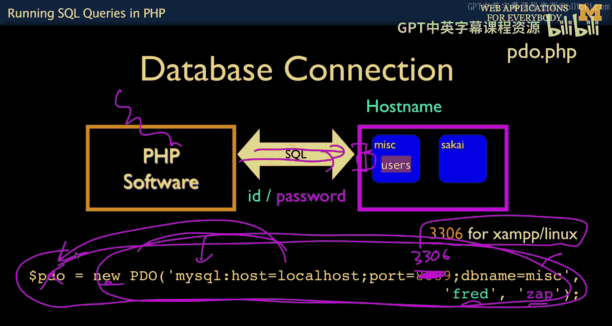
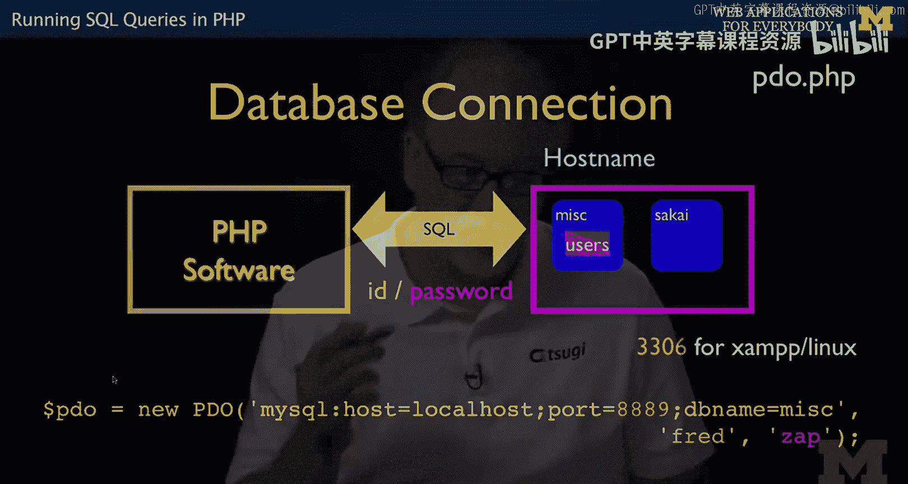
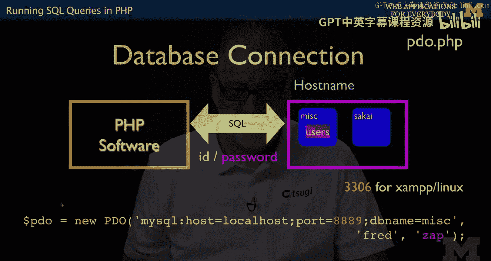
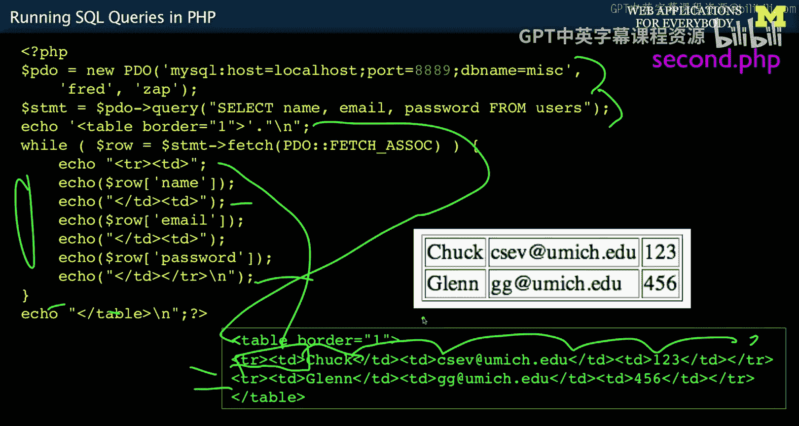
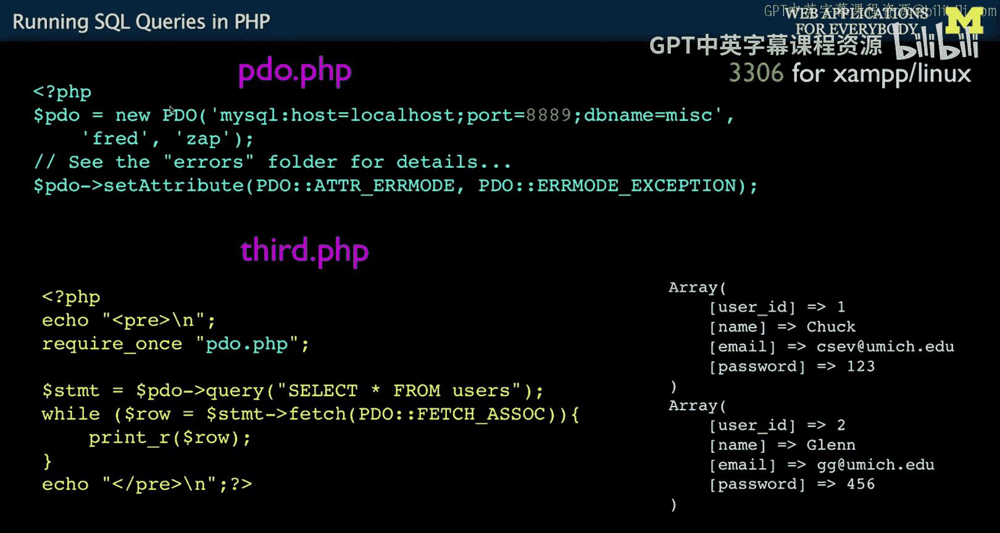

# 密歇根大学《面向所有人的Web应用程序（PHP、SQL、APP、JavaScript和JQuey｜Web Applications for Everybody》 p83 13_在PHP中执行SQL查询.zh_en -BV1Lr421A75d_p83-

So now we're going to actually insert some data。 Now I walk through these。

 I give you two versions of this first I give you kind of a lecture version of it where it's all slides。

 and then I'll give you a walkthrough of it where I'm just writing code So you're going to see this twice look at it both on the slides and on the demo。

The first thing we have to do is create a database in a user and we've done this before。

 and we've done a create database， but we haven't done a grant command。

 So create database is an SQL command to create the database。

 and then the grant command is effectively you can read up on it's you know a bunch of little things Gr all there's you can give different permissions。

 but this grants， everything。 This is a database name。

 all the tables in the database too and then an account。And then a password identified by Z。

This next parameters basically is what incoming address will we accept Fred from And so if you basically have your laptop and it's connected to the internet out here somehow when you are running a program inside the laptop which is like PP inside the laptop and then you're run a database it makes a connection and this connection is either 127001 or local host So within laptop connections are still network connections。

 they're like a fake network inside the computer， it just means that by only allowing connections from these two places。

 some hostile person wants to come in and talk to your database server。

 they cannot even if they knew this Fred and Zap account if they sneak in they're supposed they need to make the connection from within the computer because this one will have like 14121148 right and then that'll come in but that password only works for local connections So this little trick here is away to basically firewall。

Your database server from connections coming from outside Now if you want to have them connect from outside。

 most of the times when people set up production database servers。

 they set them up on virtual Oary networks where you have a PhP server and a database server There's like a little La but it's sort of the outside world can talk to PhP but the outside world is somehow blocked from talking to your database server and so this is all in your hosting facility it can talk to here but you don't even allow packets to come to this database server to protect it so people can't sort of beat the heck out of your database server they can't even get a packet to it using something like a VPN virtual private networking or who knows what。

Wow， that's a long way to basically say that what we're trying to do here is create a password。

 an account and a password and make it so that we can only talk from within the same box。

 So inside your laptop talking the Ph P inside your laptop can talk to the SQL inside your laptop。

 Now， if you're doing all this with a command line， you have to switch to the database。

 But we've seen all that before。 and you can change these， if you like。

We're also going to just create a table， right， make a table。With an index， I mean。

 by this point in time， we should know how to do this stuff。

 It shouldn't be too particularly difficult。And then we're going to insert some users right and this is from a previous lecture。

 We're going to insert name email。 We've got an auto increment field。

 and so we're going to get some data in there and away you go。

 So that we've done all that through PhP Myadmin or through the command line or some other way。

And so what we've got now is we've got our database sitting on local hosts basically。

We've got my SQL。That's software。 and we've got a couple databases。

 Maybe we have not one named missed that we just made。 Weve got a table。

 We have some other one called Ska or whatever it is that we use for some other thing。

 So that's what we've got by typing all that stuff in。 we have created that。

Now what we need to do is make it so that we can send SQL commands from PHP to this database。

 so we have to establish an SQL connection， we call it a database connection。

And again， this is like a fake little internet， even though it's inside of your computer。

 it's going to localhos or 127001 and it's literally sending SQl commands with little tiny special protocol and then getting back data using that same protocol。

 And so what we need to do inside PhP when we come down inside our code and we want to make this connection we have to know the I and the password and the database and we also have to know which port this is running on。

 And so all servers network servers have ports that they run on so that one computer can have a mail server。

 a web server or a secure web server or database server so we have to pick the port that it's going to go on。

 and there's generally two ports that we run and 3306 is the default port for my Sql on most systems if you're on a Macintosh you say this 8889 because this is how map sets it up and so if you're running map on the Macintosh this is what you do and if you're running Windows or Linux or Xamp or something just change this to 33。

this will be a pain in the neck to get right。Once you got it right， a away you go。

 and so this is basically saying we're going to connect to a Myql server。

 we're going to connect to local hostst， which is within the same computer and we're going to connect to Port 808089。

 we're going to go to the database Mi and we are going to present an ID and a password as part of this connection because there is a security that stops people from coming in here。

 and so this is like logging into a computer。 you're logging your PhP is logging into the database。

 And so once this is done。

You get back。 It's an object。 You get back an object。

 and we're gonna to store that in a variable called Do P。 I could name this dollar X if I want。

 but I just always name it P。 It's just a mneummonic， but it doesn't have to be named P。

 And I can have more than one connection。 And I would have different variables， different objects。

 different instances， for each one of those things。 See why I taught you about objects before。

 because now I can just use the word object。 And if you don't know what object is。

 go to the previous lecture and learn about objects。 So you get this connection。

 And so what the connection is is a piece of data here that is effectively your your port hole that you can see the database through this variable。

 If you have got the wrong password。 if you get this wrong or this wrong。

 this blows up with a traceback。

Lows up with a trace spec。 So if it works， you've got a connection and it's in the variable P and if it doesn't work。

 then you don't have a connection and your code's blown up and probably everything else you're going to do is not going to work。

 So like I said， making this work is the probably the hardest thing that you're going to have to do。

 And then two minutes after you make it work， you'll just use it over and over and you'll stop you'll stop thinking about it。

 So it's。Forgive us some help if you get problem with your David based connection。

So let's take a look at some PhP code that's going to take a look at this， right。

 So here's a PhP script。 It's got an echo statement in it。

 I'm using a pre tag so everything's pretty and doesn't get wrapped。 I say， hey。

 let's make a P connection to the database with Fred and Zap yada yada。 If this works， I get P。

 otherwise this will trace back。 blow up。And then I'm going to basically send a query。

 And and so you say' P an arrow means go find the method query within the P object and select are from users。

 That's just a string。 That's like you typed it on the keyboard。 select space star space from users。

 We are literally sending strings of SQL to the database server and then we get back this thing called the statement。

 And then we can loop through whatever records were selected by doing this while statement while row equal statement fetch P fetch As should print row。

Until this becomes false， and then it pops out， and in this case， because they put two records in。

 this PRr runs twice。And it just shows you the data， and it shows it to you in a key value array。

 That's with the Fesster associate that says， give me back rows in associative array。

You don't want the other one。 The other one is like it gives you back an order。

 And you have to remember that the first one is user I and the second one is named， No。

 you don't want that。 So you can look this up by user I。 And I'm just doing a printer。

 So this loop runs twice。And out the stuff。 And it gives me an array for each of the rows in the database。

 And so it's， it's the way we can see in PhP super simple code， understand every single line of this。

 Don't like， try to do fancy stuff until you know what's going on here。Okay， now。

We don't usually want to just print with print R。 We want to do something that sort of makes sense。

 And so we're gonna make a database connection。 We're going to do a select name。

 email and password from users and we're going then print out a table tag。

 so the table tag will come out。 Then we're gonna to loop through the rows。

 and we're going print out a table T R TD。 that's this little bit right here then we're going print the name out。

 and we're gonna print out Td。 we're just printing out Hml now and then at the end of it。

 we print out s tr and then we go do it again， we get a second row and then we print out slash table at the end。

 and then the output of this。 The collective output of this is what we see on our browser。

 which is this little bit of output right there。 So usually we're not just dumping this data out to show the user usually we're formatting it。

 we're selecting which data we want。 and we're formatting it in a way that's pleasant to the user。

 and this is a very simple formatting。 So it it's all three。

 you go here comes some Ph it gets some data from the database。

It pulls this data in and then it formats it before it sends it back out。

 so it chooses to format that as HTML， so it's really in a sense。

 transforming the database data into HTML。

Now， you saw that at the beginning of each of these files。

 the first thing I did was make a database connection。 and in each of those files。

 I have the host name， I have the database name， I have the account and the ID。

 And so you don't want to put that in too many files。

 And so we just put it in a separate file and include it all over the place。

 And so this is that pattern。 So if you look at this one。We just put the database connection in。

That one file。PDO。 PhP， this is exactly that same line。

 It leaves it in dollar PD and we're going to set error mode。

 and we'll talk a little bit about this a bit later。

 There are different error modes for P and depends on whether you're in production or not。

 And so we're telling this to be very talkative when things blow up because it's really important to be talkative。

When you're getting started， otherwise， you'll see these blank screens And it's like。

 what did I do wrong， It's just a blank screen。 And then you realize， oh。

 I didn't turn on error mode。 It's kind of like when you have Ph P。

 and you don't turn error modes on and you got syntax errors and you don't see them。

 So I'm going to basically suggest that while you're developing， especially in this class。

 you set air mode to be loudest blow up， die。 Don't continue， okay。Out of this residual。

 we get dollar P。 So we require that。 require once。 It's a good reason to use require once。

 And then we just run the code。 and we got this P that came out of there。

 The name and convention of dollar P and the name of this file being PO is just convention。

 doesn't have to be that。 The only thing that has to be this is this。

 because that's the name of the PO class capital PO is the name of the P class that we're going to instantiate that's given to us by P P。

 But after that， every other name and variable that I've chosen is something that I've chosen。

Okay， so now we're going to talk about how you don't just select from a PP app。

 but we're going to actually insert data in a PhP app。

