# 密歇根大学《面向所有人的Web应用程序》：第14讲：使用PDO访问MySQL并插入数据 💾


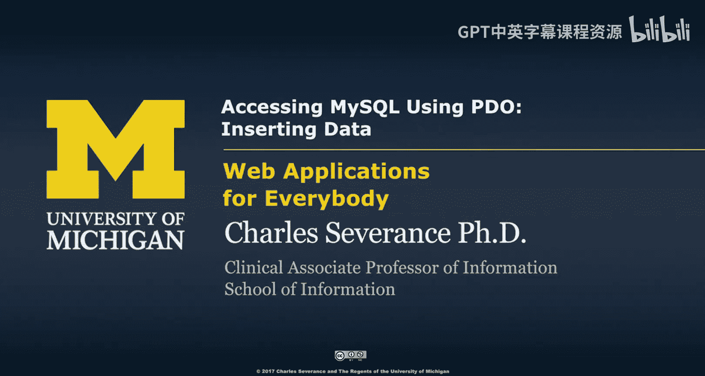

在本节课中，我们将学习如何将网页表单中的数据插入到MySQL数据库中。我们将使用PHP的PDO扩展来安全地执行SQL插入操作，并理解“模型-视图-控制器”（MVC）模式在此过程中的应用。最后，我们还会探讨如何结合查询和删除功能，构建一个简单的用户管理界面。

---

## 从表单插入数据到数据库

上一节我们介绍了PDO的基础连接。本节中，我们来看看如何接收用户通过表单提交的数据，并将其安全地存入数据库。

整个过程遵循一个清晰的流程：用户通过GET请求访问页面，看到一个表单；填写表单并提交后，触发POST请求；服务器端的PHP代码处理POST数据，生成SQL语句，并通过PDO将数据插入数据库。

以下是实现此功能的核心代码结构概述。

```php
// 模型（Model）部分：处理数据和业务逻辑
if ($_SERVER[‘REQUEST_METHOD’] == ‘POST’) {
    // 1. 从POST数组获取表单数据
    $name = $_POST[‘name’];
    $email = $_POST[‘email’];
    $password = $_POST[‘password’];

    // 2. 构造带占位符的SQL语句
    $sql = “INSERT INTO users (name, email, password) VALUES (:name, :email, :password)”;

    // 3. 准备并执行语句
    $stmt = $pdo->prepare($sql);
    $stmt->execute(array(‘:name’ => $name, ‘:email’ => $email, ‘:password’ => $password));
}

// 视图（View）部分：显示HTML表单
?>
<form method=“post”>
    Name: <input type=“text” name=“name”><br>
    Email: <input type=“text” name=“email”><br>
    Password: <input type=“password” name=“password”><br>
    <input type=“submit” value=“Add New”>
</form>
```

## 理解代码执行流程

现在，让我们深入分析上述代码的每一步是如何工作的。

当用户首次通过GET请求访问页面时，PHP会跳过`if ($_SERVER[‘REQUEST_METHOD’] == ‘POST’)` 内部的代码，直接渲染并输出HTML表单。表单中的 `name`、`email`、`password` 字段定义了提交后POST数组中的键名。

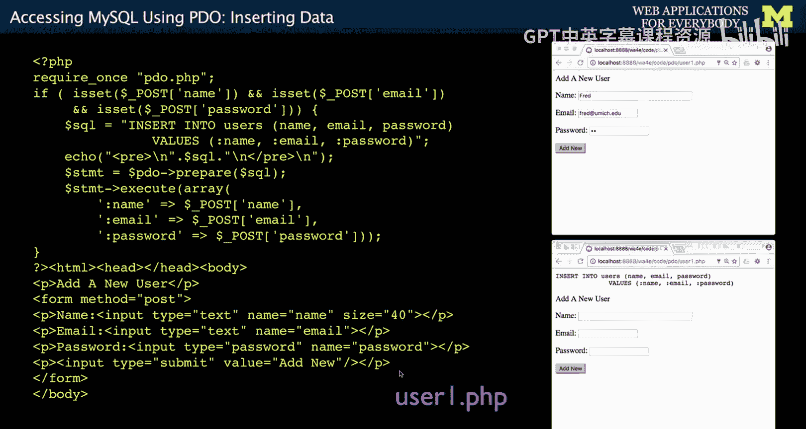

用户填写表单并点击“Add New”按钮后，浏览器会发送一个`method=“post”`的请求。此时，PHP脚本再次运行，并且因为存在POST数据，会进入if语句内部执行。

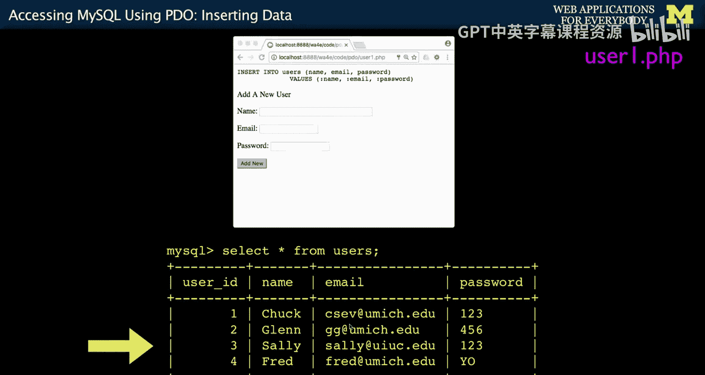

## 使用预处理语句与占位符

在模型部分，我们使用了预处理语句来执行SQL插入。这是确保数据库操作安全的关键步骤。

我们构造的SQL语句使用了命名占位符，例如 `:name`、`:email`、`:password`。占位符的名称可以是任意字符串，但为了清晰，通常与对应的表字段或POST键名保持一致。`prepare()` 方法会检查SQL语法并准备执行。随后，`execute()` 方法接收一个关联数组，将数组中的值绑定到对应的占位符上，并最终执行查询。

这种 `prepare` -> `execute` 的模式是当SQL语句需要插入外部变量值时的标准做法。它能有效防止SQL注入攻击。

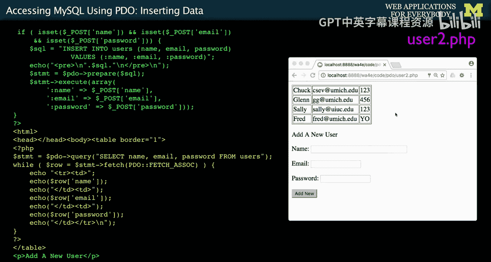


## 结合查询功能显示结果

为了即时验证插入操作是否成功，我们可以将插入功能和查询功能结合在同一个页面。

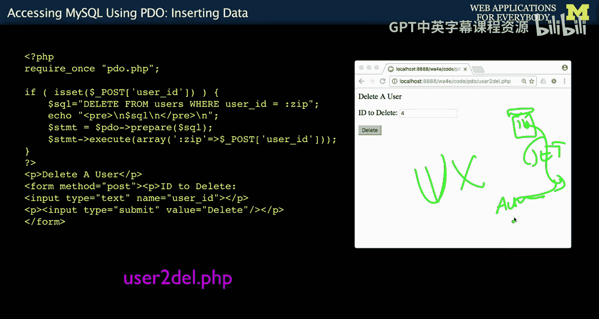

在插入数据的代码之后，我们可以添加一个查询所有用户的SQL语句，并将结果以表格形式展示在页面上。这样，用户提交新数据后，无需跳转页面或使用其他管理工具，就能立即在页面底部看到更新后的用户列表。这提供了更流畅的用户体验。


## 实现删除用户功能

完成了数据的创建（Create）和读取（Read），我们接下来看看如何实现删除（Delete）功能。删除操作需要格外谨慎。

首先，删除操作**必须**通过POST请求触发，而不应使用GET请求。这是因为根据HTTP规范，GET请求不应用于改变服务器状态（如删除数据）。网络爬虫会跟踪GET链接，可能导致误删。此外，浏览器对重复提交POST请求也有更好的防护机制。

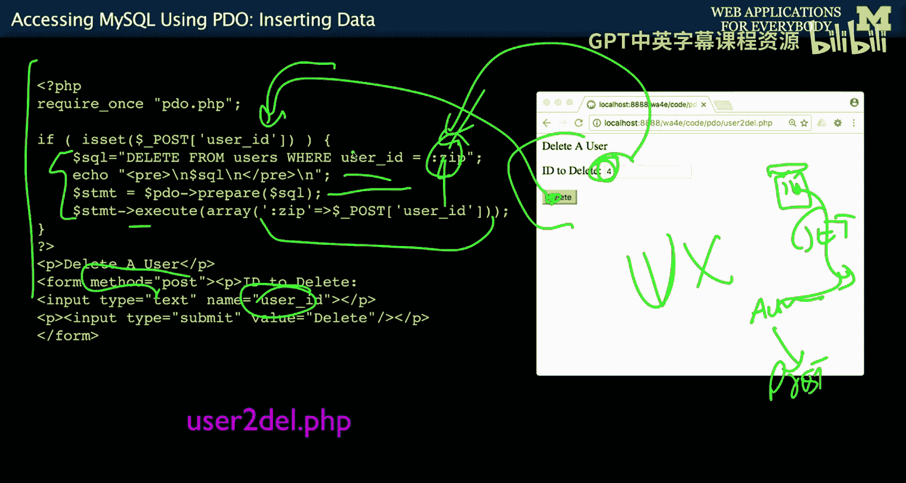

因此，一个常见的用户交互模式是：用户点击一个删除链接（GET请求），跳转到一个确认页面；在确认页面上点击“确认删除”按钮（POST请求），才真正执行删除操作。


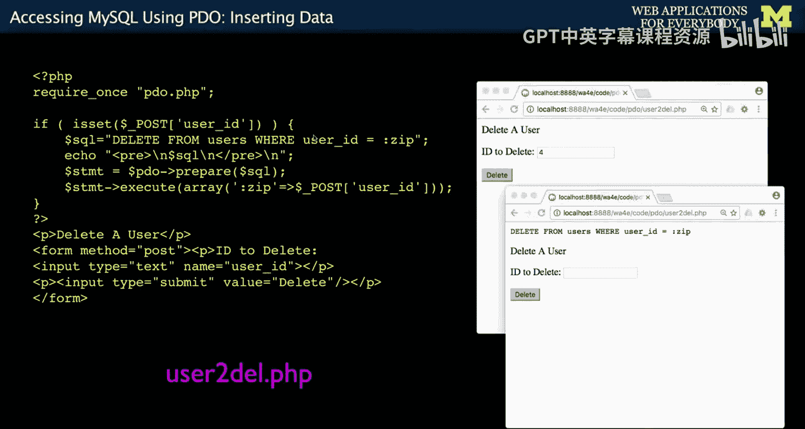

以下是删除功能的简化代码逻辑。

```php
// 如果是POST请求，则执行删除
if ($_SERVER[‘REQUEST_METHOD’] == ‘POST’ && isset($_POST[‘delete’])) {
    $user_id = $_POST[‘user_id’];
    $sql = “DELETE FROM users WHERE user_id = :zip”;
    $stmt = $pdo->prepare($sql);
    $stmt->execute(array(‘:zip’ => $user_id));
}
```

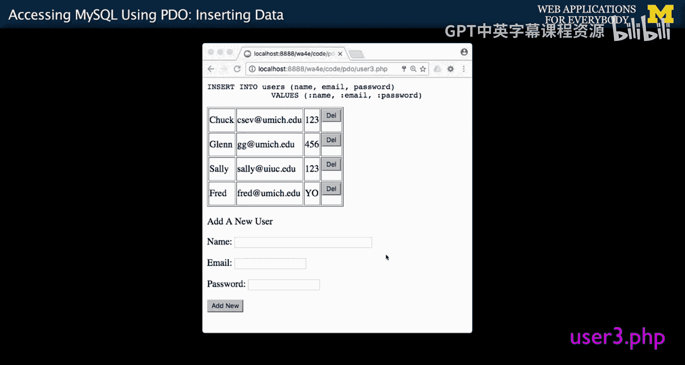

## 构建集成界面：添加与删除

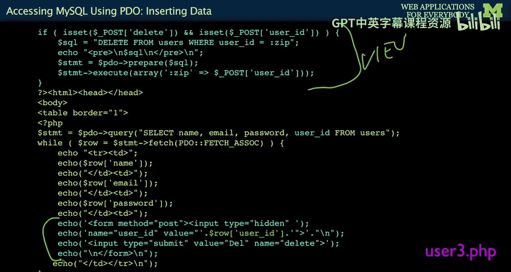

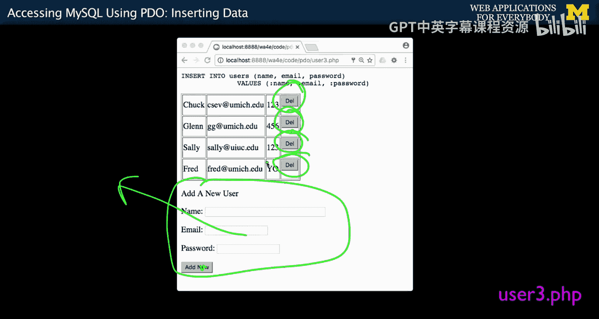

我们可以将添加用户和删除用户的功能集成到同一个页面，形成一个简单的用户管理界面。

关键在于如何在显示用户列表的每一行旁边，动态生成一个独立的删除表单。我们通过在循环输出用户数据的表格中，为每一行创建一个微表单来实现。这个表单包含一个隐藏域（`input type=“hidden”`），其值设置为该行用户的唯一主键（如`user_id`），以及一个提交按钮。

当用户点击某个“Delete”按钮时，表单会提交该行对应的用户ID。服务器端通过检查 `$_POST[‘delete’]` 和 `$_POST[‘user_id’]` 来判断并执行删除操作。

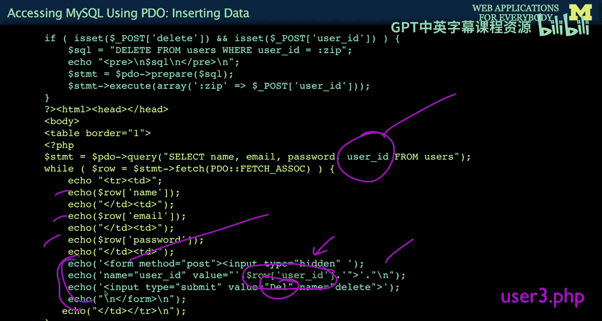

这样，页面上方是“添加用户”的表单，下方是用户列表，每个用户旁都有一个对应的删除按钮，所有功能一气呵成。

## MVC模式回顾

在整个示例中，我们实践了模型-视图-控制器（MVC）模式的简单分离。

*   **模型（Model）**：位于代码顶部，包含数据库连接（`require ‘pdo.php’`）、处理添加用户的逻辑、处理删除用户的逻辑。它负责所有与数据相关的操作。
*   **控制器（Controller）**：逻辑体现在 `if ($_SERVER[‘REQUEST_METHOD’] == ‘POST’)` 等条件判断中，它根据用户的请求（GET或POST，以及具体的POST参数）来决定调用哪个模型函数。
*   **视图（View）**：位于模型代码之后，负责生成HTML，包括显示表单、循环遍历用户数据并生成表格和删除按钮。

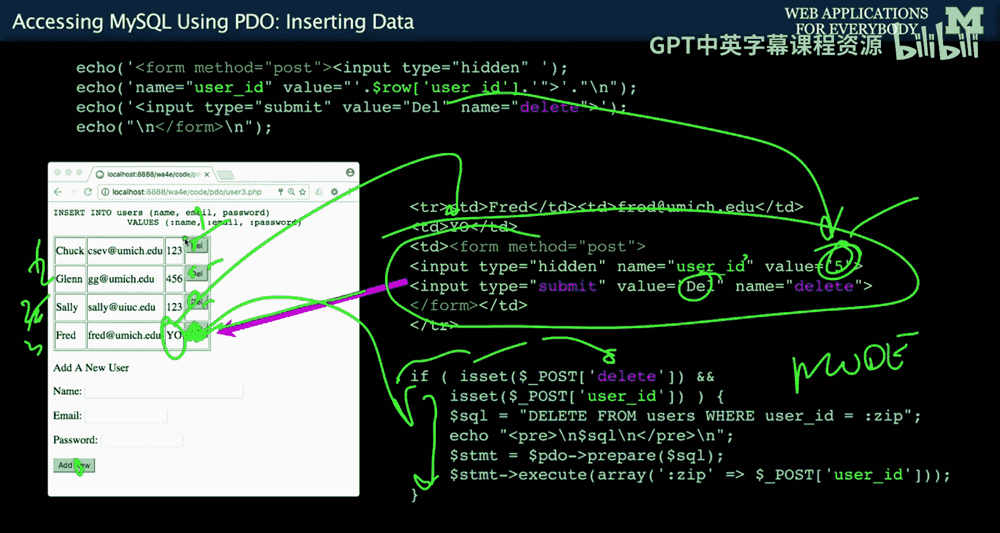

一条清晰的代码注释或空行通常作为模型和视图之间的分界线。

---

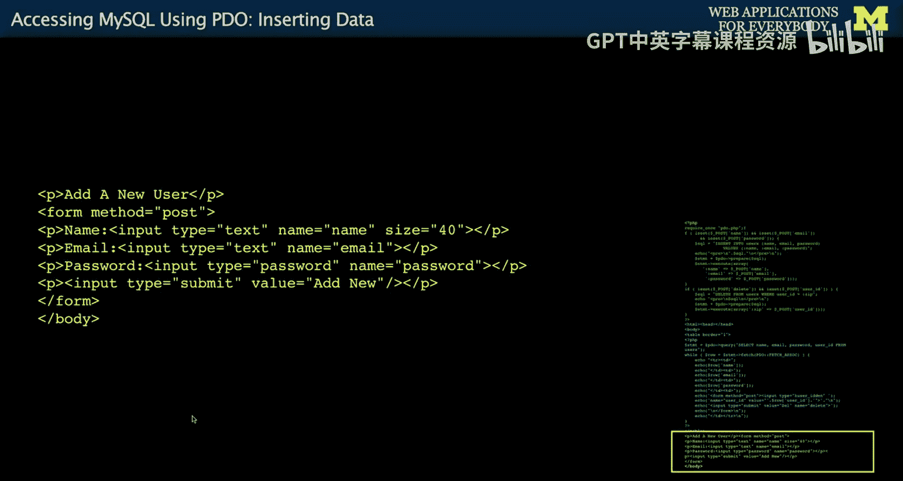

本节课中我们一起学习了如何使用PDO将表单数据安全插入MySQL数据库，掌握了预处理语句和占位符的用法。我们还了解了为何删除操作需通过POST请求进行，并成功构建了一个集用户添加、查询和删除功能于一体的简单Web界面。整个过程体现了MVC设计模式的基本思想，为构建更复杂的Web应用打下了基础。在接下来的课程中，我们将关注这些操作中可能存在的安全漏洞及其修复方法。