# 面向所有人的Web应用程序：19：安全性与SQL注入详解 🔐

在本节课中，我们将详细探讨一个用户登录功能的PHP代码实现，并重点分析其存在的安全漏洞——SQL注入。我们将通过对比两种不同的代码实现方式，来理解为何以及如何使用参数化查询来保护你的Web应用程序免受攻击。

## 概述

我们将从一个简单的登录页面 `login.php` 开始。这个页面接收用户输入的邮箱和密码，然后通过拼接SQL字符串的方式查询数据库。虽然这个功能看起来可以正常工作，但它隐藏着一个严重的安全风险。接下来，我们会演示攻击者如何利用这个漏洞，在不掌握正确密码的情况下登录系统。最后，我们将学习如何使用PDO（PHP Data Objects）和参数化查询来修复这个漏洞，从而构建一个安全的登录系统。


## 数据模型与登录流程

首先，我们来看一下基础的登录逻辑。假设我们有一个 `people` 数据表，其中存储了用户的邮箱和密码。为了简化示例，我们暂时使用明文密码（在实际应用中，密码必须经过哈希处理）。

当用户在表单中输入邮箱（例如 `c7@umich.edu`）和密码（例如 `123`）并提交时，系统会执行以下操作：
1.  从 `$_POST` 超全局数组中获取邮箱和密码。
2.  将这些值直接拼接到一个SQL查询字符串中。
3.  执行该查询，检查数据库中是否存在匹配的记录。
4.  根据查询结果返回“登录成功”或“登录失败”的信息。

以下是该流程的初始代码片段：

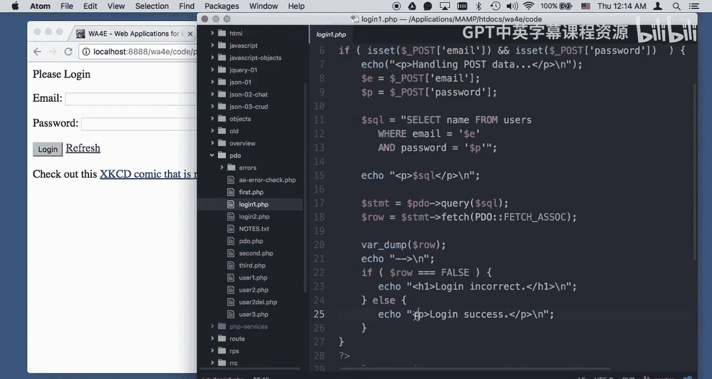

```php
$email = $_POST['email'];
$password = $_POST['password'];
$sql = "SELECT name FROM users WHERE email='$email' AND password='$password'";
// 执行查询并检查结果...
```

当输入正确的凭据时，SQL查询会返回一行数据，登录成功。如果凭据错误，则查询返回空结果，登录失败。

## 初代登录代码的漏洞

上一节我们介绍了基本的登录流程，本节中我们来看看这个实现方式存在的根本问题。问题在于代码使用了字符串拼接来构建SQL语句。

观察以下这行代码：
```php
$sql = "SELECT name FROM users WHERE email='$email' AND password='$password'";
```
这里，用户输入的 `$email` 和 `$password` 被直接嵌入到了SQL命令中。如果用户输入的是普通数据，例如 `c7@umich.edu` 和 `123`，那么生成的SQL语句是安全的：
```sql
SELECT name FROM users WHERE email='c7@umich.edu' AND password='123'
```
然而，攻击者可以输入精心构造的数据来改变SQL语句的本意。

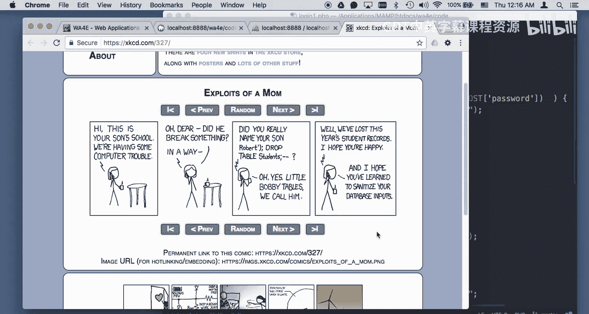

## 什么是SQL注入？

SQL注入是一种攻击技术，攻击者通过在应用程序的输入字段中插入恶意的SQL代码，来操纵后端数据库查询。这可能导致数据泄露、数据篡改，甚至完全控制数据库服务器。

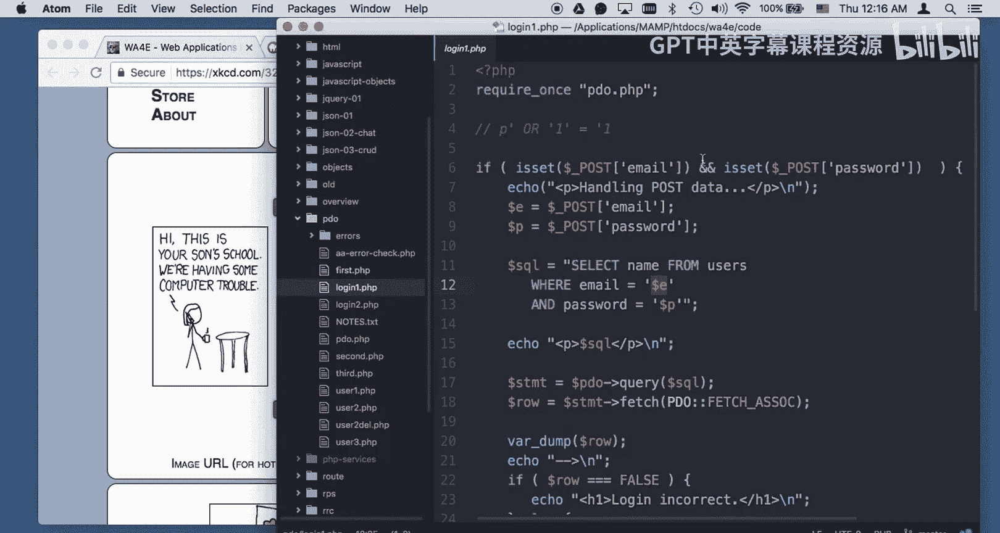

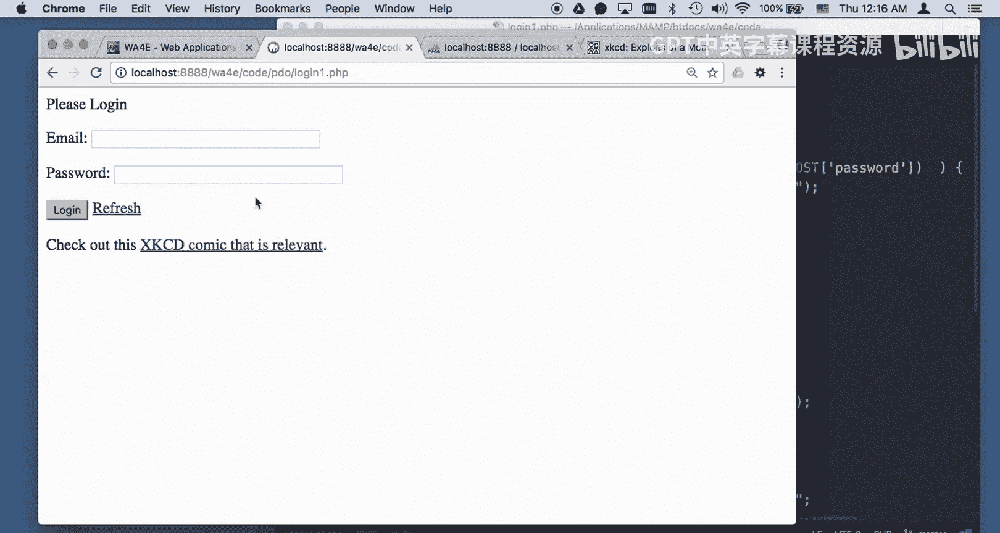

一个经典的例子是“小鲍比表”（Little Bobby Tables）漫画所描述的场景：如果学校系统未对输入进行净化处理，一个名为 `Robert’); DROP TABLE students;--` 的学生注册信息可能会执行删除整个学生表的命令。

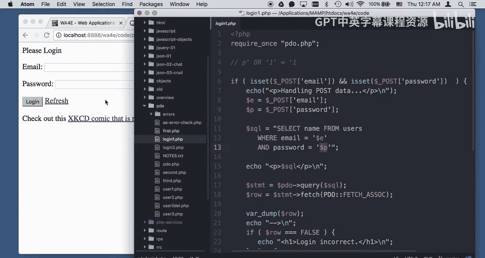

在我们的登录例子中，攻击者无需知道密码即可登录。

以下是攻击者可能进行的操作：
1.  在密码字段中，不输入真实密码，而是输入：`‘ OR ‘1’=’1`
2.  提交后，PHP代码会将其拼接到SQL语句中。
3.  最终执行的SQL语句将变为：
    ```sql
    SELECT name FROM users WHERE email='c7@umich.edu' AND password='' OR '1'='1'
    ```
    由于 `‘1’=’1’` 这个条件永远为真，这个查询将返回用户表中的数据（通常至少是第一行），从而使攻击者绕过密码验证，成功登录。

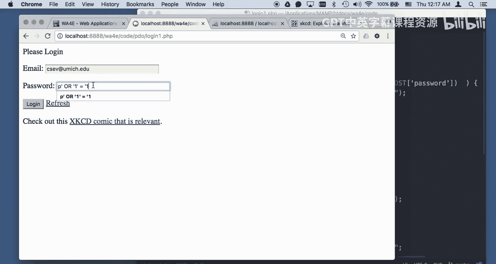

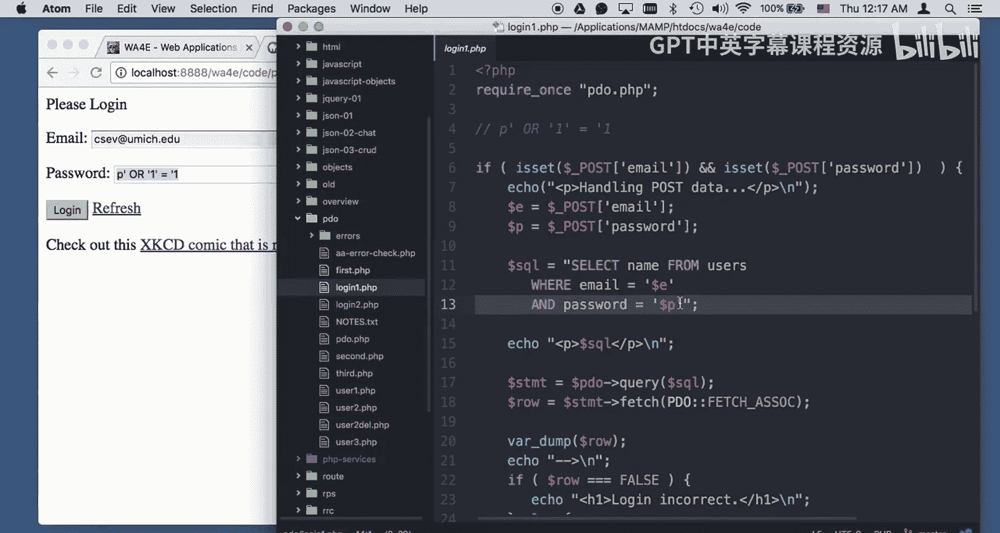

## 演示SQL注入攻击

让我们具体演示一下这个攻击过程。假设攻击者在邮箱栏输入 `c7@umich.edu`，在密码栏输入恶意字符串 `‘ OR ‘1’=’1`。

当表单提交后，我们的PHP代码会生成并执行以下SQL语句：
```sql
SELECT name FROM users WHERE email='c7@umich.edu' AND password='' OR '1'='1'
```
数据库会这样理解这个查询：“寻找邮箱是 `c7@umich.edu` 并且密码是空字符串的记录，**或者** ‘1’=‘1’ 成立的记录”。因为‘1’=‘1’恒成立，所以整个 `WHERE` 条件永远为真。这通常会导致查询返回结果集中的第一行用户记录，使得攻击者成功登录。

## 如何防御SQL注入：使用PDO与参数化查询

我们已经看到了SQL注入的巨大危害，本节将介绍最有效、最根本的防御方法：使用参数化查询（也称为预处理语句）。在PHP中，这通常通过PDO扩展来实现。

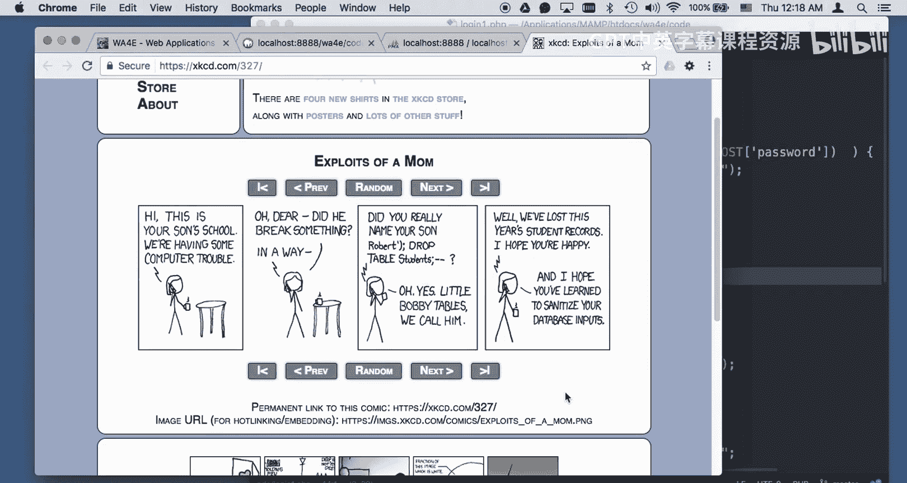

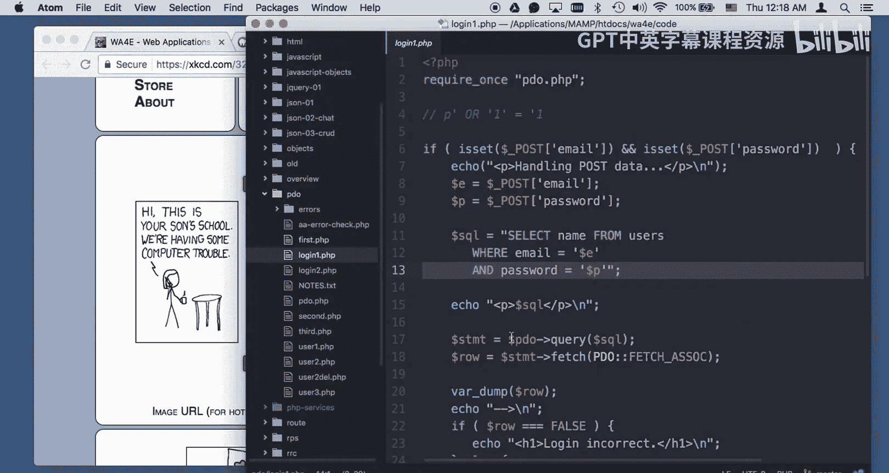

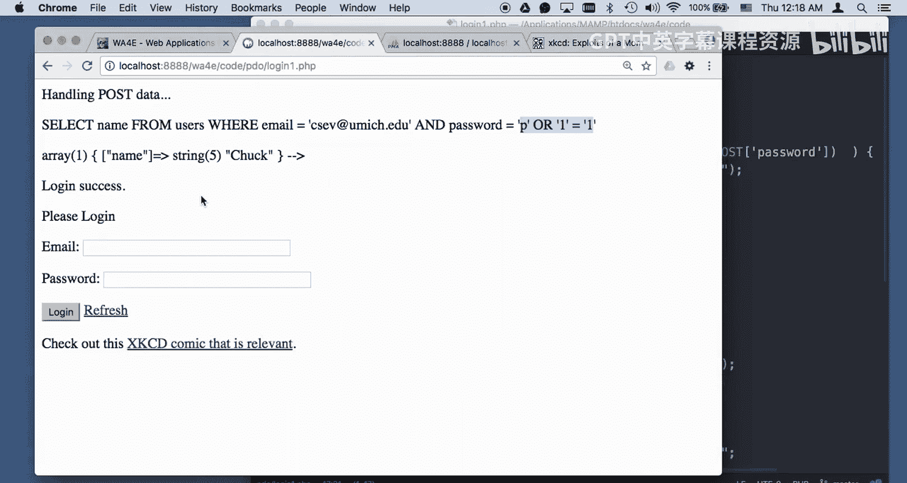

参数化查询的核心思想是将SQL代码与数据分离。我们不再拼接字符串，而是先定义一个包含占位符（如 `:email`）的SQL语句模板。然后，将用户输入的数据“绑定”到这些占位符上。PDO驱动程序会确保数据在插入到SQL命令之前被正确地转义和处理，从而彻底杜绝了数据被解释为代码的可能性。

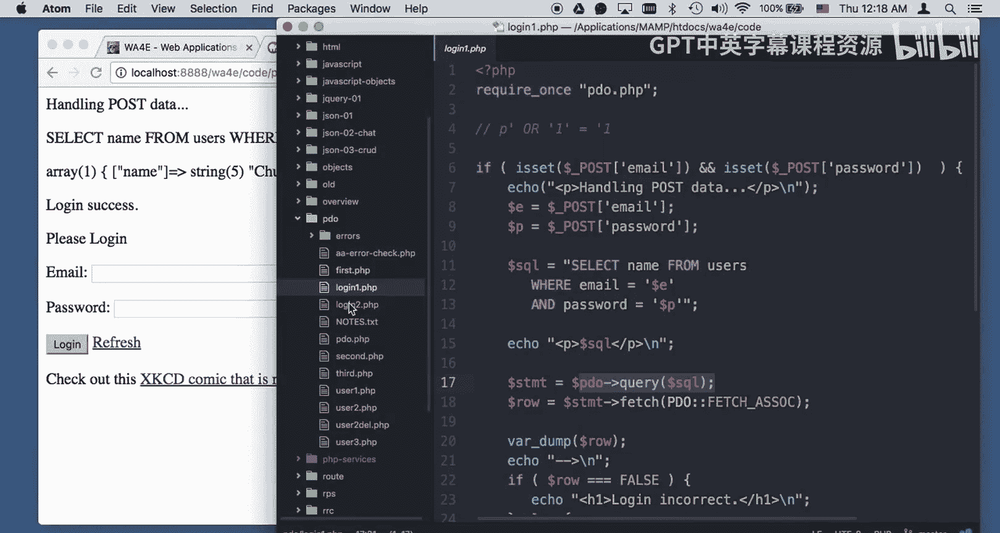

以下是使用PDO重写后的安全登录代码：

```php
// 1. 准备SQL语句，使用命名占位符
$stmt = $pdo->prepare(‘SELECT name FROM users WHERE email = :em AND password = :pw’);


// 2. 将用户输入的数据绑定到占位符
$stmt->execute(array( ‘:em’ => $email, ‘:pw’ => $password));

// 3. 获取结果
$row = $stmt->fetch(PDO::FETCH_ASSOC);
```
在这个版本中，即使用户在密码字段输入了 `‘ OR ‘1’=’1`，PDO也会将其视为一个完整的字符串值，而不会破坏SQL语句的结构。最终执行的查询等价于：
```sql
SELECT name FROM users WHERE email=‘c7@umich.edu’ AND password=‘\‘ OR \‘1\‘=\‘1’
```
数据库会去寻找密码字段**完全等于**这个奇怪字符串的用户，显然找不到，因此登录会失败。攻击手段就此失效。

**关键原则**：永远不要使用字符串拼接的方式来构建包含用户输入数据的SQL语句。对于任何涉及用户输入的数据库操作，都应使用所在编程语言提供的参数化查询接口。

## 总结

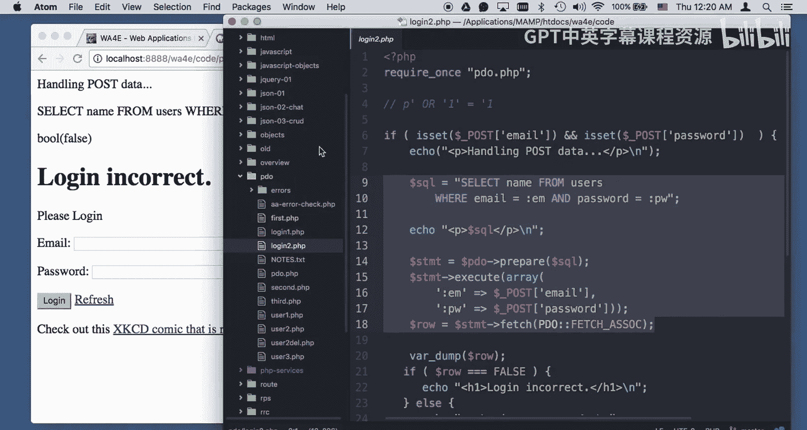

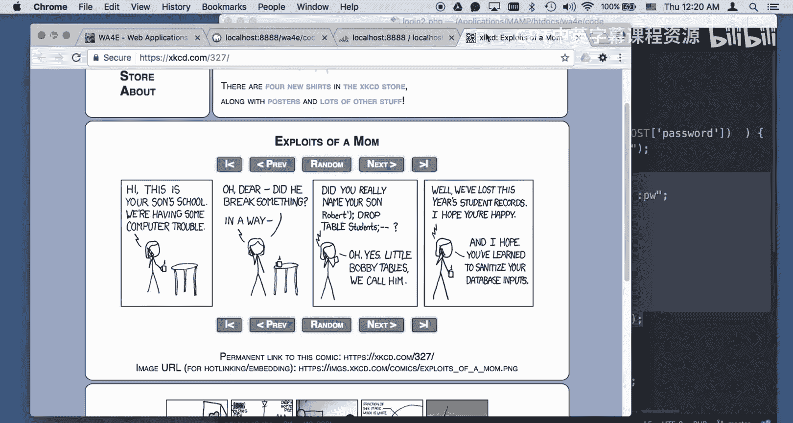


本节课中我们一起学习了Web应用安全中的一个核心议题——SQL注入。我们从一个存在漏洞的登录代码入手，分析了攻击者如何利用字符串拼接的缺陷来绕过身份验证。随后，我们探讨了解决此问题的黄金标准：使用PDO的参数化查询。通过将查询结构与数据分离，我们可以确保用户输入永远被当作数据处理，从而构建出坚固、安全的数据库交互层。请牢记，使用参数化查询是防止SQL注入的最有效和必要的手段。