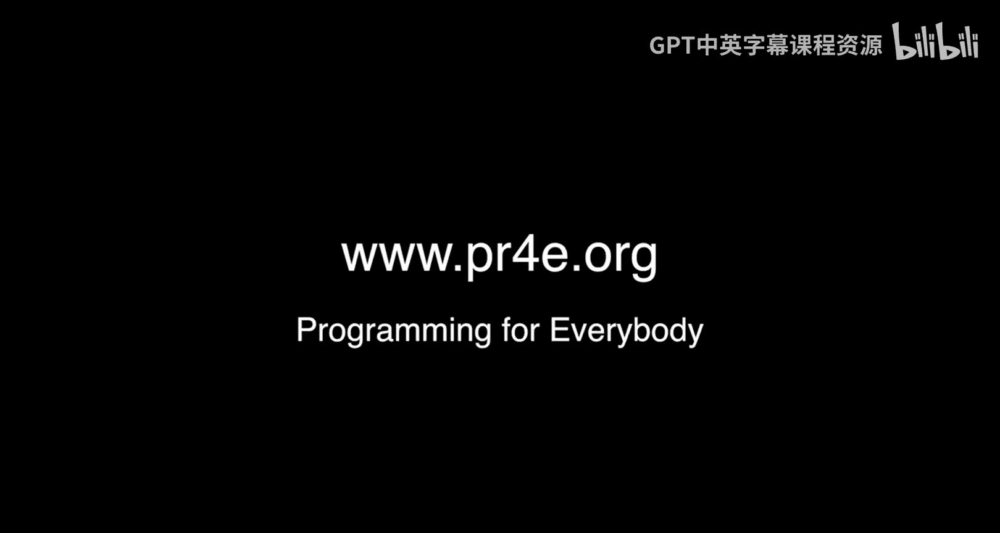
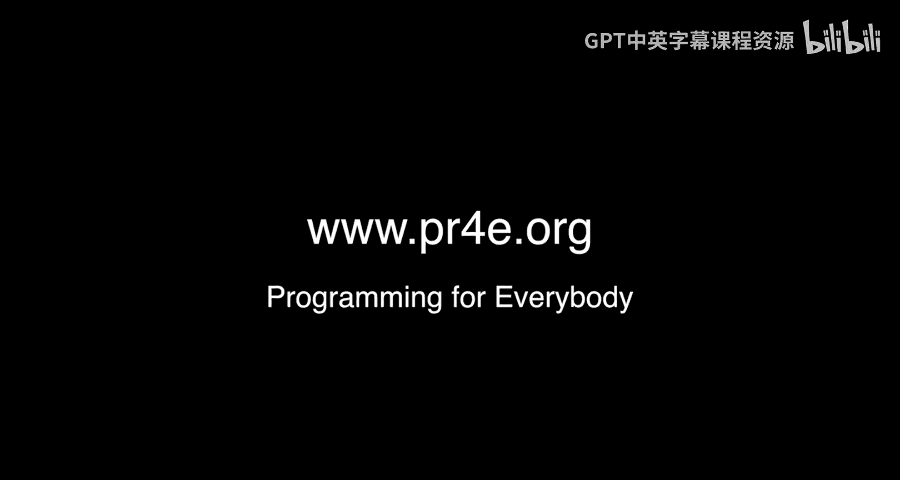

# 密歇根大学《面向所有人的Web应用程序（PHP、SQL、APP、JavaScript和JQuey｜Web Applications for Everybody》 p90 20_附加办公时间：犹他州奥勒姆.zh_en -BV1Lr421A75d_p90-

Hello everybody here we are in Orham Utah yet another office hours and I just want to let me have you meet the folks that showed up so I'll just point at you and you can say your name and say hi to the folks Hi everybody my name is John and I've taken a bunch of Dr。

 Chuck's classes and they're awesome Anything else to say。I use Python almost every day now， okay。

 do you want to talk？You lu me here with coffee？Hey， I'm Dan， I'm from Ohio， but here I am in Utah。

 Go Buck。Go bugs， I build ice castles and Python might actually help me do that build ice castles。

So that's not just a t shirt that you got，' like that's a work shirt。

Like what's an ice ca there are large tourist attractions made entirely out of ice， there's tunnels。

 caves， towers， waterfalls， slides， lights buried in the ice。

 they blink on and off they change color and time of music it's really wonderful and if you're near one you should go to it。

So I'm guessing there's not much call for ice gases right now。Not the second now， so you're chilling。

Yeah villain I'm actually doing research on our new icicle factory Oh right okay there's always research on icicle factories that keeps you busy in the summer Hi everyone I'm Yosh and I did the python for everybody course to Fu Coast and I found it really great and Dr。

 Chuck really awesome thank you thank you a compliment I'm Keith Dr Chuck welcome to Provot or Orum Utah it's good to see you here can't believe that you' you actually made it to our town but it's good to see you and go Cougars Yeah go Cougars。

I don't know where the exact next office hours is， but I think it's going to be Seoul Korea in about four weeks。

 so see you in Seoul。

