# 面向所有人的Web应用程序：21：Cookie技术 🍪


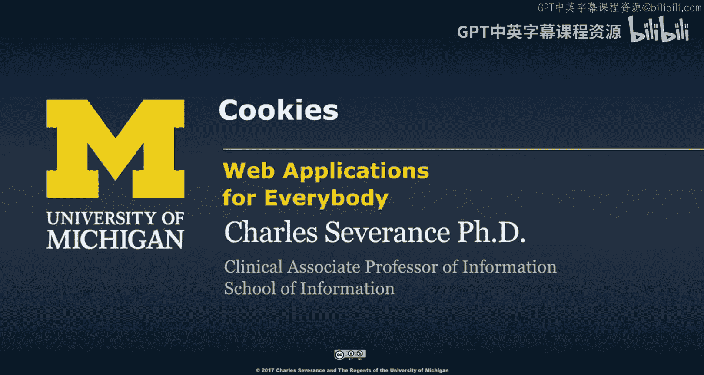

在本节课中，我们将要学习Cookie技术。Cookie是HTTP协议的一部分，用于在浏览器中存储少量数据，以便服务器能够在多次请求之间识别特定的浏览器。这对于实现用户登录、购物车等功能至关重要。

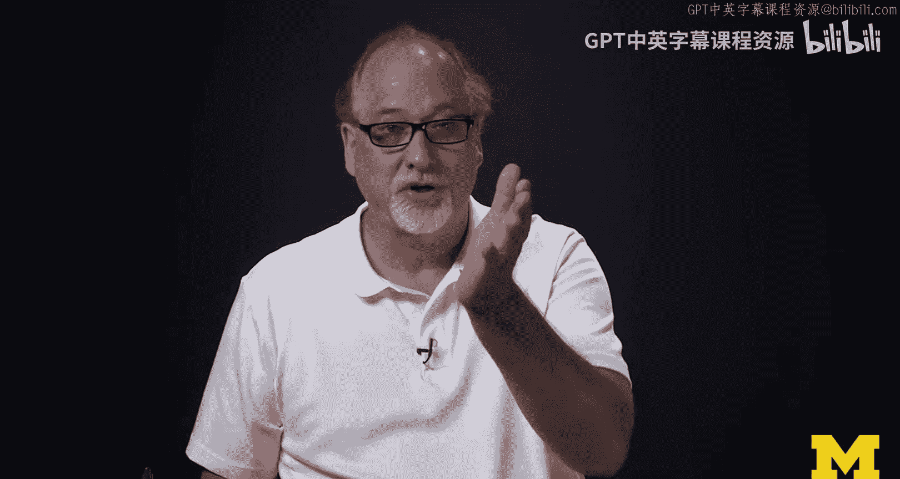

## 概述

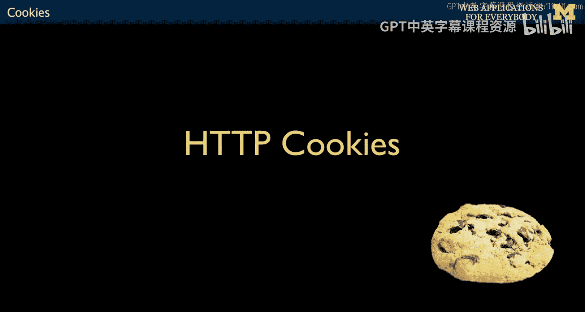

Web服务器通常需要同时与成千上万个不同的浏览器通信。为了区分这些浏览器并记住每个用户的状态（例如登录信息、购物车内容），服务器需要一种机制来“标记”每个浏览器。Cookie技术正是为了解决这个问题而设计的。

## Cookie是什么？

Cookie是存储在浏览器中的一小段数据，采用键值对的形式。它由Web服务器创建并发送给浏览器，浏览器会将其保存，并在后续向同一服务器发出的每个请求中自动附带这个Cookie。

与`GET`或`POST`数据不同，Cookie数据在单个请求结束后不会消失，而是会持续存在于后续的请求中，直到它过期或被覆盖。

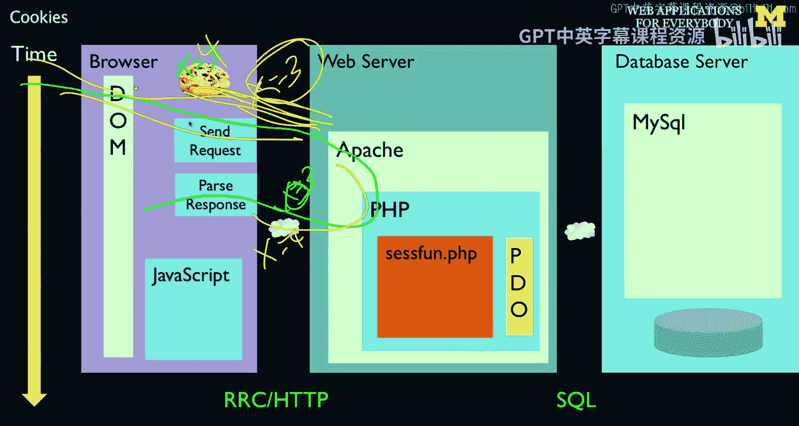

**核心概念公式**：
```
Cookie = 服务器设置的键值对数据，存储在浏览器中，随每个请求发送回服务器。
```

## Cookie的工作原理

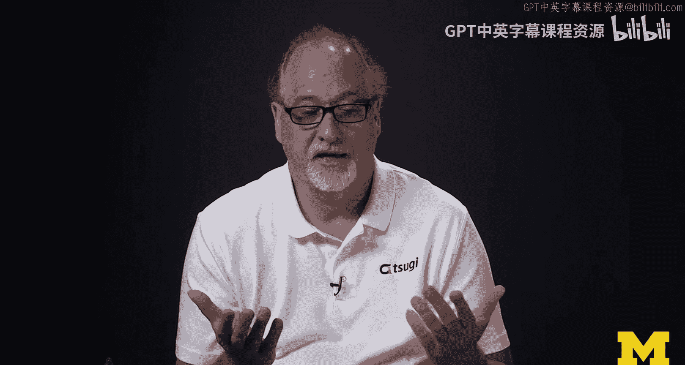

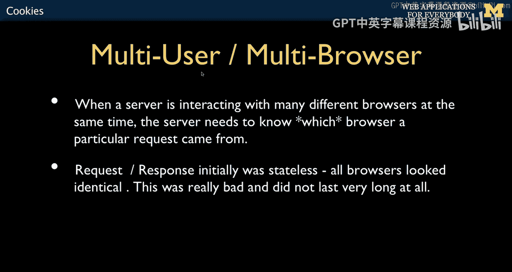

上一节我们介绍了Cookie的基本概念，本节中我们来看看它的具体工作流程。

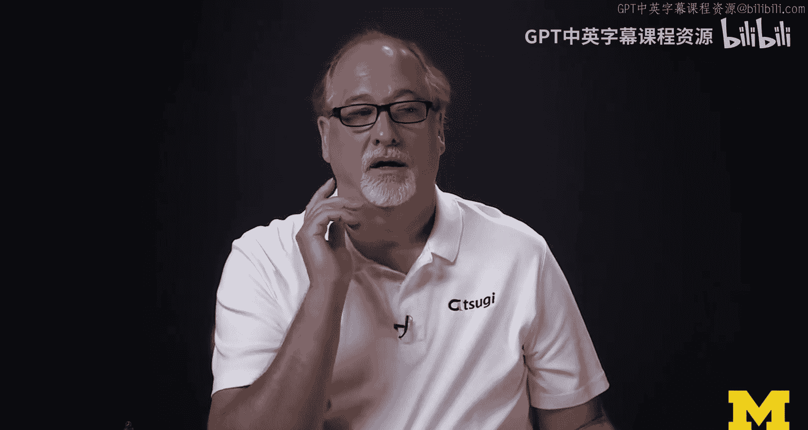

1.  **初始请求**：用户首次访问网站时，浏览器向服务器发送请求。此时请求中不包含该网站的Cookie。
2.  **服务器响应并设置Cookie**：服务器在处理请求后，会在响应头中添加一个`Set-Cookie`指令，例如 `Set-Cookie: user_id=abc123`。
3.  **浏览器存储Cookie**：浏览器收到响应后，会将这个Cookie（`user_id=abc123`）保存起来。
4.  **后续请求**：此后，每当浏览器向**同一服务器**发送请求时，都会自动在请求头中附上这个Cookie：`Cookie: user_id=abc123`。
5.  **服务器读取Cookie**：服务器从请求头中读取Cookie，从而知道这个请求来自之前标记过的浏览器。

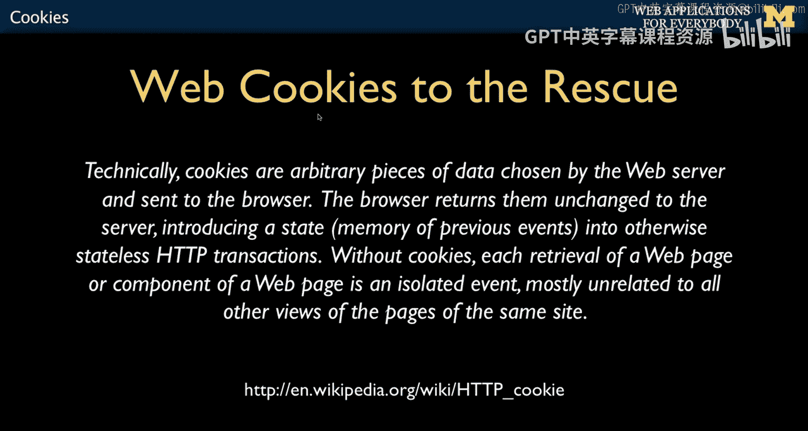

这个过程使得无状态的HTTP协议能够模拟出“有状态”的会话。

## Cookie的特性

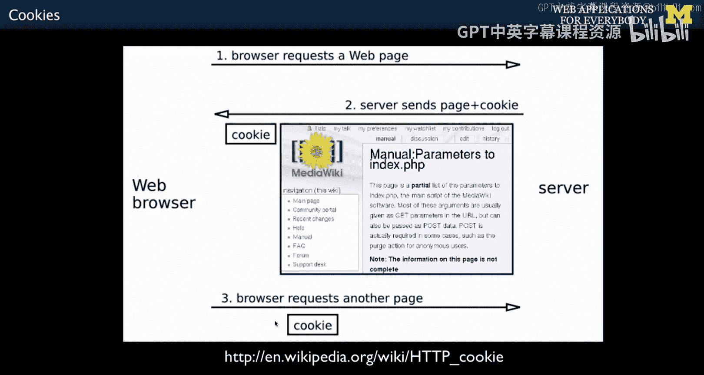

以下是Cookie的一些重要特性：

*   **域名绑定**：Cookie与特定的域名（服务器）绑定。浏览器只会将Cookie发送给创建它的服务器，这保证了不同网站之间的Cookie数据是隔离的。
*   **有效期**：Cookie可以设置过期时间。有些是“会话Cookie”，浏览器关闭即失效；有些是“持久Cookie”，可以存在几天甚至几年。
*   **存储限制**：每个Cookie有大小限制（通常为4KB），并且每个域名下可存储的Cookie数量也有限制。

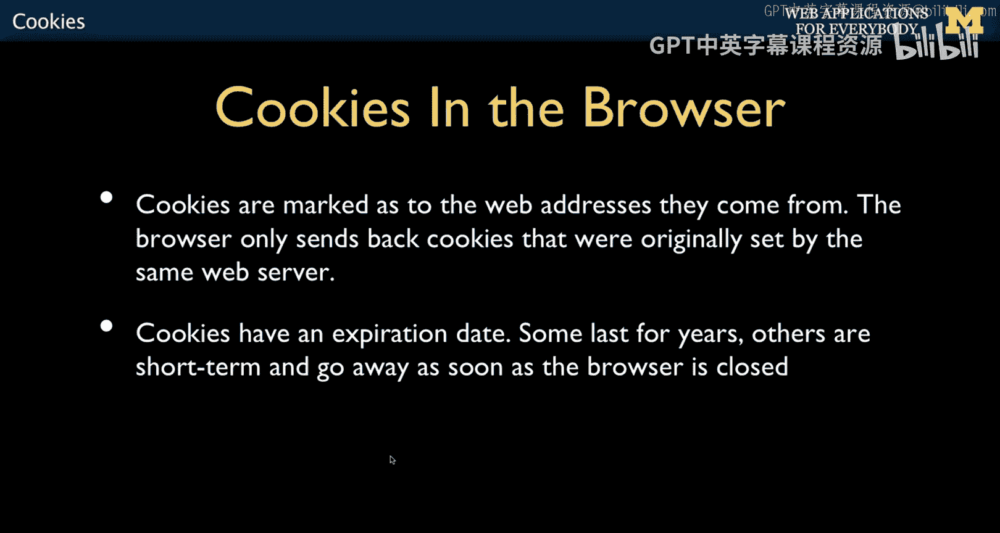

## 在PHP中使用Cookie

PHP为操作Cookie提供了出色的支持，就像处理`$_GET`和`$_POST`一样简单。

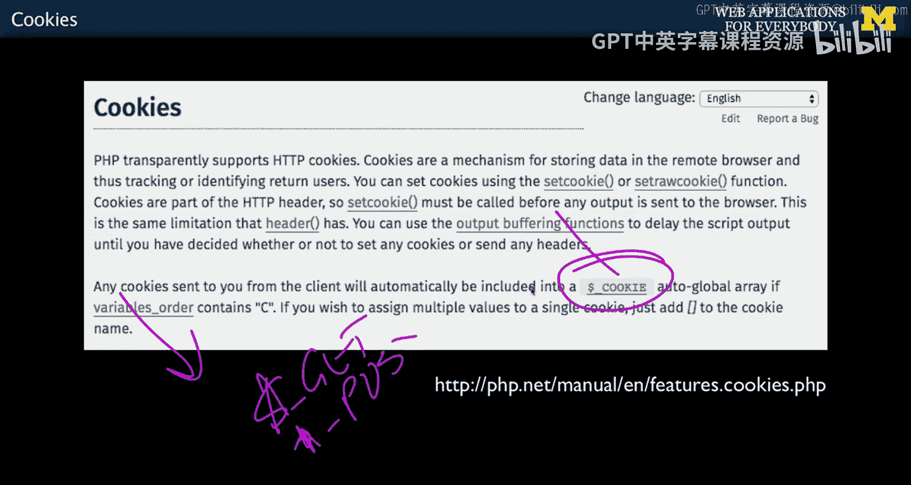

Cookie数据会自动被PHP解析，并存储在一个名为`$_COOKIE`的超全局数组中。这是一个键值对数组，你可以直接访问其中的值。

**核心概念代码**：
```php
// 读取名为 ‘username‘ 的Cookie值
if (isset($_COOKIE[‘username‘])) {
    $name = $_COOKIE[‘username‘];
    echo “欢迎回来, “ . $name;
}

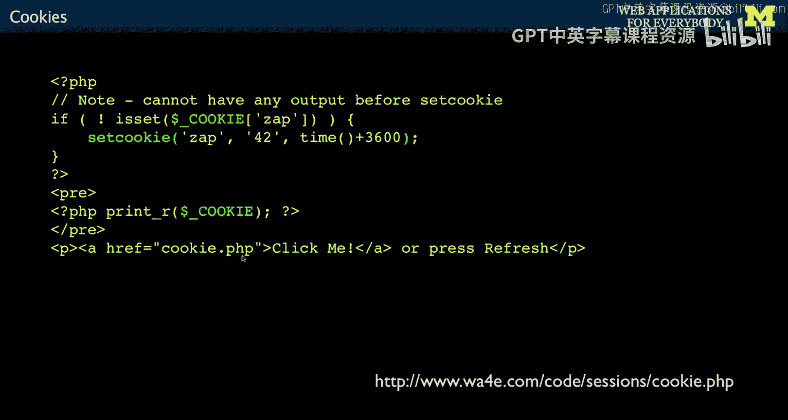

// 设置一个Cookie，有效期为1小时
$value = ‘new_user_data‘;
$expire = time() + 3600; // 当前时间戳 + 3600秒
setcookie(‘my_cookie‘, $value, $expire);
```

让我们通过一个简单的例子来理解这个过程：

1.  用户第一次访问页面时，`$_COOKIE[‘zap‘]`不存在。
2.  服务器代码检测到这一点，于是使用`setcookie()`函数设置一个名为`zap`、值为`42`、有效期1小时的Cookie。
3.  浏览器收到响应，保存这个Cookie。
4.  用户刷新页面或进行其他操作，浏览器在请求中自动带上`zap=42`这个Cookie。
5.  服务器再次运行时，就能在`$_COOKIE[‘zap‘]`中读到值`42`。

与`$_GET`和`$_POST`只存在于单次请求不同，`$_COOKIE`中的数据会随着浏览器的每次请求而持续存在。

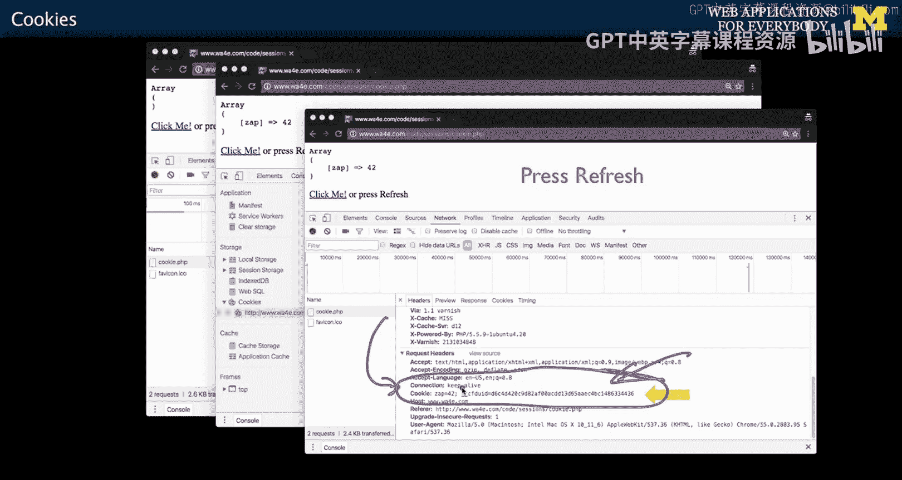

## 总结

本节课中我们一起学习了Cookie技术。我们了解到Cookie是服务器留在用户浏览器中的“标记”，它是一个键值对数据，由服务器设置、浏览器存储并随每次请求发回。这使得服务器能够在无状态的HTTP协议上识别用户身份和维持会话状态。我们学习了Cookie的工作原理、特性，以及如何在PHP中通过`$_COOKIE`数组读取和通过`setcookie()`函数设置Cookie。

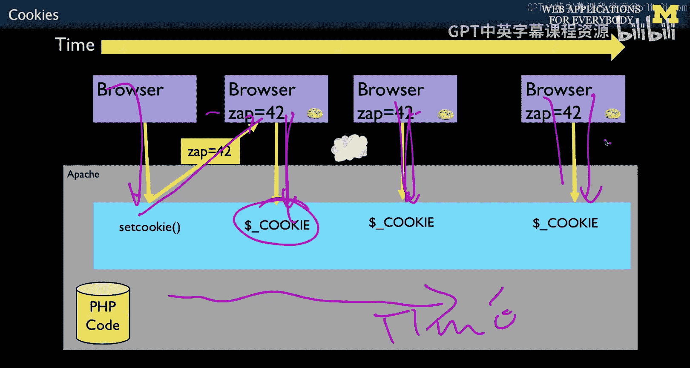

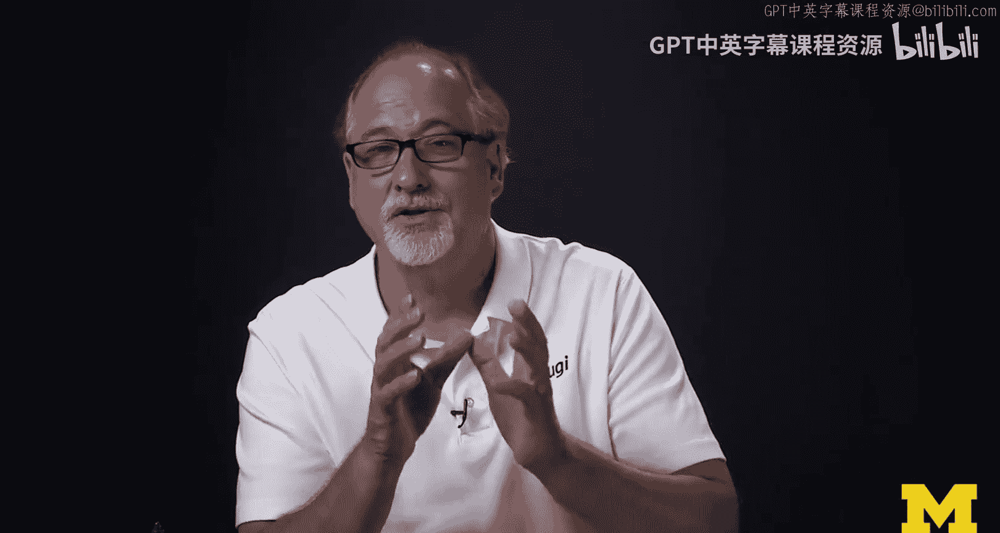

接下来，我们将探讨Session（会话）技术。Session是建立在Cookie基础上的、在服务器端存储用户数据的更强大机制。