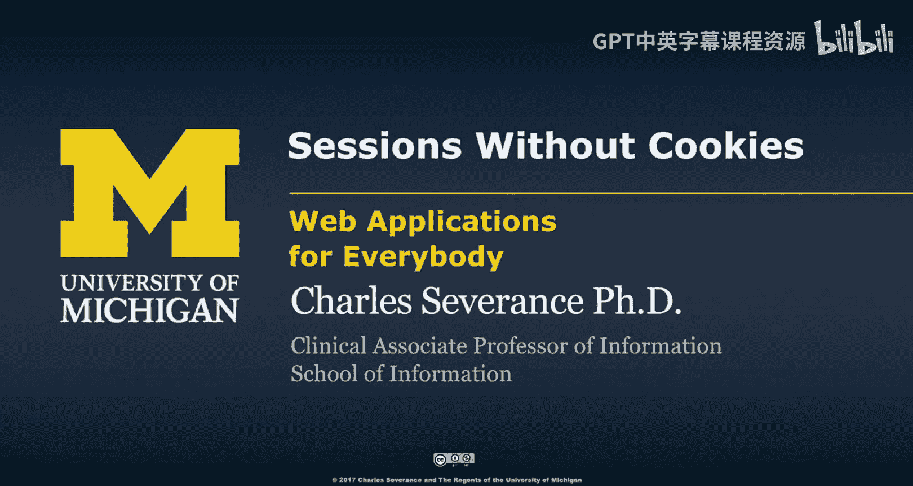
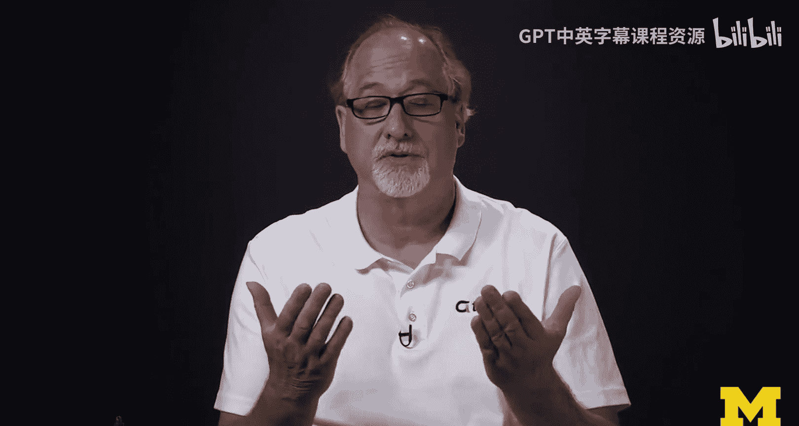
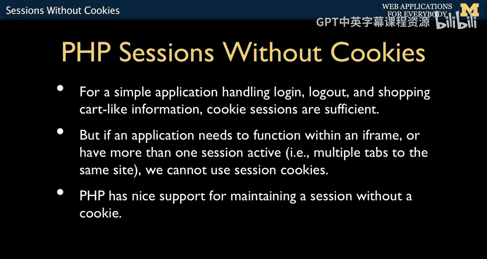
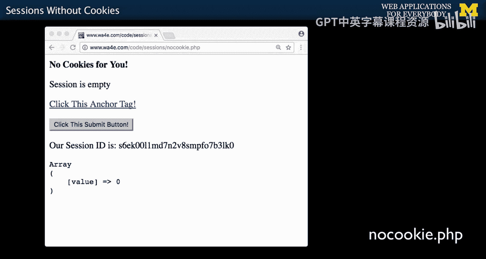
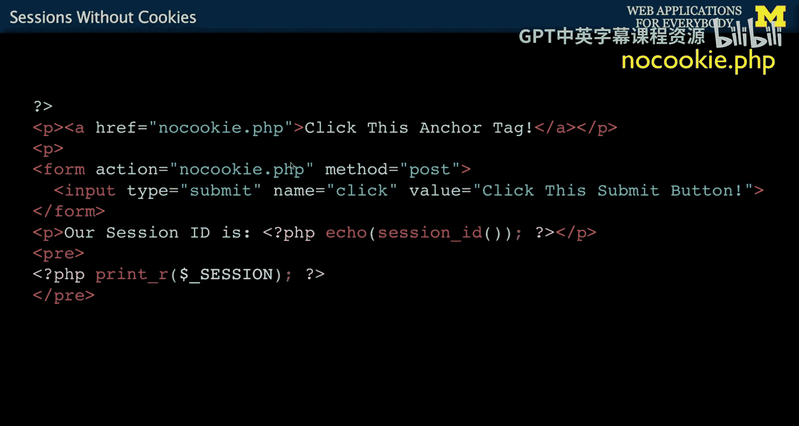
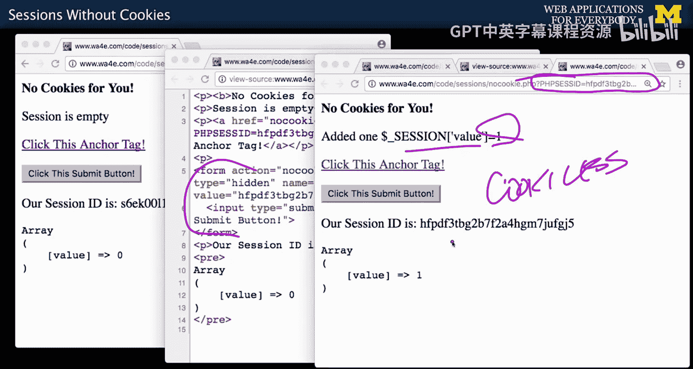
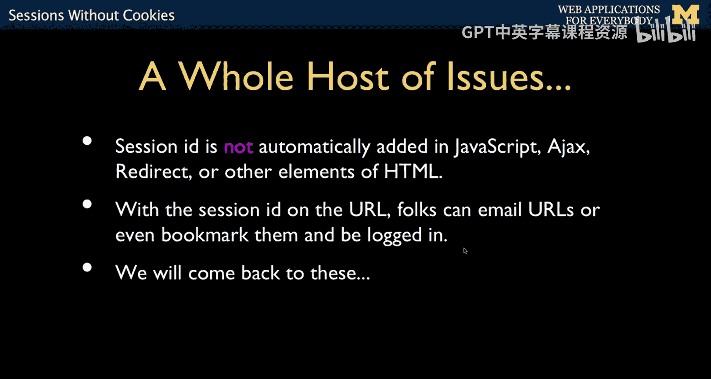
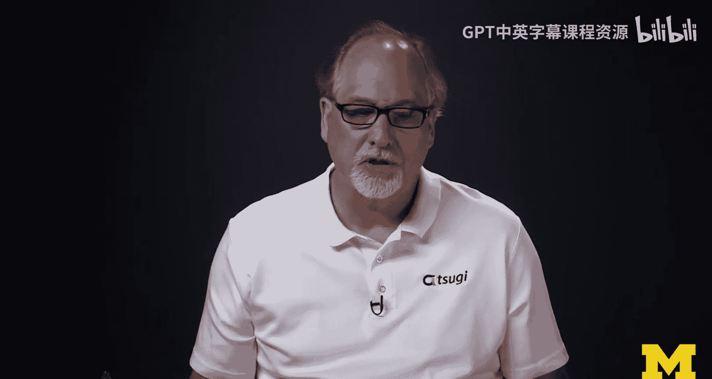
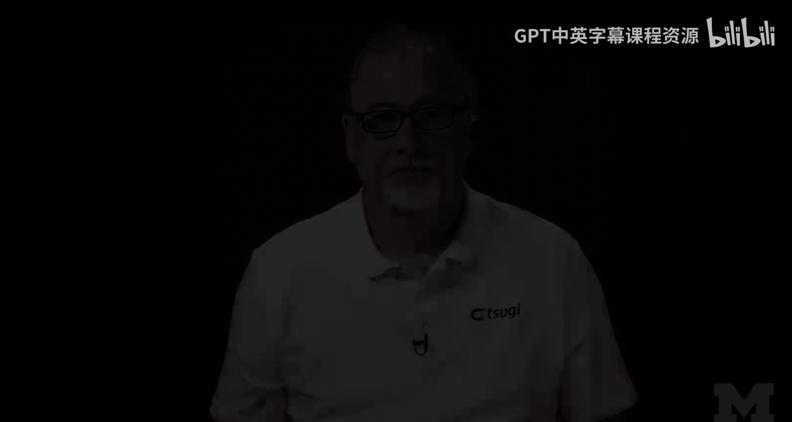

# 面向所有人的Web应用程序：23：无Cookie会话实现 🍪➡️🔗




在本节课中，我们将要学习PHP中一个特殊但强大的功能：无Cookie会话。我们将探讨它的工作原理、适用场景以及如何通过代码实现它。

上一节我们介绍了PHP如何使用Cookie和Session来管理用户状态。本节中我们来看看一种不依赖Cookie的会话管理方式。

## 概述



大多数（约99%）的PHP应用都使用基于Cookie的会话，这通常工作得很好。然而，在某些特定场景下，例如需要在同一个浏览器的不同标签页中为同一网站维持两个独立的会话（比如一个标签页是教师身份，另一个是学生身份），基于Cookie的会话就无法满足需求，因为Cookie是跨标签页共享的。这时，无Cookie会话就派上了用场。

## 实现无Cookie会话

以下是实现无Cookie会话的核心代码片段。其基本思路是，将会话标识符（Session ID）通过URL参数（对于GET请求）或表单隐藏字段（对于POST请求）在页面间传递，而不是存储在Cookie中。

```php
// 关键配置：禁用Cookie用于会话，并启用URL重写
ini_set('session.use_cookies', '0');
ini_set('session.use_only_cookies', '0');
ini_set('session.use_trans_sid', '1');

// 像往常一样启动会话
session_start();





// 会话逻辑：一个简单的计数器
if (empty($_SESSION['value'])) {
    $_SESSION['value'] = 0;
} elseif ($_SESSION['value'] < 3) {
    $_SESSION['value']++;
} else {
    session_destroy();
    session_start();
    $_SESSION['value'] = 0;
}
```

这段代码首先通过`ini_set`配置PHP，告诉它不要使用Cookie来传递会话ID，并自动转换输出（如链接和表单）以嵌入会话ID。然后，它启动会话并管理一个简单的计数器变量。

## 会话ID的传递机制



为了让会话ID能在无Cookie的情况下从一个请求传递到下一个请求，我们需要手动将其嵌入到页面的链接和表单中。PHP的`session.use_trans_sid`设置会帮助我们自动完成这项工作。

以下是页面中可能生成的HTML代码示例：

```html
<!-- 对于超链接（GET请求），会话ID作为URL参数传递 -->
<a href="page.php?PHPSESSID=abc123def456">点击我（GET请求）</a>

<!-- 对于表单（POST请求），会话ID作为隐藏字段传递 -->
<form action="page.php" method="post">
    <input type="hidden" name="PHPSESSID" value="abc123def456">
    <input type="submit" value="提交（POST请求）">
</form>
```

通过查看页面源代码，你可以观察到这两种“技巧”：
*   在超链接（`<a>`标签）的`href`属性中，PHP自动添加了类似`?PHPSESSID=...`的查询参数。
*   在表单（`<form>`）内部，PHP自动插入了一个名为`PHPSESSID`的隐藏输入字段。

当用户点击链接或提交表单时，这个会话标识符就会被发送到服务器。`session_start()`函数会检查GET或POST数据中是否存在这个标识符，并据此恢复对应的会话。

## 注意事项与权衡

使用无Cookie会话需要意识到以下几点：

*   **安全性考虑**：会话ID会暴露在URL中。用户可能复制、分享或收藏这个URL，导致会话泄露。因此，对于安全性要求高的应用，需要采取额外的保护措施。
*   **可见性**：在GET请求的URL中，会话ID对用户是可见的；而在POST请求中，它隐藏在表单里。这是无法避免的。
*   **适用性**：它主要适用于无法或不愿使用Cookie的特殊场景。对于绝大多数普通应用，标准的基于Cookie的会话管理（使用`$_SESSION`、`session_start()`和`session_destroy()`）是更简单、更安全的选择。





## 总结

本节课中我们一起学习了PHP的无Cookie会话实现。我们了解到：
1.  它通过URL参数或表单隐藏字段传递会话ID，而非依赖浏览器Cookie。
2.  它的核心配置是`ini_set('session.use_cookies', '0')`和`ini_set('session.use_trans_sid', '1')`。
3.  它适用于需要在同一浏览器中为同一网站维持多个独立会话的特殊场景。
4.  使用它需要权衡便利性和安全性，因为会话ID会暴露在URL中。





对于99%的应用场景，继续使用标准、安全的基于Cookie的会话管理即可。接下来，我们将深入探索如何在PHP中利用会话来构建更强大的Web应用功能。