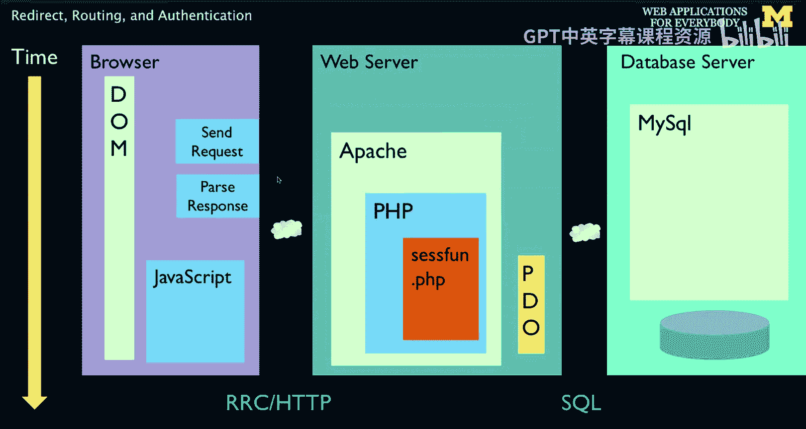
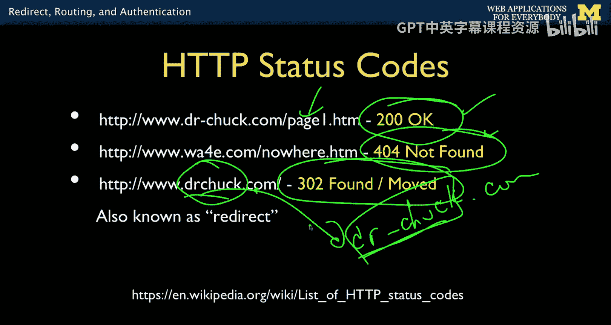
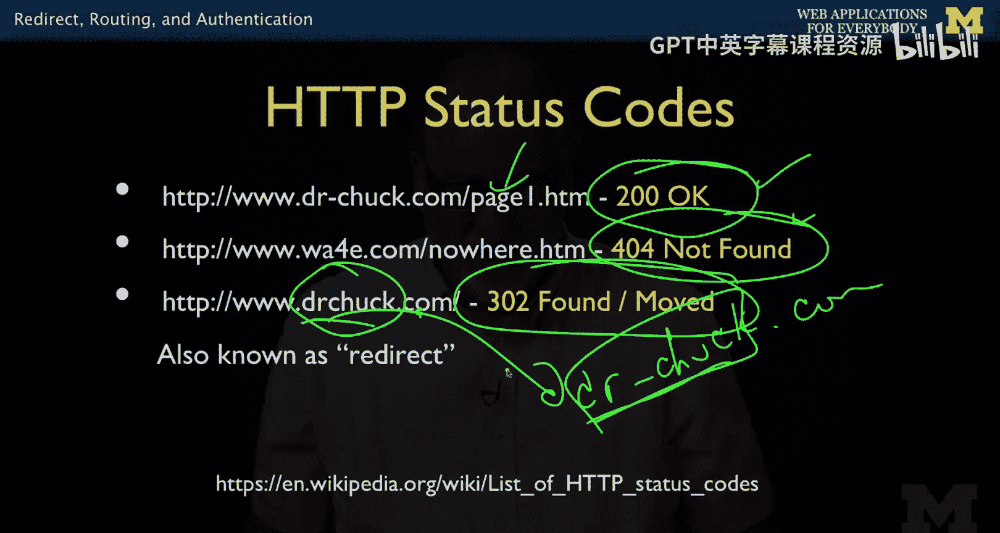
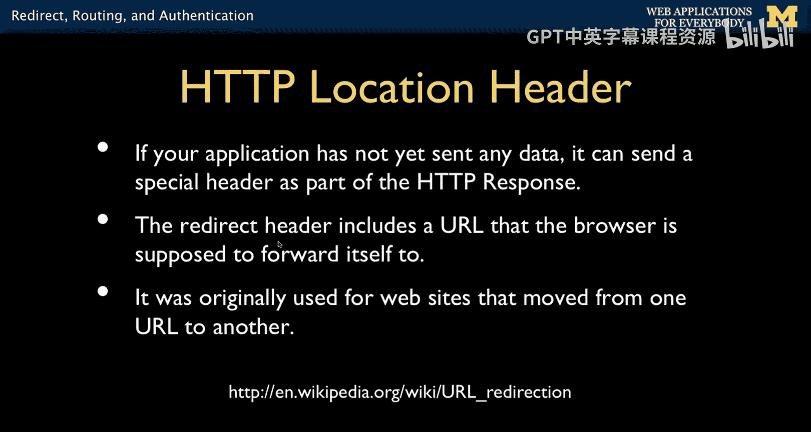
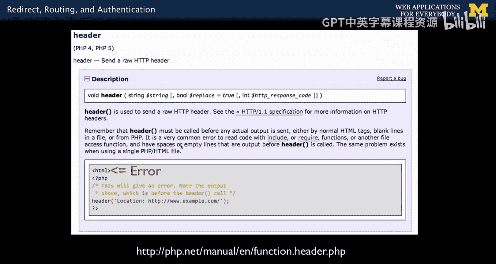
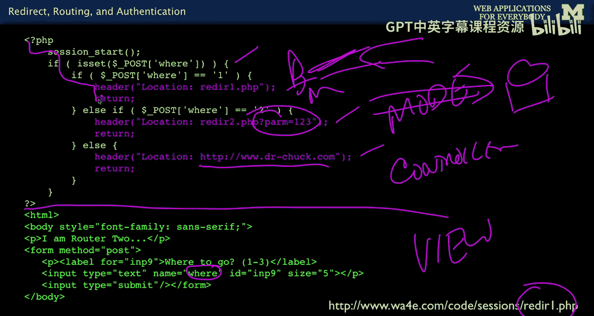
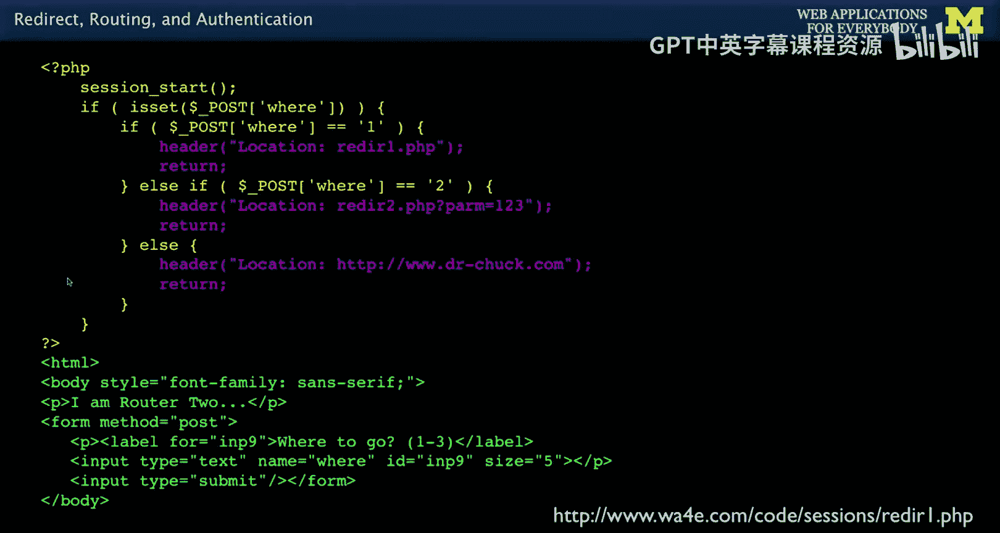
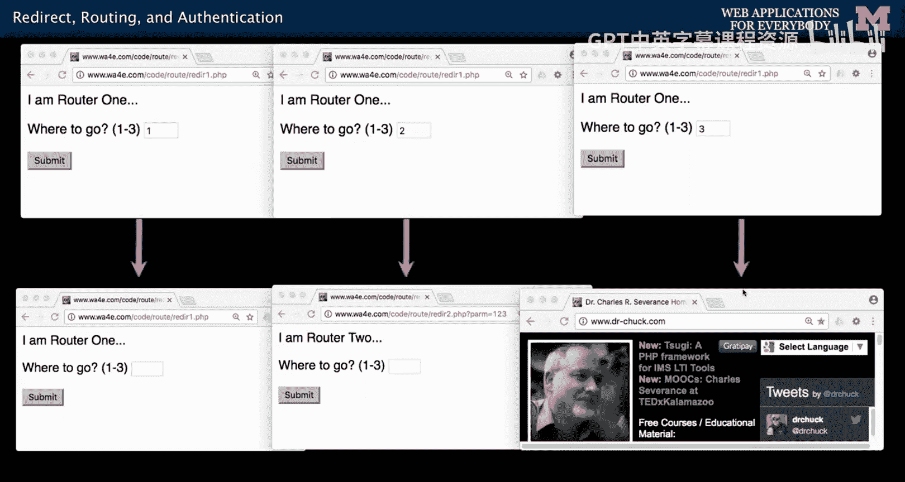
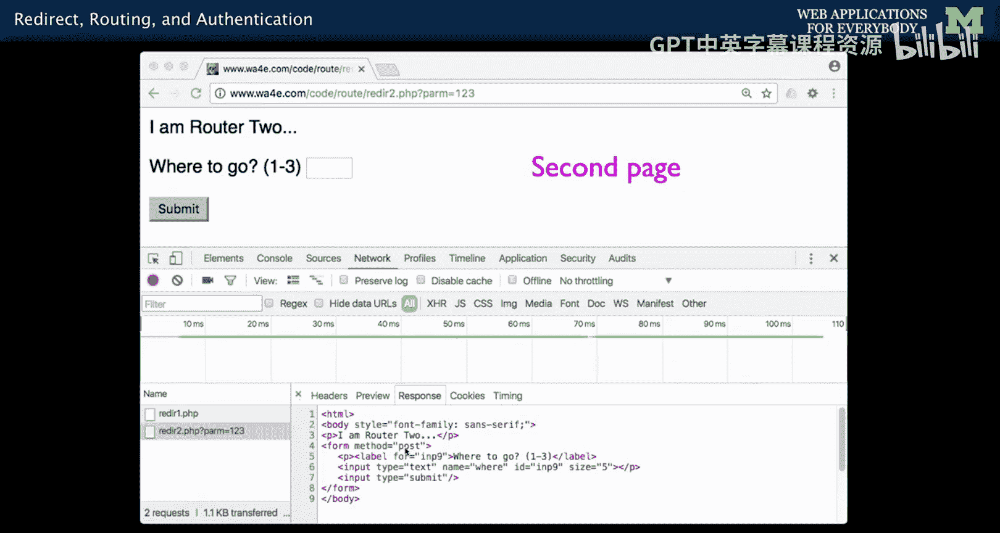

# 密歇根大学《面向所有人的Web应用程序（PHP、SQL、APP、JavaScript和JQuey｜Web Applications for Everybody》 p96 26_重定向路由与身份验证.zh_en -BV1Lr421A75d_p96-

So up to now I've been talking about the model view in the controller and I'm saying we'll soon tell you more about the routing part of the controller。

 well， this is when we're going to do that， we are going to talk about how your application can sort of push the browser around and make it do things that you want in the last lecture we saw cookies as one of the things where you in the server can sort of dictate to the browser。

 you can set these cookies and then they have to send it back。

And so what we're going to talk about today centers a lot around what we call the concept of redirect。

 and so in the simplest form， when you click on a web page，It comes into your PhP server。

 You can send a very special kind of a response called a redirect or a 403。 You send a response bag。

 And what happens is is this response never gets to the dom。 It reads it and goes， oh。

 I'm in the wrong place。 I'm supposed to do another get request。

 And so it immediately calls and does another get request。

 maybe to the same script or different script。 And then it gets the thing。

 And then it makes the document and you see it。 So there ends up being two request response cycle。

 So the first one says， go get another different file。 And then the second one。

 And so that's what we're gonna to call。 Then we call this pattern。

 the redirect a pattern because it's， you know， you do a get and you redirect it and you do another get or you do a post and you redirect it and you do another get。

 And so we will see how all this works。 And this is the way that we are in sort of our controller。

We run some code and we say， know what， I want you to go somewhere else。

 and then you res send a command basically to the browser to go somewhere else or to do something else。

It gives you a lot of power and turns out it's necessary in certain situations。

So one thing that we have been sort of glossing over and we got all these screenshots and all little demos。

 this concept of an HTTP status code。So most everything that you've seen is a 200 okay，200 says。

 give me this page。 And then， you know， here's your page，200 okay。 That means I found it。

 Another one that everyone's kind of familiar with who's used the Web is this kind of concept that 404 not found。

 This is even a meme or a joke， right，0，40，4。 What does that mean em else's not found。

 It happens to be a numeric status code for the hypertext transport protocol H T TP。

 that is the code that the server sends back if your go to a page that wasn't found。 Well。

 those are the two that we kinda know the most about。

 The one we're going to talk about in this lecture is this 302。 There's also a 301。

 which means I know exactly what you're looking for。 And it's somewhere else。 And so I have one。

 and you can see it at Doctor Chuck dot com。 So my normal host is Doctor Dashchuck dot com。

Cause I got I couldn't buy this， took me a while to buy this one because someone got it before me。

 And so I had to do the one with a dash。 But then 8，10 years later， I finally got to buy this one。

But everyone knew the one with a dash。 And so I said， you know what， Go here。

 And if you go in your browser， you will see your're sent to there。

 and the idea of a redirect originally。

Was that we knew the web would be dynamic and would change， and some pages would be here。

 and then they would go here， and we have to throw this one away and you put a little kind of breadcrumb that says。

 this is all gone here。 go over here。 And so it's called a redirect。 meaning that if you go to this。

 you'll do two request response cycles。 You request Dr Chuck do com with no dash。

 you'll get back a 302 to Doctor Dashchuck do com。 And then you'll see my regular web page。

 And so that's a redirect。 And that's what we're going to talk about a bunch today。

How is this done， Well， there is this header called the location header is in addition to that status code of the 302。

 and that location header is a response header that your application sends that says。

This is not the page you're looking for， but go to this loop URL。

 So it's a way for you in an effect in the code in the server to send back a URL to go up in in the bar and say。

 retrieve that one instead of the one you just retrieved。 Okay。

 so it's called the location header and we'll see these in a second。

Now we set these headers and other headers using in PhHP using this thing called the header。

 it's a function called header， and you give it a string。 And if you look at the documentation。

 this is older documentation because it doesn't show PhP7。

 but basically it's header and then a string， and then there is a series of legitimate headers you're allowed to put Lo is one of them。

 you say location colon uppercase L， and then some URL。

That you all can have get parameters and basically what this is showing is you'd have to call header before any actual output is set。

 so you want it to be up the top。 and if you remember in our code。

 there's this magic line where the view happens。And so HTML。The HTML tag is right there。

 This is the model code。 The point is is you can do things like header and redirect up here。

 but you cannot do it down here because it won't work because once the output is set。

 then the headers have already been sent。 So， so PhHP doesn't send the headers。

 it accumulates the headers until you write your first line of output when you write your first line of output and that can be as simple as on your first line is a blank line。

 and then you say less than question mark PHP。H P that starts output。 So you got to be really。

 really careful。 And it's not the output that the user sees。 It's the output that the browser sees。

 So the HTML tag is not something the user sees， but it is something that the browser sees。

 And still this is going to cause on error。 So these headers have got to be called in our parlance in the model in the top part of our document above the line where no output is allowed。

 No echo statements， know nothing。

Just inside PhP， run code， make decisions， update databases。

 and then you pass down the line into the view， and you can't redirect after that。

 so you have to redirect at this top part， but this controller is your code's decision that I'm going to redirect I want you to go somewhere else。

And so this is just a simple bit of code。And again。

 it's model view controller in that there is a magic line down here is the view。This is the model。

And this part is kind of the controller。 So model is kind of updating the parts of this that update the database。

 But the controller is also the routing and the what are we going to do next and how is this all going to work。

 And so this is where the controller。Really starts to sort of， you can see lines that you go like。

 oh， that's controller， so this part is controller。So what we're going to have is a little tiny form。

Right， where and we're going to put a number into it。 And if it's a one。

 we're going to redirect to reader 1 dot PhP， this file is reader 1 dot PhP。 If it's a2。

 we're going to redirect to reader 2 do PhP。 We can put get parameters on here。

 and you don't have to look be the same server。 You can redirect to anywhere that you want to redirect。

 You'll notice that I come in。 There are no lines。I do a header， and then I return。

 meaning there's no point in falling through and doing this output because I I said that retrieve。

 but it's not put in the dom。 right， It doesn't go into the dom。 It just is retrieved。

 and then it goes and gets the next thing。 So return。 So that is the end of this script。 We get out。

 We get out。 We get out。 So you'll see。 and you'll drive this a lot。

Oh， time to redirect header return， header return， header return。

 So pretty much almost every time you say header。Shortly within a line or two。

 you're going to say return。 So this on a one， it redirects back to itself on a2。

 it redirects to reader2 do P P with a parameter。 and on 3， it redirects to Doctor Chuck dot com。

 So if you're to run this code and you type in a one。

You'll see it goes right back to itself， readerer1。phP。If you type in a two to readerer1。

 PP it redirects to this one and the next page you'll see is Reader 2 and you can put get parameters on here。

 this will turn out to be useful later and if you type a3。

 it posts to this and then it gets told to redirect to Drchuck。

 co and so that's the three things that this code can do。

 just demonstrating how the location header and the header function works。

Now。If you look at your browser console and you look at your network。Some browsers have made it。

 so they collapsed these two lines into one。 You can kind of dig into it。

 I took this with an older version of Chrome。 And you could actually see that you do the hit thereader 1 do PhP。

 and it sends you back a 302。 And then that then does a get， which sends back a 200。

 So this is a return a 302。 If you don't see this in your browser， don't be concerned。

 they're trying to make your life easy and they somehow combine these together。 if you watch it。

 it you can see it's one line and it kind of jiggleles and you see a little thing and you can look a little more detail。

 But rest assured， even though your browser doesn't always showed as two requests， it's two requests。

 It does a get request at which it gets an empty document and a redirect。

 And then it follows the redirect and it gets another document and that's the document that you see。

So the second page， of course， is the page that comes back。 and in this case， we typed a 2。

 and so it goes to readerer 2。phP。 so that's a real request。

 The first one reader 1 is an empty response。The empty response and the second one is a normal response。

 and that's a 200 and it has a text body that goes along with it。

So up next， we'll talk about how we use these when we're dealing with post data in order to deal with post data properly。

