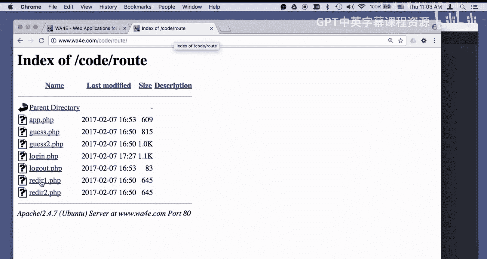
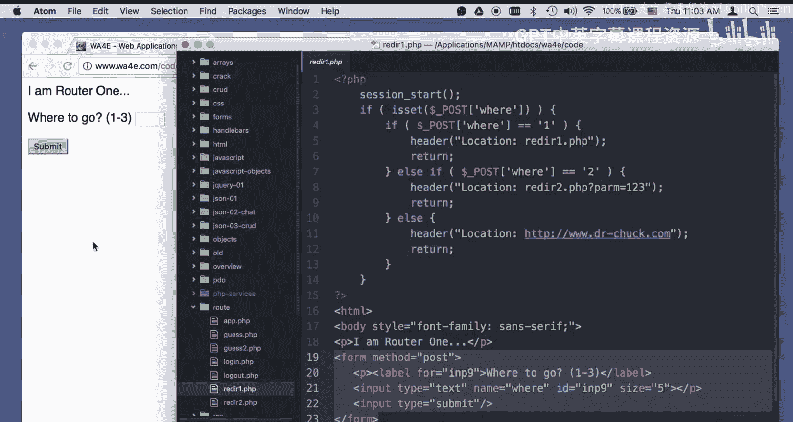
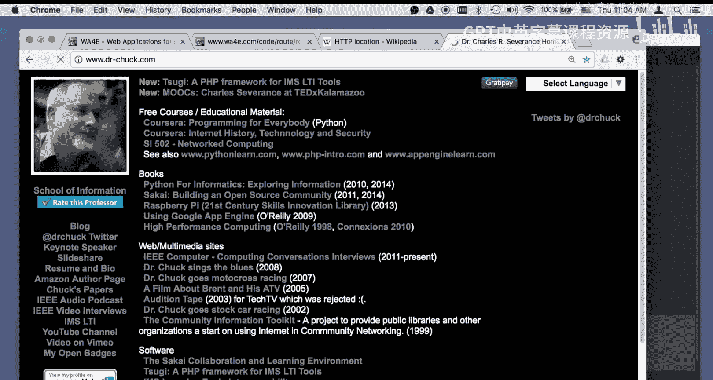
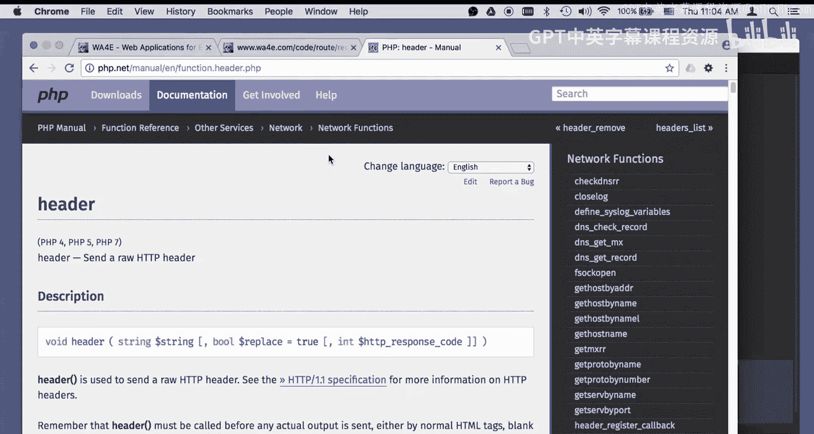
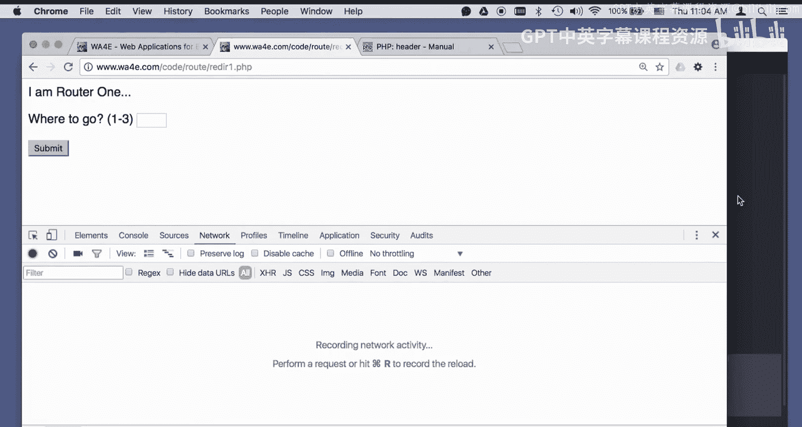
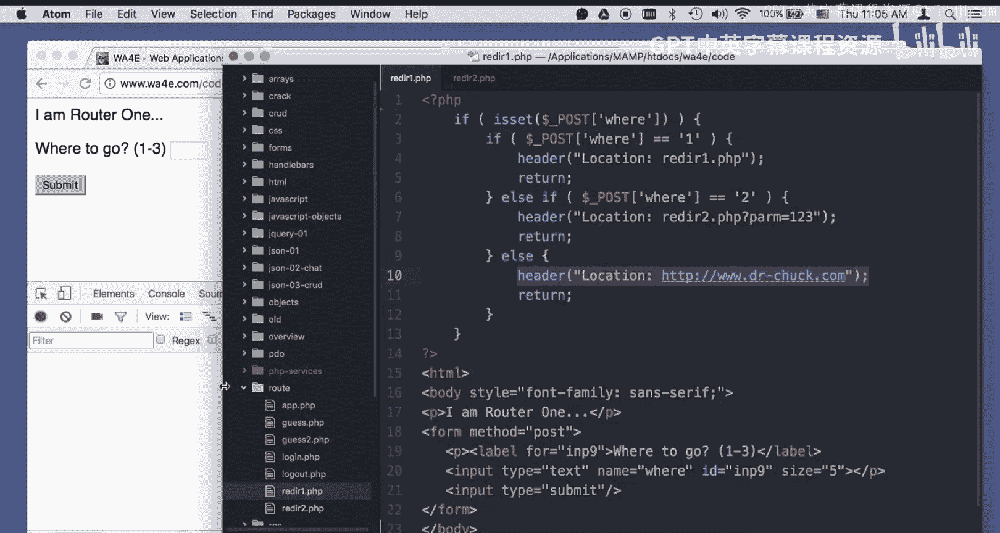
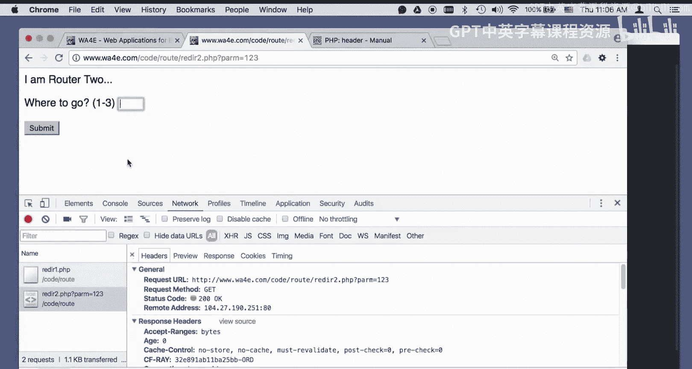
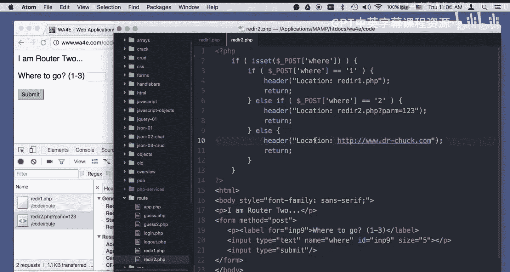
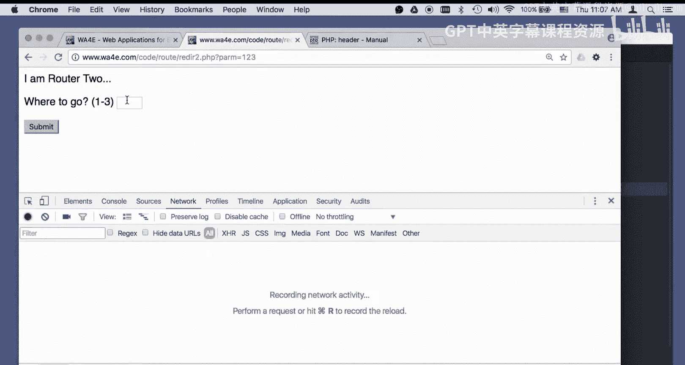
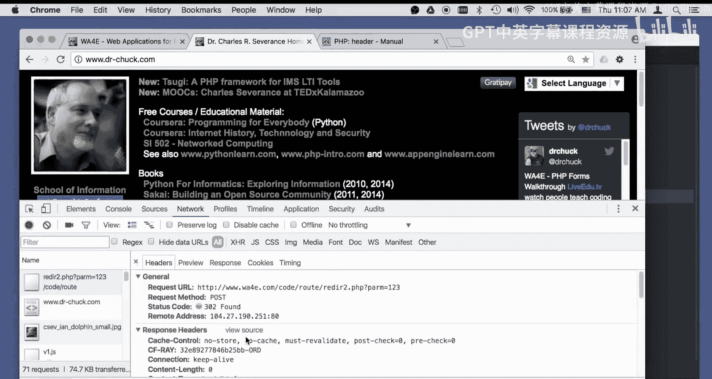

# 密歇根大学《面向所有人的Web应用程序（PHP、SQL、APP、JavaScript和JQuey｜Web Applications for Everybody》 p97 27_代码详解：路由与重定向.zh_en -BV1Lr421A75d_p97-

Hello， everybody and welcome to Web applications for everybody。

 Now we're doing a bit of code walk through。 we're in the section on how things happen with routing。

 And what we're going to do is we're going talk about this redirection code and it's really dumb code。

 It's really just a post form that I put in a number and depending on the number。

 I am going to redirect to different places。 So let's first take a look at the notion of what redirecting is in general。

😊。

Right， and so the location header is basically one of the H TTP headers that you can send。

 you send a get and it returns and says 302 found。 And then it says location colonlan where you're supposed to go。

 And so just as an example， if you go to D doctor my normal URL is doctor Chuck do com。

 but I also have Doctor Chuck dot com with no dash。 I got it much later。

 So what I do is I just automatically redirect it。

Using that a redirect to my doctor Chuck dot com。 So you notice the URL changed here。

 So I switched it from one to the other using this location header。

 So you went to the doctor Chuck with no dash， and then you were told to go to Doctor Chuck with a dash。

 And that's a redirect。 And that whole notion is there。 And so we have ways in P H P。

To set these response headers。Using the header function。

 So echo or print sends data to the body of the response and header sends data to the header。

 the part that comes out first。 And so let me do a view developer consoles。

 We can watch the network go by network So here we go So let's take a look at reader1 do PhP。

 So I'm doing a session。 I'm not really using the session in this particular one。

 I'll use it in the next one so I probably can get rid of that。

Okay， it won't have session next time you download that source code because it does not need a session。

 It really doesn't。 There's no session in it。 So if I post a one， it's really simple。

 If I post a one， I run the code， redirect back to itself because you can redirect back to the same script。

 and then I return。Or if I post。2， I redirect to a location。 and in this case。

 I add a get parameter to it， which is readerer 2 do PhP。

 which is really just a copy of the exact same thing。So readerer2。

phB is just so that I can sort of be at a different place， and then if I put a three in。

 it completely reds to some other place right， doctor。chuck。com。Okay。

So I'll put in a one here。And let's watch the network console hit submit。

 And so this was a post of the value1 to this URL。 And what it gave me back as a 302 found。

 which is not the same as a 200 to 200 means good news through two means like I know it's going on。

 But you're at the wrong place， you need to go here。

 So what happens is immediately without us even seeing a blink of the eye。

 The browser stops talking to this URL and switches to that URL and then sends a get request to that URL。

 And so that's what we actually see。嗯。Now I'll refresh this， so we only have one thing in there。

 and if I say two。You will see that I do a post back to reader 1 because that's where the post goes。

 But then reader 1 is going to say， oh， go somewhere else。

 And the place I want you to go is readerer 2 do P P par equals 1，2，3。

 So then it goes and instantly grabs this zip。 It grabs it with a get request。

 And so that's the screen that we're seeing。Okay， and so if I type a3 and remember。

 reader1 and reader2 are the exact same code， if I type a3。

It is going to go to location W W W Doctor Chuck dot com。 So let's put a three in。 clear the network。

 put a three in and watch what happens。 Bo。 Now we're at Doctor Chuck dot com。

 So there's all kind of crap that comes out。 H and C S S and whatever。

 So let's just look at the first two requests。 I scrolled all the way back up。 The first 1。

 I did a post to readerer 2 dot P H。 P with a value of 3。 And it responded302。 go away。 And it said。

 here's the place you're supposed to go。 So it immediately。

 my browser immediately saw this and then did a get request to Doctor Chuck dot com。 It， of course。

 retrieved all that H。 And then it said， oh， I got to bring a picture and yada yada， yada yada。

 And So that's all these other 71 request。 are the rest of that。

 The redirect is what happened here from this post。

From this post。With this， redirect to this get。

Okay。Okay， so that gives you a quick overview of the redirect and come back。

 we'll talk about some of the ways that we can use the redirect。

