# 密歇根大学《面向所有人的Web应用程序》：p98：POST刷新重定向 🚦

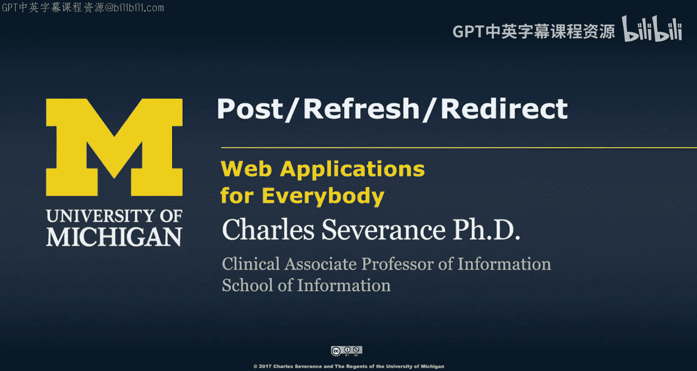

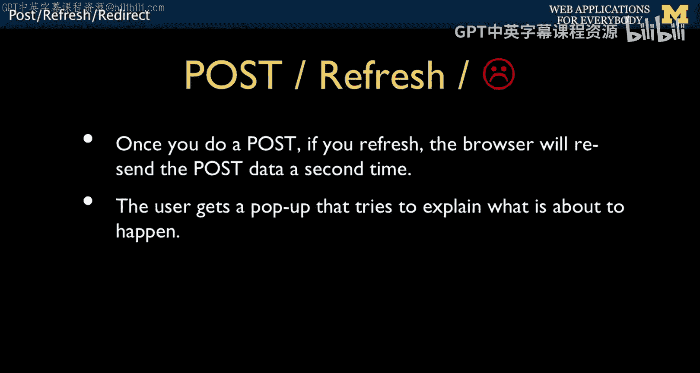

在本节课中，我们将要学习一个非常重要的Web开发模式：POST/重定向/GET。这个模式用于解决表单提交后刷新页面可能导致数据重复提交的问题。我们将理解其原理，并学习如何通过PHP会话（Session）来实现它。

## 理解问题：为什么需要POST/重定向/GET

上一节我们介绍了重定向的机制。本节中我们来看看为什么需要使用它。

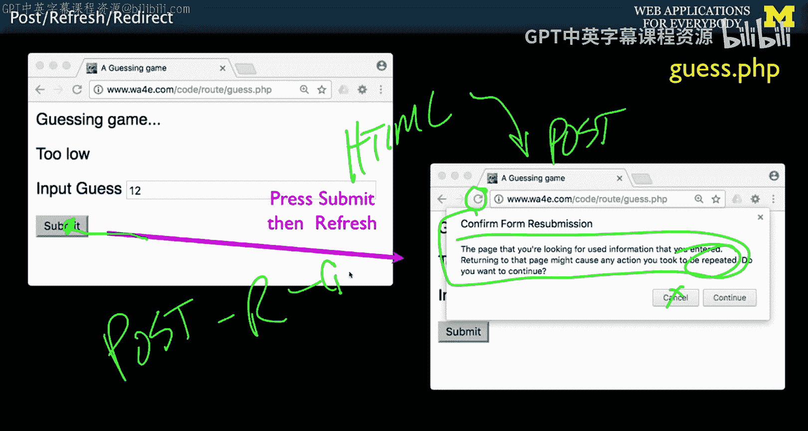

一个核心原则是：HTTP GET请求用于获取数据，而HTTP POST请求用于修改数据。你不应该使用GET请求来修改数据。问题在于，如果你提交一个POST表单，服务器返回一个结果页面，然后用户刷新这个结果页面，浏览器会询问是否要重新发送POST数据。如果用户确认，就会导致数据被重复修改，例如重复支付100美元。

浏览器为了避免这种危险的双重提交，会弹出一个不受开发者控制的警告。这意味着我们不应该在响应POST请求时直接返回HTML内容。

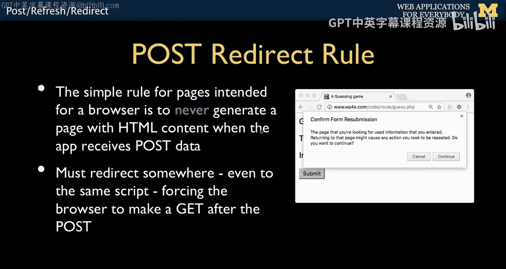

## POST/重定向/GET模式

以下是POST/重定向/GET模式的工作流程：

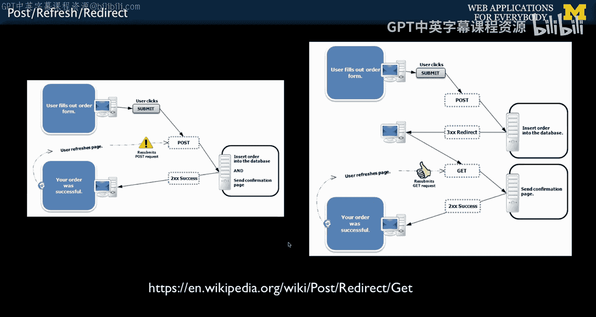

1.  用户填写一个表单（`method="post"`）并提交。
2.  服务器处理POST请求，更新数据库。
3.  服务器**不返回HTML**，而是发送一个HTTP重定向响应（状态码302），指示浏览器发起一个新的GET请求（通常是回到同一个页面）。
4.  浏览器自动发起GET请求。
5.  服务器处理GET请求，并返回最终的HTML结果页面。

这样，用户最后看到的结果页面是由一个GET请求产生的。此时用户刷新页面，只会重复GET请求，而不会重复提交POST数据，从而避免了双重提交问题。

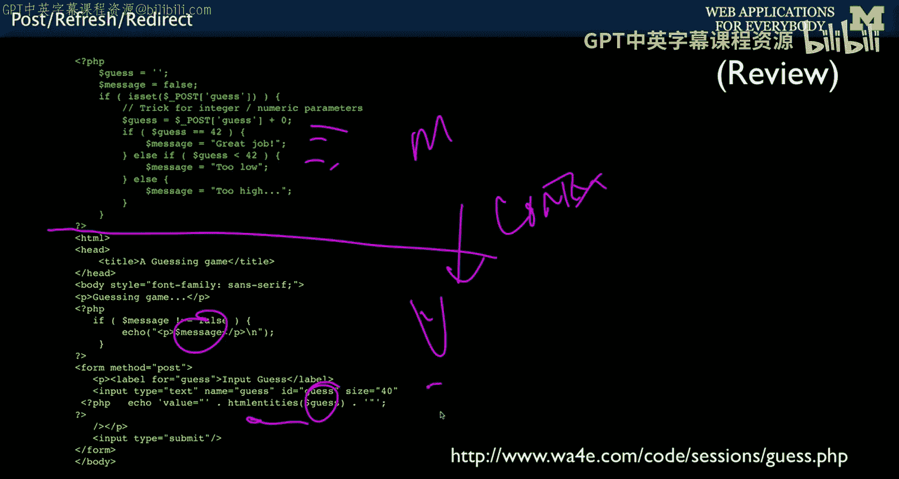

## 从错误代码到正确实现

之前展示的代码在处理POST请求后直接渲染视图并输出HTML，这是错误的做法。它会导致刷新时出现浏览器警告。

正确的做法需要解决一个关键问题：POST请求处理后的数据（如成功消息、旧表单值）如何传递给后续的GET请求？因为HTTP是无状态的，`$_POST`和`$_GET`数据不会在请求间保留。

解决方案是使用**会话（Session）**。

以下是实现POST/重定向/GET模式的核心步骤：

1.  **启动会话**：在处理脚本的开头使用 `session_start()`。这会在服务器端创建一个存储空间，并通过Cookie与特定用户关联。
2.  **处理POST请求**：
    *   执行数据验证和数据库更新等逻辑。
    *   将需要传递给下一个页面的数据（如提示信息）存储在 `$_SESSION` 超全局数组中。例如：`$_SESSION[‘message’] = “操作成功！”;`
    *   **不输出任何HTML**，使用 `header(‘Location: some_page.php’)` 函数发送重定向头，然后立即 `exit`。
3.  **处理重定向后的GET请求**：
    *   同样以 `session_start()` 开始。
    *   检查 `$_SESSION` 中是否存在之前存储的数据。
    *   将这些数据从 `$_SESSION` 中取出，用于构建HTML视图。
    *   **重要**：使用后应立即清除这些会话数据（如 `unset($_SESSION[‘message’])`），以防止它们在后续的页面刷新中重复出现。这种临时存储消息的模式常被称为“Flash消息”。

## 工作流程图示与总结

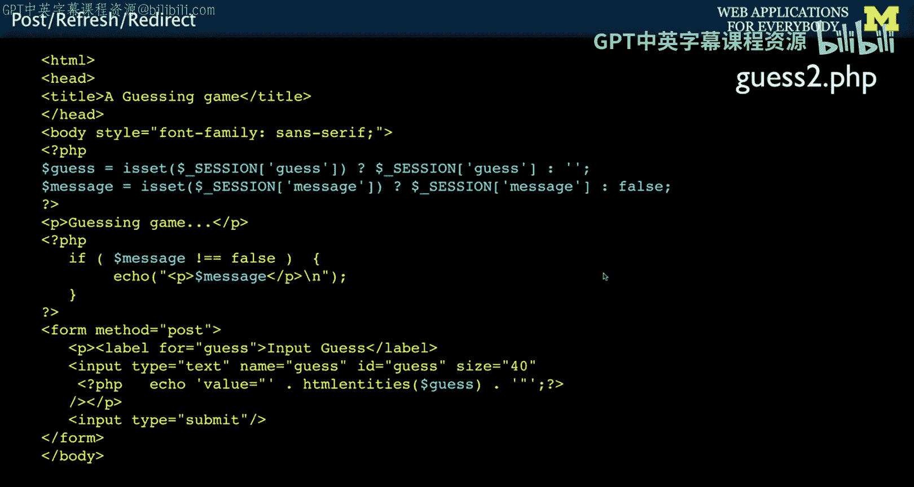

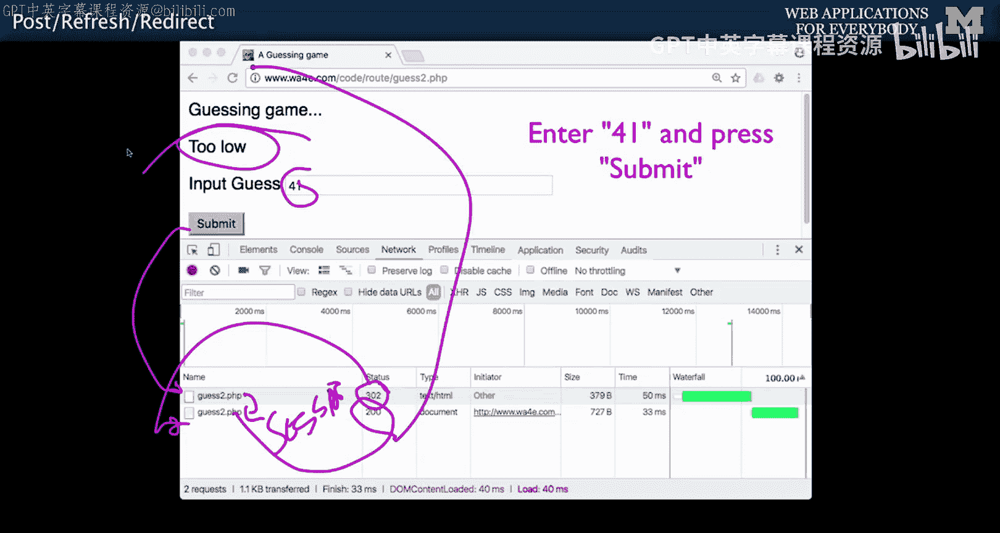

本节课中我们一起学习了POST/重定向/GET模式。

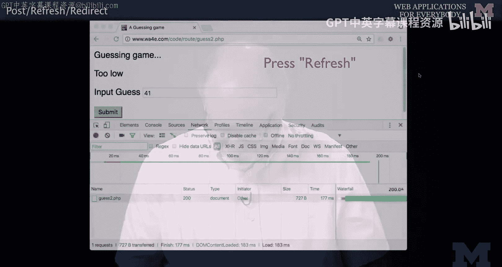

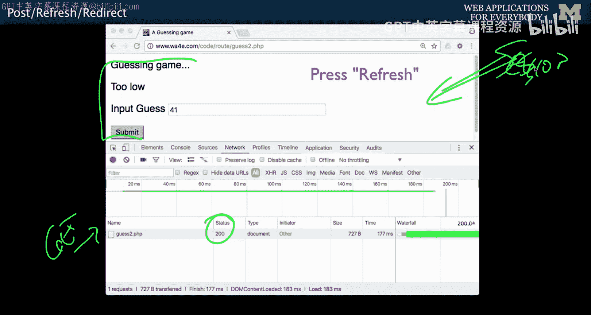

整个流程可以概括为：**一个POST请求，将数据存入Session并重定向；紧接着一个GET请求，从Session取出数据并渲染页面**。

通过这种方式，我们确保了：
*   **数据安全**：防止了表单的意外重复提交。
*   **用户体验**：消除了浏览器的重复提交警告，使刷新操作变得自然。
*   **代码结构清晰**：将数据处理（POST）和结果展示（GET）清晰地分离在两个独立的请求/响应周期中。

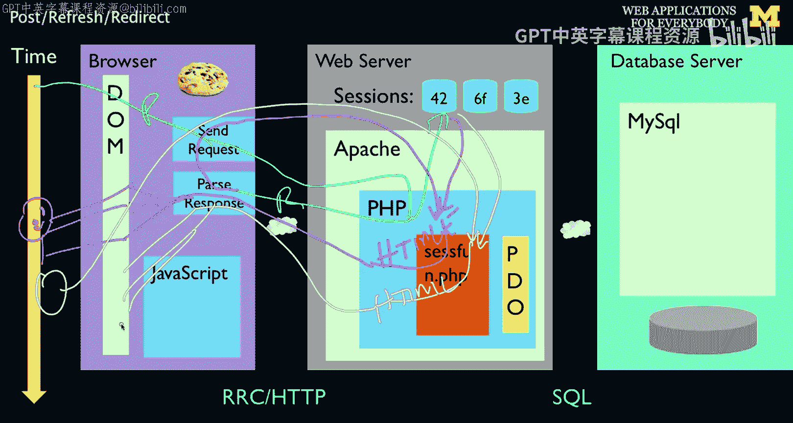

你现在已经掌握了构建更健壮、用户友好的Web表单处理程序的关键技术。在接下来的课程中，我们将运用会话机制来实现用户登录和注销功能。