# 密歇根大学《面向所有人的Web应用程序（PHP、SQL、APP、JavaScript和JQuey｜Web Applications for Everybody》 p99 29_代码详解：POST重定向.zh_en -BV1Lr421A75d_p99-

Hello and welcome to Web applications for everybody。 Today。

 we are going through some of the code for the routing。 we've done some redirecting。

 And now I want to play with this code guest dot Ph P。 And so this guest dot PP code。

 This is the code that I used to introduce model view controller。

 so the model part here is the silent data processing bit。

 and the view is the part below it with a few little bits and pieces being injected。

 kind of an HTML template with some dynamic bits in it。

 And then the context sort of falls from this top part to this bottom part。

 But I want to show you a flaw in this。 So if I do 41， and it's too low， that's fine。 I do 42。

 and it's just right。😊。

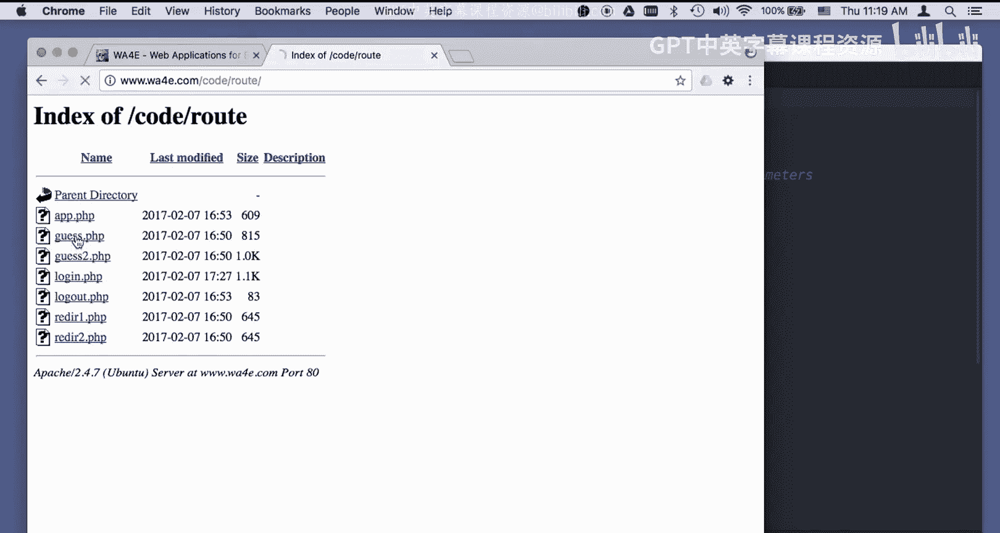

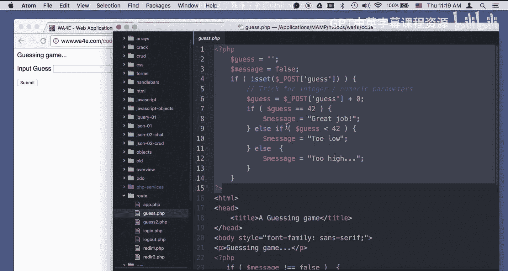

And I'm really happy。 The problem is， is that I'm sitting on a post。

 The last thing I sent was a post。 And if I hit refresh because posts are considered by the browser to be expecting to modify data。

 like if you were going to decrement your savings account。 You would do it in a post。

 The browser doesn't want to resend a post request for you just without your knowledge。 Now。

 this is not coming from my application。 This is coming from my browser that's keeping me from doing something stupid right。

 It says you might be decrementing your bank account balance or transferring 100 dollars twice or something。

 right， so it does run that I have to do this。 We， as application developers。

 we have lost control of the user experience at this point。 And so you know。

 that's pretty tacky and we're not very happy about that。 And so there is a way to fix that。

 and that is to never generate output on post and you can say post， you can Google post， redirect。😊。

Get。And you will see some Wikipedia pages， which I love so much。

 And I even use this in my lecture that basically says the problem with the post。

 and then a 200 that comes back， and then you hit refresh and it sends the post again to generate the page。

 And that's the dangerous moment， right？ So what we want to do is we want to do a post。

 And then we do the work。 And then we redirect back to ourselves with a get request。

 And then we put the actual page out on the get request。 And then if you refresh it。

 it's doing the get request over and over。 And so that's all cool。 The problem is。

 is what if we want to put a message out on this screen。

 And we are generating the message here in this post code like success or message or guess too low or whatever。

 What we're going to do is we're going to use the session。

To copy the data from this moment to that moment。Okay。

 we're going to look at the session to copy from this to this。

 So we have to use the session to get the message because otherwise what we were doing is we're just putting the too low message out right here。

 but we got to do a post redirect。 So we're going to know the too low message here。

 and we're going to send it in the session to the next one。

 and it's going to pull it out and then print it。 Okay， so this is the bad one， falls through。

 produces output as a result of the post。 Here is the good one。

 Now one of the first things we see in the good one is we have to use the session because we're going to pass data。

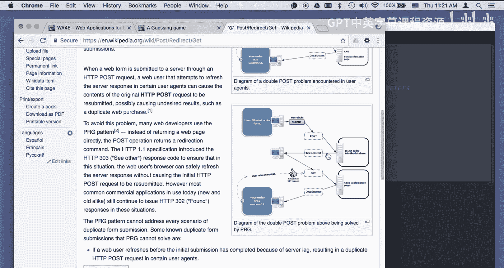

Prety much。Almost everything， except this little bit right here is the same。

 All the HTML entitiesities and all that stuff is the same。

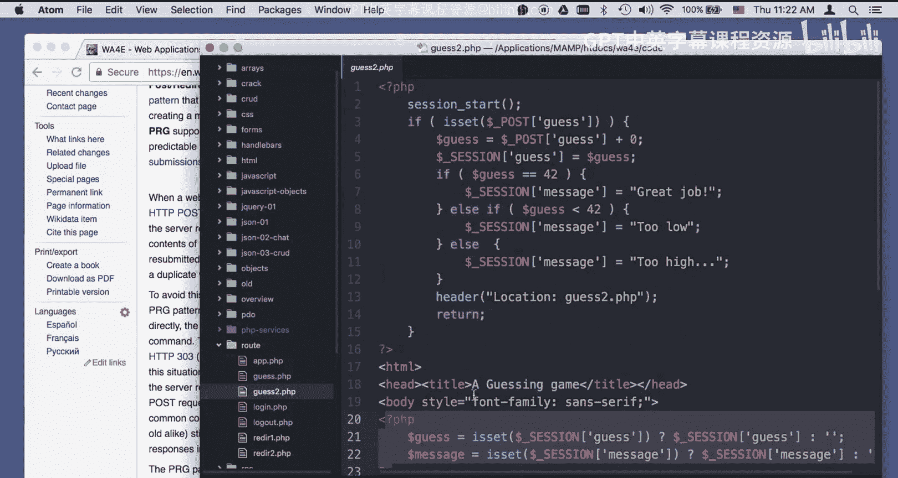

And。Let's go to guess 2。phP。

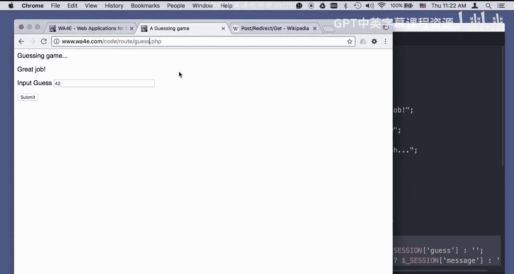

Okay， now the problem is， is that this data up here in the model part has the old guess and。

The message。 and it wants to communicate it， but it's going to come through here and then come through again。

 So it's not the post data is gone。 The get data is gone， but the session data is not。

 So one of the things we do is get the context and that is the data we pass from the model to the controller。

 get the context into the session。 So if we have a post of guests， we calculate the guess。

 and then we stick the old guess into the session with a key guess， because remember。

 you can write this。You can put stuff into the session and it just stores it for later。

 And then we do the old logic。 and we say a sessions sub message is the high low great job。

 And then we redirect back to ourselves。 And that causes the browser to immediately grab and get a new copy of us。

 So it comes down。 But this is a get request。 So this was a post request。 but we say don't do it。

 and we're right here in this picture。 we're sending back a answer to the post request。

 which is do a get request， which immediately turns into a get request to the same page， right。

 So it's going to come back in。 post is no longer defined。 But session is defined。

 So we look down here and we go like， oh， okay， well， let's grab the old guess。

 If there's a guess in the session， we'll grab that。 And if there's a message in the session。

 we'll grab that。WOops that should say false right there。

 I don't quite know when It doesn't say false right there。 So we'll save that。

 So if message is not equal to false， we print it out。And then we print the old guess。

 but we pulled them out of the session because we're in a second request response cycle。

 the second Re response cycle， so we pulled the data out of the session to produce that page。

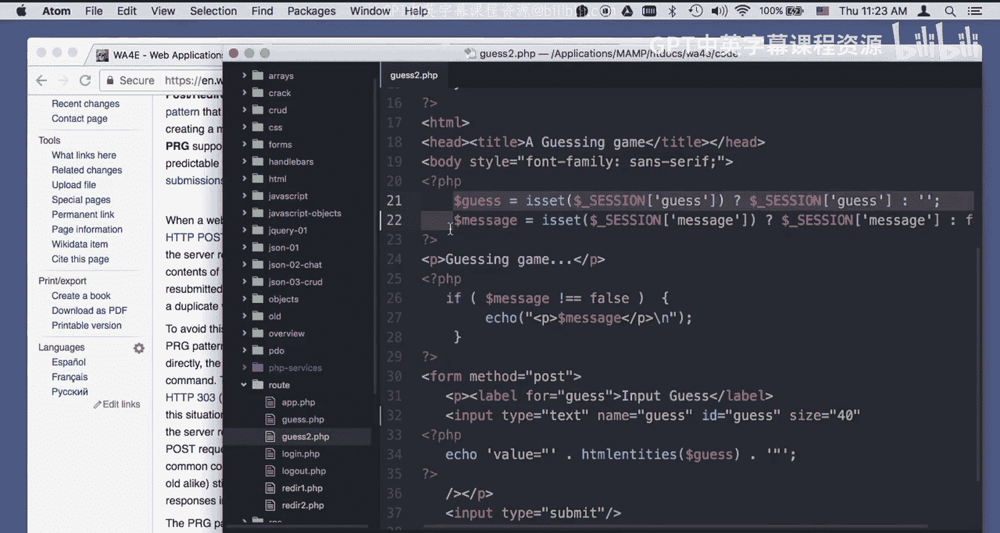

So let' do it let's do a guess of 41。Now， oh， let's do view developer console。Okay。

 so look at the network， so we're going to do a post。To， to guess2。And there you go， a to guests2。

 And we send the guess in 41 and。We got back a re 302， which says it's not really a page。

 It's something else。 And that something else sits here in the location says go back to guess too。

 So we're redirecting back to the exact same script。

 And so the browser immediately grabs that script， and it sends a get request to it。

 And that get request comes down here grabs the old guess out of session grabs the old message out of session。

 And then it renders this。 And so the actual output is here to the get request。

 If we look at the output of the post request。 There is nothing。

 And that's because up here after we did the redirect， we return and got the heck out of there。

 So we didn't fall through。 we kind of caused us to come back by saying， come back。

 come back to this same script again， please， And away it goes。 And so there you go。

 thats sort of a post redirect implementation。 And the pattern will be。

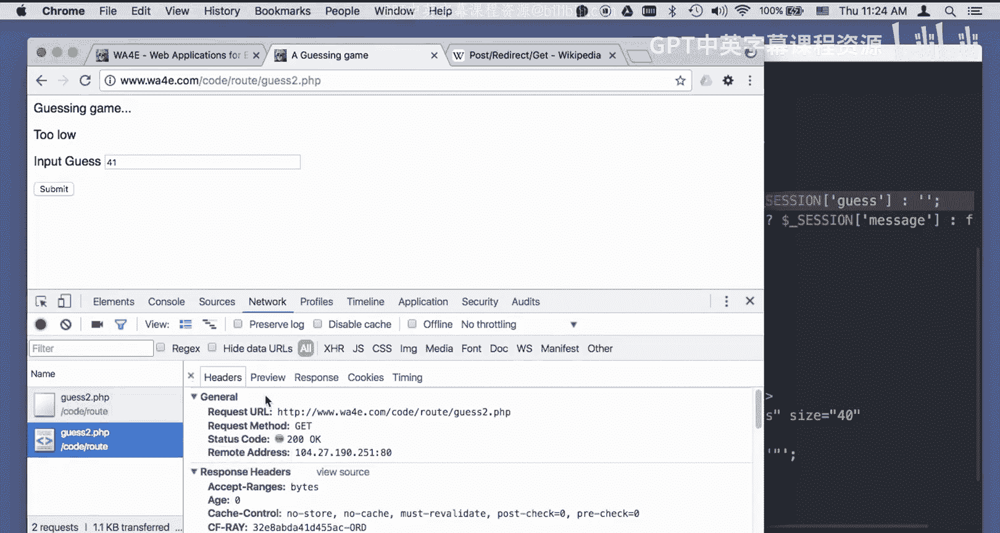

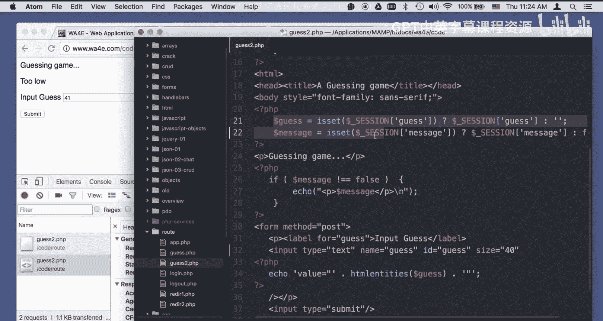

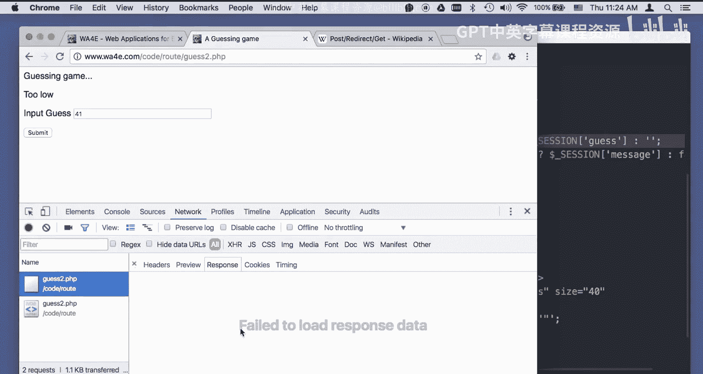

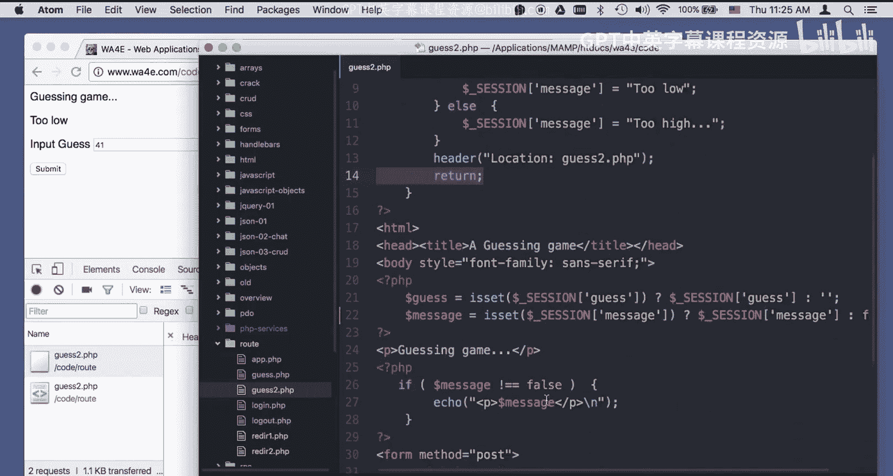

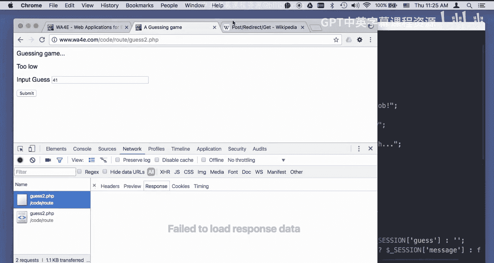

When you have post data， you eventually have to put things in the session， do a redirect and return。

 and so we'll see more complex code， but this pattern of set the session up。

 do a redirect return will be done over and over and over again so that we can follow the best practice rules of post redirect get。

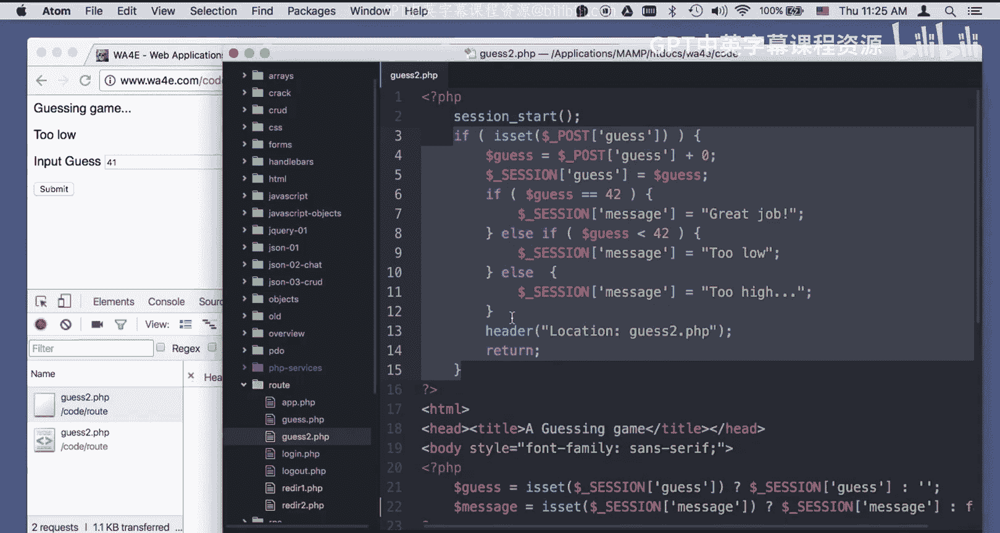

So I hope you found this helpful。

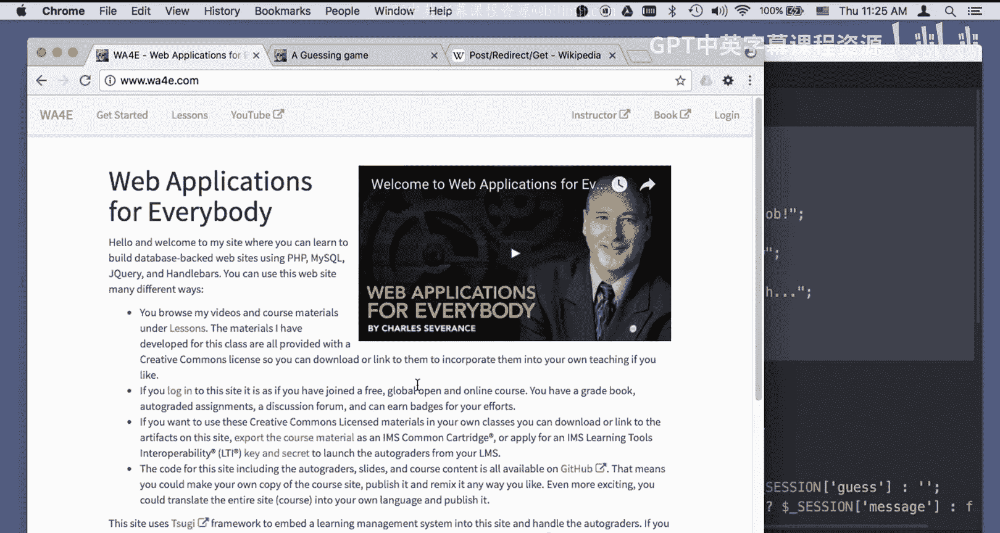