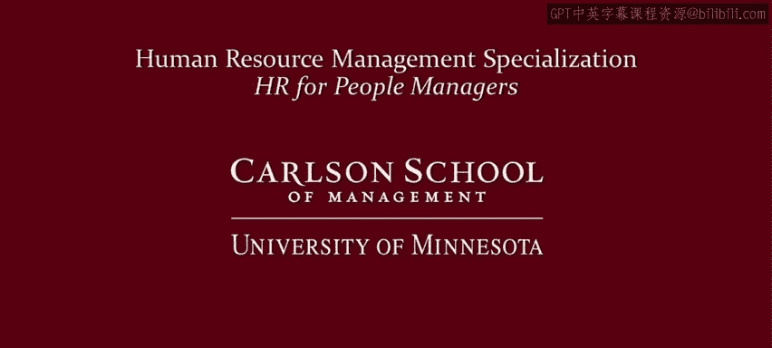

人力资源管理：P2：1_视频：拥抱你的管理者角色课程介绍 🎬

在本节课中，我们将要学习如何成为一名有效的管理者，并理解管理者角色的重要性。我们将探讨管理与领导力的关系，并概述本课程的整体结构和学习目标。

观察这些匆忙通勤的人们。他们中有科学家、工程师、品牌经理、金融分析师，也可能有医疗保健专业人员、社会工作者、法官，甚至大学教授。他们有什么共同点？如果他们在一个组织中工作，无论组织大小、属于私营部门、公共部门、政府机构还是非营利部门，无论他们身处组织金字塔的底层还是顶层，所有这些工作者都需要被管理。

因此，成为一名管理者至关重要。但这也是一项非常困难的角色。然而，鉴于它对所有组织都如此重要，你应该拥抱你的管理者角色。

但这可能很困难。不仅工作本身具有挑战性，而且如果你查看商业博客、MBA课程或其他资料，如今人们都在谈论领导力，而非管理或成为管理者。管理者似乎成了某种乏味、需要避免的角色。每个人都想成为领导者。因此，你可能会问自己：我不想做管理者，我想做领导者。

在这种思维模式下，领导力关乎大胆、精明和远见未来。而管理则关乎具体细节、平凡的灰色任务。在这种鲜明的对比思维中，领导者有远见，他们需要激励人们，需要具备战略眼光，需要推动变革。而成为管理者，则显得乏味，只是关乎政策、程序、预算这类事情。

然而，这种鲜明的思维方式存在两个主要问题。首先，所有组织都需要管理者来生存和发展，不可能每个人都只做领导者。你需要有人来遵循政策和程序，关注底线并完成任务。更重要的是，将领导者或管理者作为非此即彼的选择是一种错误的二分法。大多数管理者也需要做好领导者所具备的事情。

因此，在本专项课程中，我们将教你如何遵循良好的人员管理政策和程序，例如如何招聘人员、如何评估他们的绩效、如何奖励他们。但你需要以展现工作单元如何完成工作的远见的方式来做到这一点，你需要能够激励员工，需要在如何调动和部署他们方面具有战略性，并且当事情进展不顺利时，你需要找出变革策略。

所以，不要仅仅将这门课程视为关于管理或成为管理者，而应将其视为我所说的成为“管理型领导者”。是的，政策和程序很重要，但这并不意味着你不应该同时努力激励人们、具备战略性，并在需要改变或事情不顺利时思考如何领导变革。

这一点至关重要，因为人们加入的是组织，离开的却是管理者，这确实是事实。因此，本课程旨在为你成为我所说的“管理型领导者”打下基础。本课程的目标是让你准备好发展自己的人员管理技能，成为一名有效的管理者和领导者。

我们将通过多种方式实现这一目标。首先，我们将探讨管理人员的各种选择，包括人力资源战略以及个人管理或领导风格。我们还将研究什么驱动着员工，什么能激励他们，以及你如何让他们投入到工作中。最后，我们将审视管理者必须进行管理的背景环境，看看那些使管理者角色变得复杂的压力和约束。

让我们快速浏览一下本课程的路线图。本课程将包含四个模块。

以下是第一个模块的内容概述：

第一个模块将探讨管理人力资源的不同方法。完成本模块后，你将能够解释为什么管理员工很重要，比较不同的人力资源管理策略，评估组织的人力资源战略、管理者风格与商业环境之间的匹配度，并且能够为特定情境推荐管理人员的策略和风格。

接下来，我们进入第二个模块。

第二个模块将强调工作的货币方面。完成本模块后，你将能够解释金钱如何激励某些员工，识别当员工是自利的并从经济角度看待工作时，管理者面临的关键问题，并能够运用经济学的见解制定解决这些关键问题的策略。

在第三个模块中，我们将关注工作的非货币方面。

第三个模块将探讨工作的非货币方面。完成本模块后，你将能够解释至少四种与金钱无关的人们工作的原因，识别当员工出于不同的非货币原因工作时，管理者面临的关键问题，能够运用心理学和社会学的见解制定解决这些关键问题的策略，并且能够证明在不同情境下应用经济学、心理学和社会学见解的合理性。

最后，我们来看看第四个模块。

第四个模块将把人员管理者视为复杂系统的一部分。完成本模块后，你将能够解释影响特定组织中人力资源管理的至少四种约束，比较法律在何种程度上将雇佣关系视为或不视为典型的合同关系，能够列出你所在国家合法与非法的HRM实践，并且能够判断何时使用超越法律要求的人员管理策略。

所有这一切都是为了支持本课程的广泛目标，即让你准备好发展自己的人员管理技能。我对这门课程感到非常兴奋，没有其他课程以这种方式整合这些材料。我认为与许多教授人力资源的人相比，我拥有相当独特的背景，因此，你将再次获得独特的体验，这将为你发展自己的人员管理技能提供一个非常丰富、广泛的框架。

现在，为了激发你的兴趣，以下只是本课程中将使用的一些图片示例。

所以，来学习我的课程吧。首先，旋转一下……好吧，抱歉这个糟糕的双关语，但这个视频在课程后面也会用到。你可能不确定这些图片与人力资源和人员管理有何关联。那么，请拥抱你作为管理者和领导者的角色，学习我的课程，你将看到这些图片是如何被运用的。更重要的是，你将为一个有效的管理者和领导者打下坚实的基础。

本节课中，我们一起学习了管理者角色的重要性，理解了“管理型领导者”的概念，并预览了本课程四个核心模块的主要内容：人力资源策略、工作的经济与非经济激励因素，以及管理者所处的复杂系统环境。这为你后续深入学习具体的人员管理技能奠定了框架基础。