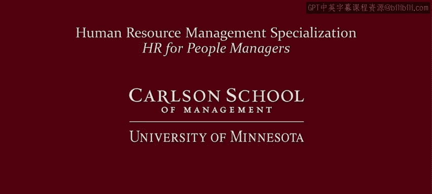

# 012：理念很重要 🧠

在本节课中，我们将探讨为何不同组织和管理者会采用不同的人力资源实践与管理策略。我们已经分析了外部影响和组织战略的重要性，但管理者和组织仍然拥有选择权。本节将重点阐述**理念**如何塑造这些选择，包括管理风格和人力资源策略。

## 核心理念的影响

上一节我们介绍了外部与内部因素，本节中我们来看看理念的根本作用。人力资源实践的发展不仅是实践的演变，也是理念的演变。当今的管理风格和人力资源策略同样反映着特定的理念。以下将重点介绍三组塑造管理及人力资源策略的理念：**组织的社会角色**、**雇佣关系**以及**对员工的看法**。

## 组织的社会角色

关于组织的社会角色，存在两种关键观点。

以下是两种主要观点：

*   **股东价值观**：认为公司通过创造股东价值来最好地服务社会。实现方式是提供对客户有价值的商品和服务。这种观点导向**工具性人力资源策略**，将员工视为成本或投入，并强调市场竞争和财务回报高于员工的重要性。
*   **利益相关者观**：强调公司享有服务社会的特权（如有限责任制），因此有义务广泛地服务社会及各利益相关者，而不仅仅是最大化股东价值。这种观点导向**高标准人力资源策略**，将员工作为关键的利益相关者。

这种区分同样适用于公共部门，即公共组织是应尽可能以最低成本提供服务，还是也应关注员工的待遇。

## 雇佣关系的不同视角

现在让我们转向雇佣关系。我将阐述关于雇佣关系的四种不同观点，其中两种构成了不同人力资源策略的基础，另外两种则对人力资源持更多批判态度。我将使用四幅约90至120年前的线条艺术图来说明，它们能很好地揭示我们对雇佣关系的智力假设。

以下是四种不同的雇佣关系观点：

1.  **自由市场观** 🛣️
    *   **核心理念**：相信自由市场在创造机会、选择和价值方面的首要地位，包括在雇佣关系中。这可称为新自由主义市场意识形态。
    *   **对人力资源的影响**：持此观点者倾向于支持根植于市场决定工资等条件的人力资源和管理策略。**公式**可表示为：`薪酬水平 = f(市场供需)`。

2.  **激进批判观** ⚔️
    *   **核心理念**：假设雇主与雇员存在尖锐的利益冲突，且雇主在工作场所和社会中拥有过度权力。
    *   **对人力资源的影响**：此观点批判人力资源，将其视为安抚工人、掩饰雇主权力的伪装，即“天鹅绒手套里的铁拳”。

3.  **多元主义观** ⚖️
    *   **核心理念**：雇佣关系中的利益相关者拥有不平等的议价能力和一些冲突利益。让任何一方的利益主导对各方和社会都有害，因此需要平衡多种合法利益。
    *   **对人力资源的影响**：认为人力资源对于没有利益冲突的问题很重要，但不愿 solely（单独）依赖它。需要法律和劳工运动等**制度制衡**来管理竞争利益。

4.  **一元主义观** 🦃
    *   **核心理念**：假设工人与组织拥有许多共同利益。管理者的任务是找到正确的政策来协调这些利益，实现双赢结果。
    *   **对人力资源的影响**：此观点是**高标准人力资源策略**的基础，旨在创造双赢的雇佣关系。**代码**逻辑可简化为：`if (找到共同利益并协调): 结果 = 双赢`。

## 理念的决定性作用

我们看到了四种人力资源观点，其中两种衍生出不同的人力资源模式，另两种则认为人力资源不完整或更有问题。这些不同观点最终植根于对雇佣关系的不同看法。再次强调，无论是支持还是批判，人力资源的方法都受到雇佣关系理念的塑造。

## 总结与展望

本节课中我们一起学习了关于组织社会角色的理念，以及对雇佣关系的信念和假设，如何塑造管理者与组织所做的选择。

但是，员工如何看待工作？什么激励他们？他们从工作中寻求什么回报？思考这些问题以及我们对此所做的假设，对管理者也至关重要。事实上，这非常重要，它将成为第2和第3模块的重点。期待在那里与您相见。