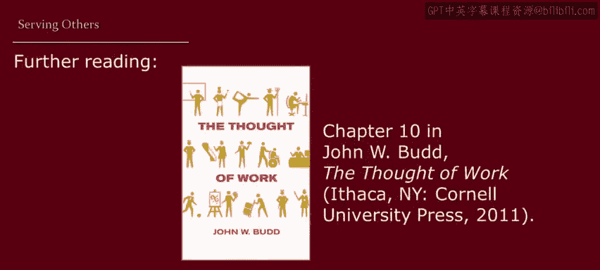

# 028：服务他人 👥

## 概述
在本节课中，我们将探讨工作的另一种重要动机：服务他人。我们将了解人们如何通过工作服务于更广泛的群体，包括社区、国家乃至信仰，并分析这种服务型工作的表现形式与内在动力。

---

上一节我们讨论了工作为个人带来的回报，如薪酬、成就感和家庭责任。本节中，我们来看看工作如何成为一种服务他人的途径。

美国总统约翰·F·肯尼迪在1961年1月的著名就职演说中有一段话：
> 不要问你的国家能为你做些什么，而要问你能为你的国家做些什么。

这与工作有何关联？我们已经审视了许多不同的工作原因：薪酬、自我实现、身份认同、养家糊口。这些原因各不相同，带来的回报也各异。但请注意，它们都相当个人化。人们可能为自己寻求薪酬，为解答自我身份认同而工作，或为照顾直系亲属而努力。

然而，有些人可能追求更广泛的目标。也就是说，他们的工作动机可能是服务他人，而不仅仅是自己或直系家庭成员。例如，2015年4月尼泊尔发生毁灭性地震后，这两位志愿者所展现的精神。

在人类历史的大部分时间里，劳动被视为维持社区生存的公共资源，而非专注于个人家庭或目标的私事。

在某些文化中，工作仍然是服务大家庭而非核心家庭的重要元素。例如，在一些儒家思想影响深远的东亚文化中便是如此。在一些原住民社区，大家庭也是主要单位。事实上，在某些情况下，美洲原住民在自己无法工作时，会派兄弟姐妹或堂表亲去替他们工作。这反映了将工作视为大家庭事务而非个人事务的观念。

除了服务大家庭，工作被视为服务他人还有两种更广泛的方式：服务社区（无论是地方、国家还是全球层面）以及服务神的国度。

---

首先，服务社区可以体现在地方或全球层面。

以下是服务社区的几种形式：
*   在社区进行无偿志愿服务。
*   在地方或国际的低薪公民服务项目中工作。
*   为国家服兵役。

以上都是非传统工作的例子，但你也可以通过传统工作服务他人。例如：
*   在非营利组织担任管理者。
*   成为公务员。
*   为政府机构工作。
*   企业高管休假到低收入社区任教。
*   在一些国家，尤其是在工业化进程中，努力在工业等领域工作被宣传为服务国家目标的方式。因此，在常规工作中努力奋斗成为一种爱国义务。

那么，人们为何通过劳动服务他人？原因如下：
*   对一些人而言，这源于基于伦理或宗教原则的人道主义关怀。
*   另一些人可能希望建设强大、充满活力的社区，因为他们认为这有助于实现政治或经济目标。
*   有些人可能想尝试偿还他们认为欠社会的债。
*   此外，志愿服务或服务他人也能带来个人回报。

服务他人带来的回报包括：
*   **内在回报**：例如，有人可能享受工作的性质，从看到他人得到帮助中获得满足感。
*   **外在回报**：例如，你可能提升自己的人力资本，扩展社交网络，或增强公民技能。

😊 这一切都意味着，志愿服务是真正的工作。它不仅像所谓的“真正工作”一样，为志愿者和他人带来益处，而且同样需要付出努力，并受到塑造有偿就业的相同因素（如劳动力市场机会、个人动机、社会规范和性别）的结构性影响。此外，也许你们中的一些人需要管理志愿者，本课程中讨论的很多内容同样适用于管理志愿者，就像管理带薪员工一样，例如如何构建他们的工作条件，如何激励和吸引志愿者。因此，我们不应将志愿服务视为“真正工作”领域之外的事情，志愿服务就是真正的工作。

---

接下来，转向服务神的国度。当然，尽管具体神学不同，但将工作视为服务的元素可以在多种宗教传统中找到，如罗马天主教、新教、犹太教、伊斯兰教和印度教。

追溯至基督教会的第一个千年，工作被视为间接服务神国度的一种方式，其作用是防止被视为导致罪恶的懒惰、供养家庭以及为慈善捐赠创造盈余。几个世纪后，马丁·路德和约翰·加尔文改变了这种思维方式，使我们能够通过工作直接而非间接地服务神。如今，有些人甚至将工作视为与神共同创造。这赋予了工作深刻的宗教意义，并在工作者与神之间建立了个人关系。但这也意味着，我们应该深切关注人们的工作条件。

其中一些可能涉及神学辩论，因此，让我们来听听一位真实工人的心声。我的朋友鲍勃·布鲁诺采访了芝加哥工人阶级社区的一些基督教、穆斯林和犹太教工人，探讨他们的工作与信仰之间的关系。

我想向你们读一段他采访一位在学校工作的保管员的记录：
> “我认为神将我们置于不同的位置和不同的工作中去帮助他人。我认为这是一种服务。工作服务于一个目的、一个召唤和一种需求。这就像成为一名传教士。任何时候你都可以服务他人，或者以我的情况为例，如果你看看这所学校，我这样做是为了让孩子们能够学习，而不必担心地板上的垃圾或墙上被涂鸦。所以，是的，这是神圣的工作。”

😊 再次，我们可以看到这里强调通过日常工作服务神。我在之前的视频中称之为“个人实现”的东西——回想一下那种满足感、自尊——当工作被视为服务神时，通常被表述为获得一种内在的喜悦。

这些描述并不局限于西方宗教，正如这段来自古印度教经典的引文所阐明：
> “当他们从工作中找到快乐时，他们都达到了完美。听听一个人如何达到完美并从工作中找到快乐：当他的工作是对神的崇拜时，他就达到了完美，万物皆源于神，神存在于万物之中。”

😊 再次注意这段引文中强调的“从工作中找到快乐”和“服务神”。获得快乐也可以被描述为从工作的诅咒性质中解放出来。

最后，有些人也将工作视为一种“召唤”，即神通过赋予特殊天赋或才能召唤某人去做的事情。用世俗的术语来说，这可以看作是职业奉献，即某人从工作中获得如此多的内在回报，以至于工作不再像是工作。具有高度奉献精神或将工作视为召唤的人，有强烈的动力去服务更伟大的目标，并且对他们的工作充满热情。

---

## 总结
本节课中，我们一起学习了将工作视为服务他人的多种视角。我们探讨了服务社区（从地方到全球）和服务信仰这两种主要形式，并分析了人们从事服务型工作的动机与回报。理解工作作为服务的概念，不仅对于全面理解工作的意义至关重要，对于成为一名更好的管理者也同样重要。无论是管理带薪员工还是志愿者，激励他们、构建良好的工作条件，其核心原则是相通的。