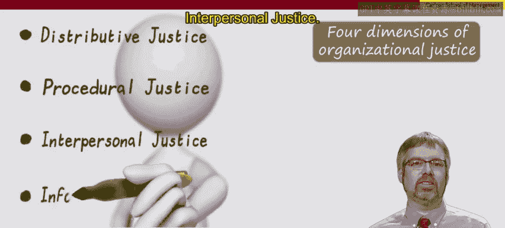

# 029：公平与正义 🧑‍⚖️

在本节课中，我们将要学习模块三的第三课，这也是本模块的最后一课。由于模块二和模块三都聚焦于人们工作的不同原因，因此你可以将本节课视为对这两个模块的总结。在模块二和三中，我们尝试做了两件事：一是探讨人们工作的不同原因，二是借此机会引入研究工作和劳动者的学科（特别是经济学、心理学和社会学）中的额外见解。因此，本总结课也将具有类似的特点，既包含对人们工作原因的不同观点的总结，也融合了来自经济学、心理学和社会学的经验教训。

## 概述：公平与正义的重要性

公平与正义对员工、管理者和组织而言都是一个重要议题。员工乃至整个社会通常对公平与正义抱有期望。如果管理者或组织未能达到这些标准，那么管理者或组织可能会承受后果，例如士气低落、生产力下降，甚至在极端情况下，组织的公众形象可能受损，有时还会引发对监管或立法标准的呼吁。

想象一下，如果员工因为感到组织或管理者的对待方式不公正或不公平而产生负面情绪，他们很可能无法高效工作。因此，公平与正义是管理者和组织必须重视的问题。

然而，公平与正义对管理者和组织来说也极具挑战性，因为对于这两个核心概念存在许多不同的视角，例如基于市场的视角、组织内部的视角等。本视频将为你介绍其中一些不同的视角。

## 基于市场的视角

首先，让我们考虑基于市场的视角。请记住，在主流经济学或新自由主义市场意识形态中，市场是至高无上的。它非常强调完全竞争市场。我们在之前的视频中看到，如果所有参与者都是平等的，那么稀缺资源就能得到最优配置。

对于信奉这一思想流派的人来说，市场结果是公平的。让我们思考一下原因：如果市场是理想竞争或完全竞争的，那么个人获得的工资就等于他们对组织的贡献价值，这源于完全竞争。此外，如果员工对现状不满，他们可以自由选择其他可用的工作机会。因此，从这个角度看，基于市场的结果是高效的、公平的（因为工资等于其创造的价值），并且员工可以通过“用脚投票”来行使话语权。市场结果被视为是公平的。

相比之下，在多元主义产业关系视角下，所有参与者并不被视为平等的。因此，劳动力市场被视为破坏性竞争，而非完全竞争。工资并不等于个人对组织的贡献价值，替代性工作机会通常受到限制，市场也无法提供太多话语权。因此，从产业关系的角度来看，市场结果并不被视为公平。相反，公平或正义被视为工资、雇佣条款与条件以及员工话语权的最低标准。

再次强调，主流经济学和产业关系学关于公平、正义和公正的视角都是基于市场的概念化。这些视角很重要，但你组织中的员工可能还有更深层次的期望，这些期望也涉及组织，特别是他们的管理者如何将他们作为个体来对待。

## 组织公平的四种形式

因此，在组织内部也有大量关于组织公平的研究，并且有不同的分类。在本视频中，我将重点介绍组织公平的四种不同形式：

以下是组织公平的四种主要形式：

1.  **分配公平**：指对**结果**公平性的感知。这方面一个经久不衰的理论是**公平理论**。公平理论预测，员工会改变自己的行为，以与某个参照群体建立公平的结果。这通常被认为是一个个体将自己的“产出/投入”比与某个参照群体进行比较的过程。例如，如果你认为自己比同事工作更努力，但薪酬却相同，公平理论预测你会降低自己的努力程度以匹配同事，或者寻求更高的报酬，这两种都是试图平衡这种比较的策略。分配公平引发的问题是：员工是否认为结果是公平的？对于结果，可以考虑工作小组内部发生的事情，例如可能导致绩效加薪或晋升的绩效评估等。研究人员通常使用一些问题来帮助从员工角度思考分配公平，例如：“我的工资（或我是否获得晋升）是否反映了我投入工作的努力？”“这个结果是否反映了我对组织的贡献？”

2.  **程序公平**：指导致这些结果的**过程**是否公平。我们考虑的是诸如绩效评估过程、晋升决定过程等。评估程序公平可以问的问题包括：程序是否被一致地应用？程序是否没有偏见？被评估的个人在过程中是否能够表达自己的观点和感受？

3.  **人际公平**：关注**传达结果信息的方式**是否公平，例如传达绩效评估结果、绩效加薪或是否获得晋升的消息。这方面的关键问题包括：管理者是否以礼貌的方式对待该人？是否尊重其尊严？是否给予其尊重？

4.  **信息公平**：关注对结果的**解释**是否公平。这方面的关键问题包括：管理者是否彻底解释了程序？管理者关于程序的解释是否合理？细节是否及时地进行了沟通？

## 组织公平的重要性与目标

组织公平对管理者至关重要。大量研究发现，对不同类型组织公平的感知可以预测员工的态度，如工作满意度、组织承诺等，并且不仅能预测态度，还能预测工作行为，不仅包括工作绩效，还包括组织公民行为（即个人是否愿意额外付出、帮助他人）。

乍一看，公平似乎因其模糊性而难以处理，存在许多不同的视角。是的，这很复杂，但如果你考虑到我在这里提出的不同要素，它就不必难以捉摸。你应该思考个人对市场导向结果中感知到的不公平可能产生的挫败感，同时也要思考与管理者对待方式相关的感知不公正或公平的不同方面。

请记住，在思考正义和公平时，你的目标本身并不是让每个人都开心，你的目标是让人们变得高效。培养正义和公平感将有助于实现这一关键目标。

## 总结

本节课中，我们一起学习了公平与正义在人力资源管理中的核心地位。我们探讨了基于市场的不同视角（主流经济学与产业关系学），并深入介绍了组织内部的四种公平形式：分配公平、程序公平、人际公平和信息公平。理解这些概念有助于管理者识别潜在问题，通过确保过程和结果的公正性，以及尊重、透明的沟通，来提升员工的生产力、满意度和组织公民行为。管理者的核心目标是通过营造公平的环境来驱动绩效，而不仅仅是取悦所有人。