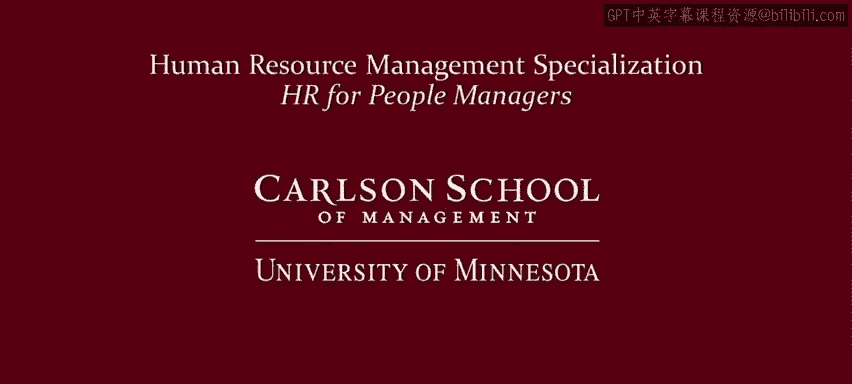

人力资源管理：模块3：工作的复杂性意味着管理的复杂性 🧩

在本节课中，我们将总结模块三的核心内容，探讨工作的多重意义如何影响员工的工作投入度、激励因素和敬业度。我们将学习如何运用这些概念作为诊断工具，帮助管理者理解并解决员工未能全力以赴的问题。

上一节我们探讨了工作的不同意义，本节中我们来看看这些意义如何为管理者提供诊断工具。当员工未能全力以赴时，思考其赋予工作的意义，可以帮助管理者找到问题的根源并制定相应的激励策略。

以下是针对不同工作意义观，员工可能缺乏全情投入的原因及相应的管理对策：

*   **工作是一种诅咒**：员工认为工作是痛苦和单调的。**激励方案**是劝导接受现实。
*   **工作是收入来源**：员工认为工作是痛苦的，偏好闲暇。**激励方案**是提供**财务激励**。
*   **工作是权利来源**：员工因工作缺乏最低标准和发言权而不努力。**激励方案**是建立最低标准并提供发言渠道。
*   **工作是自我实现**：员工因工作缺乏内在回报而不努力。**激励方案**是重新设计工作以提升其内在价值。
*   **工作是地位与归属**：员工因工作无法带来地位或归属感而不努力。**激励方案**是调整工作或团队规范以促进归属感。
*   **工作是身份认同**：员工因工作与自我认知冲突而不努力。**激励方案**是调整工作以促进积极的自我认同。
*   **工作是关爱他人**：员工因工作贬低关爱价值而不努力。**激励方案**是减少歧视并缓解工作与生活的冲突。
*   **工作是服务他人**：员工因工作重商品生产轻服务而不努力。**激励方案**是调整工作以创造服务他人的价值与机会。

接下来，我们思考如何驱动员工敬业度。不同的工作意义观，意味着需要采取不同的策略来提升员工的投入程度。

以下是基于不同工作意义观的敬业度驱动策略：

*   **工作是一种诅咒/收入来源/商品**：难以实现高敬业度。需要将观念转向自我实现、身份认同或服务他人。
*   **工作是自我实现**：通过提供**内在回报**（如胜任感、自主权、归属感）来驱动敬业度。
*   **工作是地位与归属**：通过**人际关系、社交网络和组织文化**来驱动敬业度。
*   **工作是身份认同**：通过帮助员工建立积极的自我认知，尤其是作为组织成员的正面意义，来驱动敬业度。
*   **工作是关爱或服务**：通过提供直接或间接（如志愿者项目）的机会来驱动敬业度。

正如面食种类繁多一样，工作、职位、员工及其意义也极其多样。管理者和人力资源专业人员需要厘清其工作单元内的复杂情况。

一位受访的人力资源副总裁曾给出过绝佳建议：

> “我给初次管理者的建议是：务必花时间去了解你的员工，特别是了解什么能激励他们。确保你真正了解他们的优势和发展需求。记住，一种尺寸不能适合所有人，一种尺寸只适合一个人。因此，你可能需要根据什么能激励他们、什么能帮助他们专注于所需完成的任务，来调整你的管理、指导和引导方式。”

最后，我想强调一点关于工作复杂性的关键认知。虽然我们需要找出激励每位员工的因素，但这并非简单地给每个人贴上一个标签。

**工作如此复杂，以至于我们每个人都会以不同的方式组合这些激励要素。** 问题不在于找出“我受金钱激励”或“他受关爱激励”，而在于理解不同员工如何以不同方式组合金钱、自我实现、身份认同、服务他人等多种元素。理解这些可能性是一个重要的基础和起点。

最后，尽管我们讨论了许多不同的工作观点，但有一点应该是普世的：**工作通常是辛苦的，但不应该是不合理的危险。工作必须是安全的。** 请确保你的员工使用适当的安全设备，关注安全标准，并严肃对待员工的健康与安全。

本节课中我们一起学习了如何将工作的多重意义作为管理诊断工具，分析了影响员工努力程度和敬业度的不同原因及对策，并认识到激励要素的复杂性组合以及工作安全的普世重要性。这为应对管理的复杂性奠定了重要基础。