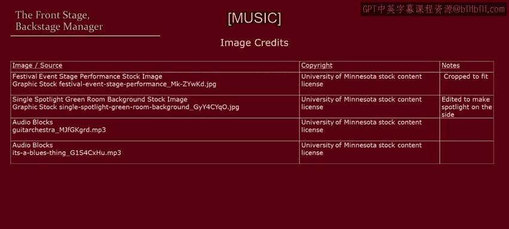

# 035：台前幕后的管理者 🎭

在本节课中，我们将学习管理者在职场中扮演的两种关键角色：台前角色与幕后角色。我们将探讨这两种情境的特点、挑战以及如何有效地在两者之间切换，以实现更好的管理效果和问题解决。

---

当你工作时，是否曾感觉自己像站在舞台上，在他人面前进行表演？作为一名管理者，你的互动有时会公开展示，因为其他人正在观看。这并非指字面意义上的舞台，除非你在一个非常酷的地方工作，但本质上你确实处于被关注的状态。

设想一个场景：你正在谈判一项将设定新政策或先例的事务。这可能是一次工会谈判，或者你正在处理一名希望居家办公的员工，而此事将为他人树立先例。你再次处于展示状态，因为他人不仅在关注结果，也在关注过程。你的上司和其他员工可能都是这场“演出”的观众。

现在，请站在你谈判对手的角度思考。那个人很可能也有自己的观众。如果你正在与工会谈判，那位工会领袖必然有普通成员在密切关注她。即使你只是在处理一开始提到的员工居家办公安排，该员工的配偶也可能在观察他是否为自己据理力争。

因此，有时某些角色必须在“台前”扮演，让他人可见。

---

## 台前舞台：满足观众期望

当处于台前时，人们通常希望表现得强硬。你希望在上司面前显得强大；工会领袖或普通员工也希望在他们的支持者或配偶面前显得强大，尤其是当观众期待看到这一点时。

于是，可能会出现拍桌子、发出威胁、气氛紧张、甚至被吼叫和言语攻击的情况。

然而，**关键是要保持冷静，扮演好你的角色，不要将任何事个人化**。台前舞台并非达成双赢协议的地方。**台前舞台的作用是满足观众的期望**。

那么，双赢协议在哪里达成呢？

---

## 幕后舞台：实现问题解决

双赢协议在这里达成。不是在聚光灯下的台前，而是在这里——**幕后**，远离观众视线的地方。

在远离聚光灯的幕后，你可以：
*   **交换信息**
*   **更开放、更坦诚地交谈**
*   **进行头脑风暴，提出不同想法，而不用担心想法泄露并引发不切实际的期望**

这里才是你真正探索不同选项并最终进行问题解决的地方。

---

## 管理实践：分离与思考

请记住，管理并非在真空中进行。它可能是一项复杂的任务，涉及许多约束和动态因素。

那么，你能做什么？

**你需要成为一名优秀的台前管理者和幕后管理者**。将台前与聚光灯下的表演，与幕后、远离聚光灯的问题解决分离开来。

当你与他人打交道时，请思考：
1.  **你是否有观众？** 思考观众期望你扮演什么角色。
2.  **不要只考虑自己。** 进行深入的换位思考。思考你正在打交道或谈判的对象，他们是否有观众？那位观众对他/她有什么样的期望？
3.  **思考你被期望扮演的角色类型**，同样进行换位思考，**你的对手被期望扮演什么角色**。

作为一名优秀的管理者，如果需要，让他们扮演他们的角色。如果他们需要保住面子，就让他们保住面子。如果他们需要显得强大，就让他们显得强大。

这可能是一项挑战，可能非常不同，压力很大，气氛紧张，情绪可能高涨。但要为此做好准备，提前准备，不要陷入台前表演的情绪中。让角色自然展开，让观众消费他们期望看到的“表演”，而将你的问题解决工作留到幕后、远离聚光灯的地方进行。

---

## 重要提醒：区分参与者与观众

无论喜欢与否，站在舞台上都是管理者工作的一部分。记住本视频的教训可以帮助你获得更好的体验。

但请不要误解这个教训。**教训不是要将人们排除在外，进行幕后交易**。这对透明度和与下属建立信任非常不利。

相反，**教训在于区分你需要涉及的直接参与者**（例如你的下属）**和从远处观看的利益相关者**（观众，但不参与决策）。**让直接参与者参与进来，但不要忘记观众的存在。**

---

本节课中，我们一起学习了管理者“台前”与“幕后”的双重角色。我们了解到，台前是满足各方观众期望、进行角色表演的场合，需要保持冷静和专业；而幕后才是进行开放交流、信息交换和创造性问题解决、达成双赢的关键场所。有效的管理者需要学会识别情境，区分直接参与者和场外观众，并在两种角色间灵活切换，从而更有效地进行管理和谈判。