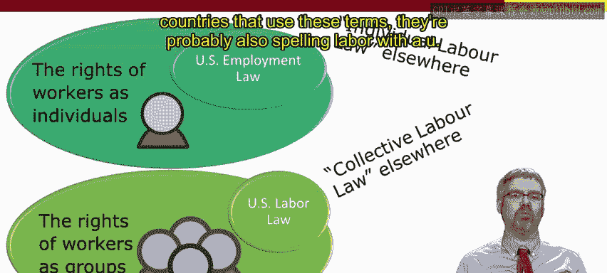
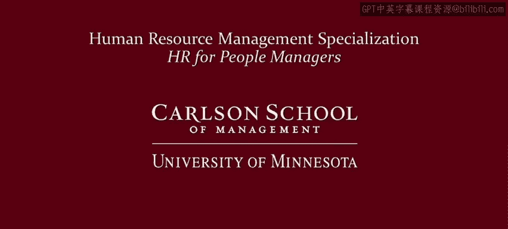

# 040：美国劳动法 📜

欢迎回来。首先，我们回顾一下当前的学习进度。

本模块的目标是强调，人员管理并非在真空中进行，而是作为一个复杂系统的一部分来运作。因此，管理者需要了解一系列约束条件。这是第一课的重点。第二课则聚焦于这些约束中的法律部分，特别强调了“**任意雇佣**”原则，它是思考法律约束的基础。

在本课中，我们将在此基础之上，探讨具体的雇佣法和劳动法实例。这些法律本质上为“任意雇佣”原则划定了界限，从而为所有管理者设定了法律边界。

本课将包含三个视频。第一个视频（即本视频）将聚焦于**美国雇佣法**。第二个视频将把我们的注意力转向**美国劳动法**。第三个视频则会介绍一些国际案例。

首先，你可能会对我所称的“雇佣法”和“劳动法”之间的区别感到困惑。**雇佣法**关注的是作为**个体**的工人的权利。相比之下，**劳动法**关注的是作为**群体**或**集体**的工人的权利。事实上，在世界其他地方，我们在美国所称的“雇佣法”常被称为“**个体劳动法**”，而我们所称的“美国劳动法”则被称为“**集体劳动法**”。我特意在这两个术语中保留了“labour”中的“u”，因为在其他使用这些术语的国家，他们很可能也这样拼写。

如果你在美国工作场所工作过，希望你已经见过张贴着不同工作场所法律海报的公告板。这些海报涵盖了管理者至少需要了解的大部分内容。当然，美国还有更多的雇佣法，但管理者可以让其人力资源专业人员去操心那些其他的法律。

因此，在这个介绍性视频中，我将只重点介绍美国的一些精选雇佣法。

美国最古老的雇佣法之一是**工人赔偿法**。工人有权获得因工作受伤的医疗覆盖。如果发生伤害，请确保获得医疗救助，并通知你的人力资源部门，以便遵循正确的程序。

美国另一项历史悠久的雇佣法是《**公平劳动标准法**》，可追溯到20世纪30年代。该法规定了全国性的**最低工资**、**加班费**（每周工作超过40小时后，加班费为正常工资的**1.5倍**），并**限制童工**。现在，许多州的最低工资高于联邦最低工资，因此你也需要注意这一点。第二个复杂之处在于，较高级别的员工通常**豁免**于美国雇佣法的加班工资规定。因此，你可能会经常听到“**豁免员工**”这个术语，意思是豁免于这些加班条款。如果你是管理者，你很可能是豁免员工，尽管这不是自动的。

加班可能是管理者经常遇到的问题。休假和休息是另一个可能相当频繁影响管理者的领域。

在联邦层面，《**家庭和医疗休假法**》为员工提供每年最多**12周**的无薪但保留工作的假期，适用于多种情况，包括新生儿出生和护理、收养或寄养儿童的安置、照顾患有严重健康状况的直系亲属，或因员工自身严重健康状况无法工作而休病假。

联邦层面没有其他休假要求。无论是病假、带薪假期、休假还是工作中的休息时间。然而，各州确实有一些相关规定，特别是关于工作期间的休息时间。以下是华盛顿州的一个例子：如果员工一天工作超过**5小时**，则有权享受**30分钟**的无薪用餐休息；如果工作至少**3小时**，则有权享受**10分钟**的休息。这些都是作为管理者需要注意的州法律。

**安全与健康**是美国雇佣法监管的另一个领域，也是管理者显然需要密切关注的另一个领域。这由《**职业安全与健康法**》监管，也有一些州法案同样监管工作场所的健康与安全。根据这些法律，雇主有责任提供一个安全的工作场所，消除危险，确保员工知道如何处理危险设备和有害材料，提供安全培训，必须报告严重伤害和死亡事件，必须记录工作场所中与工作相关的伤害和疾病。

最后但同样重要的是**非歧视**。在平等就业机会或非歧视方面，我想强调几点。首先，我想强调这适用于**申请人和员工**。其次，我想强调这涉及我在上一个视频中提到的“**不利雇佣行为**”。因此，这不仅涉及是否雇佣或解雇某人，还涉及晋升、福利、培训机会、工作推荐等。非歧视指的是特定的**受保护类别**。因此，在美国，根据联邦法律，基于种族、肤色、宗教、性别、国籍、残疾（除非造成过度困难）、年龄（至少从40岁开始）以及工会偏好进行歧视是非法的。各州可能还有额外的受保护类别，例如，一些州规定基于性取向和性别认同进行歧视是非法的，因此关注州法律也很重要。

非歧视极其重要，因此我要重申一遍。最后但同样重要的是**非歧视**。在平等就业机会或非歧视方面，我想强调几点。首先，我想强调这适用于**申请人和员工**。其次，我想强调这涉及我在上一个视频中提到的“**不利雇佣行为**”。因此，这不仅涉及是否雇佣或解雇某人，还涉及晋升、福利、培训机会、工作推荐等。非歧视指的是特定的**受保护类别**。因此，在美国，根据联邦法律，基于种族、肤色、宗教、性别、国籍、残疾（除非造成过度困难）、年龄（至少从40岁开始）以及工会偏好进行歧视是非法的。各州可能还有额外的受保护类别，例如，一些州规定基于性取向和性别认同进行歧视是非法的，因此关注州法律也很重要。

此外，对从事基本相同工作的女性和男性支付不平等的工资也是非法的。因此，**同工同酬**不仅在实践上重要，在法律上也很重要。

在这个简短的视频中，我们不可能涵盖所有的美国雇佣法，但我试图聚焦于与许多管理者最直接相关的几项法律。即使是这个简短的介绍也应该强调，管理者负有特殊的法律责任。毕竟，员工的福祉、雇佣、工作机会、晋升、收入等都依赖于你。因此，请认真对待这些责任，法律就不会成为问题。不要仅仅将法律视为需要张贴的海报，而应以尊重的方式管理，表现出对这些问题的关注，并理解这些法律最初存在的原因。

