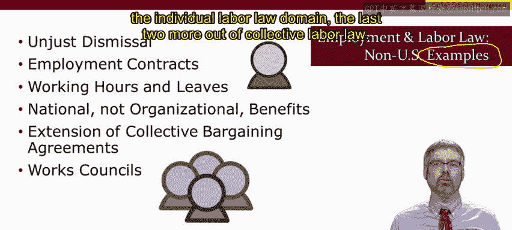
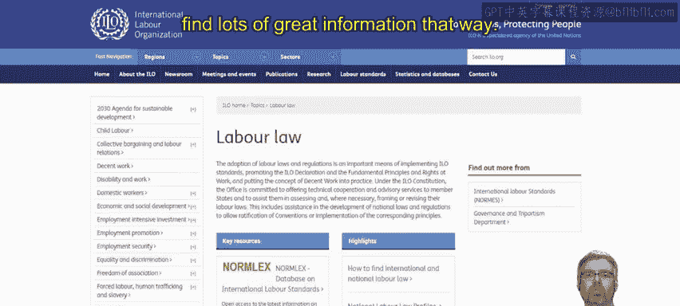

# 042：非美国就业和劳动法示例 🌍

在本节课中，我们将探讨美国以外的就业与劳动法。之前我们聚焦于美国法律，现在我们将目光投向全球，了解不同国家在管理雇佣关系时的法律差异。请注意，由于各国法律体系复杂多样，本节内容仅作为入门介绍，旨在通过示例让你获得初步了解。在实际管理中，你需要进行更深入的研究和咨询。

## 概述：全球法律框架的差异

上一节我们介绍了美国的就业与劳动法。本节中，我们来看看世界其他地区的法律实践。在美国以外，就业法常被称为“个体劳动法”，而劳动法则可能被称为“集体劳动法”。两者核心区别在于：**个体劳动法**关注员工作为个体的权利，**集体劳动法**则关注员工作为群体的权利。

鉴于各国法律差异巨大，本节将重点介绍与美国法律最为不同的六个方面。以下是核心内容概览：

1.  **不当解雇**
2.  **雇佣合同**
3.  **工作时间与休假**
4.  **国家福利（非组织福利）**
5.  **集体谈判协议的扩展**
6.  **工作委员会**

前四点更多属于个体劳动法范畴，后两点则属于集体劳动法范畴。

---

## 核心差异详解

### 1. 不当解雇 🚫

这是美国与世界其他地区最显著的差异之一。美国在工业化国家中独树一帜，因其广泛实行“随意雇佣”原则，且缺乏“正当理由”解雇保护。

*   **美国**：实行“随意雇佣”，雇主解雇员工通常无需提供理由。
*   **其他国家**：普遍存在不当解雇保护。具体形式因国而异：
    *   **加拿大**：要求雇主在解雇前提供足够的提前通知。
    *   **法国**：可能要求支付解雇赔偿金。
    *   **德国**：保护可能包括让员工复职。

### 2. 雇佣合同 📄

在雇佣合同的要求上，美国与其他国家也存在很大不同。

*   **美国**：合同通常仅用于高管、职业运动员、演员等特殊情形。
*   **其他国家**：法律常要求为许多员工提供合同。
    *   **中国**：雇主必须与全职员工签订合同，明确雇佣期限、工作描述等细节。
    *   **英国**：雇主必须向员工提供书面雇佣声明，列明薪酬、工作时间、假期、养老金等条款。

### 3. 工作时间与休假 ⏰

在工作时长和休假制度上，不仅美与其他国家差异大，各国之间也各不相同。

以下是常见差异点：
*   **标准工时**：一些国家的标准工作周更短，超过即算加班。
*   **带薪假期**：许多国家法律强制规定带薪年假。
*   **带薪病假**：美国以外的大多数国家都有法定带薪病假。
*   **产假/育儿假**：许多国家提供法定的产假或育儿假福利。

### 4. 国家福利 🏛️

与美国由组织提供许多福利不同，在美国以外的许多国家，福利由国家法律强制规定。

*   **美国**：假期、健康保险等福利主要由雇主提供。
*   **其他国家**：通常存在国家层面的法定福利，例如：
    *   法定最低带薪年假和病假。
    *   国民健康保险。
    *   国家养老金计划。

**欧盟示例**：在欧盟，除了国家政策，还有超国家层面的政策。例如，《欧洲工作时间指令》规定所有雇员每年至少享有20天带薪年假（各国可提供更多，如瑞典要求25天）。此外，《安全与健康框架指令》为所有欧盟国家设定了最低安全与健康要求。

### 5. 集体谈判协议的扩展 🤝

在欧洲许多国家，存在独特的“扩展机制”。

*   **机制**：即使某个企业的员工没有组建工会，该企业也可能必须遵守由行业工会谈判达成的集体谈判协议条款。
*   **与美国区别**：这些条款通常围绕最低标准设定，但管理者仍需注意其适用性，即使未直接与工会谈判。

**关于工会的补充**：欧洲及其他国家的工会可能比美国工会更具政治性。请回想上一课中关于“前台与后台管理”的视频，理解换位思考和感知对方压力的重要性。

### 6. 工作委员会 💬

在欧洲、韩国等地，存在“工作委员会”制度。

*   **性质**：这是非工会组织，在 workplace 内部形成。
*   **权利**：工作委员会有权获得信息，并且管理者在做出各种人事和工作相关变更前，必须与其协商。
*   **成立**：有时即使只有少数员工希望成立，也可以形成工作委员会。

**管理提示**：在处理与工作委员会的关系时，可参考关于“在工会化环境中管理”的视频，学习如何为这种关系定调。

---

## 如何获取更多信息？🔍

面对全球多样的劳动法，如何深入了解？你可以：

*   **使用搜索引擎**：直接搜索特定国家的劳动法。
*   **访问国际劳工组织网站**：ILO官网提供详细的国别劳动法概况，支持按具体政策搜索，是获取权威信息的绝佳途径。

---

## 总结

本节课中，我们一起学习了美国以外主要国家在就业与劳动法方面的关键差异。我们探讨了**不当解雇**、**雇佣合同**、**工作时间与休假**、**国家福利**、**集体谈判协议的扩展**以及**工作委员会**这六个核心领域。尽管本节内容仅是冰山一角，但希望它能让你意识到，管理人力资源需要深刻理解所在地区的法律环境。全球存在多种管理人的方式，成功的管理者必须适应并遵守其运营所在地的法律体系。