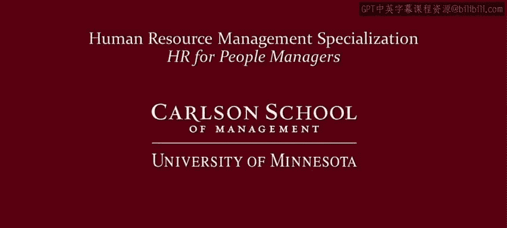

# 045：人力资源副总裁访谈 🎤


在本节课中，我们将通过通用磨坊公司人力资源副总裁的访谈，学习人力资源在现代组织中的角色、战略构建方式、对管理者的支持作用，以及人力资源领域的职业发展建议。

---

## 人力资源的角色与贡献 🤝

上一节我们介绍了课程背景，本节中我们来看看人力资源的核心角色。人力资源的首要角色是成为业务的**可信赖顾问**。这类似于市场、销售或供应链负责人的角色，要求人力资源从业者深刻理解业务如何运作。同时，人力资源部门也必须是**人才、组织和员工敬业度**领域的专家，以真正推动业务成功。

人力资源的贡献公式可以概括为：**HR贡献 = 业务理解 × (人才专长 + 组织专长 + 敬业度专长)**。

---

## 如何构建人力资源战略 🗺️

理解了人力资源的角色后，下一步是学习如何构建支持业务的人力资源战略。构建人力资源战略应从外部环境扫描开始。

以下是构建战略的关键步骤：
1.  **进行外部扫描**：关注政策、法规、立法变化和人口结构转变，以理解世界的变化趋势。
2.  **分析竞争对手**：了解竞争对手在人才、组织和文化方面的做法，明确自身需要如何差异化。
3.  **理解业务战略**：弄清公司如何盈利、损益表如何运作，以及业务领导者做决策的日常标准。
4.  **整合信息并提问**：将以上信息结合，问自己三个核心问题：如何吸引**具有竞争优势的人才**？如何打造**敏捷且具备核心优势的组织**？如何创建**员工敬业并能充分发挥潜力的文化**？

---

## 人力资源领域的演变 🔄

从构建战略的宏观视角，我们转向观察人力资源领域本身的演变。人力资源领域经历了从**事务性、常规性工作**向**战略性业务伙伴**的重大转变。

在每个组织中，人力资源都有一些至关重要的战略能力，你必须在这方面做到卓越。这些能力核心围绕**人才、组织和文化**。其他工作虽然重要且关键（通常涉及合规性），但它们是基础性和预期内的。过去几年的显著转变，正是体现在对这几项战略能力的极致追求上。

---

## 人力资源如何支持管理者 👥

既然人力资源的角色是战略伙伴，那么它应如何与一线管理者协作呢？首先必须明确，**管理者才是最终的人才管理者**。人力资源的角色是帮助管理者成为优秀的管理者。

我们的职责是帮助管理者获得所需的**技能、能力和才干**，以真正地吸引、评估、发展和保留具有竞争优势的人才。这需要通过创造一个能让员工投入工作、并每天展现最佳自我的环境和文化来实现。

支持管理者的代码可以描述为：
```python
def hr_support_for_managers():
    provide_skills_training()
    enable_talent_management(attract, assess, develop, retain)
    foster_engaging_culture()
```

---

## 管理者如何发展个人管理风格 🧭

在人力资源提供支持的基础上，管理者自身应如何发展呢？对于在组织中工作的管理者而言，要发展一种有效的管理风格，需要确保三件事在整个组织中得到贯彻，以形成文化。

以下是三个基石：
1.  **公司的宗旨与使命**
2.  **公司的价值观**
3.  **领导力期望**

在这三个框架下，管理者需要思考如何全身心投入工作，从而**激励和赋能**周围的团队成员。归根结底，管理者对业务运营负责，而**人才是公司唯一的真正差异化因素**，因此管理者的责任重大。

---

## 人力资源职业建议（入门与思考）💡

对于考虑或刚刚开始人力资源职业生涯的人，首要建议是必须**理解业务**。你需要明白业务如何运作、如何制胜，以及能力、人才、组织结构、薪酬和流程如何在帮助业务保持竞争力中发挥作用。

此外，你必须**善于施加影响力以取得成效**。人力资源工作常常是幕后的，你需要向管理者提供建议，帮助他们做得更好。这要求你有勇气提出尖锐的问题，同时具备将见解转化为行动的能力、技巧和信誉。

---

## 判断人力资源是否适合你 ❓

如何思考人力资源是否是一条适合自己的职业道路？首先，你必须**热爱商业**。你必须理解并认同，任何企业能做的最重要的事就是**在正确的时间将正确的人放在正确的位置上**。

你需要对此抱有个人热情，必须在人才评估和发展方面出类拔萃，并且需要拥有很大的勇气。通常，人力资源部门是那个提出别人不愿问或答的难题的角色。因此，如果你热爱商业，认可人才在其中的作用，并且有勇气和意愿提出难题并将其发展为行动，那么人力资源可能是适合你的职业。

---

## 人力资源职业的反思与建议 🤔

如果可以重来，在人力资源职业生涯中会做哪一件不同的事？这是一个值得反思的好问题。我的建议是：在职业生涯早期，**建立一个可信赖的顾问网络**，即你个人的“董事会”。

我鼓励你寻找三到五位人力资源领域的资深人士，他们经验丰富。同时，找一些业务领导者，以及至少一位来自你个人社交网络的人。他们可以帮助你思考决策、应对争议局面，并提供外部视角，我认为这在人力资源领域尤为重要。

---



本节课中，我们一起学习了人力资源作为战略业务伙伴的角色、构建人力资源战略的方法、其对管理者的支持作用，以及投身人力资源领域所需的商业理解、影响力和勇气。无论你是管理者还是人力资源从业者，理解这些核心原则都将有助于你更好地推动组织与人才的发展。