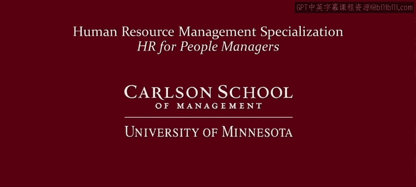

**人力资源管理：P46：人力资源管理职业 🚀**

在本节中，我们将探讨人力资源管理领域的职业机会、发展路径以及资深从业者提供的宝贵建议。

人力资源管理如今拥有广阔的职业前景。我知道，人力资源工作有时会被认为只是处理文书，例如确保求职申请表、福利登记表或绩效评估表填写完整。但正如我们在课程开头的视频中所见，这并非人力资源工作的最佳状态。实际上，人力资源工作至关重要，应当具有战略性。如果做得好，人力资源工作可以充满活力。正如我们在本课程中所看到的，人员管理非常复杂，因此企业需要积极进取、聪明且受过良好教育的专业人士，来帮助他们解决业务中非常棘手的人员问题。

---

**人力资源职业发展路径**

人力资源领域主要有两条职业发展路径：通才路径和专家路径。

*   **人力资源专家**：通常专注于某一特定领域，例如招聘专员、薪酬分析师、培训师或专门处理劳资关系的专家。
*   **人力资源通才**：在日常工作中为员工群体、管理者及企业内其他人员提供全面的支持。

---

**如何深入学习人力资源？**

以下是一些深入学习人力资源知识的途径：

*   **完成本系列课程**：当然，你可以完成本专项课程的所有内容。
*   **继续教育与会议**：本地学院和大学可能会提供短期继续教育会议和课程。
*   **专业组织**：例如，美国人力资源管理协会在各地设有分会，其他国家也有类似组织。这些组织通常会举办本地专业发展会议、区域会议和全国会议，你可以借此建立人脉并了解更多人力资源知识。
*   **学位项目**：一些学院和大学提供人力资源本科学位项目。对于那些真正有志于在人力资源领域担任领导职务的人，还有该领域的硕士学位项目。例如，明尼苏达大学卡尔森管理学院的人力资源硕士学位项目自1953年起就开始培养人力资源专业人士，拥有数千名在蓬勃发展的职业生涯中取得成功的校友。我们与微软、通用磨坊、雪佛龙等国内外领先公司保持着紧密的招聘合作关系，就业机会持续非常强劲。

---

**资深HR的职业建议**

在本课程中，我采访了一些人力资源专业人士。作为采访的一部分，我询问了他们对于有意从事人力资源职业的人有何建议。在本视频的最后，我将与大家分享他们的一些回答。

以下是他们给出的关键建议：

*   **广泛了解**：如果你正在考虑从事人力资源职业，请确保与从事不同类型人力资源工作的人交流，因为人力资源工作并非单一性质。
*   **业务优先**：要认识到你首先是一名业务人员，只是在人力资源的一个或几个领域拥有专长。
*   **拥抱多样性**：准备好应对各种多样性的工作，不要认为我们只处理公司里令人愉快的事情，因为我们还必须处理一些非常困难的工作。
*   **早期结合业务经验**：在职业生涯早期，将业务经验与人力资源经验结合起来，以便更好地理解业务。
*   **保持开放与学习**：保持开放的心态，认识到自己懂得还不够多，并尽可能多地学习。我每天都在学习，并假设自己并不知道真正的答案。
*   **深思熟虑**：如果你对人力资源职业感兴趣，建议你认真思考：你是否真的热爱与人打交道？在人力资源领域，你处理的是广泛的组织问题，需要具备广阔的思维，并能够辨别事实与虚构。
*   **扎实的教育背景**：确保获得扎实的人力资源管理教育，并侧重商业知识。因为在商业环境中处理人力资源问题，要求你能够参与决策并理解业务。
*   **平衡人与业务**：记住，你不仅是一个善于与人打交道的人，更是一个业务人员。成为一名真正高效的人力资源工作者的艺术在于，始终牢记如何将人的关注、人文关怀、组织关注和组织触觉，应用于推动业务成功。这两者不能分开运作，必须紧密结合，这尤其是我们在企业中作为人力资源工作者的角色。
*   **保持乐趣与开放**：享受工作，保持开放的心态。你可能在人力资源领域对薪酬、劳资关系、市场分析或学习发展等某个特定方面有偏好，这很重要。但在发展职业生涯时，要对学习如何应用人力资源领域的所有概念和理论保持非常开放的心态。
*   **勇于冒险**：如果我在人力资源职业生涯中能重做一件事，那就是承担更多风险。要意识到你可以领导他人，即使不知道所有答案，并且偶尔需要冒险尝试。
*   **理论与实践结合**：如果我能重做一件事，我可能会在实际深入参与工作之前，更早地投入该学科的理论学习。我有意推迟了人力资源的理论和学术学习，我认为这带来了巨大的优势，但或许可以更早一些开始。
*   **寻求国际经验**：如果我能重来一次职业生涯，我会想办法在海外市场工作。
*   **先懂业务，再懂人**：如果我能重做一件事，那就是先学习业务，再学习人员方面。如果你不能用业务驱动或业务成功的方式来阐述人力资源工作，没有人会听你的。
*   **尝试业务角色**：如果我能重做一件事，我可能会在业务岗位上多花一些时间。许多非常成功的人力资源业务伙伴都曾有过业务岗位的经验。
*   **尽早入门**：如果我能重来一次，我会更早进入人力资源领域。虽然我从业务运营开始职业生涯，这给了我很好的背景和与同事沟通的语言，但我本可以更早开始。
*   **自信专业价值**：如果我能重做一件事，我绝对不会花任何时间感到压力重重，或质疑自己是否具备足够的业务专长以参与决策。我在职业生涯后期才意识到，我带来了重要的专长——人员专长和组织专长，这本身就是业务，对我们的企业至关重要。

---

**总结**

本节课我们一起探讨了人力资源管理领域的职业机遇。我们了解了通才与专家两条主要发展路径，以及通过课程、会议、专业组织和学位项目深入学习的多种方式。最重要的是，我们聆听了众多资深人力资源从业者的切身建议，其核心在于强调**人力资源工作者首先是业务伙伴**，需要将人的关注与业务成功紧密结合，并保持持续学习、开放心态和勇于实践的精神。