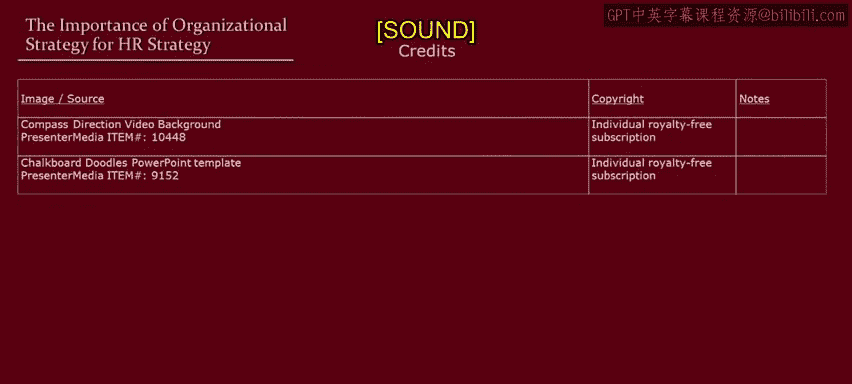

# 明尼苏达大学《人力资源管理：面向人员管理者的人力资源1｜Human Resource Management： HR for People Managers》 - P10：9_视频：组织战略对人力资源策略的重要性.zh_en - GPT中英字幕课程资源 - BV1QU411m7GF

In the last video， we looked at influences on HR strategy and managerial styles that reside outside the organization。

 Let's continue that discussion by now looking inside the organization and focusing on organizational strategy。

 I say organizational strategy intentionally and not business strategy because this applies to all organizations not just private sector businesses。

 So while we're on the topic of strategy。 First， let's ask what does it mean for HR to be strategic。

 Well this requires at least two things。 First， it requires that HR and an organization be focused on organizational needs not just the administration of HR policies。

 Second， it also requires a shift and a pushing out of HR tasks from being the responsibility solely of HR to being aligned line managers's responsibility with help from a HR partner。

 of course， but things like hiring performance appraisal。

 determining pay for performance those should be a line managers's responsibility In fact。

 those are exactly the classes that follow in this specialist。Okay。

 so now let's look at relationship between organizational strategy and HR policies first starting with business strategy。

And I'm going to use a very popular， simple。Two dimensional approach to business strategies。

 portererss， generic， two business strategies。First strategy is cost leadership。

 second is called product differentiation as the name suggests， in cost leadership。

 low cost is key or is in product differentiation， differentiation， of course。

 is key trying to develop unique features such as quality or other types of things that can give an organizations some pricing power or some other thing that will create greater bond between the customers and the organization。

 So again， contrast between emphasizing cost and product features。

 What does this imply now for HR strategy。 Well， in a cost leadership strategy。

 you would naturally expect that HR strategy is also going to emphasize labor costs。

 keep labor costs low and really drive workers in an aggressive way。

How about in a product differentiation strategy？Well this。

 we would expect to result in a different type of HR strategy。

 more that revolves around developing and rewarding employees， engaging employees。

 maybe even in some organizations empowering employees。Now， just as a reminder。

 when HR is being strategic， it's these types of things that are being done by managers。

 not just by HR。Okay， now to tie this back to the previous lesson。

 we characterize these initial HR strategies as low road strategies and the second category as highro strategies。

 and if we recall call the contrast between SAM's Club and Costco。

 now we can see more clearly where those HR strategies are coming from。

 they're coming from different business strategies across leadership strategy on SAM's Club's part and more of a product differentiation。

 service differentiation on Costco's part。Now in some countries， low road HR is called。Hard HR。

 And in some countries， high road HR is called soft HR。 I don't really like those labels。

 The soft HR， in particular， is particularly poor label。 And so I'm going to erase those labels。

 But let's quickly look at some examples。Think of a low cost no frills airline compared to an airline that focuses on business travelers。

 we would naturally expect that these would have different HR strategies。Similarly。

 think of a budget motel versus a luxury hotel， we would normally think typically think that this would result in different types of HR strategies or even within the same organization。

 core employees at Google who need to be creative， have lots of autonomy flexible。

 they would have an high road HR strategy for those employees， but within a different business。

 for example， the competitive delivery business， Google where labor costs are more important。

 we would expect the Google might have a different HR strategy that emphasizes cost containment。

But also to reinforce a lesson from the previous lesson。

 I want to emphasize that while these business strategy influences are important。

 they do not completely determine an HR strategy， and so we can have some cross over here as well。

Now I also want to emphasize that this doesn't apply simply to private sector business organizations but really applies to all organizations。

 so let's consider the public sector， there's been a lot of pressure on public sector organizations in a lot of countries。

 there's a lot of different pressures， let's just simplify it down to two。

So some public sector organizations are under great pressure to reduce costs which might imply an HR strategy that increasingly emphasizes outsourcing and weakening civil service rules。

 there's other public sector organizations that have a lot of pressure to improve service delivery。

This also tends to put pressure to weaken civil service rules。

 but also leads to enhanced performance management， greater levels of incentive pay。

 more flexible work arrangements， and sometimes even employee voice。So again， in the public sector。

 we have the same features that going on in the private sector in which organizational strategy is affecting HR strategy。

 it's not completely determining what's happening， but organizational strategy certainly is a major influence on an organization's HR strategy。

Okay。What are we going to do next time， I'm going to interview some HR executives so you can continue to get different ideas for how to manage people and advice for how to manage people。

 and then we're going to follow that up in the last video by looking at how ideas matter for managing people Okay。

 I wish I was able to racese this board better。

