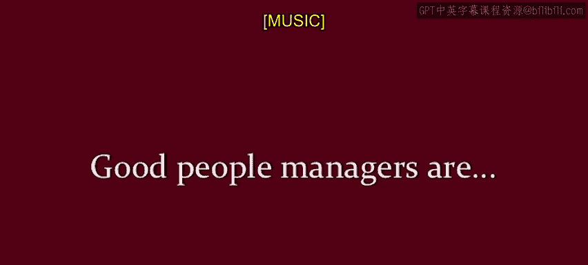
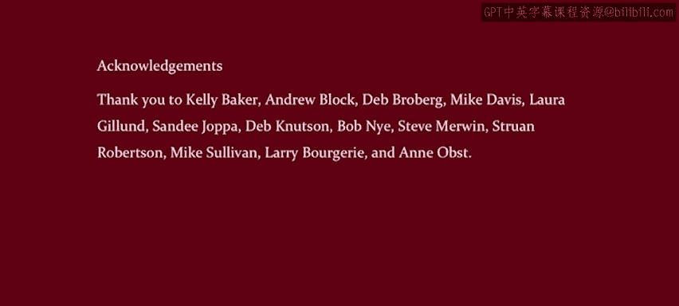
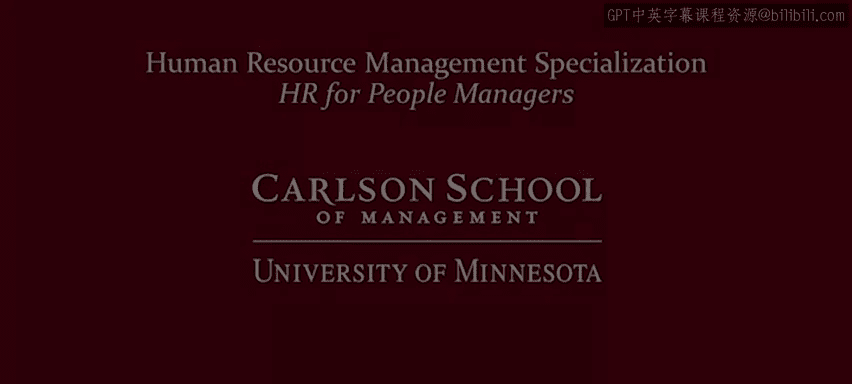

# 人力资源管理：P11：与人力资源高管快速约会

在本节课中，我们将通过一种独特的“快速约会”形式，学习多位人力资源高管分享的宝贵管理经验。这些经验涵盖了新经理常犯的错误、优秀管理者应具备的特质以及实用的团队管理技巧。

---

## 🎼 向同行学习：你并不孤单

在明尼阿波利斯市中心，人力资源高管们每年都会聚会数次，分享挑战、相互学习、建立人脉并聆听晚宴演讲者的分享。

这对于任何人员管理者都是极好的建议：向同行学习。你并不孤单，外面还有很多其他管理者。定期聚在一起交流、分享故事、学习最佳实践是一个绝佳的主意。你无需成为高管，也无需安排鸡尾酒会、晚宴和演讲。只需根据你的文化习惯，约上同行喝杯咖啡或茶，走出去与他们建立联系。这是相互学习和磨练人员管理技能的有效方式。

今晚，我将采访数位人力资源高管，向他们提出几个问题。

我的目标是让你在短时间内，尽可能多地向人力资源高管学习，就像“快速约会”一样。事实上，我将此称为“与人力资源高管的快速约会”。希望你能享受其中、有所收获，并受到启发，走出去与你自己的同行进行类似的交流学习。

---

## ⚠️ 新经理常犯的错误

上一节我们介绍了向同行学习的重要性，本节中我们来看看多位高管指出的新经理常犯的一些错误。了解这些陷阱可以帮助你更好地规避。

以下是人力资源高管们总结的新经理常见误区：

*   **试图知晓所有答案**：新经理最大的错误之一是认为自己需要知道所有答案。实际上，坦然说“我不知道，我会去查证并回复你”是非常恰当的。
*   **未能完成角色转变**：新经理常因业务能力出色而被提拔，但他们有时会忘记自己已不再是独立贡献者。他们可能过于深入细节，亲自做下属的工作，误解了管理的本质。
*   **管理方式过于强硬**：新经理有时会采取一种较为强硬的方式，认为必须树立自己的管理权威，而不是采取协作式的工作方法。
*   **忽视人际关系建设**：他们可能过于强势，没有花时间去了解团队成员的个人情况并倾听他们，导致起步不佳。
*   **混淆朋友与上下级关系**：希望与下属维持朋友关系，而不是将其发展为督导者与团队成员的关系。需要明确告知双方关系正在发生微妙变化。
*   **微观管理与忽视结果**：存在微观管理的风险，过于关注过程而非最终结果。同时，错误地认为需要自己提供所有答案，而不是积极从团队中寻求信息。
*   **缺乏时间投入**：新经理通常非常忙碌，以至于没有时间留给向他们汇报的员工。

---

## ✅ 优秀人员管理者的特质

了解了常见的错误后，我们来看看优秀的管理者应该具备哪些特质。这些是构建高效、健康团队关系的基础。

以下是人力资源高管们认为优秀人员管理者应具备的关键特质：

*   **关怀**：关心为你工作的员工。
*   **谦逊**
*   **开放**
*   **公平**
*   **值得信任**
*   **正直**
*   **透明**
*   **评估人才的能力**
*   **投入**
*   **一致性**
*   **真实**
*   **同理心**
*   **出色的倾听技巧**

---

## 💡 给新经理的核心建议

最后，我们整合高管们的智慧，提炼出给新任人员管理者的核心行动建议。这些建议将帮助你顺利过渡并建立有效的领导风格。

以下是给新经理的具体建议：

*   **理解与倾听**：努力理解你的员工，尽可能采纳他们的观点，并用心倾听。
*   **关注新人**：特别关注新员工，确保他们能充分融入并感到对工作投入，因为工作是一项团队努力。
*   **助力员工发展**：记住，员工需要你帮助其发展。我们都是在先行者的帮助下成长的，而你将成为新员工的“先行者”。
*   **保持客观公平**：保持公平，客观地思考事实。
*   **清晰且重复沟通**：进行沟通，并且要重复沟通。因为我们常常假设对方会以与我们相同的方式看待问题，但事实并非如此。
*   **设定明确期望**：从一开始就设定明确的期望，清楚说明你对团队的期望，然后帮助他们达成目标。
*   **了解你的员工**：花时间去了解你的员工，特别是了解什么能激励他们。确保你知道他们真正的优势和发展需求。
*   **因人而异**：记住“一刀切”不适用，每个人都是独特的。找出激励你员工的因素，这非常个性化。了解每个团队成员的动机对你大有裨益。
*   **完成角色认知转变**：你突然从“自己完成所有事”转变为“通过他人完成事情”。这是一项许多人需要培训才能掌握的技能。
*   **连接个人与组织目标**：记住你会有目标和指标，但关键在于帮助员工将这些目标与自己的工作联系起来，让他们感到自己的工作与团队使命相关。
*   **知人善任**：了解员工的技能，找出他们擅长什么，并思考如何将目标与他们的技能相匹配。
*   **换位思考**：记住你曾被管理时的感受，并以那种方式对待他人。
*   **鼓励独立与创新**：不要因为觉得自己能做得更好而忘记允许员工提出新想法并鼓励他们独立工作。
*   **主动寻求团队信息**：作为新经理，我强烈建议你确保自己积极地从团队中寻求信息。快速弄清楚谁知道什么，最重要的是，谁知道你所不知道的。
*   **明确关系变化**：你现在处于不同的层级，他人对你的看法也不同。你需要的不再是朋友，而是建立一种督导者与团队成员的关系。

---

本节课中，我们一起学习了如何通过向同行学习来提升管理技能，识别了新经理常犯的多种错误，认识了优秀管理者必备的关键特质，并收获了一系列直接、实用的管理行动建议。记住，管理是一门可以通过学习和实践不断精进的艺术。