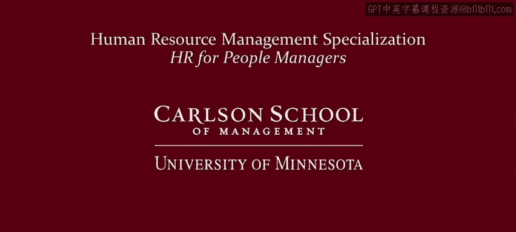

# 明尼苏达大学《人力资源管理：面向人员管理者的人力资源1｜Human Resource Management： HR for People Managers》 - P13：12_视频：为什么要关注员工工作的原因.zh_en - GPT中英字幕课程资源 - BV1QU411m7GF

Welcome back。This is the first video in the second module。

 let's see where this module fits into the logic of the entire course。

The first module is called alternative approaches to managing human resourcessource。

 The second module， this one， what makes employees work， money， of course。

 the next module revisits the question of what makes employees work and looks at nonmonetary rather than monetary motivations。

 And the last module is called the people manager as part of a complex system。 Now， as you can see。

 we're going to spend two whole modules thinking about why employees work。

 What makes them come to work every day or what keeps them from coming to work each day to look at it from a negative perspective So why is it so important。

 why are we going to spend two whole modules thinking about why employees work。 Well。

 this video is meant to motivate these two modules by thinking about why it is so important to think about why people work。

 So there's a few reasons why it's important to understand what makes employees come to work every day。

 what makes them engaged or not。 The first reason is that why people work。

 determines their motivation。 So that's going to determine what employees are and are not willing to do for the。

And under what conditions they're willing to do it。Get it right and they'll be successful。

Get it wrong as a manager and employees might leave， or they might not work very hard。

The second reason is that there's a lot of different motivators that's why we're going to spend two whole modules on this Now you might be thinking that it's all about money。

 money， money， money， that's why employees are working Well certainly there are some employees that are working for money and everybody's probably working for money to a certain extent。

 but that doesn't mean that people are completely or solely working for money。

Some employees might be looking for satisfaction， a sense of accomplishment， of self self esteem。

Other people might want to be part of a successful team or successful group。

Yet others might want to care for people or serve some other mission。

And the third reason is that people are different。If everybody was working for the same reason。

 you could probably have your human resources department just tell you which motivator it is and just work off of that。

But for better for worse， the people in your work group are undoubtedly unique。

 you probably have people coming to work every day for very different reasons。

 and so only you have the power to figure out what is driving each of your employees。

 you can't rely on HR to tell you this needs to be your important responsibility as a manager。

 you need to understand why workers work and engage them on that basis。

