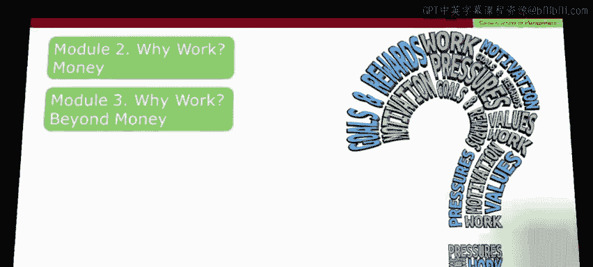
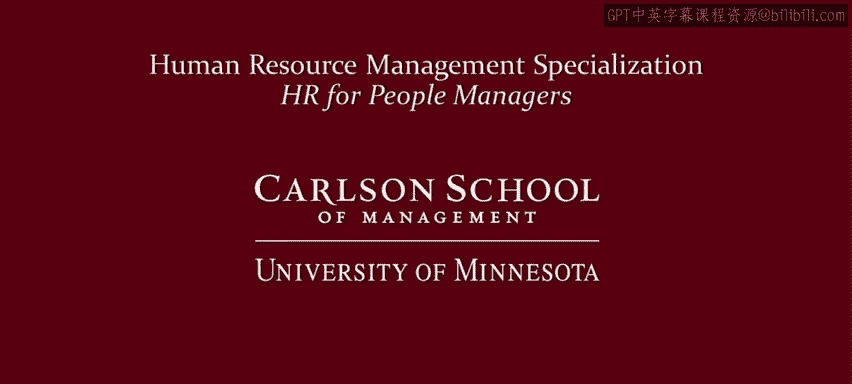

# 明尼苏达大学《人力资源管理：面向人员管理者的人力资源1｜Human Resource Management： HR for People Managers》 - P14：13_视频：工作的多重含义.zh_en - GPT中英字幕课程资源 - BV1QU411m7GF

The objective for the middle part of this course is to deepen your understanding of the different reasons why people work。

 that is it's to consider the many different meanings of work to provide an overview I've created an animation。

 I hope you enjoy it and find it useful。🎼Work is complex。

 it can take many forms and some jobs themselves are complicated and complex but what I'm focusing on here are the complex reactions we have to work what does work mean to us how can we think about the purposes of work what are the different ways in which we can conceptualize what work is This is important because work can mean different things to different people and it can have multiple meanings for each of us so to hire employees that fit with a particular organization to find rewards that motivate them and to structure work in ways that will yield high levels of engagement managers need to understand why employees work what are they looking for in their work in my own research I've identify 10 broad ways of thinking about work。

The first way is work as a curse when work is seen as a curse。

 it is just seen as something that we have to do， it's an unquestioned burden necessary for human survival or maintenance of the social order。

🎼Quite opposite to this is to see work as freedom， a way to achieve independence。

 and maybe that's independence from other human beings or in a more fundamental ways。

Freedom from the harsh environment of nature is also to think about work as freedom is to think about work as a way to express human creativity。

The third way of thinking about work is as a commodity。When work is a commodity。

 it's seen as an abstract quantity of some kind of productive effort that has tradable economic value。

 so it's governed maybe by the laws of supply and demand。In contrast with this。

 a fourth way of thinking about work as occupational citizenship is to see work as something pursued by human members of the community and therefore entitled to certain rights beyond what a market might provide。

Now a fifth way of seeing work involves a little bit of economic jargon， this is called disutility。

 so this plays off of an economic approach to utility， something good and disutility。

 something that attracts from your utility so it's a lousy activity and why do people do it while they tolerate this lousy activity so that they can obtain goods and services that provide pleasure。

Contrast with this is work as personal fulfillment。

 is to see work as physical and especially psychological functioning that ideally satisfies individual needs。

But when work is bad， it can detract from psychological wellbe。

Seventh work can be seen as a social relation， this is to see work as human interaction and therefore guided by social norms。

 institutions， and humanly created power structures。Eth work is seen as caring for others。

 this is the physical， cognitive and emotional effort required to attend to and maintain others。

Ninth， we can see work as serving others， rather than trying to care for our own personal family。

 derive our own monetary well-being or our own psychological well-being。

 we can see work as a way of devoting efforts to others， such as God， an extended household。

 a community， or even a country。🎼Lastly， we can see work as identity it's not something that gives simply gives us money for psychological well-being。

 but it gives us a sense of meaning， it helps us understand who we are and where we stand in the social structure so as you can see work has diverse meanings and individuals see work in different ways this is important for managers and HR professionals to understand as they recruit。

 motivate and reward employees。Before we've been taking this course。

 you probably knew that work was complex， but after watching this animation。

 maybe you see that it's even more complex than you thought that's why we're going to spend two modules thinking about why workers work。

For the Rer of this module we're going to focus on the monetary and economic reasons why people work。

 this is best analyzed through a lens of economic scholarship and so we're going to spend the remainder of this module thinking about the different lessons that economic scholarship can provide managers and then in the last module we're going to continue the discussion of why people work but move beyond monetary reasons。

Yeah。

