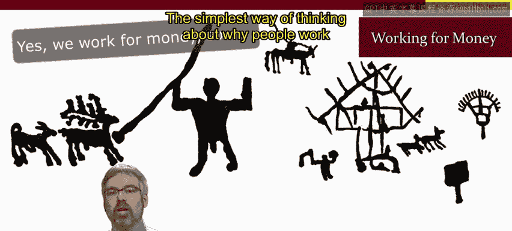
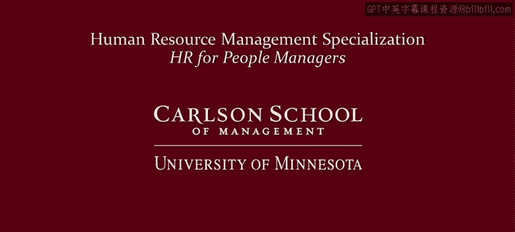

# 人力资源管理：面向人员管理者的人力资源1｜P15：14_视频：为金钱工作 💰

在本节课中，我们将探讨一个基本但核心的问题：人们为何工作。我们将从最基础的“为金钱而工作”这一视角出发，分析其对管理实践的重要启示。

## 工作的本质：生存所需

人类为了生存，始终需要工作。在史前时代，人类作为狩猎采集者需要劳作。在随后的几个世纪里，以家庭为基础的生产方式延续了这一事实。

工业革命并未改变“人类必须工作以生存”这一基本事实。但它改变了工作的性质。人们不再直接生产自己消费的东西（例如种植自己的粮食），而是为他人工作。换言之，人们为薪水而工作，为金钱而工作。

这种观念在我们的文化中多有体现。例如，20世纪80年代Huey Lewis and the News乐队的流行歌曲《Workin' for a Livin'》。另一个例子是Placebo乐队的歌曲《Slave to the Wage》。

## 对管理者的启示

即便将工作简单地视为谋生手段，这种基本思维方式也为管理者带来了重要启示。以下将重点阐述两点。

**第一，财务压力在工作场所的放大效应。**
家庭或家庭的生存依赖于工作，这意味着财务压力可能会在工作场所被放大。当员工感到工作不保或收入面临风险，无法维持生计时，这会给工作场所带来额外的压力、紧张，有时甚至是绝望感。

**第二，工作可能被视为一种“诅咒”。**
因为工作被视为生存的经济必需品（至少对大多数人而言），这可能使工作看起来像一种诅咒，像是人类境况中自然而然、亘古不变且必须如此的一部分。从广义上讲，这或许没错——我们确实需要工作来生存。但这并不意味着具体的工作必须以特定的方式构建。相反，组织以及作为管理者的你，对于如何设计岗位、如何构建工作流程是有选择权的。如果你的工作团队中存在糟糕的岗位，请思考如何改进它们。

## 总结与行动要点

本节课中，我们一起学习了人们为金钱而工作的基本动因及其管理启示。

是的，人们为金钱工作，他们必须如此，以购买住所、食物、衣物和其他必需品。但即便是工作的这一最基本层面、思考人们为何工作的最简单方式，也为管理者提出了重要启示。

以下是基于本课内容的三点行动建议：

*   **关注额外压力：** 留意员工可能因家庭财务压力带入工作场所而产生的额外压力，甚至在极少数情况下的绝望情绪。压力被带入工作场所，是因为这里是他们的收入来源。
*   **避免将工作降格为诅咒：** 不要认为“工作就应该是这样，我们无法改进岗位、让它们变得更好”。
*   **不要假设工作只关乎金钱：** 金钱确实是本模块（模块2）的焦点。然而，在模块3中，我们将探讨人们工作的多种超越金钱的原因。