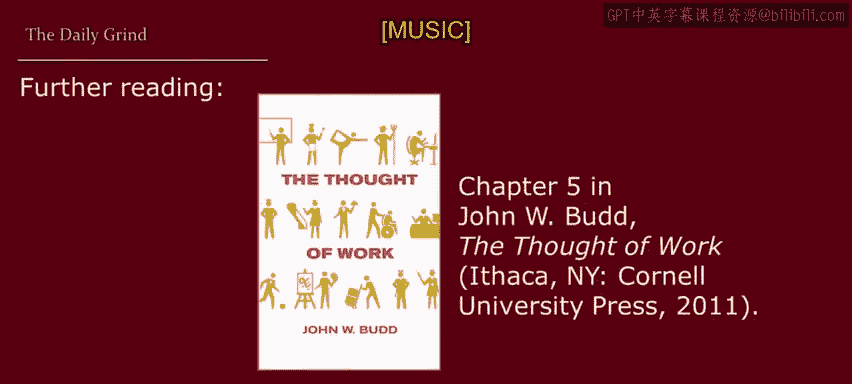

# 明尼苏达大学《人力资源管理：面向人员管理者的人力资源1｜Human Resource Management： HR for People Managers》 - P16：15_视频：日常工作.zh_en - GPT中英字幕课程资源 - BV1QU411m7GF

The goal of this lesson is to illustrate important concepts that managers should be aware of when work is seen as something tolerated only to an income。

 either by workers or by organizations， it's not just about how workers see work。

 it's also about how organizations think about work。Now。

 if what we hear on the radio is to be believed， there are a lot of people who experience work as what I'm calling the Daily grind。

So let's give you a few examples。 For example，9 to 5 by Dolly Parton working 9 to 5。

 barely getting by。 It's all taken and no given。 They just use your mind。

 and they never give you credit。 It's enough to drive you crazy if you let it。

Or taking care of business by B T O。 And if your train's on time。

 you can get to work by 9 and start your slave and job to get your pay。 If you ever get annoyed。

 look at me。 I'm self employed。 I love to work at nothing all day。Or Jacqueline by Franz Ferdinand。

 it's always better on holiday， so much better on holiday。

 that's why we only work when we need the money。And lastly。

 bang the drum all day by Todd Runundgrren。 Every day when I get home from work。

 I feel so frustrated。 The boss is a jerk， and I get my sticks and go out to the shed。

 and I pound on that drum like it was the boss's head， because I don't want to work。

 I want to bang on the drum all day。Okay， but it's not just in pop culture that work is a daily grind。

It's also enshrined in mainstream economic theory。 economic theory assumes that work is a lousy activity。

 So again， why do so many people engage in this lousy activity？ Well。

 they tolerate it to earn income。There's two different ways in which econom see work as a negative。

 First， work can be painful。 It can be hot， dangerous， stressful， boring。

 maybe it requires stifling your emotions， pretending to be happy when you are not。

 and the list goes on and on and on。 I have to stand here and shoot a lot of videos and my feet gets sore。

Second。Time spent at work can prevent you from spending time on leisure or other non work activities that you prefer。

Relaxing hobbies， time with family and friends， vacation， caring for others。 And again。

 the list goes on and on。 Making these videos has taken a lot of time away from my family。😊。

So once again， why do so many people endure this pain or this opportunity cost。

 Well we all know the answer to that， iss for a paycheck， it's for money， it's for compensation。

Even the wordcomp reinforces the negativity of work in general。

 compensate means to make up for or make amends for。

 so compensation for working is pay that makes up for。

 make amends for what you have to endure when you work。

Now economic theory predicts that workers will work for an organization or for themselves only up to the point at which the reward still compensates them for the burden of working。

 for those of you who have had a basic economics course。

 this is the point at which marginal cost equals marginal benefit as somebody to work longer or harder than that。

 and they won't。Let's not overgeneralize an economic approach to work doesn't mean that work is always bad。

 rather， an economic approach is most applicable when work becomes a negative。

That is when the work is particularly hard or stressful。 For example。

 think about work at the end of a long day or at the end of a long week。

 This is when work can become both a pain cost and an opportunity cost。

 Or even at the beginning of the day， if a task is particularly boring， it can be painful。

And this is when the real motivational challenges for managers begins。

 it's easy to motivate people when a task is just right， not too easy， not too hard。

 it's easy to motivate people when they haven't been working too much so it's cutting into other things that they want to do。

 but when work becomes a pain and or it conflicts with other things that someone would rather be doing。

 that's when it becomes hard to motivate someone。So economic theory teaches us to pay particularly close attention to what economists call the margin。

 The margin is the border or the edge between two actions or outcomes， for example。

 think of the last extra hour you want someone in your work group to work if this is right on the edge of whether they want to work more or not。

 then to get them to work that additional hour you have to make this more attractive than their alternatives。

Now， before someone hits that margin， work represents less of a pain or an opportunity cost and therefore it's easier to get them to work。

 it's really on the margin where you need to pay attention to what it will take to get someone to do something extra。

Now you should also use this to think of the question as to where each of your employees thinks their margin exists。

 how much do they really want to work， at what point are you trying to push them too far？

As another example of margin， suppose you need to hire or retain 10 people for a work unit。

 it might be easy to hire or retain the first nine of them。Marginal analysis and economics however。

 focuses our attention on what is it going to take to hire or retain the last worker。

 the 10th worker， and it's really the terms and conditions of employment that it's going to take to recruit or retain that individual that's going to drive compensation and other elements of the job for everybody。

Now， when work becomes something negative that workers tolerate just to earn income。

What many people call the daily grind， economic theorizing gives us a useful way to think about how workers behave。

Specifically， economic analysis assumes that workers are self interested and rational。

And what do they like， They like income， but they don't like to work for it。

So this is where useful concepts to managers arise。

 think about pain costs and opportunity costs and how that ties to the nature of work in your organization and your ability to motivate workers and get them to work longer than they might otherwise want to。

 remember to work past their margin， so that's another useful concept thinking about margin and marginal analysis。

So in the remainder of this module， we'll look at additional insights that come from applying economic insights to work。

 workers and the workplace。Okay， back to S in the blues about lousy work。

