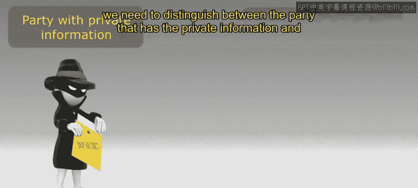
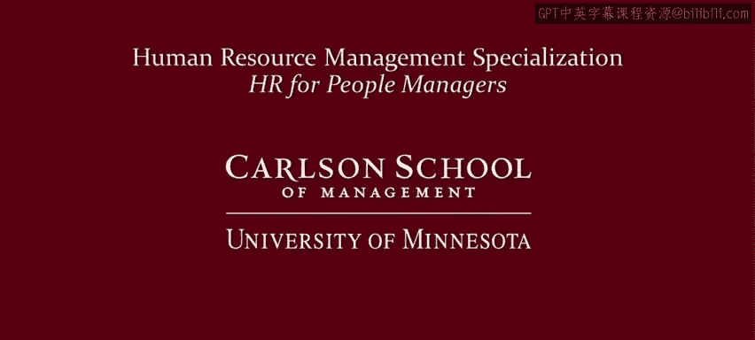

# 明尼苏达大学《人力资源管理：面向人员管理者的人力资源1｜Human Resource Management： HR for People Managers》 - P19：18_视频：信息、信号和筛选.zh_en - GPT中英字幕课程资源 - BV1QU411m7GF

In the previous video， we looked at lessons that comes from economics that can help managers think about using incentives to motivate selfinterested workers who might prefer not to work very hard。

Well in this video， we move past the topic of motivating workers and think about economic insights that can be used in situations of private information。

When workers or organizations have private information and workers or organizations are self-interested。

 this information has strategic value， so won't necessarily be freely shared， for example。

 job applicants typically know more about their own limitations than the organization considering them for a job。

 but job applicants would typically be trying to sell themselves rather than truthfully reveal all of their limitations。

Now for a humorous exception， there is an interview scene in the movie U Me and Dupret。

 where Owen Wilson's character says， I absolutely insist on joy in life， not so task oriented。

 not a workhorse， if you're looking for a Clydedale and probably not your man。

 like I don't live to work， it's more the other way around， I live to work。

So that's obviously a humorous situation and in a typical situation。

 workers are going to try to be selling themselves so they're strategically revealing information and you're at an information disadvantage。

 so what can be done to better handle these types of situations？

Economic theory teaches us that there are two general strategies for dealing with private information。

 There is a category of strategies that goes under the banner of signaling and a separate category that goes under the label of screening to think about what's a signaling strategy as opposed to a screening strategy we need to distinguish between the party that has the private information and the party that is at the information disadvantage and wants to know the information Now it's not always the case that the worker has private information and the organization wants to know about it。

 it could be the reverse， and in some cases， an organization might have the private information and an applicant or an employee wants to know that information。

 So again， we need to distinguish between these two actors to distinguish between what's a signaling strategy。

 what's a screening strategy。

And in particular， we need to ask which party is the one that's trying to do something about this information problem？

So who's acting to do something about it， if it's the party that has the private information that is acting to do something about it。

 to overcome this information asymmetry， that's called a signaling strategy。Now。

 the reverse is the case where the party that is at the information disadvantages trying to do something actively about it。

 Well those are called screening strategies。 Let's look at an example of each one。So first。

 let's look at an example of a screening strategy。Now， as I've already said。

 job applicants typically know their own ability or their own limitations better than potential employers。

So what can an organization do about it， suppose an organization publicly makes it known to job applicants that that organization has a very challenging。

 hard to achieve performance bonus program。Okay， why might this help overcome an information problem Well the logic here is that this challenging bonus program will only be attractive to higher ability applicants。

 and so if this works， lower ability individuals screen themselves out and they won't apply for your job。

Note that the party without the information， in this case。

 the organization is the one that's trying to do something about it。

 and that's why this is an example of a screening strategy。Now， as an aside。

 notice that in many job interviews， an organization would typically be trying to sell the job just like an applicant is trying to sell him or herself。

 and that would be undermining this type of screening strategy if you try to sell your jobs to aggressively you might attract the wrong kind of worker。

 so think carefully about the information you're providing and what this might be implying about who's applying for your job。

NowLet's think about a signaling example， similar to the previous example。

 suppose that individuals know their own ability better than potential employers。

Suppose you're a higher individual ability and you want to do something about this to show that you are different。

 So， for example， you might try to get more education to distinguish yourself from a lower ability individual。

 This would be an example of trying to send a signal。 You're trying to say， hey， look at me。

 I'm special。But notice a talk is cheap。 Everyone might just say that they're a high ability person。

 So what does it take to make a signal stronger than weaker。

 He needs something that's difficult to imitate If anyone can get more education。

 it's not a very powerful signal。 Keep this in mind if you are either trying to send a signal or evaluating other signals。

Now again， both of these examples have been from the individual perspective。

 but there might be examples where the organization has information。

 so for example an organization might want to send a signal to an applicant that it has a family friendly culture now all organizations could say that they do talk is cheap that would be easy to imitate so an organization that wants to send a signal that they really do have a family friendly culture has to come up with a signaling strategy that is more difficult to imitate。

 for example， they might offer certain benefits that are costly and therefore any old organization might not try to just imitate that。

So in conclusion， when there's private information and workers or organizations are self interested。

 information has strategic value。 So what should you do， Well， you should think strategically。

If you have private information， you can try to devise a way to signal things about you or your organization if you are at an information disadvantage。

 you can watch for signals from those who know more than you do。

 but remember that easy to imitate signals are not very reliable or you don't have to wait for others to send out signals。

 you can do things to get those with the information to try to screen themselves。

 So thinking strategically about self-interest and the incentive for individuals to act in certain ways is very helpful not only for trying to motivate workers but also for trying to overcome problems of private information。

