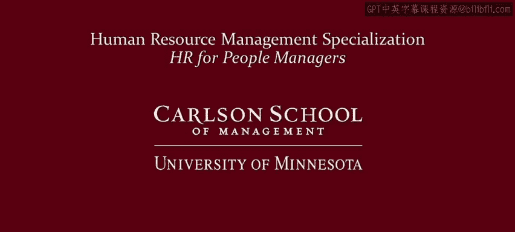

# 人力资源管理：P1：欢迎参加人力资源管理专业课程 🎓

在本课程中，我们将一起了解明尼苏达大学卡尔森管理学院人力资源与劳动研究中心推出的《人力资源管理：面向人员管理者的人力资源》专业课程。本课程旨在为各类管理者提供人力资源管理核心领域的坚实基础。

欢迎参加我们的《人力资源管理：面向人员管理者的人力资源》专业课程。我是约翰·巴德，我是拉里·博格瑞，我是艾米，我是艾伦·本森。我们都是明尼苏达大学卡尔森管理学院人力资源与劳动研究中心的教员。你可能将明尼苏达与寒冷的冬天联系起来，但在人力资源领域，人们将明尼苏达与卓越的领导力和教育成就联系在一起。人力资源与劳动研究中心在人力资源领域（我们称之为HR）作为领先的研究与教学中心已超过70年。我们拥有该领域顶尖的硕士项目之一，甚至拥有专门提供人力资源信息的图书馆。

我们团队在人力资源领域拥有超过50年的教学经验，非常高兴能共同教授这门专业课程《人力资源管理：面向人员管理者》。本专业课程将全面介绍人力资源管理的核心原则、政策与实践，重点聚焦于人才的获取与入职、员工绩效管理以及员工激励。这些是任何人员管理者都需要了解的核心领域，即使他或她并不在人力资源部门工作。

在整个专业课程中，我们将呈现基于该领域最佳学术成果与实践经验的最佳实践和实用技巧。完成本专业课程后，您将对职场中行之有效的方法有更深入的理解，包括一套用于招聘、管理和激励员工的最佳实践工具包。

我们为不同类型的学习者设计了本专业课程。以下是几种可能的情况：

*   您可能是一位“意外成为的管理者”：您因出色的工作表现（例如作为工程师、会计师、护士等）被提升到管理岗位。这意味着您现在需要管理下属，但缺乏人力资源和人员管理方面的培训，您想知道如何更好地管理员工的绩效。
*   您可能是一位“默认的HR人员”：您没有接受过正式的人力资源培训，但被视为善于与人打交道，因此被要求承担人力资源职责，例如在小企业中。
*   您可能是一位“职业探索者”：您对心理学或其他与人相关的领域感兴趣，有人告诉您适合做HR，或者在HR领域比在心理学领域能赚更多钱，但您不了解HR工作的具体内容，因此想了解更多关于HR的知识以及将其作为职业意味着什么。
*   您可能是一位“职业进修者”：您从事HR工作已有一段时间，但想知道自己的理念是否与时俱进，希望从该领域的顶尖大学了解当前关于关键HR议题的最新思考。

无论您符合以上哪种描述，或是其他我们未提及的情况，我们相信您都将从理解我们所说的“人员管理者价值主张”中受益匪浅。价值主张简单来说就是一份利益声明。因此，人员管理者价值主张概括了我们将通过本专业课程为您带来的益处，也概括了您在完成课程后将为您的组织和职业生涯带来的益处。人员管理者价值主张为有效的人员管理者和HR专业人员的关键HR相关任务提供了指导，从而也为本专业课程提供了路线图。

管理者必须知道如何承接组织目标，确定需要人员完成什么，然后理解如何设计并实施战略来领导和激励员工实现这些目标。但这并非在真空中发生，它受到组织价值观、法律环境等外部因素，甚至可能受到工会的影响。因此，这将是第一门课程中我将涵盖的人员管理者价值主张部分。

寻找并聘用合适的人才常被列为当今企业的头等大事。我们似乎都在争夺最优秀、最聪明的人才。正如您将在我们的第二门课程中看到的，人员管理者价值主张的一个关键组成部分是聘用能够帮助组织实现其战略目标的人才。在课程开始时，我们将探讨将招聘目标与公司整体战略联系起来的重要性。然后，我们将探讨一系列有效且合法地招聘和选拔员工的方案。在整个课程中，我们将审视人才获取中的当前议题，例如公司如何利用社交媒体和招聘分析来确保更高质量的招聘。

一旦您聘用了优秀的员工，成功的人员管理者采取的下一步就是开发员工的全部潜能。绩效管理是一个帮助管理者实现从员工身上获得最佳表现这一目标的过程。在绩效管理课程中，我们将讨论您为发展员工以实现部门和组织目标所需的技能与关键流程。这些技能将包括设定明确的期望、提供积极和纠正性的反馈，以及进行有效的绩效评估。

人员管理者还必须知道如何奖励员工。我们从这个问题开始：为了执行业务战略，我们需要吸引、保留和激励什么样的人？我们将讨论您对该问题的回答如何帮助您设计与业务战略相匹配的薪资结构、福利、短期激励和长期激励。我们还将帮助您评估福利并确保合规性。

掌握人员管理者价值主张中的步骤对于任何人员管理者或HR专业人员的成功都至关重要。HR领域有句名言：人们因组织而加入，却因管理者而离开。我们在这里帮助您成为员工愿意加入而非离开的管理者。

我们很高兴能将明尼苏达大学在人力资源领域的专业知识带给您，无论您的目标是什么，身在何处。如果您只注册了一门课程，那也很好。我们希望本专业课程的介绍能让您更好地了解这些课程所涵盖的全部内容，并吸引您注册整个专业课程。

我们期待在课程中与您相见。